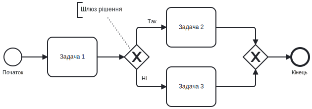

# Лабораторна робота 01 Моделювання бізнес-процесу AS-IS

## 🎯 Мета

Набути практичних навичок аналізу реальних бізнес-процесів, збору інформації про процес, створення BPMN діаграм у спеціалізованих інструментах моделювання та розрахунку ключових метрик ефективності процесів.

Після виконання лабораторної роботи студент зможе самостійно документувати існуючі бізнес-процеси організації, виявляти їх учасників та етапи, будувати формалізовані моделі у нотації BPMN 2.0 та проводити кількісний аналіз ефективності процесів.

## 📋 Завдання

Виконати комплексний аналіз обраного бізнес-процесу та створити його формалізовану модель:

1. Обрати реальний бізнес-процес для моделювання з переліку рекомендованих або запропонувати власний варіант.
2. Провести детальний аналіз процесу: визначити учасників, кроки виконання, документообіг, точки прийняття рішень.
3. Створити BPMN діаграму AS-IS у Draw.io або Bizagi Modeler з використанням стандартних елементів нотації.
4. Зібрати дані та розрахувати ключові метрики ефективності: cycle time, waiting time, кількість handoffs, resource utilization.
5. Підготувати звіт з описом процесу, BPMN діаграмою та аналізом метрик.

## ⭐ Критерії оцінювання

Максимальна кількість балів за лабораторну роботу: **7 балів**.

Розподіл балів за елементами роботи:

- **Аналіз процесу** (1 бал): повнота опису процесу, ідентифікація всіх учасників, чіткість визначення кроків та документообігу.
- **BPMN діаграма** (3 бали): коректне використання елементів нотації BPMN 2.0, логічність побудови діаграми, читабельність, використання swimlanes, правильність зв'язків між елементами.
- **Розрахунок метрик** (2 бали): коректність збору даних, правильність розрахунків, обґрунтованість прийнятих припущень.
- **Оформлення звіту** (1 бал): структурованість викладення, якість візуалізації, дотримання вимог до оформлення, відсутність орфографічних помилок.

## ⏰ Політика дедлайнів та штрафів

**Термін здачі:** Лабораторна робота має бути здана **протягом 2 тижнів** від дати проведення останнього аудиторного заняття з цієї теми.

**Система штрафів за прострочення:** Здача роботи в установлений термін дає можливість отримати повну оцінку 7 балів. Роботи, здані з запізненням, будуть оцінені максимум в 4 бали. Виняток становлять документально підтверджені поважні причини (хвороба, сімейні обставини), за яких термін може бути продовжений за погодженням з викладачем.

## 📚 Теоретичні відомості

### Бізнес-процес та його характеристики

Бізнес-процес являє собою послідовність взаємопов'язаних дій, що перетворюють вхідні ресурси у вихідний продукт або послугу, яка має цінність для клієнта. Кожен процес характеризується наступними атрибутами: вхід (матеріали, інформація, запити), вихід (продукт, послуга, рішення), учасники (ролі та відповідальність), ресурси (люди, обладнання, системи) та правила виконання (регламенти, політики, стандарти).

Розрізняють кілька типів бізнес-процесів. Основні процеси безпосередньо створюють цінність для клієнта: виробництво продукції, надання послуг, обслуговування замовлень. Підтримуючі процеси забезпечують функціонування основних процесів: управління персоналом, бухгалтерський облік, IT підтримка. Управлінські процеси координують роботу організації: стратегічне планування, контроль якості, управління ризиками.

### Методологія моделювання AS-IS

Модель AS-IS відображає поточний стан процесу так, як він виконується в організації зараз, з усіма наявними недоліками, затримками та неефективностями. Створення моделі AS-IS є першим кроком у проєктах оптимізації бізнес-процесів, оскільки неможливо покращити те, що не задокументовано та не виміряно.

Процес створення моделі AS-IS передбачає кілька етапів. Спочатку визначається межа процесу: початкова подія (тригер) та кінцева подія (результат). Далі ідентифікуються всі учасники процесу та їхні ролі. Потім збирається інформація про кроки процесу через інтерв'ю з виконавцями, спостереження, аналіз документації. На основі зібраної інформації будується BPMN діаграма. Фінальним етапом є валідація моделі з реальними виконавцами процесу для підтвердження точності відображення.

### Нотація BPMN 2.0

>> Для кращого розуміння BPMN рекомендується попередньо ознайомитись з [Лекцією 02](../lectures/lec-02.md)

BPMN (Business Process Model and Notation) є міжнародним стандартом для моделювання бізнес-процесів, що забезпечує зрозумілу візуальну мову для всіх учасників проєктів автоматизації.

Основні групи елементів BPMN включають події (events), активності (activities), шлюзи (gateways) та потоки (flows). Події позначають щось, що відбувається під час виконання процесу. Початкова подія (start event) показує, з чого починається процес, проміжна подія (intermediate event) відбувається під час виконання процесу, кінцева подія (end event) завершує процес. Події позначаються колами з різними внутрішніми символами залежно від типу тригера.

Активності представляють роботу, яку необхідно виконати. Задача (task) є атомарною одиницею роботи, що не розбивається на дрібніші кроки. Підпроцес (subprocess) містить вкладену послідовність кроків. Активності зображуються прямокутниками із заокругленими кутами.

Шлюзи контролюють розгалуження та злиття потоків виконання. Ексклюзивний шлюз (exclusive gateway) вибирає один шлях із кількох можливих на основі умови. Паралельний шлюз (parallel gateway) запускає кілька потоків одночасно або очікує на їх завершення. Інклюзивний шлюз (inclusive gateway) може активувати один або кілька шляхів одночасно. Шлюзи позначаються ромбами з відповідними внутрішніми символами.

Потоки з'єднують елементи діаграми. Потік послідовності (sequence flow) показує порядок виконання активностей (суцільна лінія зі стрілкою). Потік повідомлень (message flow) відображає обмін повідомленнями між учасниками (пунктирна лінія зі стрілкою). Асоціація (association) пов'язує артефакти з елементами діаграми (пунктирна лінія без стрілки).

Swimlanes організують елементи діаграми за учасниками. Pool представляє організацію або підрозділ, що бере участь у процесі. Lane розділяє pool на зони відповідальності окремих ролей або відділів. Використання swimlanes робить діаграму більш зрозумілою, чітко показуючи, хто відповідає за кожен крок процесу.

### Ключові метрики ефективності процесів

Для об'єктивної оцінки ефективності бізнес-процесу використовуються кількісні метрики, що дозволяють виміряти продуктивність та ідентифікувати проблемні зони.

Cycle Time (час циклу) вимірює загальний час від початку до завершення процесу для одного екземпляра. Наприклад, скільки днів займає обробка заявки на відпустку від моменту подання до отримання схвалення. Розраховується як сума всіх активностей та очікувань:

Cycle Time = Σ (час виконання активностей) + Σ (час очікування між активностями)

Processing Time (час обробки) показує суму часу фактичної роботи над процесом, без урахування очікувань. Це час, коли хтось активно працює над завданням.

Waiting Time (час очікування) відображає час, коли робота не виконується, але процес ще не завершений. Це може бути очікування схвалення, очікування інформації, простої між етапами. Висока частка waiting time у cycle time вказує на неефективність процесу.

Lead Time показує час від ініціювання запиту до отримання результату з точки зору клієнта. Для внутрішніх процесів може співпадати з cycle time.

Handoffs (передачі) рахують кількість разів, коли відповідальність за виконання переходить від одного учасника до іншого. Кожен handoff створює ризик затримки, втрати інформації або помилки. Формула розрахунку:

Handoffs = кількість переходів між різними lanes/pools

Resource Utilization (використання ресурсів) показує, наскільки ефективно використовуються ресурси (люди, системи):

Resource Utilization = (Processing Time / Available Time) × 100%

Throughput (пропускна здатність) вимірює кількість завершених процесів за одиницю часу, наприклад, кількість оброблених заявок на день або тиждень.

### Інструменти моделювання

Для створення BPMN діаграм існує кілька безкоштовних інструментів з різними можливостями.

Draw.io (diagrams.net) є вебінструментом та десктоп додатком для створення різних типів діаграм, включно з BPMN. Переваги: повністю безкоштовний, не вимагає реєстрації, працює в браузері або як десктоп додаток, підтримує експорт у різні формати (PNG, SVG, PDF, XML), інтеграція з Google Drive та OneDrive, простий інтерфейс. Draw.io містить бібліотеку BPMN елементів, що відповідає стандарту 2.0. Рекомендується для навчання та простих проєктів моделювання.

Bizagi Modeler є спеціалізованим інструментом для BPMN моделювання з розширеними можливостями. Переваги: безкоштовна версія для академічного використання, повна підтримка BPMN 2.0, валідація діаграм на відповідність стандарту, можливість симуляції процесів, генерація документації, експорт у різні формати. Bizagi забезпечує більш професійний підхід до моделювання з додатковими можливостями аналізу.

Camunda Modeler також є потужним безкоштовним інструментом з відкритим кодом, орієнтованим на технічне моделювання процесів для подальшої автоматизації.

## Хід роботи

### Крок 1. Вибір бізнес-процесу для моделювання

Оберіть один бізнес-процес з наведеного переліку або запропонуйте власний варіант:

**Рекомендовані процеси:**

- Процес оформлення відпустки працівника (від подання заяви до виходу у відпустку).
- Процес закупівлі офісного обладнання або канцелярії (від виникнення потреби до отримання товару).
- Процес найму нового співробітника (від публікації вакансії до виходу на роботу).
- Процес обробки звернення клієнта у службу підтримки (від отримання запиту до закриття тікету).
- Процес погодження та публікації контенту на вебсайті організації.
- Процес реєстрації студента на курс в університеті.
- Процес повернення товару в інтернет магазині.
- Процес отримання доступу до інформаційної системи компанії (onboarding).

Обраний процес має бути достатньо складним для моделювання (мінімум 8-12 кроків), але не надмірно комплексним. Він повинен включати кількох учасників (мінімум 3 ролі), містити точки прийняття рішень та різні сценарії виконання.

### Крок 2. Збір інформації про процес

Для створення точної моделі AS-IS необхідно зібрати детальну інформацію про процес. Якщо ви моделюєте реальний процес в організації, де маєте доступ до учасників, проведіть інтерв'ю з виконавцями різних ролей. Якщо моделюєте гіпотетичний або загальновідомий процес, опирайтеся на загальноприйняту практику та логіку виконання.

**Визначте основні характеристики процесу:**

Межі процесу. Початкова подія (тригер): що ініціює запуск процесу? Наприклад, працівник подає заяву на відпустку, клієнт залишає запит у службу підтримки. Кінцева подія (результат): яким є успішне завершення процесу? Наприклад, працівник отримує схвалену відпустку, клієнт отримує відповідь на запит.

Учасники процесу. Перелічіть всі ролі, які беруть участь у процесі, та їхню відповідальність. Наприклад, для процесу відпустки: Працівник (ініціює заяву), Менеджер (погоджує відпустку), HR відділ (перевіряє залишок днів, веде облік), Бухгалтерія (розраховує відпускні). Для кожної ролі опишіть, які саме дії вони виконують.

Кроки процесу. Детально опишіть послідовність дій від початку до кінця. Для кожного кроку визначте: хто виконує (роль), що саме робиться (дія), які документи або дані використовуються, скільки часу зазвичай займає виконання, які системи залучені (якщо є).

Точки прийняття рішень. Визначте місця, де процес може розгалужуватися залежно від умов. Для кожної точки рішення опишіть: яка умова перевіряється, які можливі варіанти (наприклад, схвалено/відхилено), що відбувається в кожному випадку. Наприклад, після подання заяви менеджер перевіряє наявність критичних проєктів: якщо є критичні завдання, заяву відхиляють або переносять дати; якщо завдань немає, заяву схвалюють.

Документи та інформаційні потоки. Перелічіть всі документи, форми, дані, що використовуються: вхідні документи (заяви, запити, форми), проміжні документи (погодження, розрахунки), вихідні документи (накази, підтвердження). Відстежте, як інформація передається між учасниками.

Системи та інструменти. Які інформаційні системи використовуються на різних етапах: системи документообігу, корпоративна пошта, CRM системи, ERP модулі, Google Forms, Spreadsheets.

**Створіть таблицю з детальним описом кроків процесу:**

| № | Роль | Дія | Тривалість | Опис |
|---|------|-----|------------|------|
| 1 | Працівник | Заповнює заяву на відпустку | 10 хв | Вказує дати, причину відпустки у системі |
| 2 | Менеджер | Переглядає заяву | 1 година | Перевіряє графік проєктів |
| 3 | Менеджер | Приймає рішення | 5 хв | Схвалює або відхиляє із коментарем |
| ... | ... | ... | ... | ... |

Така таблиця допоможе структурувати інформацію перед побудовою діаграми та буде основою для розрахунку метрик.

### Крок 3. Встановлення та налаштування інструменту моделювання

Оберіть один з рекомендованих інструментів для створення BPMN діаграми.

**Варіант А: Draw.io**

Перейдіть на сайт https://app.diagrams.net/ або завантажте десктоп версію з https://github.com/jgraph/drawio-desktop/releases. Для вебверсії натисніть "Start" та оберіть, де зберігати файли (Google Drive, OneDrive, Device). Створіть новий файл: File → New → Blank Diagram. Назвіть файл за шаблоном "LAB1_AS-IS_ПрізвищеІм'я". У лівій панелі знайдіть бібліотеку "BPMN 2.0". Якщо її немає, додайте: More Shapes → Software → BPMN 2.0, поставте галочку та натисніть Apply.

Ознайомтеся з основними елементами: Events (події) у вигляді кіл, Activities/Tasks (активності) у вигляді заокруглених прямокутників, Gateways (шлюзи) у вигляді ромбів, Pools and Lanes (басейни та доріжки) для організації учасників, Arrows (стрілки) для потоків послідовності.

**Варіант Б: Bizagi Modeler**

Завантажте Bizagi Modeler з офіційного сайту https://www.bizagi.com/en/products/bpm-suite/modeler (безкоштовна версія). Встановіть програму на комп'ютер, запустіть Bizagi Modeler. Створіть новий процес: File → New Process → надайте назву проєкту. У лівій панелі ви побачите палітру BPMN елементів, організованих за категоріями.

### Крок 4. Побудова BPMN діаграми AS-IS

Розпочніть з визначення учасників процесу через створення Pools та Lanes.

Створіть Pool для кожної організації або системи, що бере участь у процесі. Якщо процес відбувається в межах однієї організації, достатньо одного Pool. Всередині Pool створіть Lane для кожної ролі або відділу. Наприклад, для процесу відпустки: Lane "Працівник", Lane "Менеджер", Lane "HR відділ", Lane "Бухгалтерія". Підпишіть кожен Lane відповідною назвою ролі.

Розмістіть елементи процесу в правильній послідовності та відповідних lanes:

Початкова подія. Розмістіть Start Event (порожнє коло) у lane того учасника, хто ініціює процес. Додайте підпис, що саме запускає процес: "Потреба у відпустці виникла", "Клієнт залишив запит".

Активності та задачі. Для кожного кроку з вашої таблиці створіть Task (заокруглений прямокутник) у відповідному lane. Підпишіть задачі дієсловами: "Заповнити заяву", "Перевірити залишок днів", "Розрахувати відпускні". Використовуйте різні типи задач де доречно: User Task (задача з іконкою людини), Service Task (задача з іконкою шестерні для автоматизованих дій), Manual Task (задача з іконкою руки).

З'єднайте елементи. Використовуйте Sequence Flow (суцільна стрілка) для з'єднання задач в межах одного процесу. Стрілка показує напрямок виконання. Якщо потрібно передати повідомлення між різними pools або lanes, використовуйте Message Flow (пунктирна стрілка).

Точки прийняття рішень. Додайте Exclusive Gateway (ромб з X всередині) у місцях, де процес розгалужується. Розмістіть gateway після задачі, де приймається рішення. Від gateway проведіть стрілки до різних варіантів продовження. Підпишіть кожну стрілку умовою: "Схвалено", "Відхилено", "Потрібні уточнення".

Паралельне виконання. Якщо кілька задач виконуються одночасно, використовуйте Parallel Gateway (ромб з плюсом). Наприклад, після схвалення заяви HR відділ і Бухгалтерія можуть працювати паралельно: HR веде облік відпусток, Бухгалтерія розраховує відпускні. Parallel Gateway розділяє потік на паралельні гілки. Другий Parallel Gateway об'єднує гілки, коли обидві задачі завершені.

Кінцеві події. Додайте End Event (коло з жирною лінією) для кожного можливого завершення процесу. Може бути кілька кінцевих подій: успішне завершення, відміна процесу, ескалація. Підпишіть кожну кінцеву подію: "Відпустку схвалено", "Заяву відхилено".

**Рекомендації щодо оформлення діаграми:**

Дотримуйтесь напрямку зліва направо: початок діаграми ліворуч, завершення праворуч. Уникайте перетину стрілок для кращої читабельності. Використовуйте вирівнювання елементів по горизонталі в межах одного lane. Підписуйте всі елементи чітко та лаконічно. Використовуйте колір помірно для виділення важливих елементів (не обов'язково). Додайте заголовок діаграми та дату створення.

**Перевірка коректності діаграми:**

Переконайтеся, що кожен елемент має вхідну та вихідну стрілку (крім Start і End Events). Всі гілки після Gateway повинні з'єднуватися або приводити до End Event. Немає "мертвих" елементів, до яких неможливо дійти. Всі підписи зрозумілі та описують конкретну дію. Діаграма відображає реальну послідовність виконання процесу.

Збережіть діаграму у форматі PNG або PDF для включення у звіт, а також у нативному форматі інструменту (.drawio або .bpm) для можливості редагування.

### Крок 5. Розрахунок ключових метрик процесу

На основі створеної BPMN діаграми та зібраної інформації розрахуйте метрики ефективності процесу.

**Cycle Time (час циклу)**

Підсумуйте час виконання всіх активностей та час очікування між ними для одного екземпляра процесу. Використовуйте реалістичні оцінки або середні значення, якщо маєте доступ до реальних даних.

Приклад для процесу відпустки:
- Працівник заповнює заяву: 10 хв
- Очікування перегляду менеджером: 24 години
- Менеджер переглядає та приймає рішення: 15 хв
- Очікування перевірки HR: 12 годин
- HR перевіряє залишок днів: 20 хв
- Очікування розрахунку бухгалтерії: 24 години
- Бухгалтерія розраховує відпускні: 30 хв
- Формування наказу: 15 хв

Cycle Time = 10 хв + 24 год + 15 хв + 12 год + 20 хв + 24 год + 30 хв + 15 хв = 60 год 40 хв = 2,5 дні

**Processing Time (час обробки)**

Підсумуйте тільки час активної роботи, виключивши очікування:

Processing Time = 10 хв + 15 хв + 20 хв + 30 хв + 15 хв = 1 година 30 хв

**Waiting Time (час очікування)**

Waiting Time = Cycle Time - Processing Time = 60 год 40 хв - 1 год 30 хв = 59 год 10 хв

Розрахуйте відсоток часу очікування:

Waiting Time % = (Waiting Time / Cycle Time) × 100% = (59,17 / 60,67) × 100% = 97,5%

Такий високий відсоток вказує на значні можливості для оптимізації.

**Handoffs (кількість передач)**

Порахуйте, скільки разів відповідальність переходить між різними учасниками. Кожен перехід між lanes є handoff.

Приклад: Працівник → Менеджер (1), Менеджер → HR (2), HR → Бухгалтерія (3), Бухгалтерія → HR (4).

Кількість handoffs = 4

**Throughput (пропускна здатність)**

Оцініть, скільки екземплярів процесу може бути оброблено за певний період. Якщо маєте дані про кількість заявок, використовуйте їх. Інакше зробіть теоретичний розрахунок.

Якщо один екземпляр займає 2,5 дні, і процеси йдуть послідовно, throughput = 1 процес / 2,5 дні = 0,4 процеси/день або 2 процеси/тиждень. Якщо процеси можуть йти паралельно, throughput збільшується залежно від ресурсів.

**Створіть зведену таблицю метрик:**

| Метрика | Значення | Примітки |
|---------|----------|----------|
| Cycle Time | 2,5 дні | Від подання до схвалення |
| Processing Time | 1 год 30 хв | Фактична робота |
| Waiting Time | 59 год 10 хв | 97,5% від cycle time |
| Handoffs | 4 | Високий ризик затримок |
| Throughput | ~2 процеси/тиждень | При послідовному виконанні |

**Аналіз результатів:**

На основі розрахованих метрик зробіть висновки про ефективність процесу. Які є основні проблеми: високий час очікування, багато передач, низька пропускна здатність? Які кроки займають найбільше часу? Де виникають затримки? Які є можливості для покращення?

### Крок 6. Підготовка звіту

Оформіть звіт за наступною структурою у форматі PDF:

**Титульна сторінка**

Назва лабораторної роботи, назва курсу, ПІБ студента, група.

**Опис обраного процесу**

Назва процесу та обґрунтування вибору. Межі процесу: початкова та кінцева події. Опис призначення процесу: яку цінність створює, для кого. Контекст виконання: де виконується, як часто.

**Учасники процесу**

Таблиця з переліком ролей та їхніх обов'язків:

| Роль | Відповідальність | Взаємодія з іншими ролями |
|------|------------------|---------------------------|
| ... | ... | ... |

**Детальний опис кроків процесу**

Таблиця з усіма кроками процесу (як у Кроці 2):

| № | Роль | Дія | Тривалість | Опис |
|---|------|-----|------------|------|
| ... | ... | ... | ... | ... |

**BPMN діаграма AS-IS**

Вставте створену діаграму у високій роздільності. Переконайтеся, що всі підписи читабельні. Додайте підпис до діаграми з поясненням ключових елементів.

**Розрахунок метрик ефективності**

Наведіть формули та розрахунки для кожної метрики: Cycle Time, Processing Time, Waiting Time, Handoffs, Throughput. Зведена таблиця з результатами. Графік або діаграма для візуалізації (за бажанням).

**Аналіз результатів**

Інтерпретація отриманих метрик. Виявлені проблеми та вузькі місця процесу. Які кроки найбільш ресурсомісткі або тривалі? Де найбільші затримки? Попередні ідеї для оптимізації (детальна оптимізація буде у Лабораторній 2).

**Висновки**

Що було зроблено під час виконання лабораторної роботи. Які навички набуто. Які труднощі виникли та як їх вирішено.

**Додатки (за потреби)**

Скріншоти інтерфейсу інструменту моделювання. Додаткові діаграми або таблиці. Посилання на джерела інформації про процес.

**Формат звіту - `pdf`.**

## ❓ Контрольні запитання

1. Що таке бізнес-процес і чим він відрізняється від окремої задачі чи функції? Наведіть приклади основних, підтримуючих та управлінських процесів у вашій організації або університеті.
2. Поясніть різницю між моделлю AS-IS та TO-BE. Чому важливо спочатку створювати модель AS-IS перед початком оптимізації процесу?
3. Які основні групи елементів нотації BPMN 2.0 ви знаєте? Опишіть призначення подій (events), активностей (activities), шлюзів (gateways) та потоків (flows). Наведіть приклади використання кожного типу елементів.
4. Що таке Cycle Time і чому він важливий для аналізу ефективності процесу? Як можна зменшити Cycle Time, не збільшуючи кількість ресурсів?
5. Поясніть поняття Handoff. Чому велика кількість передач між учасниками може негативно впливати на ефективність процесу? Які ризики пов'язані з кожним handoff?
6. Які є типи шлюзів у BPMN 2.0 і в яких ситуаціях використовується кожен з них? Наведіть приклади бізнес-сценаріїв для ексклюзивного, паралельного та інклюзивного шлюзів.
7. Що показує відсоток Waiting Time у загальному Cycle Time? Якщо у вашому процесі Waiting Time становить 95%, які дії ви б запропонували для покращення?
