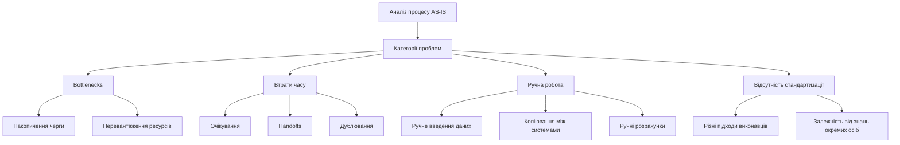
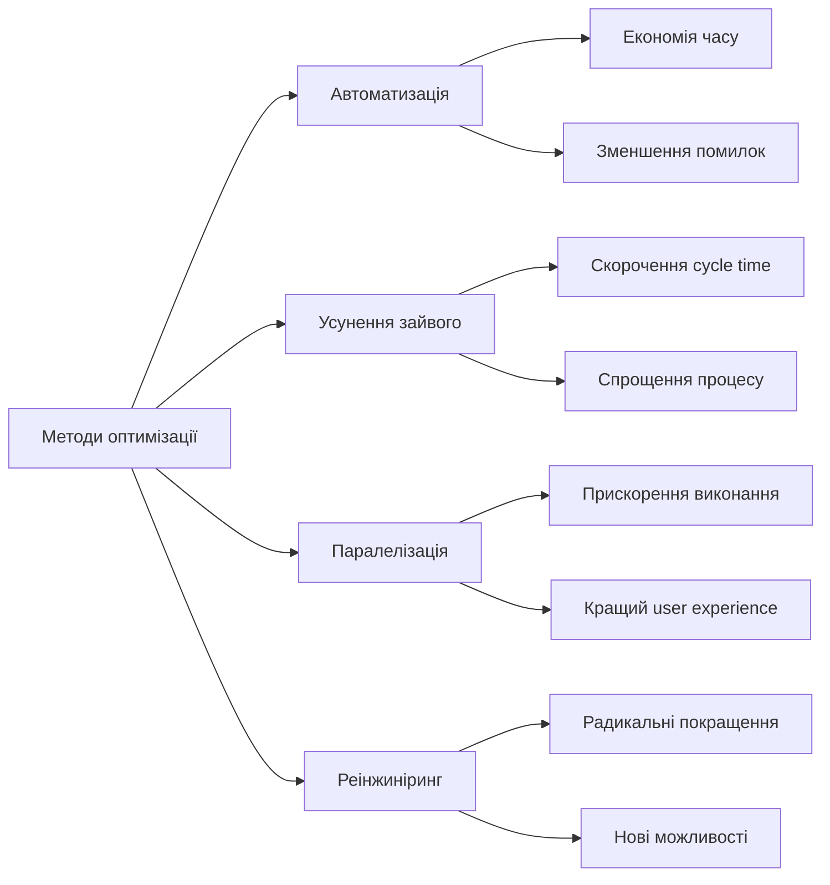
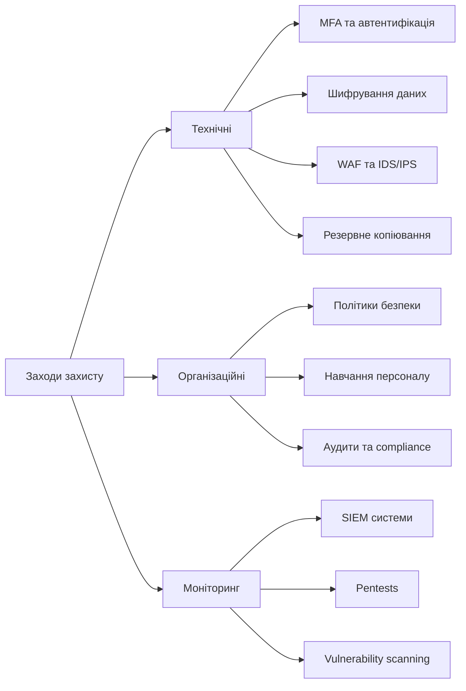

# Лабораторна робота 02 Оптимізація бізнес-процесу та створення моделі з оцінкою ризиків безпеки

## 🎯 Мета

Навчитися виявляти проблемні зони у поточних бізнес-процесах, розробляти оптимізовані моделі TO-BE з використанням нотації BPMN 2.0, проводити комплексну оцінку ризиків інформаційної безпеки при автоматизації процесів та розраховувати ефект від впровадження змін з урахуванням витрат на забезпечення безпеки.

## 📋 Завдання

На основі моделі AS-IS, створеної у лабораторній роботі №1, виконати комплексний проєкт оптимізації процесу з оцінкою безпеки:

1. Провести детальний аналіз поточного процесу AS-IS та виявити проблемні зони: bottlenecks, втрати часу, можливості автоматизації.
2. Розробити обґрунтовані рішення для оптимізації процесу з використанням сучасних технологій автоматизації.
3. Створити BPMN діаграму оптимізованого процесу TO-BE у інструменті моделювання з дотриманням стандарту BPMN 2.0.
4. Провести оцінку ризиків інформаційної безпеки для процесу TO-BE за методологією аналізу ризиків.
5. Визначити критичні точки безпеки в процесі та оцінити стійкість до кібератак.
6. Розробити заходи захисту для мітигації ідентифікованих ризиків з розрахунком їх вартості.
7. Розрахувати економічний ефект від оптимізації з урахуванням витрат на забезпечення безпеки та обґрунтувати доцільність впровадження.
8. Підготувати комплексний звіт з порівняльним аналізом процесів AS-IS та TO-BE, оцінкою ризиків безпеки та рекомендаціями щодо впровадження.

## ⭐ Критерії оцінювання

Максимальна кількість балів за лабораторну роботу: **7 балів**.

Розподіл балів за елементами роботи:

- **Аналіз проблем процесу AS-IS** (1 бал): повнота виявлення bottlenecks, втрат часу, можливостей автоматизації, кількісна оцінка впливу проблем.
- **Якість рішень для оптимізації** (1 бал): обґрунтованість запропонованих рішень, реалістичність впровадження, відповідність виявленим проблемам.
- **BPMN діаграма TO-BE** (1 бал): коректність використання нотації BPMN 2.0, логічність оптимізованого процесу, правильне позначення автоматизованих кроків.
- **Оцінка ризиків безпеки** (2 бали): комплексність аналізу загроз та вразливостей, коректність розрахунку рівня ризиків, обґрунтованість пріоритизації.
- **Визначення критичних точок безпеки** (1 бал): повнота ідентифікації критичних компонентів, якість аналізу стійкості до атак, практичність рекомендацій.
- **Якість звіту** (1 бал): структурованість викладення, якість візуалізації, повнота порівняльного аналізу, обґрунтованість висновків.

## ⏰ Політика дедлайнів та штрафів

**Термін здачі:** Лабораторна робота має бути здана **протягом 3 тижнів** від дати проведення останнього аудиторного заняття з цієї теми.

**Система штрафів за прострочення:** Здача роботи в установлений термін дає можливість отримати повну оцінку 7 балів. Роботи, здані з запізненням, будуть оцінені максимум в 4 бали. Виняток становлять документально підтверджені поважні причини (хвороба, сімейні обставини), за яких термін може бути продовжений за погодженням з викладачем.

## 📚 Теоретичні відомості

### Аналіз бізнес-процесів та виявлення проблем

Аналіз поточного стану бізнес-процесу є критичним етапом перед його оптимізацією. Систематичний підхід до виявлення проблем дозволяє зосередити зусилля на найбільш впливових змінах та уникнути поверхневих покращень, які не дають значного ефекту.

Bottlenecks або вузькі місця являють собою етапи процесу, де відбувається затримка через обмежену пропускну здатність ресурсу. Класичним прикладом bottleneck є ситуація, коли один менеджер має узгоджувати всі заявки на закупівлю в організації. Навіть якщо інші етапи процесу виконуються швидко, загальна швидкість процесу обмежена швидкістю роботи цього менеджера. Ознаками bottleneck є накопичення робіт у черзі перед певним етапом, значний час очікування на цьому етапі порівняно з іншими та систематичне перевантаження конкретних виконавців.

Втрати часу виникають через неефективну організацію процесу та неоптимальну послідовність дій. Основні категорії втрат включають час очікування між етапами процесу, коли робота завершена на одному кроці, але ще не почалася на наступному. Час на передачу роботи між підрозділами (handoffs) часто супроводжується затримками через необхідність перемикання контексту, пояснення ситуації та можливі комунікаційні розриви. Дублювання дій або перевірок, коли одна й та ж інформація перевіряється кількома людьми без додавання цінності, також створює втрати. Зайві узгодження і затвердження, особливо коли рішення могли б прийматися на нижчому рівні, суттєво уповільнюють процес.

Ручна робота, яку можна автоматизувати, є одним з найбільш очевидних джерел неефективності в сучасних бізнес-процесах. Ручне введення даних з паперових форм у систему не тільки займає час, але й призводить до помилок через людський фактор. Ручне копіювання інформації між різними системами створює подвійну проблему: витрати часу та ризик розбіжностей у даних. Ручний розрахунок показників, які можуть бути обчислені автоматично за формулами, є марною тратою кваліфікованого робочого часу. Створення звітів вручну, коли системи містять всю необхідну інформацію, але не мають функції автоматичної генерації, також відноситься до цієї категорії проблем.

Відсутність стандартизації призводить до непередбачуваності процесу та ускладнює його аналіз і покращення. Коли різні виконавці роблять одну роботу по-різному, виникають відхилення у якості результату та часі виконання. Без чітких інструкцій та регламентів нові співробітники тривалий час входять в курс справи, а досвідчені працівники можуть виконувати роботу неоптимально просто через звичку. Неформалізовані критерії прийняття рішень створюють невизначеність та можливість суб'єктивності. Залежність від знань конкретних співробітників робить організацію вразливою до їх відсутності або звільнення.

### Методи оптимізації бізнес-процесів

Існує кілька фундаментальних підходів до оптимізації бізнес-процесів, які можна застосовувати окремо або в комбінації залежно від специфіки процесу та виявлених проблем.

Автоматизація рутинних операцій дозволяє передати виконання повторюваних завдань інформаційним системам, звільнивши людські ресурси для більш творчої та складної роботи. Автоматичне заповнення форм на основі наявних даних усуває необхідність вводити одну й ту ж інформацію кілька разів. Автоматична маршрутизація документів за заздалегідь визначеними правилами прискорює процес узгодження та зменшує ризик відправки документа не тій особі. Автоматичні розрахунки та перевірки виконуються миттєво та без помилок, на відміну від ручних обчислень. Автоматичне створення звітів та сповіщень забезпечує своєчасне інформування всіх зацікавлених сторін без необхідності ручного моніторингу.

Усунення зайвих кроків базується на принципі Lean management, що найшвидший процес - це той, якого немає. Критичний аналіз кожного кроку процесу з питанням "чи дійсно цей крок додає цінність?" часто виявляє дії, які виконуються з історичних причин або через надмірну обережність. Зайві узгодження, коли документ проходить через п'ятьох керівників, хоча реально рішення приймає тільки один, можуть бути скорочені. Дублюючі перевірки, коли одна й та ж інформація верифікується кількома підрозділами незалежно, часто можуть бути замінені однією комплексною перевіркою. Надмірна деталізація звітності, яка створюється але ніким не використовується, також може бути усунена.

Паралелізація завдань дозволяє виконувати незалежні кроки одночасно замість послідовного виконання, суттєво скорочуючи загальний час процесу. Класичний приклад: замість послідовного узгодження документа з п'ятьма керівниками, коли загальний час становить суму часу кожного узгодження плюс затримки передачі, можна відправити документ всім керівникам одночасно, і час узгодження буде визначатися найповільнішим з них. Важливо правильно ідентифікувати дії, які справді є незалежними та можуть виконуватися паралельно, не створюючи конфліктів або дублювання зусиль.

Реінжиніринг процесу представляє радикальний підхід, коли процес проєктується заново з чистого аркуша, без обмежень поточної організації та традицій. Замість питання "як покращити те, що є?" ставиться питання "якби ми проєктували цей процес сьогодні, з урахуванням всіх доступних технологій та кращих практик, як би він виглядав?" Це може включати фундаментальну зміну послідовності кроків, перерозподіл відповідальності між виконавцями з урахуванням їх реальних компетенцій, впровадження якісно нових інструментів або навіть повну зміну бізнес-моделі процесу.

### Оцінка ризиків інформаційної безпеки при автоматизації

Автоматизація та оптимізація бізнес-процесів, незважаючи на очевидні переваги, створюють нові виклики для інформаційної безпеки організації. Розуміння цих ризиків та планування заходів захисту має відбуватися на етапі проєктування процесу TO-BE, а не після впровадження, коли виправлення помилок стає набагато дорожчим.

Ризики автоматизації проявляються через збільшення поверхні атаки. Кожна нова система, додаток або інтеграція є потенційною точкою входу для зловмисників. Якщо у процесі AS-IS використовувалися паперові документи та Excel таблиці, поверхня атаки обмежувалася фізичною безпекою офісу та комп'ютерами співробітників. У процесі TO-BE з вебдодатками, базами даних, API інтеграціями та хмарними сервісами кількість потенційних векторів атаки зростає в рази. Кожен програмний компонент може містити вразливості, які ще не виявлені або не виправлені розробниками. Автоматизовані процеси часто потребують обміну даними між системами через API, що створює додаткові канали, які потрібно захищати від перехоплення, підробки або несанкціонованого доступу.

Ризики централізації даних виникають як побічний ефект консолідації інформації з різних джерел в єдиній системі. З точки зору ефективності та управління це чудово: всі дані в одному місці, легко шукати, аналізувати, генерувати звіти. Але з точки зору безпеки централізація створює привабливу ціль для атак. Компрометація централізованої системи може призвести до витоку великих обсягів критичних даних, які раніше були розподілені по різних системах і документах. Принцип безпеки "не тримати всі яйця в одному кошику" вступає в протиріччя з принципом ефективності "консолідувати дані для кращого управління".

Ризики автентифікації та авторизації стають особливо критичними при автоматизації. У ручних процесах часто використовується неформальний контроль: люди знають один одного, менеджер впізнає почерк підлеглого на паперовій заяві, HR знає хто має право запитувати певну інформацію. В автоматизованих системах весь контроль доступу має бути формалізований у правилах. Автоматизовані системи часто використовують сервісні акаунти з розширеними правами для виконання операцій від імені системи. Якщо облікові дані такого акаунта компрометовані, зловмисник отримує широкі можливості для шкоди. Багатофакторна автентифікація, управління правами за принципом найменших привілеїв, регулярний перегляд та відкликання прав стають не просто рекомендаціями, а необхідністю.

Ризики доступності процесу зростають при переході до автоматизації. У ручному процесі, якщо комп'ютер зламався або система недоступна, роботу можна продовжувати на папері, хоч і повільніше. У повністю автоматизованому процесі технічний збій може повністю зупинити критичні бізнес-операції. DDoS атака на вебсервіс може паралізувати обробку замовлень клієнтів. Збій бази даних може зупинити виробничий процес. Ransomware атака може заблокувати доступ до всіх даних та систем. Тому при проєктуванні процесу TO-BE необхідно закладати механізми забезпечення доступності: резервування критичних компонентів, резервне копіювання даних, плани відновлення після збоїв, можливість деградації до мінімально функціонального режиму.

```mermaid
graph LR
    A[Автоматизація процесу] --> B[Категорії ризиків безпеки]

    B --> C[Збільшення поверхні атаки]
    B --> D[Централізація даних]
    B --> E[Автентифікація та авторизація]
    B --> F[Доступність]

    C --> C1[Вразливості додатків]
    C --> C2[Ризики API]
    C --> C3[Інтеграційні точки]

    D --> D1[Привабливість для атак]
    D --> D2[Масштаб можливого витоку]

    E --> E1[Сервісні акаунти]
    E --> E2[Управління правами]
    E --> E3[MFA необхідність]

    F --> F1[DDoS загрози]
    F --> F2[Технічні збої]
    F --> F3[Ransomware]
```

### Модель оцінки ризиків

Систематична оцінка ризиків інформаційної безпеки використовує структурований підхід, що включає ідентифікацію активів, загроз, вразливостей та кількісну оцінку рівня ризику.

Активи процесу - це цінні ресурси, які потребують захисту від загроз. Інформаційні активи включають персональні дані клієнтів, які підпадають під регуляторні вимоги захисту. Фінансова інформація організації є критичною для бізнесу. Комерційна таємниця забезпечує конкурентну перевагу. Конфіденційні документи можуть завдати репутаційної шкоди при витоку. Технічні активи включають сервери, бази даних, додатки, інтерфейси та мережеве обладнання. Процесні активи - це сам бізнес-процес як конкурентна перевага, репутація організації та довіра до бренду.

Загрози являють собою потенційні події або дії, які можуть завдати шкоди активам. Зовнішні загрози включають цілеспрямовані хакерські атаки, malware та ransomware, DDoS атаки, фішинг, SQL injection, XSS та інші вразливості вебдодатків. Внутрішні загрози включають навмисні дії співробітників (крадіжка даних, саботаж, зловживання правами) та ненавмисні помилки через незнання або неуважність. Технічні загрози включають збої обладнання, помилки програмного забезпечення, проблеми з інтеграціями та втрату даних.

Вразливості - це слабкі місця в системі, які дозволяють загрозам реалізуватися. Технічні вразливості включають застарілі версії програмного забезпечення, невиправлені патчі, слабкі паролі, відсутність шифрування, неправильні налаштування систем та відсутність резервного копіювання. Організаційні вразливості пов'язані з відсутністю політик безпеки, недостатнім навчанням персоналу, відсутністю процедур реагування на інциденти, неналежним контролем доступу та відсутністю моніторингу дій користувачів.

Розрахунок рівня ризику проводиться за формулою:

**Рівень ризику = Ймовірність × Вплив**

Ймовірність оцінюється за шкалою від 1 до 5 (дуже низька, низька, середня, висока, дуже висока). Вплив також оцінюється за шкалою від 1 до 5 (мінімальний, низький, середній, високий, критичний). Результуючий рівень ризику класифікується як низький (1-6), середній (8-12), високий (15-20) або критичний (25).

### Заходи захисту та їх вартість

Після ідентифікації та оцінки ризиків необхідно визначити відповідні заходи захисту для їх мітигації. Вибір заходів має базуватися на балансі між вартістю впровадження та зниженням рівня ризику.

Технічні заходи захисту включають впровадження систем автентифікації та авторизації (MFA, SSO, RBAC), шифрування даних при зберіганні та передачі (SSL/TLS), системи виявлення та запобігання вторгнень (IDS/IPS, WAF), регулярне резервне копіювання даних та системи антивірусного захисту.

Організаційні заходи включають розробку політик інформаційної безпеки, навчання персоналу, проведення аудитів безпеки, створення процедур реагування на інциденти та управління доступом.

Моніторинг та підтримка включають системи збору та аналізу логів (SIEM), регулярні тести на проникнення, моніторинг вразливостей та своєчасне оновлення програмного забезпечення.

### Розрахунок економічного ефекту

Економічне обґрунтування оптимізації бізнес-процесу має враховувати не тільки прямі вигоди від покращення ефективності, але й витрати на забезпечення безпеки автоматизованого процесу.

Вигоди від оптимізації включають економію часу виконавців, зменшення кількості помилок, можливість масштабування без додавання персоналу та покращення задоволеності клієнтів.

Витрати на оптимізацію включають як одноразові інвестиції (ліцензії, налаштування, навчання), так і постійні операційні витрати (підписки, підтримка, обслуговування). Окремою категорією є витрати на забезпечення безпеки.

Повний розрахунок економічного ефекту:

**Економічний ефект = Річна економія - Витрати на впровадження - Річні операційні витрати - Витрати на безпеку**

**Період окупності = Витрати на впровадження / (Річна економія - Річні операційні витрати)**

**ROI = ((Економічний ефект за 3 роки) / (Витрати на впровадження)) × 100%**

## 🔬 Хід роботи

### Крок 1. Аналіз процесу AS-IS та виявлення проблем

Розгляньте модель AS-IS, створену у лабораторній роботі №1, та проведіть детальний аналіз для систематичного виявлення проблемних зон.

Для виявлення bottlenecks проаналізуйте метрики, зібрані у попередній роботі. Визначте етапи з найбільшим часом очікування та найбільшою кількістю робіт у черзі. Ідентифікуйте виконавців або ресурси, які є вузьким місцем процесу.

Для аналізу втрат часу розрахуйте відсоток часу, який витрачається на очікування, передачу роботи між підрозділами та узгодження. Визначте, скільки разів робота передається між різними людьми або системами.

Для виявлення можливостей автоматизації складіть список всіх ручних операцій у процесі. Оцініть, які з них є повторюваними та стандартизованими.

Результатом має бути структурований перелік виявлених проблем з їх кількісною оцінкою.

### Крок 2. Розробка рішень для оптимізації

На основі виявлених проблем розробіть конкретні рішення для оптимізації процесу.

Для кожної проблеми визначте один або кілька можливих способів вирішення. Оцініть кожне рішення з точки зору складності впровадження, необхідних ресурсів та очікуваного ефекту.

Визначте, які технології будуть використані для автоматизації. Опишіть, як зміниться процес після впровадження кожного рішення.

### Крок 3. Створення BPMN діаграми TO-BE

Використовуючи інструмент моделювання, створіть діаграму оптимізованого процесу TO-BE.

Відкрийте новий файл у Draw.io або Bizagi Modeler. Використовуйте ті ж swimlanes, що і в діаграмі AS-IS. Змоделюйте оптимізований процес з урахуванням всіх запропонованих рішень.

Використовуйте Service Task для автоматизованих кроків. Застосовуйте паралельні шлюзи для паралельного виконання незалежних завдань. Видаліть зайві кроки та узгодження.

Переконайтеся, що діаграма відповідає стандарту BPMN 2.0. Додайте анотації для пояснення ключових змін. Розрахуйте нові метрики для процесу TO-BE.

### Крок 4. Оцінка ризиків інформаційної безпеки

Проведіть систематичну оцінку ризиків безпеки для процесу TO-BE.

Складіть перелік активів процесу. Ідентифікуйте загрози для кожного активу. Визначте вразливості системи. Розрахуйте рівень ризику для кожної комбінації загрози та вразливості.

Результатом має бути таблиця ризиків з розрахунком рівня кожного ризику та пріоритизацією від найвищих до найнижчих.

### Крок 5. Визначення критичних точок безпеки

Проаналізуйте процес TO-BE для визначення критичних точок з точки зору безпеки.

Визначте Single Points of Failure - компоненти, відмова яких призводить до повної зупинки процесу. Ідентифікуйте точки входу даних - місця, де дані вводяться в систему ззовні. Проаналізуйте точки інтеграції між системами. Визначте привілейовані операції з підвищеним рівнем доступу.

Створіть схему процесу TO-BE з позначенням критичних точок безпеки.

### Крок 6. Розробка заходів захисту

Для кожного ідентифікованого ризику визначте відповідні заходи захисту.

Технічні заходи можуть включати MFA, шифрування, WAF, резервне копіювання. Організаційні заходи включають політики безпеки, навчання персоналу, аудити. Моніторинг передбачає SIEM, pentests, vulnerability scanning.

Для кожного заходу оцініть вартість впровадження та підтримки. Розрахуйте загальні витрати на забезпечення безпеки.

### Крок 7. Розрахунок економічного ефекту

Проведіть розрахунок економічного ефекту від оптимізації процесу з урахуванням витрат на забезпечення безпеки.

Розрахуйте вигоди: економію часу, зменшення помилок, можливість масштабування. Розрахуйте витрати на впровадження та операційні витрати. Включіть витрати на безпеку.

Розрахуйте чистий економічний ефект, період окупності та ROI. Проведіть аналіз чутливості для різних сценаріїв.

### Крок 8. Підготовка звіту

Оформіть звіт за наступною структурою у форматі PDF:

1. Титульна сторінка
2. Аналіз процесу AS-IS
3. Розроблені рішення для оптимізації
4. Оптимізований процес TO-BE
5. Оцінка ризиків інформаційної безпеки
6. Заходи захисту
7. Економічний аналіз
8. Порівняльний аналіз AS-IS та TO-BE
9. Висновки та рекомендації
10. Додатки

Формат звіту: `pdf`.

## ❓ Контрольні запитання

1. Які основні категорії проблем можуть бути виявлені при аналізі бізнес-процесу AS-IS? Наведіть конкретні приклади для обраного вами процесу та поясніть, як кожна проблема впливає на ефективність.
2. Поясніть різницю між оптимізацією шляхом автоматизації та оптимізацією шляхом реінжинірингу процесу. Коли доцільно використовувати кожен підхід? Чи можна їх комбінувати?
3. Чому автоматизація бізнес-процесів створює нові ризики інформаційної безпеки? Наведіть мінімум 5 конкретних прикладів таких ризиків та поясніть механізм їх виникнення.
4. Як розраховується рівень ризику інформаційної безпеки? Поясніть, які фактори впливають на оцінку ймовірності та впливу. Чому важливо враховувати обидва параметри, а не тільки один?
5. Що таке критичні точки безпеки в бізнес-процесі? Як їх систематично ідентифікувати в моделі TO-BE? Наведіть приклади таких точок у вашому процесі.
6. Які типи заходів захисту можуть бути застосовані для мітигації ризиків безпеки? Наведіть по 3 приклади технічних та організаційних заходів. Які з них зазвичай більш ефективні та чому?
7. Як витрати на забезпечення безпеки впливають на економічний ефект від оптимізації процесу? Чи завжди оптимізація є економічно виправданою, якщо врахувати всі витрати на безпеку? Наведіть приклад ситуації, коли проєкт може бути невигідним.
8. Поясніть різницю між періодом окупності та ROI як метриками ефективності інвестицій. Яка з цих метрик важливіша для прийняття рішення про впровадження оптимізації? Чому?
9. Що таке Single Point of Failure (SPOF) і чому це критично важливо для автоматизованих процесів? Як можна мітигувати ризики, пов'язані з SPOF?
10. Як баланс між вигодами від оптимізації та ризиками безпеки повинен впливати на рішення про впровадження? Чи існують ситуації, коли варто відмовитися від оптимізації через занадто високі ризики безпеки?
