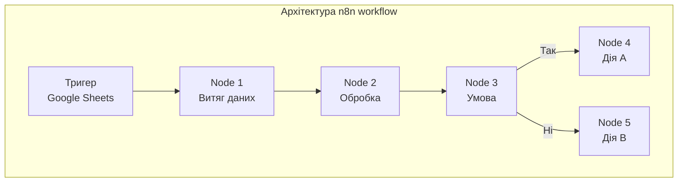
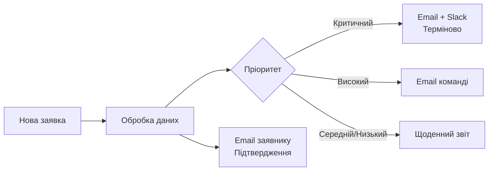
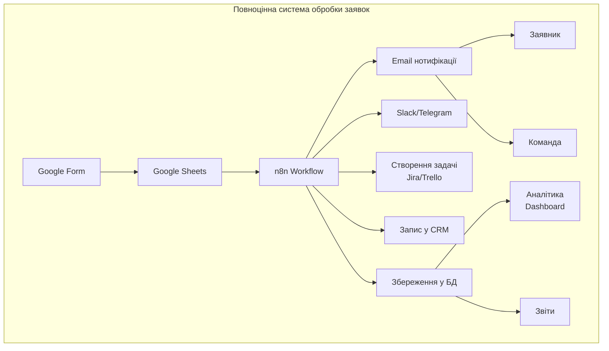

# Лабораторна робота 03 Створення workflow для обробки заявок

## 🎯 Мета

Опанувати базові навички створення автоматизованих бізнес-процесів за допомогою low-code платформи n8n, навчитися інтегрувати різні сервіси для автоматичної обробки даних та зрозуміти принципи event-driven automation.

## 📋 Завдання

Студенту необхідно створити повноцінний автоматизований workflow для прийому та обробки заявок від користувачів. Система повинна включати форму для подання заявок, автоматичне збереження даних у таблиці та базову обробку інформації за допомогою workflow-движка n8n. У процесі виконання роботи студент має налаштувати інтеграцію між Google Forms, Google Sheets та n8n, створити тригери на нові події, реалізувати логіку обробки даних та протестувати роботу системи на різних сценаріях.

## ⭐ Критерії оцінювання

Максимальна кількість балів за лабораторну роботу: **5 балів**.

Розподіл балів за елементами роботи:

- **Створення Google Form з необхідними полями та налаштування збору даних у Google Sheets** (1 бал): повнота форми, правильна валідація полей, коректна структура таблиці для збору даних.
- **Успішна реєстрація у n8n Cloud та налаштування інтеграції з Google Sheets** (1 бал): правильна автентифікація OAuth2, налаштування credentials, підключення до таблиці.
- **Створення базового workflow з тригером на нову заявку та обробкою даних** (1 бал): коректне налаштування polling тригера, правильна трансформація даних, логічність обробки.
- **Тестування workflow на різних сценаріях та документування результатів** (1 бал): створення тестових сценаріїв, аналіз виконань, документація помилок та їх вирішення.
- **Оформлення звіту згідно з вимогами та якість презентації матеріалу** (1 бал): структурованість викладення, якість скріншотів, повнота опису workflow, обґрунтованість ідей для розширення.

## ⏰ Політика дедлайнів та штрафів

**Термін здачі:** Лабораторна робота має бути здана **протягом 2 тижнів** від дати проведення останнього аудиторного заняття з цієї теми.

**Система штрафів за прострочення:** Здача роботи в установлений термін дає можливість отримати повну оцінку 5 балів. Роботи, здані з запізненням, будуть оцінені максимум в 3 бали. Виняток становлять документально підтверджені поважні причини (хвороба, сімейні обставини), за яких термін може бути продовжений за погодженням з викладачем.

## 📚 Теоретичні відомості

### Автоматизація бізнес-процесів

Автоматизація бізнес-процесів передбачає використання технологій для виконання повторюваних завдань без участі людини або з мінімальним втручанням. Основна мета автоматизації полягає у підвищенні ефективності, зменшенні помилок та вивільненні часу співробітників для більш важливих завдань.

Сучасні low-code та no-code платформи дозволяють створювати складні автоматизовані процеси без глибоких знань програмування. Такі рішення особливо корисні для автоматизації рутинних операцій, таких як обробка заявок, розсилка повідомлень, синхронізація даних між системами.

### Workflow та event-driven automation

Workflow (робочий потік) являє собою послідовність кроків, які виконуються для досягнення певної мети. У контексті автоматизації workflow складається з тригерів (подій, що запускають процес), дій (операцій над даними) та умов (логіки прийняття рішень).

Event-driven automation базується на принципі реагування на події. Коли відбувається певна подія (наприклад, нова заявка у формі), система автоматично запускає відповідний workflow. Такий підхід забезпечує миттєву реакцію на зміни та дозволяє обробляти дані в реальному часі.


### Google Forms та Google Sheets

Google Forms є інструментом для створення онлайн-форм, опитувань та анкет. Форми автоматично збирають відповіді у відповідну Google Sheets таблицю, що робить їх ідеальним рішенням для прийому заявок, реєстрацій та збору зворотного зв'язку.

Google Sheets виступає як сховище даних та може слугувати джерелом тригерів для автоматизації. Кожна нова відповідь у формі додається як новий рядок у таблиці, що дозволяє легко відстежувати нові записи та запускати на їх основі автоматичні процеси.

### Платформа n8n

n8n є low-code платформою для автоматизації workflow з відкритим вихідним кодом. На відміну від багатьох конкурентів, n8n пропонує гнучкіший підхід до обробки даних та більше можливостей для кастомізації.

Основні переваги n8n включають інтеграцію з понад 200 сервісами, візуальний редактор workflow, можливість виконання JavaScript коду всередині процесу, підтримку різних типів тригерів (webhook, polling, cron) та безкоштовний тарифний план для навчання та тестування.



### Тригери та polling

Тригер це механізм, який запускає workflow при настанні певної події. Існує кілька типів тригерів: webhook (миттєва реакція на HTTP запит), polling (періодична перевірка наявності нових даних), schedule (запуск за розкладом) та manual (ручний запуск для тестування).

Polling тригер для Google Sheets працює шляхом періодичної перевірки таблиці на наявність нових рядків. n8n запам'ятовує останній оброблений рядок та при наступній перевірці витягує лише нові записи. Інтервал перевірки можна налаштувати від декількох хвилин до годин залежно від потреб.

### Обробка та трансформація даних

Після отримання даних з тригера часто потрібно їх обробити перед подальшим використанням. Це може включати витяг окремих полів, перетворення форматів, об'єднання даних з різних джерел, валідацію та очищення інформації.

n8n надає різні способи обробки даних: вбудовані функції трансформації (Set node для створення нових полів, Function node для JavaScript коду), вирази для динамічного формування значень та можливість використання зовнішніх API для збагачення даних.

## 🔬 Хід роботи

### Крок 1. Створення Google Form для прийому заявок

Перейдіть на сайт Google Forms за адресою forms.google.com та створіть нову форму. Оберіть шаблон "Порожня форма" або почніть з чистого аркуша.

Надайте формі описову назву, наприклад "Заявка на технічну підтримку" або "Реєстрація на подію". У полі опису вкажіть коротку інструкцію для користувачів щодо заповнення форми.

Додайте необхідні поля до форми. Рекомендується використати наступний набір базових полів: ПІБ заявника (текстове поле, обов'язкове), Email (текстове поле з валідацією email, обов'язкове), Тема заявки (випадаючий список або текстове поле, обов'язкове), Опис проблеми або запиту (багаторядкове текстове поле, обов'язкове), Пріоритет (одиночний вибір: Низький, Середній, Високий, Критичний).

Для кожного поля налаштуйте параметри валідації. Зробіть обов'язковими поля, без яких заявка не може бути оброблена. Для email поля увімкніть перевірку формату адреси.

У налаштуваннях форми (значок шестерні) увімкніть опцію "Збирати адреси електронної пошти", якщо потрібна автентифікація користувачів через Google акаунт. Налаштуйте повідомлення після відправки форми, наприклад "Дякуємо! Вашу заявку отримано і буде оброблено найближчим часом".

### Крок 2. Налаштування Google Sheets для збору даних

У редакторі форми перейдіть на вкладку "Відповіді" та натисніть на зелений значок Google Sheets. Оберіть опцію "Створити нову таблицю" та надайте їй назву, наприклад "Заявки техпідтримки (відповіді)".

Після створення таблиця автоматично відкриється у новій вкладці. Ознайомтеся зі структурою таблиці: перший рядок містить заголовки (назви полів з форми), стовпець "Відмітка часу" додається автоматично та фіксує час подання заявки.

Додайте додаткові стовпці для обробки заявок. Рекомендується створити такі поля: Статус (можливі значення: Нова, В обробці, Виконана, Відхилена), Відповідальний (ПІБ співробітника або email), Дата обробки, Коментарі.

Налаштуйте форматування таблиці для зручності роботи. Зафіксуйте перший рядок з заголовками через меню Вигляд - Закріпити - 1 рядок. Застосуйте умовне форматування для стовпця "Пріоритет": червоний колір для критичних заявок, жовтий для високого пріоритету.

Додайте тестову заявку через форму та переконайтеся, що дані коректно потрапляють у таблицю. Зверніть увагу на формат даних у кожному стовпці.

### Крок 3. Реєстрація у n8n Cloud

Перейдіть на офіційний сайт n8n за адресою n8n.io та натисніть кнопку "Get started for free" або "Sign up". Оберіть опцію реєстрації через email або використайте швидку реєстрацію через Google акаунт.

Якщо обираєте реєстрацію через email, заповніть форму з вашим ім'ям, email адресою та придумайте надійний пароль. Підтвердіть email адресу через лист, який прийде на вказану пошту.

Після входу у систему вам буде запропоновано обрати тарифний план. Оберіть безкоштовний план "Free tier", який включає 5000 виконань workflow на місяць, необмежену кількість workflow та доступ до всіх основних інтеграцій.

Ознайомтеся з інтерфейсом n8n Cloud. Основні елементи включають панель навігації зліва (Workflows, Credentials, Executions, Settings), робоча область у центрі для побудови workflow, панель вузлів справа для додавання нових кроків.

Налаштуйте базові параметри облікового запису. Перейдіть у Settings та вкажіть часовий пояс (Europe/Kyiv для України), налаштуйте мову інтерфейсу та параметри сповіщень.

### Крок 4. Налаштування доступу n8n до Google Sheets

Перед створенням workflow необхідно налаштувати автентифікацію n8n для доступу до вашого Google акаунту. Перейдіть у розділ Credentials у лівому меню та натисніть кнопку "Add Credential".

У списку доступних сервісів знайдіть "Google Sheets API" або просто введіть "Google" у пошук. Оберіть тип автентифікації "OAuth2" (рекомендований варіант для безпечного доступу).

Натисніть кнопку "Connect my account" та дозвольте n8n доступ до вашого Google акаунту у вікні, що відкриється. Надайте необхідні дозволи для читання та редагування Google Sheets.

Після успішної автентифікації збережіть credentials під зрозумілою назвою, наприклад "My Google Sheets Account". Ці дані будуть використовуватися у workflow для доступу до таблиць.

Переконайтеся, що credentials створено успішно, перевіривши їх наявність у списку збережених облікових даних.

### Крок 5. Створення базового workflow

Поверніться на головну сторінку та створіть новий workflow натисканням кнопки "Create new workflow". Надайте workflow описову назву, наприклад "Обробка заявок з Google Forms".

Додайте тригер для запуску workflow. Натисніть на кнопку "Add first step" або "+" та у списку тригерів оберіть "Google Sheets". Виберіть операцію "On Row Added" (при додаванні нового рядка).

У налаштуваннях тригера оберіть раніше створені credentials для доступу до Google Sheets. Вкажіть ID таблиці або оберіть її зі списку доступних таблиць. ID таблиці можна знайти в URL адресі таблиці між /d/ та /edit.

Налаштуйте параметри тригера: укажіть назву аркуша (зазвичай "Form Responses 1" для відповідей з форми), встановіть інтервал перевірки нових рядків (рекомендується 1 хвилина для тестування, можна збільшити до 5-15 хвилин для продакшену).

Протестуйте тригер натисканням кнопки "Test step". Якщо у таблиці є дані, ви побачите приклад витягнутого рядка з усіма полями.

### Крок 6. Додавання вузла обробки даних

Додайте новий вузол після тригера натисканням кнопки "+" на з'єднувальній лінії. У списку вузлів оберіть "Set" (для встановлення значень) або "Code" (для JavaScript коду).

Якщо обрали вузол "Set", налаштуйте витяг та трансформацію потрібних полів. Додайте нові поля, які будуть використовуватися далі у workflow. Наприклад, створіть поле "full_name" шляхом об'єднання імені та прізвища, створіть поле "priority_level" з числовим значенням пріоритету (1-4), створіть поле "created_date" з форматованою датою.

Для доступу до даних з попереднього вузла використовуйте вирази n8n. Синтаксис виглядає так: {{ $json["Назва стовпця"] }} для витягу значення поля. Наприклад, {{ $json["Email"] }} витягне email з відповіді форми.

Додайте вузол "Code" для більш складної обробки. У редакторі коду напишіть JavaScript для трансформації даних. Приклад коду для обчислення пріоритету:

```javascript
// Витягуємо дані з попереднього вузла
const item = items[0].json;

// Визначаємо числове значення пріоритету
const priorityMap = {
  'Критичний': 4,
  'Високий': 3,
  'Середній': 2,
  'Низький': 1
};

// Обробляємо дані
const processedData = {
  email: item.Email,
  subject: item['Тема заявки'],
  priority: priorityMap[item['Пріоритет']] || 2,
  timestamp: new Date(item['Відмітка часу']).toISOString(),
  status: 'Нова'
};

// Повертаємо оброблені дані
return [{ json: processedData }];
```

Протестуйте вузол обробки даних натисканням "Test step" та переконайтеся, що дані трансформуються коректно.

### Крок 7. Тестування workflow

Активуйте workflow перемикачем "Active" у правому верхньому куті. Після активації workflow буде автоматично запускатися при додаванні нових рядків у Google Sheets.

Створіть тестову заявку через Google Form. Заповніть усі поля форми реалістичними даними та відправте форму.

Зачекайте хвилину (або встановлений інтервал polling) та перевірте виконання workflow у розділі Executions. Ви побачите список всіх запусків workflow з позначками успішності.

Відкрийте деталі виконання та перегляньте дані на кожному кроці workflow. Переконайтеся, що тригер коректно витяг дані з таблиці, вузол обробки правильно трансформував інформацію.

Якщо є помилки, перегляньте повідомлення про помилки у деталях виконання. Типові проблеми включають неправильні налаштування credentials, помилки у виразах для доступу до полів, невідповідність назв стовпців у таблиці та workflow.

Створіть декілька тестових заявок з різними значеннями у полях (різні пріоритети, різні теми) та переконайтеся, що workflow обробляє всі сценарії коректно.

### Крок 8. Документування workflow

Додайте коментарі до вузлів workflow для пояснення їх призначення. Клацніть правою кнопкою миші на вузол та оберіть "Add Note". Опишіть, що робить цей вузол та які дані він обробляє.

Зробіть скріншоти вашого workflow у n8n. Переконайтеся, що на скріншоті видно всі вузли та їх з'єднання.

Зробіть скріншоти успішних виконань workflow з розділу Executions. Збережіть приклади вхідних та вихідних даних на кожному кроці.

Задокументуйте структуру даних. Створіть таблицю з описом полів форми, їх типів та призначення. Вкажіть, як дані трансформуються на кожному етапі workflow.

Опишіть можливі сценарії використання створеного workflow та подальші покращення, які можна реалізувати у наступній лабораторній роботі.

## 💡 Перспективи розвитку workflow

Створений вами у цій лабораторній роботі базовий workflow є фундаментом для побудови повноцінної системи автоматизації обробки заявок. Важливо розуміти, що поточна реалізація виконує лише первинну обробку даних, але не забезпечує комунікацію з користувачами та інтеграцію з іншими системами. Розглянемо, як можна розвивати цей workflow для створення production-ready рішення.

### Автоматична комунікація з користувачами

Одразу після отримання заявки система може автоматично відправляти email користувачу з підтвердженням прийняття заявки, унікальним номером звернення для відстеження статусу та орієнтовним часом обробки. Це значно покращує користувацький досвід, оскільки заявник одразу отримує зворотний зв'язок та розуміє, що його запит не загубився.

Для команди, що обробляє заявки, можна налаштувати відправку нотифікацій у Slack, Telegram або email відповідальним співробітникам. Наприклад, критичні заявки можуть негайно надсилатися у спеціальний канал з тегуванням відповідальних осіб, тоді як заявки з низьким пріоритетом можуть агрегуватися у щоденний дайджест.



### Інтелектуальна маршрутизація заявок

На основі вмісту заявки workflow може автоматично визначати відповідального виконавця. Якщо заявка стосується технічних проблем, вона направляється у відділ IT, якщо це питання оплати, то у бухгалтерію, а якщо загальний запит, то менеджеру з обслуговування клієнтів. Така маршрутизація може базуватися на аналізі теми заявки, ключових слів у описі або категорії, обраної користувачем.

Для різних типів заявок можна створювати різні типи задач у системах управління проєктами. Наприклад, баг-репорти автоматично створюють issues у Jira з відповідними тегами та пріоритетами, запити на нові функції додаються у product backlog у Trello, а питання підтримки перетворюються на тікети у систему helpdesk.

### Збагачення та валідація даних

Перед обробкою заявки workflow може автоматично перевіряти та збагачувати дані. Email адреса може валідуватися через спеціальні сервіси для виявлення одноразових адрес або невалідних доменів. Якщо заявник є існуючим клієнтом, система може автоматично витягувати додаткову інформацію про нього з CRM (історію попередніх звернень, тип підписки, дату реєстрації).

Для текстового вмісту заявки можна застосовувати автоматичну обробку: визначення мови для подальшого перекладу, виявлення тональності (позитивна, негативна, нейтральна) для пріоритизації незадоволених клієнтів, екстракцію ключових слів та категоризацію заявки.

### Інтеграція з корпоративними системами

У реальному бізнес-середовищі заявки часто потребують взаємодії з різними системами. Workflow може автоматично створювати записи у CRM системі (HubSpot, Salesforce, Pipedrive), оновлювати інформацію про клієнта, фіксувати взаємодію у customer journey.

Для фінансових питань можна інтегрувати перевірку статусу платежів через API платіжних систем, автоматичне створення рахунків або інвойсів, синхронізацію з бухгалтерськими системами. Якщо заявка потребує оформлення документів (договорів, актів, угод), workflow може автоматично генерувати їх на основі шаблонів з підставленням даних заявника.

### Аналітика та моніторинг

Накопичені дані з workflow можна використовувати для аналізу ефективності процесів. Автоматичний підрахунок метрик включає кількість заявок за період, середній час обробки, розподіл за пріоритетами та категоріями, конверсію заявок у виконані завдання.

На основі цих даних можна будувати інтерактивні дашборди у Google Data Studio, Tableau або Power BI, налаштовувати автоматичну генерацію звітів для керівництва (щоденні, тижневі, місячні), створювати алерти на аномальні ситуації (різке зростання кількості заявок, перевищення SLA по часу обробки).



### Безпека та відповідність стандартам

При роботі з заявками користувачів критично важливо забезпечити безпеку даних. Workflow може включати автоматичне маскування чутливої інформації у логах, шифрування персональних даних перед збереженням у базі даних, автоматичне видалення старих заявок відповідно до політики зберігання даних.

Для відповідності вимогам GDPR та іншим регуляторним стандартам можна налаштувати автоматичне логування всіх операцій з персональними даними, створення audit trail для аудиту, відправку нотифікацій про обробку персональних даних згідно з законодавством.

### Практичне застосування у наступній лабораторній роботі

У лабораторній роботі №4 ви будете розширювати створений базовий workflow саме цими функціями. Ви додасте умовну логіку для маршрутизації заявок за пріоритетом, налаштуєте автоматичну відправку email нотифікацій заявнику та команді, інтегруєте додаткові сервіси (Slack, Telegram або Trello) для управління задачами.

Розуміння цих перспектив розвитку допоможе вам краще усвідомити цінність базового workflow, який ви створюєте зараз. Він є фундаментом, на якому будується повноцінна система автоматизації бізнес-процесів, що використовується у реальних компаніях для обробки тисяч заявок щодня.

Під час виконання поточної лабораторної роботи зверніть особливу увагу на якість налаштування тригера та обробки даних, оскільки від цього залежатиме стабільність роботи всієї системи при додаванні нових функцій. Правильна структуризація даних на початковому етапі дозволить легко інтегрувати додаткові сервіси без необхідності переробляти базову логіку.

## 📄 Структура звіту

Звіт має бути оформлений у форматі PDF та включати наступні розділи:

1. Титульна сторінка з назвою лабораторної роботи, ПІБ студента, групою та датою виконання.
2. Мета роботи (переписати з методичних вказівок).
3. Опис створеної Google Form: скріншот форми, перелік створених полів з їх типами, пояснення призначення кожного поля.
4. Опис Google Sheets таблиці: скріншот таблиці з тестовими даними, опис структури таблиці, пояснення додаткових стовпців для обробки.
5. Налаштування n8n: скріншот успішно створених credentials, опис процесу автентифікації.
6. Опис створеного workflow: скріншот повного workflow з усіма вузлами, детальний опис кожного вузла (тригер, обробка даних), пояснення логіки роботи workflow.
7. Результати тестування: скріншоти успішних виконань workflow, приклади вхідних даних (з форми), приклади оброблених даних після кожного вузла, аналіз коректності обробки різних сценаріїв.
8. Код обробки даних: якщо використовувався вузол Code, навести повний код з коментарями, пояснити логіку роботи коду.
9. Ідеї для розширення: опишіть 3-5 конкретних покращень, які ви плануєте реалізувати у наступній лабораторній роботі, поясніть, яку бізнес-цінність вони принесуть.
10. Висновки: що було досягнуто у процесі виконання роботи, які навички опановано, які складнощі виникли та як їх вирішено.

Формат звіту: `pdf`.

## ❓ Контрольні запитання

1. Поясніть різницю між webhook та polling тригерами у n8n. У яких випадках краще використовувати кожен з них.
2. Які переваги має автоматизація процесу прийому заявок порівняно з ручною обробкою через електронну пошту.
3. Опишіть архітектуру створеного вами workflow. Які вузли використовуються та як вони з'єднані між собою.
4. Які типи даних може обробляти n8n. Як здійснюється доступ до полів з попередніх вузлів у виразах.
5. Які потенційні проблеми можуть виникнути при використанні polling тригера з великою кількістю заявок. Як це впливає на швидкість обробки.
6. Поясніть, як працює OAuth2 автентифікація у n8n для доступу до Google Sheets. Які дозволи надаються додатку.
7. Наведіть три конкретні приклади, як створений workflow можна розширити для покращення обслуговування клієнтів. Поясніть бізнес-цінність кожного покращення.
8. Які метрики ефективності можна відстежувати для оцінки якості роботи автоматизованої системи обробки заявок.
9. Які ризики безпеки виникають при автоматизації процесу прийому заявок через публічні форми. Як можна мітигувати ці ризики.
10. Чому важливо правильно структурувати дані на етапі базового workflow. Як це впливає на можливість розширення системи у майбутньому.
