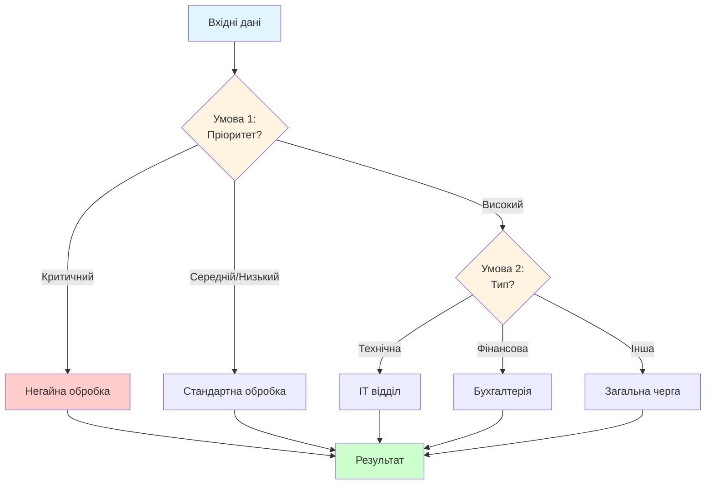
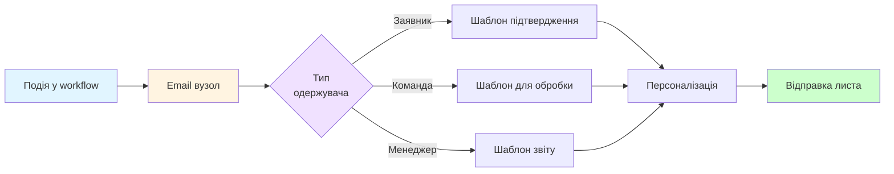
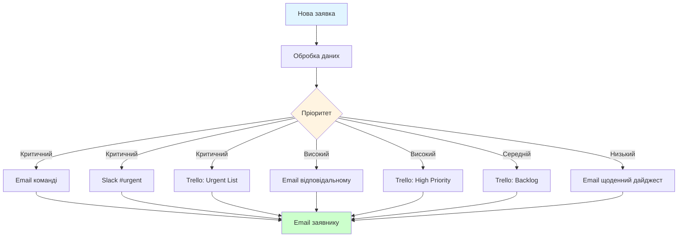

# Лабораторна робота 04 Автоматизація комунікацій та інтеграцій

## 🎯 Мета

Розвинути навички роботи з платформою n8n шляхом додавання складної логіки обробки, умовних розгалужень та інтеграції з зовнішніми сервісами для створення повноцінної системи автоматизації обробки заявок з нотифікаціями та управлінням задачами.

## 📋 Завдання

На основі базового workflow, створеного у лабораторній роботі №3, студент має розширити функціонал системи до production-ready рішення:

1. Додати умовну логіку для маршрутизації заявок на основі пріоритету, теми або інших критеріїв з використанням IF та Switch вузлів.
2. Налаштувати автоматичну відправку email-повідомлень заявнику з підтвердженням прийняття заявки та унікальним номером звернення.
3. Реалізувати відправку нотифікацій команді через email з деталями заявки залежно від її пріоритету та категорії.
4. Інтегрувати мінімум один додатковий сервіс для управління задачами: Slack для командних повідомлень, Telegram для особистих нотифікацій або Trello для створення карток задач.
5. Розробити різні сценарії обробки для різних типів заявок з відповідною логікою маршрутизації та повідомлень.
6. Протестувати workflow на всіх можливих сценаріях роботи та переконатися у коректності обробки edge cases.
7. Задокументувати повний процес автоматизації з описом всіх інтеграцій, логіки розгалужень та прикладами виконання.
8. Підготувати комплексний звіт з аналізом досягнутої автоматизації, порівнянням з ручним процесом та рекомендаціями щодо подальшого розвитку.

## ⭐ Критерії оцінювання

Максимальна кількість балів за лабораторну роботу: **5 балів**.

Розподіл балів за елементами роботи:

- **Реалізація умовної логіки та розгалужень** (1 бал): правильне використання IF/Switch вузлів, логічність умов маршрутизації, охоплення всіх можливих сценаріїв.
- **Налаштування email-нотифікацій** (1 бал): коректна відправка підтвердження заявнику, інформативні листи команді, персоналізація повідомлень, професійне оформлення.
- **Інтеграція додаткового сервісу** (1 бал): успішне підключення Slack/Telegram/Trello, коректна передача даних, налаштування різних типів повідомлень залежно від контексту.
- **Тестування та обробка різних сценаріїв** (1 бал): створення комплексних тестових випадків, перевірка edge cases, документування результатів тестування, виправлення виявлених помилок.
- **Якість звіту та документації** (1 бал): повнота опису workflow, якість схем та скріншотів, аналіз ефективності автоматизації, практичність рекомендацій.

## ⏰ Політика дедлайнів та штрафів

**Термін здачі:** Лабораторна робота має бути здана **протягом 2 тижнів** від дати проведення останнього аудиторного заняття з цієї теми.

**Система штрафів за прострочення:** Здача роботи в установлений термін дає можливість отримати повну оцінку 5 балів. Роботи, здані з запізненням, будуть оцінені максимум в 3 бали. Виняток становлять документально підтверджені поважні причини (хвороба, сімейні обставини), за яких термін може бути продовжений за погодженням з викладачем.

## 📚 Теоретичні відомості

### Умовна логіка у workflow автоматизації

Умовна логіка є ключовим елементом складних автоматизованих процесів, що дозволяє системі приймати рішення на основі даних та направляти виконання різними шляхами залежно від умов. На відміну від лінійних workflow, де всі дії виконуються послідовно, умовні розгалуження створюють динамічні процеси, що адаптуються до конкретної ситуації.

Основою умовної логіки є логічні вирази, що повертають значення true або false. Прості умови перевіряють одне значення, наприклад "пріоритет дорівнює Критичний" або "сума більша за 10000". Складні умови об'єднують кілька перевірок за допомогою логічних операторів AND (обидві умови мають бути true), OR (хоча б одна умова має бути true) та NOT (інверсія результату).



У n8n умовна логіка реалізується через спеціальні вузли IF та Switch. IF вузол підходить для бінарних рішень, коли потрібно розділити потік на два шляхи: true (умова виконується) та false (умова не виконується). Switch вузол використовується для множинного вибору, коли потрібно направити дані одним з декількох можливих шляхів на основі значення поля.

Важливо розуміти різницю між цими вузлами. IF вузол оцінює умову та направляє дані по одному з двох виходів. Якщо умова true, дані йдуть через вихід "true", інакше через вихід "false". Switch вузол порівнює значення з набором правил та направляє дані через відповідний вихід. Наприклад, для поля "статус" можна створити виходи "новий", "в обробці", "виконаний" та "default" для всіх інших випадків.

### Email автоматизація та шаблони повідомлень

Email залишається одним з найбільш надійних каналів комунікації у бізнес-процесах завдяки своїй універсальності та формальності. Автоматизація email-повідомлень дозволяє забезпечити своєчасне інформування всіх учасників процесу без ручного втручання.

Ключовим елементом професійної email-автоматизації є використання шаблонів з динамічними параметрами. Замість відправки одноманітних повідомлень, шаблони дозволяють персоналізувати кожен лист, підставляючи конкретні дані отримувача, деталі заявки, дати та інші релевантні параметри.

Структура професійного email-повідомлення включає кілька обов'язкових елементів. Тема листа має бути інформативною та містити ключові деталі, що дозволяють одразу зрозуміти зміст, наприклад "Заявка №12345: підтвердження прийняття" або "Критична заявка від клієнта Acme Corp потребує уваги". Привітання має звертатися до отримувача за іменем для персоналізації. Основний текст повідомлення має бути структурованим, чітким та містити всю необхідну інформацію без зайвої деталізації.



HTML форматування дозволяє створювати візуально привабливі та структуровані повідомлення. Базове форматування включає заголовки для розділів, списки для переліку пунктів, таблиці для структурованого відображення даних та виділення кольором для важливих елементів. Важливо дотримуватися балансу між дизайном та простотою, оскільки занадто складний HTML може некоректно відображатися у різних email-клієнтах.

У n8n відправка email реалізується через вузол Gmail (якщо використовується Gmail акаунт) або вузол Send Email для інших SMTP серверів. Для професійного використання рекомендується налаштувати окремий email-акаунт для автоматизації, а не використовувати особистий, щоб уникнути плутанини та забезпечити можливість моніторингу відправлених повідомлень.

### Інтеграція з Slack

Slack є популярною платформою для командної комунікації, що дозволяє організувати обмін повідомленнями у структурованому вигляді через канали та приватні чати. Інтеграція Slack з workflow автоматизації дає можливість миттєво інформувати команду про важливі події без необхідності постійно перевіряти email або інші системи.

Основною одиницею організації у Slack є канал - спеціальний простір для обговорення конкретної теми або проєкту. Канали можуть бути публічними (доступні всім членам workspace) або приватними (тільки для запрошених користувачів). Для різних типів заявок можна створити окремі канали: #support-critical для критичних проблем, #support-general для звичайних запитів, #finance для фінансових питань.

Slack підтримує багате форматування повідомлень через Block Kit - систему структурованих блоків, що дозволяє створювати інтерактивні та візуально привабливі повідомлення. Основні типи блоків включають Section (текст з можливістю додавання зображень), Divider (роздільник між секціями), Context (додаткова інформація дрібним шрифтом) та Actions (інтерактивні кнопки).

Mentions (згадування) дозволяють привернути увагу конкретних користувачів або груп. Синтаксис @username надсилає нотифікацію конкретному користувачу, @channel повідомляє всіх учасників каналу, @here повідомляє тільки активних зараз користувачів. Це особливо корисно для критичних заявок, що потребують негайної уваги.

### Інтеграція з Telegram

Telegram пропонує потужний Bot API, що дозволяє створювати автоматизовані системи повідомлень для персональних нотифікацій або роботи з невеликими командами. На відміну від Slack, Telegram не потребує корпоративного workspace і є більш доступним для малого бізнесу або особистого використання.

Telegram боти створюються через спеціального бота @BotFather, який генерує токен доступу для API. Цей токен використовується для автентифікації всіх запитів до Telegram API. Важливо зберігати токен у безпеці, оскільки будь-хто, хто має доступ до токену, може керувати ботом.

Кожен користувач або група у Telegram має унікальний Chat ID - числовий ідентифікатор, який використовується для відправки повідомлень конкретному одержувачу. Для отримання Chat ID користувача можна скористатися спеціальними ботами типу @userinfobot або перехопити його з webhook події після того, як користувач напише боту.

Telegram підтримує різні типи повідомлень: текстові повідомлення з Markdown або HTML форматуванням, зображення з підписами, документи та файли, опитування для збору зворотного зв'язку. Для структурованих повідомлень можна використовувати Inline клавіатури - кнопки, що відображаються під повідомленням та дозволяють користувачу виконувати дії одним кліком.

### Інтеграція з Trello

Trello є візуальним інструментом для управління проєктами на основі Kanban методології, де задачі представлені у вигляді карток, організованих у списки на дошках. Автоматизація створення карток Trello з заявок дозволяє безшовно інтегрувати систему прийому запитів з процесом їх виконання.

Основна структура Trello складається з ієрархії елементів. Board (дошка) - це контейнер верхнього рівня, що містить весь проєкт. List (список) представляє етап процесу, наприклад "To Do", "In Progress", "Done". Card (картка) - це окрема задача або заявка з деталями, чекліcтами, термінами та відповідальними.

Картка Trello може містити різноманітну інформацію: назву та детальний опис задачі, мітки (labels) для категоризації, терміни виконання (due date) з нагадуваннями, членів (members) - призначених відповідальних, чекліcти для поетапного виконання, вкладення (attachments) для додавання файлів та коментарі для обговорення.



При створенні картки через API важливо правильно структурувати інформацію з заявки. Назва картки має бути короткою але інформативною, опис може містити всі деталі заявки у форматованому вигляді, мітки використовуються для позначення типу заявки або її статусу, термін виконання може автоматично розраховуватися на основі пріоритету.

### Обробка помилок та resilience

У production-ready workflow критично важливо передбачити обробку помилок та забезпечити стійкість системи до збоїв. Помилки можуть виникати з різних причин: недоступність зовнішнього сервісу, некоректний формат даних, перевищення ліміту API запитів, проблеми з мережею.

n8n надає механізми для обробки помилок на рівні окремих вузлів та всього workflow. Error trigger дозволяє перехоплювати помилки і виконувати спеціальні дії, наприклад відправку повідомлення адміністратору. Retry on fail автоматично повторює виконання вузла кілька разів з затримкою у випадку помилки. Continue on fail дозволяє workflow продовжити виконання навіть якщо конкретний вузол завершився з помилкою.

Логування є важливим аспектом надійних систем. n8n автоматично зберігає історію всіх виконань workflow з деталями кожного кроку, що дозволяє аналізувати проблеми post-factum. Додатково можна налаштувати відправку критичних помилок у окремий канал моніторингу або систему логування.

## 🔬 Хід роботи

### Крок 1. Підготовка базового workflow з лабораторної роботи №3

Відкрийте workflow, створений у лабораторній роботі №3, у n8n Cloud. Переконайтеся, що базовий workflow працює коректно: тригер успішно отримує нові заявки з Google Sheets, вузол обробки даних коректно трансформує інформацію.

Перед додаванням нової функціональності рекомендується створити резервну копію поточного workflow. Клацніть правою кнопкою миші на назві workflow та оберіть "Duplicate" для створення копії. Назвіть копію "Обробка заявок - backup" для можливості повернення до робочої версії у разі проблем.

Проаналізуйте поточну структуру даних, що передається між вузлами. Зверніть увагу на назви полів, їх формат та доступні значення. Це важливо для правильного налаштування умовної логіки на наступних кроках.

Додайте коментарі до існуючих вузлів для документування їх призначення. Це допоможе орієнтуватися у більш складному workflow після додавання нових елементів.

### Крок 2. Додавання умовної логіки для маршрутизації

Додайте IF вузол після вузла обробки даних для розділення заявок за пріоритетом. Клацніть на "+" після останнього вузла та у списку оберіть "IF". Налаштуйте умову для перевірки пріоритету.

У налаштуваннях IF вузла створіть умову: Value 1 встановіть як {{ $json["priority_level"] }}, Operator оберіть "Larger Than", Value 2 встановіть як 2. Ця умова буде перевіряти, чи є пріоритет високим або критичним (значення 3 або 4).

Якщо потрібна більш складна маршрутизація з кількома варіантами, додайте Switch вузол замість IF. Switch дозволяє створити окремі гілки для кожного можливого значення пріоритету. Налаштуйте режим Switch як "Rules" та додайте правила для кожного рівня пріоритету.

Для кожного рівня пріоритету створіть окреме правило: Output 0 - Критичний (priority_level дорівнює 4), Output 1 - Високий (priority_level дорівнює 3), Output 2 - Середній (priority_level дорівнює 2), Output 3 - Низький (priority_level дорівнює 1), Fallback - на випадок невизначеного пріоритету.

Протестуйте умовну логіку з тестовими даними різних пріоритетів. Створіть заявки через Google Form з різними значеннями пріоритету та переконайтеся, що вони коректно розподіляються по різних гілках workflow.

### Крок 3. Налаштування email-повідомлення для заявника

Додайте вузол Gmail або Send Email для відправки підтвердження заявнику. Якщо використовуєте Gmail, спочатку налаштуйте credentials аналогічно до Google Sheets у лабораторній роботі №3.

Для налаштування Gmail credentials перейдіть у розділ Credentials, додайте новий Gmail OAuth2, пройдіть процес автентифікації та надайте дозвіл на відправку email від вашого імені.

У налаштуваннях email вузла заповніть наступні поля. To (отримувач) встановіть як {{ $json["Email"] }} для використання email адреси з заявки. Subject (тема) створіть динамічну, наприклад "Заявка №{{ $json["row_number"] }}: підтвердження прийняття".

Для поля Message (текст листа) створіть професійний шаблон з персоналізацією:

```
Шановний/а {{ $json["ПІБ"] }},

Дякуємо за звернення! Вашу заявку успішно отримано та зареєстровано в нашій системі.

Деталі заявки:
━━━━━━━━━━━━━━━━━━━━━━━━━━━━━━━━━━━━━━
📌 Номер заявки: {{ $json["row_number"] }}
📅 Дата подання: {{ $json["created_date"] }}
📋 Тема: {{ $json["Тема заявки"] }}
⚡ Пріоритет: {{ $json["Пріоритет"] }}

Опис:
{{ $json["Опис проблеми або запиту"] }}
━━━━━━━━━━━━━━━━━━━━━━━━━━━━━━━━━━━━━━

Ваша заявка буде оброблена найближчим часом. Орієнтовний час обробки залежить від пріоритету:
• Критичний: протягом 2 годин
• Високий: протягом 8 годин
• Середній: протягом 24 годин
• Низький: протягом 48 годин

Ви отримаєте повідомлення про зміну статусу заявки.

З повагою,
Команда технічної підтримки
```

Для HTML форматування увімкніть опцію "HTML Email" у налаштуваннях вузла та перепишіть повідомлення з використанням HTML тегів для кращого відображення:

```html
<h2>Підтвердження прийняття заявки</h2>

<p>Шановний/а <strong>{{ $json["ПІБ"] }}</strong>,</p>

<p>Дякуємо за звернення! Вашу заявку успішно отримано та зареєстровано в нашій системі.</p>

<h3>Деталі заявки:</h3>
<table style="border-collapse: collapse; width: 100%; max-width: 600px;">
    <tr>
        <td style="padding: 8px; border: 1px solid #ddd;"><strong>Номер заявки:</strong></td>
        <td style="padding: 8px; border: 1px solid #ddd;">{{ $json["row_number"] }}</td>
    </tr>
    <tr>
        <td style="padding: 8px; border: 1px solid #ddd;"><strong>Дата подання:</strong></td>
        <td style="padding: 8px; border: 1px solid #ddd;">{{ $json["created_date"] }}</td>
    </tr>
    <tr>
        <td style="padding: 8px; border: 1px solid #ddd;"><strong>Тема:</strong></td>
        <td style="padding: 8px; border: 1px solid #ddd;">{{ $json["Тема заявки"] }}</td>
    </tr>
    <tr>
        <td style="padding: 8px; border: 1px solid #ddd;"><strong>Пріоритет:</strong></td>
        <td style="padding: 8px; border: 1px solid #ddd; color: {{ $json["priority_level"] > 3 ? 'red' : 'black' }};">{{ $json["Пріоритет"] }}</td>
    </tr>
</table>

<p style="margin-top: 20px;">З повагою,<br>Команда технічної підтримки</p>
```

Протестуйте відправку email створивши тестову заявку. Перевірте, що лист приходить на вказану адресу, всі динамічні поля підставляються коректно, форматування відображається правильно.

### Крок 4. Налаштування email-повідомлень для команди

Створіть окремі гілки email-повідомлень для команди залежно від пріоритету заявки. Для критичних заявок додайте email вузол після відповідного виходу Switch/IF вузла.

Налаштуйте email для критичних заявок з максимальною деталізацією та яскравим оформленням для привернення уваги. To (отримувач) вкажіть email відповідальної особи або команди, наприклад support-team@company.com. Subject зробіть помітним: "🚨 КРИТИЧНА ЗАЯВКА №{{ $json["row_number"] }} - ПОТРЕБУЄ НЕГАЙНОЇ УВАГИ".

Текст повідомлення для команди має містити більше технічних деталей ніж повідомлення для заявника:

```html
<div style="background-color: #ff4444; color: white; padding: 15px; border-radius: 5px; margin-bottom: 20px;">
    <h2 style="margin: 0;">⚠️ КРИТИЧНА ЗАЯВКА</h2>
    <p style="margin: 5px 0 0 0; font-size: 18px;">Номер: {{ $json["row_number"] }} | Час подання: {{ $json["created_date"] }}</p>
</div>

<h3>Інформація про заявника:</h3>
<ul>
    <li><strong>ПІБ:</strong> {{ $json["ПІБ"] }}</li>
    <li><strong>Email:</strong> <a href="mailto:{{ $json["Email"] }}">{{ $json["Email"] }}</a></li>
</ul>

<h3>Деталі проблеми:</h3>
<p><strong>Тема:</strong> {{ $json["Тема заявки"] }}</p>
<div style="background-color: #f5f5f5; padding: 15px; border-left: 4px solid #ff4444;">
    {{ $json["Опис проблеми або запиту"] }}
</div>

<div style="margin-top: 30px; padding: 15px; background-color: #fff3cd; border-left: 4px solid #ffc107;">
    <strong>⏱️ SLA:</strong> Критичні заявки мають бути оброблені протягом 2 годин від моменту подання.
</div>

<p style="margin-top: 20px;">
    <a href="https://docs.google.com/spreadsheets/d/YOUR_SHEET_ID" style="background-color: #007bff; color: white; padding: 10px 20px; text-decoration: none; border-radius: 5px; display: inline-block;">Переглянути в системі</a>
</p>
```

Для заявок з високим пріоритетом створіть подібний email але з менш яскравим оформленням. Для середніх та низьких пріоритетів можна об'єднати повідомлення у щоденний дайджест (це можна реалізувати пізніше через окремий scheduled workflow).

### Крок 5. Інтеграція зі Slack

Якщо обрали Slack для командних повідомлень, почніть з налаштування Slack App. Перейдіть на api.slack.com/apps та створіть новий додаток для вашого workspace.

У налаштуваннях додатка перейдіть до OAuth & Permissions та додайте необхідні Bot Token Scopes: chat:write для відправки повідомлень, chat:write.customize для налаштування імені та іконки бота, channels:read для отримання списку каналів. Встановіть додаток у workspace та скопіюйте Bot User OAuth Token.

У n8n додайте новий Slack credential типу OAuth2. Вставте отриманий Bot Token у відповідне поле. Збережіть credentials під зрозумілою назвою.

Додайте Slack вузол після Switch вузла на гілці критичних заявок. Оберіть операцію "Send Message". У полі Channel вкажіть назву каналу для критичних повідомлень, наприклад #support-urgent.

Створіть структуроване повідомлення для Slack з використанням Block Kit:

```json
{
  "blocks": [
    {
      "type": "header",
      "text": {
        "type": "plain_text",
        "text": "🚨 Критична заявка #{{ $json["row_number"] }}"
      }
    },
    {
      "type": "section",
      "fields": [
        {
          "type": "mrkdwn",
          "text": "*Заявник:*\n{{ $json["ПІБ"] }}"
        },
        {
          "type": "mrkdwn",
          "text": "*Email:*\n{{ $json["Email"] }}"
        },
        {
          "type": "mrkdwn",
          "text": "*Тема:*\n{{ $json["Тема заявки"] }}"
        },
        {
          "type": "mrkdwn",
          "text": "*Час подання:*\n{{ $json["created_date"] }}"
        }
      ]
    },
    {
      "type": "section",
      "text": {
        "type": "mrkdwn",
        "text": "*Опис проблеми:*\n{{ $json["Опис проблеми або запиту"] }}"
      }
    },
    {
      "type": "divider"
    },
    {
      "type": "context",
      "elements": [
        {
          "type": "mrkdwn",
          "text": "⏱️ SLA: 2 години | Потрібна негайна увага команди"
        }
      ]
    }
  ]
}
```

Додайте mention для повідомлення відповідальних осіб у тексті повідомлення. Використовуйте синтаксис <@USER_ID> або <!channel> для повідомлення всього каналу у критичних випадках.

### Крок 6. Інтеграція з Telegram

Якщо обрали Telegram, створіть бота через @BotFather у Telegram. Відправте команду /newbot та дотримуйтесь інструкцій для створення нового бота. Збережіть отриманий API токен.

У n8n додайте Telegram credential. Вставте API токен у поле "Access Token". Збережіть credentials.

Щоб отримати Chat ID для відправки повідомлень, напишіть вашому боту будь-яке повідомлення у Telegram. Потім використайте Telegram API метод getUpdates для отримання Chat ID: виконайте GET запит https://api.telegram.org/bot{YOUR_TOKEN}/getUpdates у браузері або Postman. У відповіді знайдіть поле "chat": {"id": 123456789}.

Додайте Telegram вузол після Switch вузла для відповідної гілки пріоритету. Оберіть операцію "Send Message". У полі Chat ID вкажіть отриманий ідентифікатор чату. У полі Message створіть форматоване повідомлення з використанням Markdown або HTML.

Приклад повідомлення з HTML форматуванням:

```html
🚨 <b>КРИТИЧНА ЗАЯВКА #{row_number}</b>

👤 <b>Заявник:</b> {ПІБ}
📧 <b>Email:</b> {Email}
📋 <b>Тема:</b> {Тема заявки}
⏰ <b>Час:</b> {created_date}

<b>Опис:</b>
<code>{Опис проблеми або запиту}</code>

⚠️ <i>SLA: 2 години - потрібна негайна обробка</i>
```

Увімкніть опцію "Parse Mode" та встановіть значення "HTML" для коректного відображення форматування.

### Крок 7. Інтеграція з Trello

Якщо обрали Trello, спочатку отримайте API Key та Token. Перейдіть на trello.com/power-ups/admin, увійдіть у свій акаунт та отримайте API Key. Натисніть на посилання для генерації Token з необхідними дозволами (read та write).

У n8n додайте Trello credential. Вставте API Key та Token у відповідні поля. Збережіть credentials.

Створіть дошку Trello для управління заявками, якщо її ще немає. Додайте списки для різних статусів: "Нові заявки", "В обробці", "Очікування відповіді", "Виконані". Скопіюйте ID дошки з URL адреси (між /b/ та назвою дошки).

Додайте Trello вузол після Switch вузла. Оберіть операцію "Create a Card". У налаштуваннях вкажіть Board ID, List (оберіть відповідний список залежно від пріоритету заявки).

Налаштуйте поля картки для максимальної інформативності. Name (назва картки) зробіть короткою але інформативною: "[{{ $json["Пріоритет"] }}] {{ $json["Тема заявки"] }} - {{ $json["ПІБ"] }}". Description (опис) має містити всі деталі заявки у структурованому вигляді:

```markdown
## Інформація про заявника
- **ПІБ:** {{ $json["ПІБ"] }}
- **Email:** {{ $json["Email"] }}
- **Дата подання:** {{ $json["created_date"] }}

## Деталі заявки
**Номер:** {{ $json["row_number"] }}
**Пріоритет:** {{ $json["Пріоритет"] }}
**Тема:** {{ $json["Тема заявки"] }}

## Опис проблеми
{{ $json["Опис проблеми або запиту"] }}

---
*Автоматично створено системою обробки заявок*
```

Додайте мітки (Labels) для візуальної ідентифікації. Створіть мітки різних кольорів для різних пріоритетів: червона для критичних, помаранчева для високих, жовта для середніх, зелена для низьких.

Встановіть Due Date (термін виконання) автоматично на основі пріоритету. Використайте вираз для розрахунку дати:

```javascript
{{
  $now.plus({
    hours: $json["priority_level"] === 4 ? 2 :
           $json["priority_level"] === 3 ? 8 :
           $json["priority_level"] === 2 ? 24 : 48
  }).toISO()
}}
```

### Крок 8. Тестування повного workflow

Створіть комплексний план тестування для перевірки всіх можливих сценаріїв роботи системи. Підготуйте тестові дані для кожного рівня пріоритету, різних типів заявок, різних форматів даних (з усіма полями заповненими, з мінімальним набором полів, з нестандартними символами).

Протестуйте кожну гілку workflow окремо. Створіть критичну заявку та переконайтеся, що відправляються email заявнику, email команді з відповідним форматуванням, повідомлення у Slack/Telegram, картка у Trello з правильними параметрами.

Перевірте edge cases та потенційні проблеми. Що відбувається, якщо email заявника невалідний, якщо у полі пріоритету нестандартне значення, якщо опис заявки дуже довгий (більше ліміту для Slack/Telegram), якщо один з сервісів (Slack/Trello) недоступний.

Додайте обробку помилок для критичних вузлів. На вузлах відправки email та інтеграцій увімкніть опцію "Continue On Fail" щоб workflow не зупинявся при збої одного сервісу. Додайте Error Trigger для логування помилок.

Створіть мінімум 10 тестових заявок з різними комбінаціями параметрів. Задокументуйте результати кожного тесту у таблиці: номер тесту, вхідні параметри, очікуваний результат, фактичний результат, статус (Pass/Fail), коментарі.

Виправте всі виявлені проблеми та повторно протестуйте проблемні сценарії для підтвердження коректності виправлень.

### Крок 9. Оптимізація та документування workflow

Проаналізуйте ефективність створеного workflow. Порахуйте, скільки часу займає автоматична обробка однієї заявки порівняно з ручним процесом. Оцініть економію часу команди на рутинних операціях.

Додайте коментарі до всіх вузлів workflow. Для кожного вузла опишіть його призначення, які дані він обробляє, які дії виконує. Для складних виразів додайте пояснення логіки обчислень.

Створіть візуальну схему workflow з поясненнями. Зробіть скріншот повного workflow та додайте анотації для кожної важливої гілки. Опишіть потік даних від початкового тригера до фінальних дій.

Задокументуйте всі використані інтеграції з деталями налаштування. Для кожного зовнішнього сервісу опишіть процес отримання credentials, необхідні дозволи, особливості конфігурації.

Підготуйте інструкцію для команди щодо роботи з системою. Опишіть, як створюється заявка, що відбувається після подання, де можна відстежити статус, як змінити налаштування workflow.

### Крок 10. Аналіз досягнутої автоматизації

Створіть порівняльну таблицю процесу до та після автоматизації. Включіть метрики: час обробки однієї заявки, кількість ручних операцій, ймовірність помилок, час реакції команди на критичні заявки.

Розрахуйте економічний ефект від автоматизації. Якщо раніше на обробку однієї заявки (прийом, реєстрація, повідомлення команди) витрачалося 10 хвилин ручної роботи, а зараз процес автоматичний, то при 50 заявках на день економія становить 500 хвилин або більше 8 годин робочого часу.

Визначте метрики для моніторингу ефективності системи. Кількість оброблених заявок за період, середній час від подання до першої реакції, відсоток заявок, оброблених у межах SLA, кількість помилок workflow.

Сформулюйте рекомендації щодо подальшого розвитку системи. Які додаткові функції можна реалізувати (автоматичне призначення відповідального, інтеграція з системою обліку часу, автоматичні нагадування про прострочені заявки, аналітичні звіти).

## 💡 Перспективи подальшого розвитку

Створена у цій лабораторній роботі система автоматизації є повноцінним рішенням для обробки заявок, але її можна розвивати у різних напрямках для досягнення ще більшої ефективності та функціональності.

### Інтелектуальна обробка та категоризація

Додавання можливостей машинного навчання дозволить автоматично категоризувати заявки на основі їх вмісту. Інтеграція з API сервісів обробки природної мови (Google Cloud Natural Language, Azure Text Analytics) може автоматично визначати тему заявки, тональність повідомлення та ключові сутності без необхідності ручного заповнення категорій користувачем.

Sentiment analysis (аналіз тональності) допоможе виявляти особливо незадоволених клієнтів та автоматично підвищувати пріоритет їх заявок. Якщо у тексті виявлено негативну тональність з високим рівнем впевненості, система може додатково сповістити менеджера для особистого контакту з клієнтом.

### Автоматичне призначення виконавців

На основі історичних даних та спеціалізації членів команди можна реалізувати інтелектуальну маршрутизацію заявок. Система може аналізувати, які типи заявок певні співробітники обробляють найшвидше та найякісніше, та автоматично призначати їм відповідні задачі.

Балансування навантаження гарантує, що жоден член команди не буде перевантажений. Workflow може перевіряти поточну кількість активних задач у кожного виконавця та призначати нові заявки тому, хто має найменше навантаження у відповідній категорії.

### Дводенна комунікація та оновлення статусу

Інтеграція webhook для отримання оновлень від зовнішніх систем дозволить автоматично інформувати заявника про зміни статусу. Коли виконавець змінює статус картки у Trello або позначає задачу виконаною, система може автоматично відправити email або Telegram повідомлення клієнту.

Інтерактивні елементи у повідомленнях дозволять заявникам надавати зворотний зв'язок безпосередньо з email або Slack. Кнопки "Проблему вирішено", "Потрібні уточнення", "Незадоволений рішенням" можуть запускати відповідні workflow для закриття заявки або ескалації.

### Аналітика та звітність

Накопичення даних про всі заявки дозволяє будувати потужну аналітику. Автоматична генерація звітів може показувати тренди звернень за категоріями, ефективність роботи команди, дотримання SLA, найпоширеніші проблеми клієнтів.

Predictive analytics може прогнозувати піки навантаження на основі історичних даних та допомагати планувати ресурси команди. Якщо система виявляє, що щопонеділка кількість заявок зростає на 40%, вона може заздалегідь попередити менеджера про необхідність додаткового покриття.

Розуміння цих можливостей допоможе вам бачити систему не як статичний набір правил, а як платформу, що постійно розвивається та адаптується до потреб бізнесу.

## 📄 Структура звіту

Звіт має бути оформлений у форматі PDF та включати наступні розділи:

1. Титульна сторінка з назвою лабораторної роботи, ПІБ студента, групою та датою виконання.
2. Мета роботи (переписати з методичних вказівок).
3. Опис розширеного workflow: повна схема workflow з усіма вузлами та з'єднаннями, детальний опис кожного нового вузла (умовна логіка, email, інтеграції), пояснення логіки маршрутизації та обробки різних сценаріїв.
4. Налаштування умовної логіки: скріншоти налаштувань IF/Switch вузлів, опис умов та правил розгалуження, приклади даних для кожної гілки.
5. Конфігурація email-повідомлень: шаблони повідомлень для заявника та команди, скріншоти отриманих email з реальними даними, пояснення персоналізації та форматування.
6. Інтеграція додаткового сервісу: процес налаштування credentials та доступу, конфігурація повідомлень або створення задач, скріншоти результатів у зовнішньому сервісі (Slack/Telegram/Trello).
7. Результати тестування: таблиця тестових сценаріїв з вхідними даними та результатами, скріншоти успішних виконань для різних типів заявок, аналіз виявлених проблем та їх вирішення, приклади обробки edge cases.
8. Аналіз ефективності автоматизації: порівняльна таблиця ручного та автоматизованого процесів, розрахунок економії часу та ресурсів, метрики якості обслуговування (час реакції, дотримання SLA).
9. Висновки та рекомендації: досягнення та навички, отримані під час виконання роботи, виклики та складнощі, з якими зіткнулися, та їх вирішення, ідеї для подальшого розвитку системи автоматизації.

Звіт має бути структурованим, всі скріншоти повинні бути чіткими та супроводжуватися поясненнями. Обов'язково включіть приклади реальних повідомлень у всіх інтегрованих сервісах.

Формат звіту: `pdf`.

## ❓ Контрольні запитання

1. Поясніть різницю між IF та Switch вузлами у n8n. У яких ситуаціях краще використовувати кожен з них? Наведіть конкретні приклади з вашого workflow.
2. Які переваги дає персоналізація email-повідомлень порівняно зі стандартними шаблонами? Як це впливає на досвід користувача та ефективність комунікації?
3. Опишіть процес автентифікації та авторизації при інтеграції n8n з зовнішніми сервісами (Gmail, Slack, Trello). Які ризики безпеки необхідно враховувати?
4. Як правильно структурувати повідомлення для різних каналів комунікації (email, Slack, Telegram)? Які особливості форматування та обмеження існують для кожного каналу?
5. Що таке edge cases у контексті автоматизації workflow? Наведіть 5 прикладів edge cases для системи обробки заявок та поясніть, як їх обробляти.
6. Поясніть концепцію "Continue On Fail" у n8n. Чому це важливо для production-ready систем? У яких випадках краще дозволити workflow завершитися з помилкою?
7. Які метрики ефективності автоматизації найважливіші для бізнесу? Як їх правильно вимірювати та інтерпретувати для обґрунтування інвестицій в автоматизацію?
8. Опишіть потенційні проблеми масштабування створеної системи. Що станеться, якщо кількість заявок зросте з 50 до 500 на день? Які обмеження можуть виникнути?
9. Як забезпечити відповідність автоматизованої системи вимогам GDPR при роботі з персональними даними заявників? Які заходи безпеки необхідно впровадити?
10. Поясніть концепцію "fail fast" у контексті автоматизації. Чому краще виявити проблему на ранньому етапі workflow, ніж дозволити їй поширитися далі по ланцюгу?
