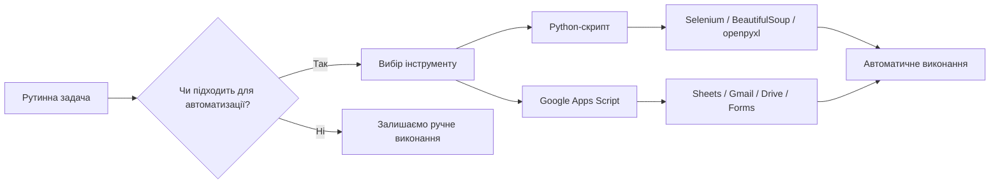
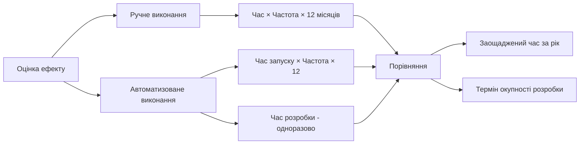

# Лабораторна робота 05 RPA — автоматизація рутинних завдань

## 🎯 Мета

Навчитися застосовувати інструменти роботизованої автоматизації процесів (RPA) для виконання рутинних задач: розробити скрипт для автоматизації обраної задачі на основі Python або Google Apps Script, протестувати його в реальних умовах та оцінити практичний ефект від автоматизації у вигляді заощадженого часу.

## 📋 Завдання

Обрати рутинну задачу, яку виконують вручну, та автоматизувати її одним із двох способів.

1. Проаналізувати обрану задачу: описати її кроки, частоту виконання та поточні часові витрати.
2. Реалізувати автоматизацію — на вибір студента:
    - варіант A: Python-скрипт із використанням бібліотек Selenium, BeautifulSoup, openpyxl або інших доречних інструментів;
    - варіант B: Google Apps Script для автоматизації в межах Google Workspace (Forms, Sheets, Gmail, Drive).
3. Протестувати скрипт на кількох реальних сценаріях і зафіксувати результати.
4. Розрахувати заощаджений час у порівнянні з ручним виконанням.
5. Підготувати звіт у форматі PDF за наведеною структурою.

## ⭐ Критерії оцінювання

Максимальна кількість балів за лабораторну роботу: **5 балів**.

Розподіл балів за елементами роботи:

- Аналіз задачі та обґрунтування вибору підходу (1 бал): чіткий опис кроків задачі, обрану платформу обґрунтовано, наявна оцінка поточних витрат часу.
- Якість реалізації скрипту (2 бали): код є читабельним, структурованим та коментованим; скрипт коректно виконує задачу; реалізована обробка помилок або нестандартних ситуацій.
- Тестування та результати (1 бал): перевірено мінімум 3 сценарії використання, зафіксовані реальні результати виконання, розраховані часові показники.
- Якість звіту (1 бал): відповідність структурі, наявність скріншотів або виводу скрипту, обґрунтованість висновків.

## ⏰ Політика дедлайнів та штрафів

Термін здачі: лабораторна робота має бути здана протягом 3 тижнів від дати проведення останнього аудиторного заняття з цієї теми.

Система штрафів за прострочення: здача роботи в установлений термін дає можливість отримати повну оцінку 5 балів. Роботи, здані з запізненням, будуть оцінені максимум в 3 бали. Виняток становлять документально підтверджені поважні причини (хвороба, сімейні обставини), за яких термін може бути продовжений за погодженням з викладачем.

## 📚 Теоретичні відомості

### Концепція RPA та її місце в автоматизації

Роботизована автоматизація процесів, або RPA (Robotic Process Automation), — це підхід до автоматизації, при якому програмні "роботи" наслідують дії людини при роботі з комп'ютером: клацають кнопки, заповнюють форми, читають дані з екрана та переносять їх між системами. На відміну від класичної системної інтеграції через API, RPA не потребує зміни існуючих застосунків і може працювати з будь-яким інтерфейсом так само, як це робить людина.

RPA найбільш ефективна тоді, коли задача є повторюваною, правила її виконання чіткі та стандартизовані, а обсяг роботи значний або вона виконується регулярно. Класичні приклади: копіювання даних між двома системами, щомісячне формування звітів з кількох джерел, перевірка наявності нових файлів і їх обробка, надсилання повідомлень за розкладом або по тригеру.



Два основні критерії вибору задачі для автоматизації: по-перше, задача має виконуватися достатньо часто, щоб інвестиція часу на написання скрипту окупилася; по-друге, її кроки мають бути однозначними та відтворюваними. Якщо задача потребує творчих рішень або суттєво змінюється від разу до разу, автоматизація буде значно складнішою або недоцільною.

### Варіант A: Python-скрипт

Python є одним із найпопулярніших інструментів для RPA завдяки великій екосистемі бібліотек та зрозумілому синтаксису. Для різних типів задач використовуються різні бібліотеки.

Selenium призначений для автоматизації дій у браузері. Він відкриває реальний браузер (або headless-браузер без інтерфейсу), переходить на вказані сторінки, знаходить елементи на сторінці та взаємодіє з ними так само, як це робить людина. Selenium підходить для задач, де потрібно заповнити вебформу, авторизуватися на сайті, послідовно переглянути кілька сторінок або виконати дії, що потребують JavaScript.

BeautifulSoup використовується для аналізу HTML-коду сторінки та вилучення з нього структурованих даних. Зазвичай його поєднують з бібліотекою requests, яка завантажує HTML без відкриття браузера. Це більш швидкий і легкий підхід, але він не підходить для сторінок, де контент генерується динамічно через JavaScript.

Бібліотеки для роботи з файлами дозволяють автоматизувати обробку даних без браузера. openpyxl дозволяє читати та записувати файли Excel, python-docx — документи Word, а модуль csv зі стандартної бібліотеки — текстові таблиці. Це зручно для задач обробки звітів, трансформації даних та генерації документів.

Простий приклад скрипту, що зберігає заголовки новин із публічного сайту в CSV-файл:

```python
import requests
from bs4 import BeautifulSoup
import csv
from datetime import datetime

# URL сторінки з новинами (використовуємо публічно доступний ресурс)
url = "https://news.ycombinator.com"

# Завантажуємо HTML сторінки
response = requests.get(url, timeout=10)
response.raise_for_status()  # Перевірка на помилки HTTP

# Парсимо HTML
soup = BeautifulSoup(response.text, "html.parser")

# Знаходимо заголовки статей
titles = soup.select(".titleline > a")

# Записуємо результати у CSV
filename = f"news_{datetime.now().strftime('%Y%m%d_%H%M')}.csv"
with open(filename, "w", newline="", encoding="utf-8") as f:
    writer = csv.writer(f)
    writer.writerow(["Заголовок", "Посилання"])
    for title in titles:
        writer.writerow([title.get_text(), title.get("href", "")])

print(f"Збережено {len(titles)} заголовків у файл {filename}")
```

Для запуску скрипту потрібно встановити залежності:

```
pip install requests beautifulsoup4
```

Важливою частиною будь-якого скрипту є обробка помилок. Мережа може бути недоступна, структура сторінки може змінитися, файл може бути заблокований іншою програмою. Конструкція `try/except` дозволяє передбачити такі ситуації та реагувати на них коректно, а не завершувати роботу з незрозумілою помилкою.

### Варіант B: Google Apps Script

Google Apps Script — це хмарна платформа для автоматизації сервісів Google Workspace: Sheets, Docs, Forms, Gmail, Drive, Calendar та інших. Скрипти пишуться мовою JavaScript і виконуються на серверах Google, тобто не потребують встановлення нічого на комп'ютері студента.

Найпростіший спосіб почати: відкрити Google Таблицю, перейти до меню Розширення → Apps Script і написати функцію. Скрипт можна запустити вручну, прив'язати до кнопки на аркуші або налаштувати автоматичний запуск за розкладом через тригери.

Типові сценарії використання Google Apps Script: автоматичне надсилання листа при заповненні Google Form, щотижнева генерація зведеного звіту з кількох аркушів таблиці, копіювання нових рядків з однієї таблиці в іншу, форматування даних та виділення клітинок за умовою, сповіщення про зміни в документі.

Приклад скрипту, що збирає відповіді з Google Form і надсилає на пошту підсумок:

```javascript
function sendFormSummary() {
  // Отримуємо активну таблицю (куди записуються відповіді форми)
  const sheet = SpreadsheetApp.getActiveSpreadsheet().getActiveSheet();
  const data = sheet.getDataRange().getValues();

  // Рядок 0 — заголовки, рядки 1+ — відповіді
  const headers = data[0];
  const rows = data.slice(1);

  // Формуємо текст листа
  let body = `Нових відповідей: ${rows.length}\n\n`;
  rows.forEach((row, index) => {
    body += `Відповідь #${index + 1}:\n`;
    headers.forEach((header, col) => {
      body += `  ${header}: ${row[col]}\n`;
    });
    body += "\n";
  });

  // Надсилаємо лист
  GmailApp.sendEmail(
    Session.getActiveUser().getEmail(),
    "Підсумок відповідей форми",
    body
  );

  Logger.log("Лист надіслано успішно.");
}
```

Тригери дозволяють запускати такі функції автоматично. Наприклад, можна налаштувати запуск щопонеділка о 9:00 або при кожному надходженні нової відповіді на форму. Тригери налаштовуються через меню Розширення → Apps Script → Тригери.

### Розрахунок заощадженого часу

Ключовим результатом автоматизації є кількісна оцінка ефекту. Формула розрахунку:

```
Заощаджений час = (Час ручного виконання × Частота) - (Час запуску скрипту × Частота + Час розробки)
```

Заощаджений час зазвичай обчислюється за рік. Якщо задача виконується щодня і вручну займає 20 хвилин, а скрипт виконується за 1 хвилину без участі людини, то річна економія становитиме: `(20 - 1) × 250 робочих днів = 4750 хвилин ≈ 79 годин`. Навіть якщо розробка скрипту зайняла 5 годин, інвестиція окупається вже через кілька тижнів.



## 🔬 Хід роботи

### Крок 1. Вибір задачі та аналіз

Оберіть рутинну задачу для автоматизації з наведеного переліку або запропонуйте власну.

Можливі задачі для варіанту A (Python):

- збір даних з публічного вебсайту та збереження у файл Excel або CSV;
- перевірка наявності нових файлів у папці та їх автоматична обробка (перейменування, архівування, перетворення);
- читання даних з кількох CSV-файлів, їх об'єднання та формування зведеного звіту;
- надсилання email-повідомлень за списком адресатів із персоналізованим текстом.

Можливі задачі для варіанту B (Google Apps Script):

- автоматичне надсилання підтвердження на email після заповнення Google Form;
- щотижневе формування зведеного звіту з Google Sheets і надсилання його на пошту;
- копіювання рядків, що відповідають умові, з одного аркуша на інший;
- автоматичне форматування нових рядків у таблиці за визначеними правилами.

Для обраної задачі опишіть: всі кроки її ручного виконання у вигляді пронумерованого списку, частоту виконання (щодня, щотижня, щомісяця), середній час одного ручного виконання (виміряйте або оцініть обґрунтовано), кількість людей, що зазвичай виконують задачу.

### Крок 2. Підготовка середовища

Для варіанту A встановіть Python 3.10 або новішу версію, якщо ще не встановлено. Перевірте встановлення командою `python --version`. Встановіть необхідні бібліотеки через pip, наприклад `pip install requests beautifulsoup4 openpyxl selenium`. Якщо плануєте використовувати Selenium, завантажте відповідний WebDriver для браузера: ChromeDriver для Chrome або GeckoDriver для Firefox.

Для варіанту B відкрийте Google Диск і створіть нову Google Таблицю. Перейдіть до меню Розширення → Apps Script. Переконайтеся, що ви увійшли до облікового запису Google.

### Крок 3. Розробка скрипту

Напишіть скрипт, що автоматизує обрану задачу. Дотримуйтеся таких вимог до коду:

- кожна функція чи логічний блок має бути відокремлений та мати короткий коментар;
- змінні мають мати зрозумілі назви, що відображають їх призначення;
- скрипт має обробляти щонайменше одну нештатну ситуацію (відсутність файлу, помилка мережі, порожні дані);
- у кінці виконання скрипт має виводити повідомлення з результатом роботи.

Починайте з мінімально робочої версії: реалізуйте основну функцію, переконайтеся, що вона працює, а потім додавайте обробку помилок та додаткові можливості.

### Крок 4. Тестування

Протестуйте скрипт мінімум на трьох сценаріях.

Сценарій 1 — стандартне виконання: запустіть скрипт з типовими вхідними даними та перевірте, що результат відповідає очікуваному.

Сценарій 2 — граничний випадок: перевірте поведінку при мінімальному або максимальному обсязі даних (наприклад, порожня таблиця або дуже великий файл).

Сценарій 3 — нештатна ситуація: змодельте умову, при якій скрипт може зазнати невдачі (відсутній файл, недоступний URL), та перевірте, що обробка помилок працює коректно.

Для кожного сценарію зафіксуйте вхідні дані, час виконання скрипту та отриманий результат або повідомлення про помилку.

### Крок 5. Розрахунок заощадженого часу

На основі даних, зібраних у кроці 1, та результатів тестування розрахуйте заощаджений час.

Заповніть таблицю:

| Параметр | Значення |
|---|---|
| Час ручного виконання (хвилин) | |
| Час виконання скрипту (хвилин) | |
| Частота виконання за рік (разів) | |
| Час розробки скрипту (годин) | |
| Заощаджено часу за рік (годин) | |
| Термін окупності розробки (тижнів) | |

Поясніть у звіті, чи вважаєте ви автоматизацію цієї задачі виправданою та чому.

### Крок 6. Підготовка звіту

Оформіть звіт у форматі PDF за наведеною структурою:

1. Титульна сторінка (тема лабораторної роботи, ПІБ, група, дата).
2. Опис обраної задачі (кроки ручного виконання, частота, поточні витрати часу).
3. Обґрунтування вибору підходу (варіант A або B, чому саме цей інструмент).
4. Опис середовища розробки (встановлені бібліотеки або налаштування Google Apps Script).
5. Код скрипту з коментарями (вставити безпосередньо у звіт або як додаток).
6. Результати тестування (таблиця з трьома сценаріями та скріншоти або вивід консолі).
7. Розрахунок заощадженого часу (заповнена таблиця та висновок).
8. Висновки (що вдалося реалізувати, з якими труднощами зіткнулися, що б покращили).

Формат звіту: `pdf`.

## ❓ Контрольні запитання

1. Що таке RPA і чим вона відрізняється від традиційної системної інтеграції через API? У яких ситуаціях RPA є більш доцільним вибором?
2. За якими критеріями варто обирати задачу для автоматизації? Наведіть приклад задачі, яка виглядає підходящою для RPA, але насправді погано піддається автоматизації.
3. Поясніть різницю між Selenium і BeautifulSoup. Для яких типів задач підходить кожен інструмент?
4. Чому обробка помилок є обов'язковою частиною будь-якого скрипту автоматизації? Що відбудеться, якщо скрипт не передбачає нештатних ситуацій?
5. Як розрахувати термін окупності автоматизації? Від яких факторів він залежить і як можна його скоротити?
6. Які обмеження має Google Apps Script порівняно з Python? У яких випадках варто надати перевагу саме Apps Script?
7. Що таке headless-браузер і коли його використання переважніше за звичайний браузер при роботі з Selenium?
