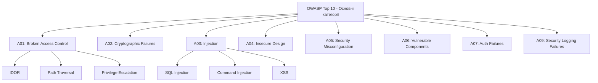
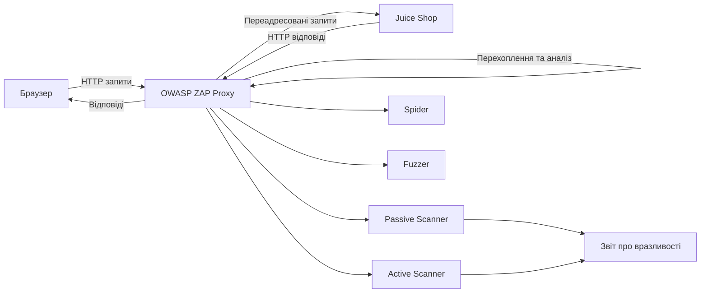

# Лабораторна робота 07 Аналіз вразливостей вебдодатків

## 🎯 Мета

Навчитися виявляти та аналізувати вразливості вебдодатків з використанням спеціалізованих інструментів безпеки, формувати навички проведення автоматизованого та ручного сканування, документувати знахідки відповідно до стандартів інформаційної безпеки.

## 📋 Завдання

1. Розгорнути вразливий вебдодаток OWASP Juice Shop локально (через Docker) або підключитись до онлайн-версії.
2. Встановити та налаштувати сканер безпеки OWASP ZAP.
3. Виконати автоматизоване сканування вебдодатку та проаналізувати результати.
4. Знайти та експлуатувати вручну мінімум 5 різних вразливостей.
5. Задокументувати кожну знайдену вразливість: тип, рівень критичності (severity), потенційний вплив (impact) та підтвердження концепції (PoC).
6. Підготувати звіт з результатами тестування та рекомендаціями щодо усунення вразливостей.

## ⭐ Критерії оцінювання

Максимальна кількість балів за лабораторну роботу: **6 балів**.

Розподіл балів за елементами роботи:

- **Розгортання та налаштування середовища** (1 бал): успішне розгортання Juice Shop, налаштування OWASP ZAP та підключення до цільового додатку, коректне налаштування проксі.
- **Автоматизоване сканування** (1 бал): виконання повного автоматизованого сканування, аналіз звіту ZAP, коректна інтерпретація знайдених попереджень та їх класифікація.
- **Ручна експлуатація вразливостей** (2 бали): виявлення та успішна демонстрація мінімум 5 різних вразливостей, різноманітність типів вразливостей (не менше 3 різних категорій OWASP Top 10).
- **Документування знахідок** (1 бал): повнота опису кожної вразливості (тип, severity, impact, PoC з доказами), якість технічного пояснення механізму вразливості.
- **Якість звіту та рекомендації** (1 бал): структурованість звіту, обґрунтованість рекомендацій щодо усунення вразливостей, загальні висновки щодо захищеності додатку.

## ⏰ Політика дедлайнів та штрафів

**Термін здачі:** Лабораторна робота має бути здана **протягом 3 тижнів** від дати проведення останнього аудиторного заняття з цієї теми.

**Система штрафів за прострочення:** Здача роботи в установлений термін дає можливість отримати повну оцінку 6 балів. Роботи, здані з запізненням, будуть оцінені максимум в 3 бали. Виняток становлять документально підтверджені поважні причини (хвороба, сімейні обставини), за яких термін може бути продовжений за погодженням з викладачем.

## 📚 Теоретичні відомості

### OWASP Top 10 та класифікація вразливостей вебдодатків

OWASP (Open Web Application Security Project) — міжнародна некомерційна організація, що займається підвищенням безпеки вебпрограмного забезпечення. Список OWASP Top 10 є стандартом де-факто для оцінки безпеки вебдодатків і оновлюється кожні кілька років на основі реальних даних про вразливості.

Ін'єкційні вразливості (Injection) виникають, коли ненадійні дані передаються інтерпретатору як частина команди або запиту. SQL Injection є найбільш поширеним прикладом: зловмисник вставляє шкідливий SQL-код у поле введення, і сервер виконує його як частину запиту до бази даних. Наприклад, запит `SELECT * FROM users WHERE login='admin' AND password='' OR '1'='1'` обходить перевірку пароля, оскільки умова `'1'='1'` завжди є істинною. Наслідки можуть включати несанкціонований доступ до даних, їх модифікацію або видалення, а в критичних випадках — виконання команд на рівні операційної системи.

Міжсайтовий скриптинг (XSS, Cross-Site Scripting) дозволяє зловмисникам впроваджувати шкідливі скрипти на сторінки, які переглядають інші користувачі. Reflected XSS відбувається, коли дані зі шкідливим кодом одразу повертаються у відповіді сервера без збереження. Stored XSS є більш небезпечним — шкідливий код зберігається в базі даних і виконується при кожному завантаженні ураженої сторінки. DOM-based XSS маніпулює об'єктною моделлю документа без взаємодії із сервером.

Помилки автентифікації та управління сесіями дозволяють зловмисникам компрометувати паролі, ключі або токени сесій. Типові проблеми включають: передбачувані ідентифікатори сесій, відсутність обмежень кількості невдалих спроб входу, небезпечне зберігання облікових даних (наприклад, у відкритому вигляді) та незавершення сесій при виході з системи.



Небезпечні прямі посилання на об'єкти (IDOR, Insecure Direct Object Reference) виникають, коли додаток надає пряме посилання на внутрішній об'єкт (наприклад, файл, запис у базі даних або ключ) без перевірки, чи має поточний користувач право доступу до нього. Зловмисник може змінити параметр URL `?id=123` на `?id=124` і отримати дані іншого користувача, якщо перевірка авторизації відсутня.

### OWASP Juice Shop як навчальна платформа

OWASP Juice Shop — це свідомо вразливий вебдодаток, розроблений для навчання з питань безпеки. Він є сучасним SPA (Single Page Application) на базі Node.js та Angular і містить понад 100 задач різного рівня складності. Juice Shop охоплює всі категорії OWASP Top 10 та багато інших вразливостей, представлених у контексті реального інтернет-магазину.

Juice Shop може бути розгорнутий локально через Docker командою `docker run -p 3000:3000 bkimminich/juice-shop`, після чого він стає доступним за адресою `http://localhost:3000`. Також існує офіційна онлайн-версія для практики без необхідності локального розгортання.

Система завдань у Juice Shop організована у вигляді скорбордy, де кожна успішно вирішена задача фіксується. Цей механізм дозволяє студентам самостійно відстежувати прогрес та підтверджувати виконання завдань за допомогою скриншотів із зафіксованим успіхом.

### OWASP ZAP як інструмент аналізу безпеки

OWASP ZAP (Zed Attack Proxy) — це безкоштовний інструмент з відкритим кодом для тестування безпеки вебдодатків. ZAP виступає як проксі-сервер між браузером та цільовим додатком, перехоплюючи та аналізуючи HTTP/HTTPS трафік.

Основні режими роботи ZAP включають автоматичне сканування (Active Scan), яке надсилає шкідливі запити до цільового додатку для виявлення вразливостей, та пасивне сканування (Passive Scan), що аналізує трафік без активних атак. Spider/Crawler автоматично обходить посилання додатку, складаючи карту ресурсів. Fuzzer дозволяє надсилати велику кількість модифікованих запитів для виявлення нестандартної поведінки.



### Шкала критичності вразливостей CVSS

Система Common Vulnerability Scoring System (CVSS) забезпечує стандартизований спосіб оцінки критичності вразливостей. Базовий показник CVSS враховує вектор атаки, складність атаки, необхідні привілеї та вплив на конфіденційність, цілісність і доступність.

Рівні критичності класифікуються наступним чином: Critical (9.0–10.0) — вразливості, що допускають повну компрометацію системи без автентифікації; High (7.0–8.9) — серйозні вразливості зі значним впливом; Medium (4.0–6.9) — вразливості з обмеженим впливом або що потребують певних умов; Low (0.1–3.9) — вразливості з мінімальним впливом; None (0.0) — відсутність вразливості.

### Поняття Proof of Concept (PoC)

Підтвердження концепції (PoC) у контексті вразливостей безпеки — це демонстрація реальної можливості використання вразливості. PoC є критично важливою частиною звіту про вразливість, оскільки він підтверджує, що вразливість є не теоретичною, а практично експлуатованою.

Якісний PoC включає опис кроків для відтворення вразливості, точні запити або дії, що призводять до виявлення проблеми, скриншоти або відеозапис результату та опис отриманого ефекту (витік даних, обхід автентифікації тощо). PoC дозволяє розробникам самостійно відтворити та підтвердити вразливість і є стандартною вимогою у responsible disclosure процесах.

## 🔬 Хід роботи

### Крок 1. Підготовка середовища

**Варіант А — локальне розгортання через Docker:**

Переконайтесь, що Docker встановлений і запущений на вашому комп'ютері. Виконайте у терміналі команду для завантаження та запуску Juice Shop:

```
docker run -p 3000:3000 bkimminich/juice-shop
```

Після завершення завантаження образу відкрийте браузер і перейдіть за адресою `http://localhost:3000`. Ви маєте побачити головну сторінку інтернет-магазину Juice Shop.

**Варіант Б — онлайн-версія:**

Якщо встановлення Docker неможливе, скористайтесь посиланням на демо-інстанс. Зверніться до викладача для отримання актуального посилання, оскільки публічні інстанси змінюються.

**Встановлення OWASP ZAP:**

Завантажте OWASP ZAP з офіційного сайту `https://www.zaproxy.org/download/`. Встановіть відповідну версію для вашої операційної системи. Запустіть ZAP та виконайте первинне налаштування, прийнявши параметри за замовчуванням.

### Крок 2. Налаштування OWASP ZAP як проксі

Після запуску ZAP ознайомтесь з його інтерфейсом. Знайдіть у нижній частині екрана інформацію про локальний проксі — за замовчуванням це `127.0.0.1:8080`.

Налаштуйте браузер для роботи через ZAP: у Firefox або Chrome відкрийте налаштування мережевого проксі та вкажіть `127.0.0.1` та порт `8080`. Встановіть сертифікат ZAP у браузер для перехоплення HTTPS трафіку (ZAP → Tools → Options → Network → Server Certificates → Save Root CA Certificate, потім імпортуйте у браузер).

Перевірте налаштування: відкрийте Juice Shop через браузер та переконайтеся, що запити відображаються у вкладці History у ZAP.

### Крок 3. Автоматизоване сканування

У ZAP відкрийте вкладку Quick Start та скористайтесь функцією Automated Scan. Введіть URL Juice Shop (`http://localhost:3000`) та натисніть Attack. ZAP автоматично виконає Spider та Active Scan.

Дочекайтесь завершення сканування (це може тривати від 10 до 30 хвилин). Після завершення перейдіть до вкладки Alerts, де відображаються всі знайдені попередження, відсортовані за рівнем критичності.

Проаналізуйте знайдені попередження. Для кожного попередження ZAP надає опис, технічний аналіз та посилання на відповідну категорію CWE або OWASP. Збережіть звіт: Reports → Generate Report → HTML.

### Крок 4. Ручна експлуатація вразливостей

Мета цього кроку — знайти та продемонструвати мінімум 5 вразливостей вручну, без автоматизованих інструментів. Нижче наведені підказки для початку роботи.

**Вразливість 1 — SQL Injection (обхід автентифікації):**
Перейдіть на сторінку входу в систему. Спробуйте ввести у полі email значення `' OR '1'='1` та будь-який пароль. Дослідіть, що відбувається. Якщо вхід успішний, ви знайшли SQL Injection у формі логіну. Зафіксуйте запит через вкладку History у ZAP.

**Вразливість 2 — XSS (Reflected або DOM-based):**
Знайдіть поле пошуку на сайті. Введіть `<script>alert('XSS')</script>` та натисніть пошук. Дослідіть URL та поведінку сторінки. Якщо виконується JavaScript, зафіксуйте PoC.

**Вразливість 3 — IDOR (Insecure Direct Object Reference):**
Після реєстрації та входу в систему перегляньте свої дані або замовлення. Спробуйте змінити ідентифікатор у URL (наприклад, `?id=1`, `?id=2`). Дослідіть, чи можна отримати дані інших користувачів.

**Вразливість 4 — Exposed Admin Interface:**
Спробуйте знайти приховані сторінки адміністратора шляхом перебору поширених шляхів: `/admin`, `/administration`, `/administrator`. Скористайтесь функцією Spider у ZAP для виявлення прихованих ресурсів.

**Вразливість 5 — Sensitive Data Exposure:**
Перегляньте JavaScript-файли та API-відповіді в браузерних інструментах розробника (F12). Шукайте захардкоджені секрети, коментарі з технічними деталями або незахищені API-ендпоінти, що повертають зайву інформацію.

Для кожної вразливості фіксуйте точні запити через ZAP та робіть скриншоти з підтвердженням успішної експлуатації.

### Крок 5. Документування знахідок

Для кожної знайденої вразливості заповніть шаблон документування:

- Назва вразливості та категорія OWASP Top 10.
- Рівень критичності (Critical / High / Medium / Low) за CVSS.
- Опис вразливості: де знаходиться та чому виникає.
- Потенційний вплив (impact): які дані або функції під загрозою.
- Підтвердження концепції (PoC): точні кроки для відтворення з скриншотами.
- Рекомендація щодо усунення: конкретний спосіб виправлення.

### Крок 6. Підготовка звіту

Оформіть звіт у форматі PDF за наступною структурою:

1. Титульна сторінка (тема, ПІБ, група).
2. Опис тестового середовища (версія Juice Shop, версія ZAP, метод розгортання).
3. Результати автоматизованого сканування (підсумок за кількістю попереджень по рівнях критичності, скриншот звіту ZAP).
4. Результати ручного тестування — по одному розділу на кожну з 5 вразливостей за шаблоном з кроку 5.
5. Зведена таблиця вразливостей (назва, категорія, severity, статус підтвердження).
6. Загальна оцінка захищеності додатку та висновки.
7. Список рекомендацій щодо усунення вразливостей.

Формат здачі: `pdf`.

## ❓ Контрольні запитання

1. Що таке OWASP Top 10 і яке його практичне значення для розробників та спеціалістів з безпеки? Назвіть 5 категорій з актуального списку та поясніть механізм кожної.
2. Поясніть різницю між пасивним та активним скануванням у OWASP ZAP. У яких ситуаціях слід обирати кожен режим? Які ризики пов'язані з активним скануванням на реальних системах?
3. Що таке SQL Injection і чому ця вразливість залишається актуальною попри тривалу відомість? Поясніть механізм атаки та підходи до захисту (не менше двох).
4. Чим відрізняється Reflected XSS від Stored XSS? Наведіть приклад сценарію атаки для кожного типу та поясніть, чому Stored XSS є небезпечнішим.
5. Що таке IDOR і як визначити, чи є об'єкт вразливим до цього типу атаки? Опишіть конкретні кроки перевірки на наявність IDOR.
6. Поясніть поняття CVSS та систему рівнів критичності. Чому важливо мати стандартизовану шкалу оцінки вразливостей? Як рівень критичності впливає на пріоритет усунення?
7. Що таке Proof of Concept (PoC) і чому він є обов'язковим елементом звіту про вразливість? Які компоненти має містити якісний PoC?
