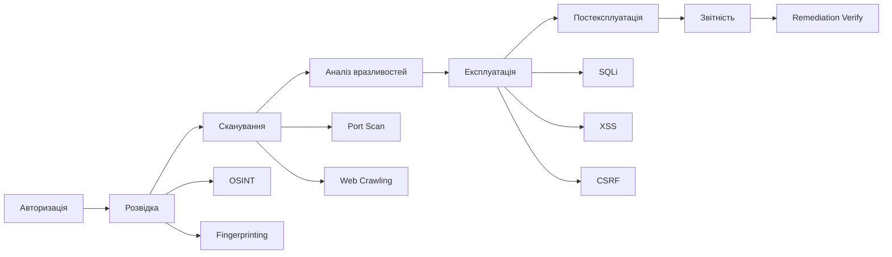
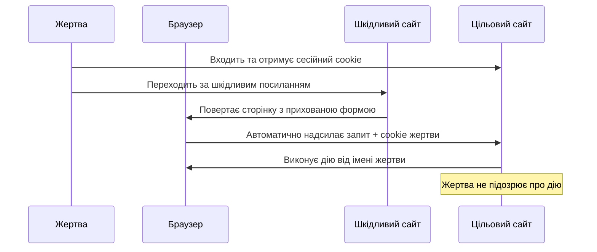
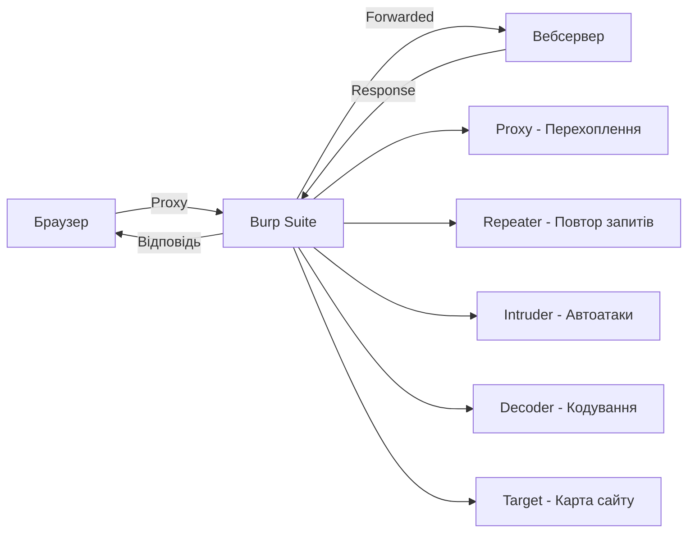

# Лабораторна робота 08 Пентестинг та експлуатація вразливостей

## 🎯 Мета

Набути практичних навичок проведення тестування на проникнення (пентестингу), навчитися перехоплювати та модифікувати HTTP-запити за допомогою Burp Suite, відпрацювати техніки експлуатації вразливостей SQL Injection, XSS та CSRF на практичних завданнях платформи TryHackMe, а також навчитися складати структуровані звіти про знайдені вразливості з рекомендаціями щодо їх усунення.

## 📋 Завдання

1. Зареєструватись на платформі TryHackMe та ознайомитись з інтерфейсом.
2. Пройти кімнату (room) з основ вебвразливостей на платформі TryHackMe.
3. Встановити та налаштувати Burp Suite Community Edition.
4. Практично відпрацювати техніки SQL Injection, XSS та CSRF з використанням Burp Suite для перехоплення та модифікації запитів.
5. Задокументувати кожну відпрацьовану техніку атаки з поясненням механізму та підтвердженням (скріншоти).
6. Скласти звіт про знайдені вразливості за стандартною структурою пентест-звіту з рекомендаціями щодо усунення.

## ⭐ Критерії оцінювання

Максимальна кількість балів за лабораторну роботу: **6 балів**.

Розподіл балів за елементами роботи:

- **Виконання завдань TryHackMe** (2 бали): успішне проходження кімнати з підтвердженням (скриншоти отриманих прапорців), охоплення мінімум 3 різних типів вразливостей у межах кімнати.
- **Налаштування та використання Burp Suite** (1 бал): коректне налаштування проксі, демонстрація перехоплення запитів, модифікації параметрів та повторного відтворення запитів (Repeater).
- **Практика SQL Injection, XSS, CSRF** (2 бали): демонстрація кожного з трьох типів атак з поясненням механізму, скриншоти з підтвердженням успішної експлуатації, розуміння відмінностей між типами атак.
- **Якість звіту та рекомендації** (1 бал): структурованість та повнота звіту, конкретність рекомендацій щодо захисту для кожної виявленої вразливості, наявність виконавчого резюме (executive summary).

## ⏰ Політика дедлайнів та штрафів

**Термін здачі:** Лабораторна робота має бути здана **протягом 3 тижнів** від дати проведення останнього аудиторного заняття з цієї теми.

**Система штрафів за прострочення:** Здача роботи в установлений термін дає можливість отримати повну оцінку 6 балів. Роботи, здані з запізненням, будуть оцінені максимум в 3 бали. Виняток становлять документально підтверджені поважні причини (хвороба, сімейні обставини), за яких термін може бути продовжений за погодженням з викладачем.

## 📚 Теоретичні відомості

### Тестування на проникнення: методологія та етапи

Тестування на проникнення (penetration testing або пентестинг) — це авторизована спроба атакувати комп'ютерну систему, мережу або вебдодаток для виявлення вразливостей безпеки до того, як це зробить реальний зловмисник. Ключовою відмінністю від несанкціонованого злому є письмовий дозвіл власника системи, що чітко визначає рамки та цілі тестування.

Методологія пентестингу зазвичай включає кілька послідовних фаз. Фаза розвідки (Reconnaissance) передбачає збір відкритої інформації про ціль (OSINT): доменні імена, IP-адреси, технологічний стек, відкриті порти. Фаза сканування та перерахування (Scanning and Enumeration) включає активне дослідження цілі: сканування портів, виявлення сервісів та їх версій, картографування вебдодатку. Фаза аналізу вразливостей (Vulnerability Assessment) систематизує знайдені слабкі місця та оцінює їх критичність. Фаза експлуатації (Exploitation) — це практична спроба використати виявлені вразливості для підтвердження їх реальності. Фаза постексплуатації (Post-Exploitation) досліджує можливості закріплення в системі та горизонтального просування по мережі. Завершальна фаза звітності (Reporting) документує всі знахідки та надає рекомендації.

### SQL Injection: механізм та техніки

SQL Injection є однією з найбільш небезпечних та поширених вразливостей вебдодатків. Вона виникає, коли введені користувачем дані безпосередньо вбудовуються в SQL-запит без належного очищення та валідації.

Класичний сценарій автентифікаційного обходу демонструє основний принцип: якщо сервер формує запит як `SELECT * FROM users WHERE username = 'INPUT' AND password = 'INPUT'`, введення `admin' --` у поле імені користувача перетворює його на `SELECT * FROM users WHERE username = 'admin' --' AND password = '...'`. Символи `--` позначають початок коментаря у SQL, і все що йде після них ігнорується, включаючи перевірку пароля.

Error-based SQL Injection використовує повідомлення про помилки бази даних для отримання інформації про структуру та дані. Time-based Blind SQL Injection застосовується у випадках, коли помилки не відображаються: запит `IF(1=1, SLEEP(5), 0)` затримує відповідь на 5 секунд, підтверджуючи наявність вразливості. Union-based SQL Injection дозволяє об'єднати результат шкідливого запиту з оригінальним і витягти дані з інших таблиць бази даних.

Для захисту від SQL Injection використовують параметризовані запити (prepared statements), ORM-фреймворки, що автоматично екранують введення, валідацію вхідних даних та принцип найменших привілеїв для облікових записів бази даних.

### XSS: типи та вектори атаки

Cross-Site Scripting (XSS) дозволяє зловмиснику виконати довільний JavaScript-код у браузері жертви. Незважаючи на назву, XSS є вразливістю вебдодатку, а не мережевою атакою типу MITM.

Reflected XSS виникає, коли шкідливий скрипт вставляється у параметр запиту, і сервер одразу повертає його у відповіді без збереження. Типовий вектор: URL виду `https://site.com/search?q=`. Жертва переходить за цим посиланням, і скрипт виконується в контексті вразливого сайту, маючи доступ до cookie та інших даних сесії.

Stored XSS є більш небезпечним, оскільки шкідливий код зберігається на сервері (у базі даних) і виконується для кожного відвідувача ураженої сторінки. Наприклад, зловмисник залишає коментар з XSS-навантаженням, і воно спрацьовує для всіх, хто переглядає цей коментар. Наслідки включають крадіжку сесійних токенів, перехоплення форм, дефейс сторінок та розповсюдження шкідливого коду.

DOM-based XSS відрізняється тим, що шкідливий код вбудовується у DOM-дерево сторінки на стороні клієнта без відправки на сервер. Він часто важко виявляється статичним аналізом, оскільки відбувається виключно у клієнтській логіці JavaScript.

### CSRF: підробка міжсайтових запитів

Cross-Site Request Forgery (CSRF) змушує автентифікованого користувача ненавмисно виконати небажані дії на довіреному сайті. На відміну від XSS, де мета — виконати код у браузері жертви, CSRF використовує автентифікований стан жертви для виконання дій від її імені.

Класичний сценарій: користувач автентифікований у банківській системі. Зловмисник надсилає йому посилання на шкідливий сайт, де розміщена прихована HTML-форма. Форма автоматично відправляє POST-запит на URL банку з параметрами переказу коштів. Браузер жертви автоматично додає cookie автентифікації до запиту, і банк сприймає його як законний.

Захист від CSRF реалізується через CSRF-токени — унікальні непередбачувані значення, що генеруються сервером і вставляються у кожну форму. При відправці форми токен перевіряється, і запит без коректного токена відхиляється. SameSite атрибут cookie та перевірка заголовка Origin/Referer є додатковими механізмами захисту.

### Burp Suite Community Edition

Burp Suite — це інтегрована платформа для тестування безпеки вебдодатків. Community Edition є безкоштовною версією з базовим набором інструментів, достатнім для навчання та проведення ручного тестування.

Ключові компоненти Burp Suite Community Edition включають Proxy — проксі-перехоплювач між браузером і сервером, що дозволяє переглядати, зупиняти та модифікувати запити та відповіді в режимі реального часу. Repeater дозволяє повторно надсилати окремі запити з ручними змінами параметрів, що є незамінним інструментом для ручного дослідження вразливостей. Intruder (обмежений у безкоштовній версії) виконує автоматизовані атаки за набором пейлоадів. Decoder допомагає кодувати та декодувати дані у різних форматах: Base64, URL-encoding, HTML entities тощо. Scanner відсутній у Community Edition, але доступний у Pro-версії.

### Структура пентест-звіту

Звіт з тестування на проникнення є ключовим результатом роботи пентестера. Якісний звіт має відповідати потребам двох аудиторій: управлінського рівня (що зрозуміє executive summary) та технічних спеціалістів (що опрацюють детальні технічні описи).

Виконавче резюме (Executive Summary) містить загальну оцінку рівня захищеності системи, короткий перелік критичних знахідок та рекомендацій, висновки щодо бізнес-ризиків без технічних деталей. Методологія описує обсяг тестування, дати проведення, використані інструменти та обмеження. Технічні знахідки — основна частина звіту — деталізують кожну вразливість за стандартним шаблоном. Рекомендації надають конкретні кроки з усунення кожної вразливості з пріоритизацією. Висновки підсумовують стан безпеки та рекомендують повторне тестування після виправлень.

## 🔬 Хід роботи

### Крок 1. Реєстрація та підготовка на TryHackMe

Перейдіть за адресою `https://tryhackme.com` та зареєструйтесь, використовуючи електронну пошту. Реєстрація є безкоштовною і не потребує кредитної картки. Після реєстрації ознайомтесь з інтерфейсом платформи.

TryHackMe пропонує два типи кімнат: ті, що потребують VPN-підключення до ізольованих лабораторних машин, та ті, що виконуються через вбудований браузер (In-Browser). Для цієї роботи рекомендується обирати кімнати типу In-Browser або використовувати VPN-підключення.

Знайдіть та відкрийте одну з наступних безкоштовних кімнат за темою вебвразливостей: **OWASP Top 10** (охоплює всі основні категорії вразливостей), **Web Fundamentals** (основи безпеки вебдодатків) або **OWASP Juice Shop** (практичні задачі на реальному вразливому додатку). Для пошуку скористайтесь функцією Search на платформі та фільтром Free.

Зробіть скриншот профілю після реєстрації та скриншот початку обраної кімнати.

### Крок 2. Проходження кімнати TryHackMe

Виконуйте задачі обраної кімнати послідовно. Більшість кімнат мають вбудовані підказки та розбиті на секції з короткими теоретичними поясненнями та практичними питаннями.

Для кожної виконаної задачі, що стосується SQL Injection, XSS або CSRF, зробіть скриншот: отриманий прапорець (flag), результат виконаної атаки, підтвердження проходження секції. TryHackMe автоматично зараховує прапорці та показує прогрес проходження кімнати.

Зберіть мінімум по одному підтвердженому прикладу для SQL Injection, XSS та CSRF. Якщо обрана кімната не охоплює всі три типи, виконайте додаткові задачі у суміжних кімнатах або поверніться до Juice Shop з попередньої лабораторної роботи для решти типів.

### Крок 3. Встановлення та налаштування Burp Suite

Завантажте Burp Suite Community Edition з офіційного сайту `https://portswigger.net/burp/communitydownload`. Встановіть відповідну версію для вашої операційної системи.

Запустіть Burp Suite та оберіть Temporary Project → Use Burp Defaults. Перейдіть до вкладки Proxy → Options та перевірте, що проксі слухає на `127.0.0.1:8080`.

Налаштуйте браузер (рекомендується Firefox) для роботи через Burp: у налаштуваннях мережі вкажіть HTTP-проксі `127.0.0.1` та порт `8080`. Встановіть CA-сертифікат Burp: у браузері перейдіть на `http://burp`, завантажте сертифікат та імпортуйте його в сховище довірених сертифікатів браузера.

Перевірте налаштування: відкрийте будь-який сайт, у Burp перейдіть до Proxy → Intercept та переконайтесь, що запити відображаються і можуть бути зупинені.

### Крок 4. Практика SQL Injection з Burp Suite

Відкрийте цільовий додаток — Juice Shop з попередньої лабораторної роботи або вебдодаток з активної кімнати TryHackMe — через браузер з налаштованим Burp-проксі.

Ввімкніть перехоплення в Burp (Proxy → Intercept → Intercept is on). Перейдіть до форми входу в систему. Введіть будь-які дані та натисніть кнопку входу. Burp перехопить запит і відобразить його у вкладці Intercept.

Натисніть правою кнопкою миші на перехоплений запит і оберіть Send to Repeater. Перейдіть у вкладку Repeater. Ви бачите повний HTTP-запит з параметрами. Знайдіть поле username або email і модифікуйте значення, додавши SQL-пейлоад: `' OR '1'='1' --`. Натисніть Send і проаналізуйте відповідь сервера.

Повторюйте з різними пейлоадами, аналізуючи зміни у відповіді. Зафіксуйте скриншотами перехоплений запит, модифікований запит у Repeater та відповідь, що підтверджує успішну ін'єкцію.

### Крок 5. Практика XSS з Burp Suite

Знайдіть у цільовому додатку поле введення, яке відображає введені дані (пошуковий рядок, поле коментаря, поле імені). Введіть тестовий пейлоад `` та надішліть форму.

Якщо XSS спрацювала — відобразиться діалогове вікно браузера. Якщо пейлоад відображається як звичайний текст — перевірте, можливо він HTML-кодується. Спробуйте альтернативні варіанти: `` або `<svg onload=alert(1)>`.

Для аналізу через Burp: перехопіть запит із вашим пейлоадом у Proxy. Відправте у Repeater. Змінюйте пейлоад та аналізуйте, як він відображається у HTML-відповіді — чи екранується, чи виконується. Знайдіть пейлоад, що виконується, і зафіксуйте як PoC.

### Крок 6. Практика CSRF

Для демонстрації CSRF знайдіть у додатку дію, що змінює стан (зміна email, зміна паролю, переказ коштів). Перехопіть у Burp відповідний POST-запит під час виконання легітимної дії.

Відправте запит у Repeater. Проаналізуйте наявність CSRF-токена. Якщо токен відсутній — видаліть або змініть заголовок Referer та повторіть запит. Успішне виконання запиту без валідного Referer або CSRF-токена підтверджує наявність вразливості.

Для додаткового дослідження: скористайтесь функцією Burp → Engagement Tools → Generate CSRF PoC, яка автоматично створить HTML-форму для демонстрації CSRF-атаки.

### Крок 7. Підготовка звіту

Складіть звіт за структурою реального пентест-звіту у форматі PDF:

1. Титульна сторінка (тема, ПІБ, група).
2. Виконавче резюме (2–3 абзаци): загальна оцінка захищеності, кількість знайдених вразливостей, найбільш критичні знахідки.
3. Методологія: перелік використаних інструментів (TryHackMe, Burp Suite), типи проведених тестів.
4. Результати тестування — для кожної з трьох вразливостей (SQL Injection, XSS, CSRF):
    - Назва та тип вразливості.
    - Де знайдена (URL, параметр, функція).
    - Рівень критичності.
    - Механізм вразливості.
    - Підтвердження (скріншоти з поясненнями).
    - Рекомендація щодо усунення.
5. Зведена таблиця вразливостей.
6. Загальні рекомендації щодо покращення безпеки додатку.
7. Висновки.

Формат здачі: `pdf`.

## ❓ Контрольні запитання

1. Що таке тестування на проникнення (пентестинг)? Чим воно відрізняється від несанкціонованого злому? Поясніть роль письмового дозволу у пентестингу та юридичні наслідки роботи без нього.
2. Опишіть основні фази методології пентестингу. Чому важливо дотримуватись чіткої послідовності фаз? Яка з фаз є найбільш відповідальною та чому?
3. Поясніть механізм SQL Injection на конкретному прикладі. Як параметризовані запити (prepared statements) запобігають цьому типу атаки? Чому просте екранування лапок є недостатнім захистом?
4. Чим відрізняються Reflected XSS та Stored XSS з точки зору масштабу впливу та складності виявлення? В якому випадку атака може бути спрямована на адміністратора системи і чому це особливо небезпечно?
5. Поясніть механізм CSRF-атаки. Яку роль відіграє функція Same-Origin Policy браузера у захисті від CSRF? Чому вона не є достатнім захистом самостійно?
6. Що таке CSRF-токен і як він захищає від атаки? Яким вимогам має відповідати токен, щоб бути ефективним захистом? Що відбудеться, якщо токен є передбачуваним?
7. Поясніть різницю між Burp Suite Proxy та Repeater. Для яких завдань пентестера призначений кожен з інструментів? Наведіть конкретні сценарії використання.
8. Що таке виконавче резюме (executive summary) у пентест-звіті? Чому цей розділ є важливим, якщо читач не є технічним спеціалістом? Яку інформацію він має містити обов'язково?
