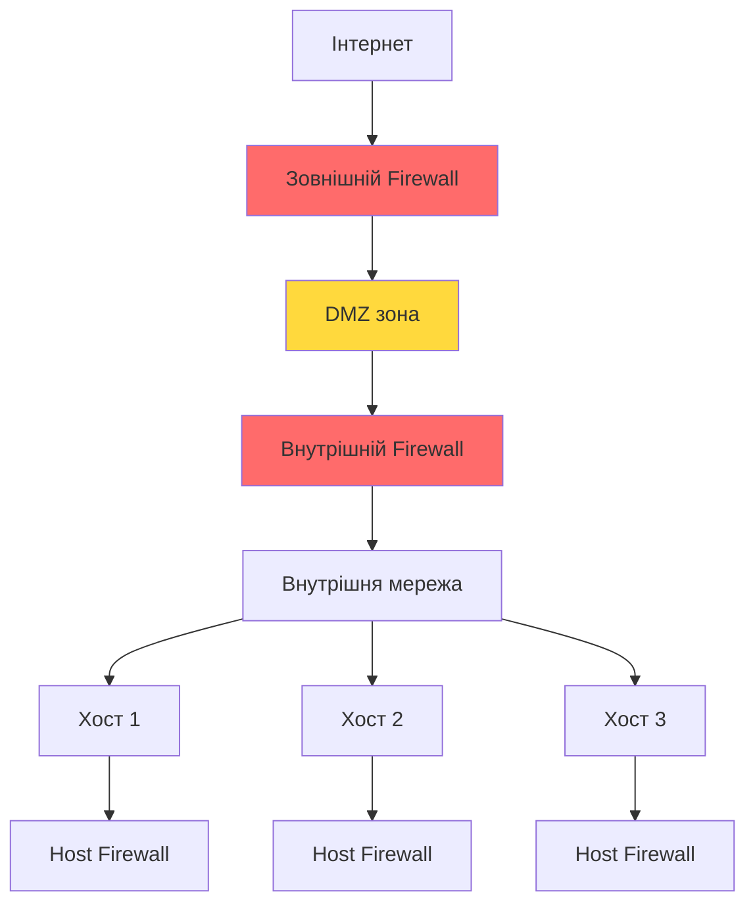
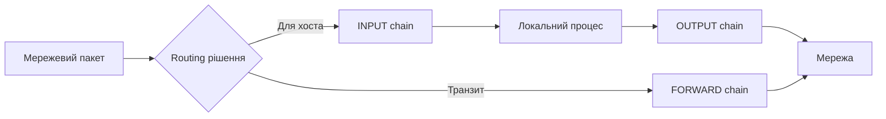
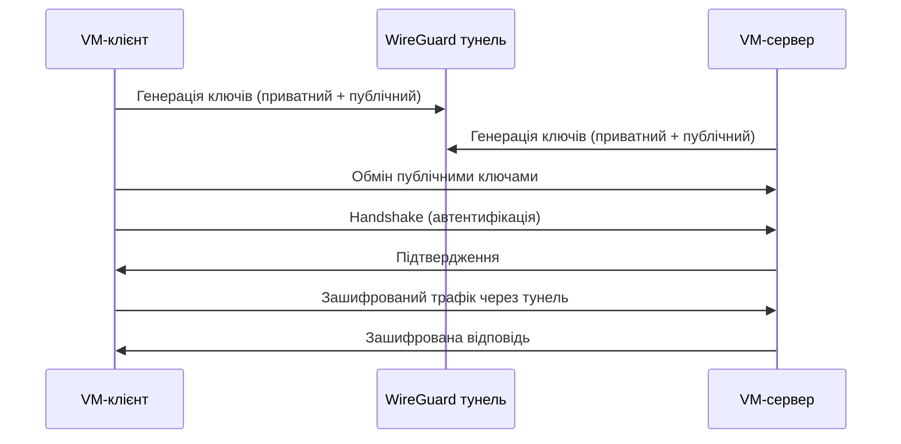

# Лабораторна робота 09 Налаштування мережевої безпеки

## 🎯 Мета

Набути практичних навичок налаштування мережевої безпеки у віртуальному середовищі: освоїти принципи роботи та конфігурації міжмережевого екрана (firewall) на основі iptables, навчитися створювати правила фільтрації трафіку, налаштовувати VPN-з'єднання та перевіряти ефективність вжитих заходів захисту за допомогою інструментів мережевого сканування.

## 📋 Завдання

1. Встановити VirtualBox та розгорнути готову VM з Kali Linux (або Ubuntu Server).
2. Налаштувати мережеву топологію з двома віртуальними машинами у VirtualBox (хост-атакувальник та хост-захисник).
3. Налаштувати firewall на основі iptables на захисному хості: визначити базову політику, створити правила фільтрації за портами, IP-адресами та протоколами.
4. Налаштувати VPN-з'єднання між двома VM з використанням WireGuard.
5. Перевірити ефективність конфігурації: виконати сканування портів за допомогою nmap та переконатися, що правила firewall працюють коректно.
6. Задокументувати всі конфігурації та результати тестування у звіті.

## ⭐ Критерії оцінювання

Максимальна кількість балів за лабораторну роботу: **5 балів**.

Розподіл балів за елементами роботи:

- **Розгортання та налаштування середовища** (1 бал): успішне встановлення VirtualBox, розгортання двох VM, коректне налаштування мережевих адаптерів (Internal Network або Host-Only), підтвердження мережевої зв'язності між машинами.
- **Налаштування iptables** (2 бали): визначення базових політик (DROP за замовчуванням), створення мінімум 5 правил фільтрації різних типів (за портом, протоколом, IP-адресою, станом з'єднання), коректне збереження та відновлення правил після перезавантаження.
- **Налаштування VPN** (1 бал): успішне налаштування WireGuard-тунелю між двома VM, підтвердження шифрованого з'єднання (ping через тунель, перевірка трафіку), коректне генерування та обмін ключами.
- **Тестування та документування** (1 бал): виконання nmap-сканування до та після застосування правил firewall з аналізом різниці у результатах, повнота та структурованість звіту, скриншоти всіх ключових етапів.

## ⏰ Політика дедлайнів та штрафів

**Термін здачі:** Лабораторна робота має бути здана **протягом 3 тижнів** від дати проведення останнього аудиторного заняття з цієї теми.

**Система штрафів за прострочення:** Здача роботи в установлений термін дає можливість отримати повну оцінку 5 балів. Роботи, здані з запізненням, будуть оцінені максимум в 2 бали. Виняток становлять документально підтверджені поважні причини (хвороба, сімейні обставини), за яких термін може бути продовжений за погодженням з викладачем.

## 📚 Теоретичні відомості

### Мережева безпека: концепція глибокого захисту

Мережева безпека — це комплекс заходів, що захищає цілісність, конфіденційність та доступність мережевої інфраструктури і даних, що передаються нею. Ключовою концепцією є захист у глибину (Defense in Depth): замість покладання на один рубіж захисту використовуються кілька незалежних рівнів, і компрометація одного не призводить до повного відкриття системи.

Рівні мережевого захисту зазвичай включають периметровий захист (зовнішній firewall, DMZ), захист внутрішнього сегмента мережі (внутрішній firewall, мережева сегментація), захист хостів (host-based firewall, антивірусне програмне забезпечення) та захист даних (шифрування, VPN). Кожен рівень доповнює інші та забезпечує захист у випадку, якщо зловмисник подолав попередній рубіж.



### Міжмережеві екрани: принципи роботи та класифікація

Міжмережевий екран (firewall) — це програмно-апаратний засіб, що контролює мережевий трафік на основі заздалегідь визначених правил. Firewall аналізує пакети та вирішує, чи дозволити їх проходження, чи заблокувати.

Пакетні фільтри (Packet Filters) є найпростішим типом: вони аналізують заголовки пакетів (IP-адреса джерела та призначення, порт, протокол) і приймають рішення без урахування стану з'єднання. Вони швидкі, але не розуміють контексту.

Stateful Inspection Firewall (firewall з відстеженням стану) відстежує стан TCP-з'єднань і може ухвалювати рішення з урахуванням контексту. Наприклад, він дозволяє відповідь на легітимний запит, навіть якщо немає явного правила для вхідного трафіку на відповідному порті.

Application Layer Firewall (або Next-Generation Firewall) аналізує трафік на рівні додатку: розуміє протоколи HTTP, DNS, FTP і може блокувати конкретні HTTP-запити, незалежно від порту.

### iptables: архітектура та синтаксис

iptables — це стандартний інструмент управління міжмережевим екраном у Linux-системах. Він взаємодіє з Netfilter — підсистемою ядра Linux, що обробляє мережеві пакети.

Архітектура iptables побудована на таблицях і ланцюжках. Основна таблиця filter містить три ланцюжки: INPUT (пакети для самого хоста), OUTPUT (пакети, що виходять від хоста) та FORWARD (пакети, що проходять через хост як маршрутизатор). Таблиця nat відповідає за трансляцію мережевих адрес, таблиця mangle — за модифікацію заголовків пакетів.



Синтаксис команди iptables: `iptables -[A/I/D] CHAIN -p PROTOCOL -s SOURCE -d DEST --dport PORT -j ACTION`, де дія може бути ACCEPT (прийняти), DROP (відкинути без повідомлення) або REJECT (відкинути з повідомленням про помилку).

Приклади базових правил:

```bash
# Дозволити встановлені та пов'язані з'єднання
iptables -A INPUT -m state --state ESTABLISHED,RELATED -j ACCEPT

# Дозволити SSH тільки з конкретної IP-адреси
iptables -A INPUT -p tcp -s 192.168.1.10 --dport 22 -j ACCEPT

# Заблокувати ICMP (ping)
iptables -A INPUT -p icmp -j DROP

# Встановити базову політику DROP для INPUT
iptables -P INPUT DROP

# Зберегти правила (Debian/Ubuntu)
iptables-save > /etc/iptables/rules.v4
```

### VPN: типи та протоколи

Віртуальна приватна мережа (VPN) створює зашифрований тунель між двома точками через ненадійну мережу. VPN забезпечує конфіденційність, цілісність та автентичність даних, що передаються.

Основні протоколи VPN відрізняються за механізмом шифрування та сценаріями використання. OpenVPN є зрілим рішенням з широкою підтримкою, використовує TLS і може працювати через TCP або UDP. IPsec — стандарт IETF, часто використовується для site-to-site VPN у корпоративному середовищі, складніший у налаштуванні. WireGuard — сучасний протокол з мінімальною кодовою базою (близько 4000 рядків коду проти 400 000 у OpenVPN), значно продуктивніший та простіший у конфігурації.



WireGuard використовує фіксований набір сучасних криптографічних алгоритмів: Curve25519 для обміну ключами, ChaCha20 для шифрування, Poly1305 для автентифікації повідомлень і BLAKE2 для хешування. Відсутність вибору алгоритмів є свідомим рішенням, що усуває цілий клас помилок конфігурації.

### Мережеве сканування: nmap

nmap (Network Mapper) — це найпопулярніший інструмент мережевого сканування та аудиту безпеки. Він дозволяє виявляти хости, відкриті порти, запущені сервіси та їх версії, операційну систему.

Основні типи сканування: TCP SYN scan (`-sS`) — «стелс»-сканування, не завершує TCP-handshake, менш помітне для систем виявлення вторгнень; TCP Connect scan (`-sT`) — повне з'єднання, більш надійне але помітне; UDP scan (`-sU`) — сканування UDP-портів, повільніше ніж TCP; Service Version Detection (`-sV`) — визначення версій сервісів; OS Detection (`-O`) — визначення операційної системи.

```bash
# Базове сканування хоста
nmap 192.168.56.101

# Сканування конкретних портів з визначенням сервісів
nmap -sV -p 22,80,443,3306 192.168.56.101

# Агресивне сканування (версії + ОС + скрипти)
nmap -A 192.168.56.101

# Сканування мережі
nmap -sn 192.168.56.0/24
```

Результати nmap є основним інструментом перевірки ефективності правил firewall: сканування до та після застосування правил наочно демонструє зміну стану портів з open на filtered або closed.

## 🔬 Хід роботи

### Крок 1. Розгортання віртуального середовища

Завантажте та встановіть VirtualBox з офіційного сайту `https://www.virtualbox.org/`. Для роботи знадобляться дві VM: атакувальник (Kali Linux) та захисник (Ubuntu Server або Kali Linux).

Готові образи VM у форматі OVA доступні на офіційних сайтах: Kali Linux — `https://www.kali.org/get-kali/#kali-virtual-machines`, Ubuntu Server — `https://ubuntu.com/download/server`. Імпортуйте OVA-образ через меню VirtualBox → File → Import Appliance.

Налаштуйте мережеві адаптери обох VM. Для кожної VM відкрийте Settings → Network → Adapter 1 та оберіть режим Internal Network з ім'ям мережі `intnet`. Це забезпечить ізольовану мережу між VM без виходу до зовнішньої мережі. За необхідності доступу до інтернету додайте другий адаптер у режимі NAT.

Запустіть обидві VM. Перевірте мережеву зв'язність командою `ping` між ними. Визначте IP-адреси командою `ip addr show`.

### Крок 2. Налаштування базового firewall з iptables

Підключіться до VM-захисника. Переглянте поточні правила iptables:

```bash
iptables -L -n -v
```

Очистіть всі поточні правила та встановіть базові політики:

```bash
# Очистити всі ланцюжки
iptables -F
iptables -X

# Встановити базові політики DROP (блокувати все за замовчуванням)
iptables -P INPUT DROP
iptables -P FORWARD DROP
iptables -P OUTPUT ACCEPT
```

Додайте базові дозвільні правила:

```bash
# Дозволити loopback-інтерфейс (необхідно для локальних сервісів)
iptables -A INPUT -i lo -j ACCEPT

# Дозволити встановлені та пов'язані з'єднання
iptables -A INPUT -m state --state ESTABLISHED,RELATED -j ACCEPT
```

Зробіть скриншот виводу `iptables -L -n -v` після застосування базових правил.

### Крок 3. Створення правил фільтрації трафіку

Додайте правила для різних сценаріїв фільтрації. Виконуйте кожну команду послідовно та документуйте результат:

```bash
# Правило 1: Дозволити SSH тільки з IP-адреси атакувальника
iptables -A INPUT -p tcp -s 192.168.56.101 --dport 22 -j ACCEPT

# Правило 2: Дозволити HTTP та HTTPS (якщо запущено вебсервер)
iptables -A INPUT -p tcp --dport 80 -j ACCEPT
iptables -A INPUT -p tcp --dport 443 -j ACCEPT

# Правило 3: Обмежити кількість ICMP-запитів (захист від ping flood)
iptables -A INPUT -p icmp --icmp-type echo-request -m limit --limit 1/s --limit-burst 5 -j ACCEPT
iptables -A INPUT -p icmp -j DROP

# Правило 4: Заблокувати конкретну IP-адресу
iptables -A INPUT -s 192.168.56.200 -j DROP

# Правило 5: Логувати підозрілий трафік перед блокуванням
iptables -A INPUT -j LOG --log-prefix "IPTABLES-DROP: " --log-level 4
```

Перегляньте фінальний список правил та збережіть конфігурацію:

```bash
iptables -L -n -v --line-numbers

# Зберегти правила для відновлення після перезавантаження
iptables-save > /etc/iptables/rules.v4
```

### Крок 4. Налаштування WireGuard VPN

Встановіть WireGuard на обох VM:

```bash
apt update && apt install -y wireguard
```

На VM-сервері згенеруйте пару ключів та створіть конфігурацію:

```bash
# Генерація ключів
wg genkey | tee /etc/wireguard/privatekey | wg pubkey > /etc/wireguard/publickey
cat /etc/wireguard/privatekey  # зберегти, не показувати нікому
cat /etc/wireguard/publickey   # передати клієнту

# Створення конфігурації /etc/wireguard/wg0.conf на сервері
[Interface]
Address = 10.0.0.1/24
ListenPort = 51820
PrivateKey = <ПРИВАТНИЙ КЛЮЧ СЕРВЕРА>

[Peer]
PublicKey = <ПУБЛІЧНИЙ КЛЮЧ КЛІЄНТА>
AllowedIPs = 10.0.0.2/32
```

На VM-клієнті виконайте аналогічну генерацію ключів та налаштуйте конфігурацію:

```bash
[Interface]
Address = 10.0.0.2/24
PrivateKey = <ПРИВАТНИЙ КЛЮЧ КЛІЄНТА>

[Peer]
PublicKey = <ПУБЛІЧНИЙ КЛЮЧ СЕРВЕРА>
Endpoint = 192.168.56.102:51820
AllowedIPs = 10.0.0.1/32
PersistentKeepalive = 25
```

Запустіть WireGuard на обох VM та перевірте з'єднання:

```bash
# Запустити інтерфейс
wg-quick up wg0

# Перевірити статус
wg show

# Перевірити з'єднання через тунель
ping 10.0.0.1
```

### Крок 5. Тестування конфігурації firewall

З VM-атакувальника виконайте базове nmap-сканування захисного хоста до застосування правил (якщо можливо відтворити стан «до»), а потім після:

```bash
# Повне сканування всіх портів
nmap -sS -p- 192.168.56.102

# Сканування з визначенням сервісів
nmap -sV -p 22,80,443,8080 192.168.56.102

# UDP сканування
nmap -sU --top-ports 20 192.168.56.102
```

Перевірте, що заблоковані порти відображаються як `filtered`, а дозволені — як `open`. Перевірте роботу правила для ICMP: надішліть серію ping-запитів та переконайтеся, що обмеження rate limiting працює. Перевірте логи системи щодо заблокованого трафіку:

```bash
dmesg | grep "IPTABLES-DROP"
# або
journalctl -k | grep "IPTABLES-DROP"
```

### Крок 6. Підготовка звіту

Оформіть звіт у форматі PDF за такою структурою:

1. Титульна сторінка (тема, ПІБ, група).
2. Опис мережевої топології: схема з IP-адресами VM, типи мережевих адаптерів.
3. Конфігурація iptables: повний список правил з поясненням призначення кожного правила.
4. Конфігурація WireGuard: файли конфігурації (без приватних ключів), скриншоти успішного з'єднання та виводу `wg show`.
5. Результати тестування nmap: скриншоти сканування з коментарями, аналіз стану портів.
6. Аналіз логів firewall: скриншоти записів у журналі заблокованого трафіку.
7. Висновки: ефективність застосованих заходів, виявлені труднощі, рекомендації щодо вдосконалення конфігурації.

Формат здачі: `pdf`.

## ❓ Контрольні запитання

1. Поясніть концепцію захисту у глибину (Defense in Depth). Чому недостатньо одного рубежу захисту мережі? Наведіть приклад багаторівневої архітектури.
2. Чим відрізняється Stateful Inspection Firewall від простого пакетного фільтра? Яку вразливість усуває відстеження стану з'єднань і як це впливає на продуктивність?
3. Поясніть призначення ланцюжків INPUT, OUTPUT та FORWARD в iptables. Яка різниця між політикою DROP та правилом DROP? Чому рекомендується встановлювати базову політику DROP?
4. Що таке rate limiting у контексті firewall? Для захисту від яких типів атак він застосовується і як реалізується у iptables?
5. Поясніть принцип роботи WireGuard. Які криптографічні алгоритми він використовує і чому відсутність вибору алгоритмів вважається перевагою з точки зору безпеки?
6. Яка різниця між статусами порту `open`, `closed` та `filtered` у результатах nmap? Який статус виникає при використанні правила DROP і чому це важливо з точки зору безпеки?
7. Навіщо логувати заблокований трафік firewall? Які події варто фіксувати і як аналіз логів допомагає виявляти спроби атак?
