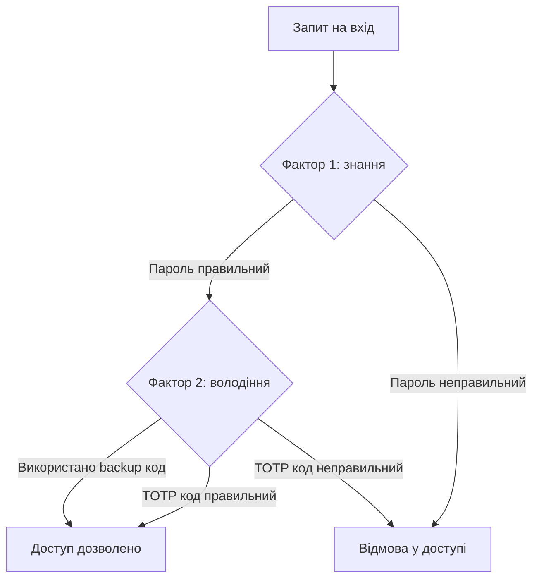
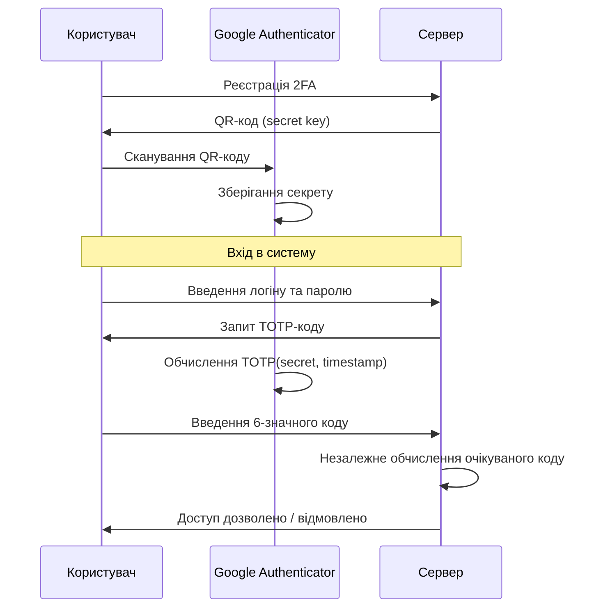

# Лабораторна робота 10 Впровадження двофакторної автентифікації

## 🎯 Мета

Освоїти принципи роботи двофакторної автентифікації (2FA) та набути практичних навичок її реалізації: розробити простий вебдодаток з базовою автентифікацією, інтегрувати TOTP-протокол для роботи з Google Authenticator, реалізувати механізм резервних кодів для відновлення доступу та дослідити сильні й слабкі сторони різних методів багатофакторної автентифікації.

## 📋 Завдання

1. Розробити простий вебдодаток із формою реєстрації та входу на Flask (Python) або Node.js (Express).
2. Інтегрувати двофакторну автентифікацію на основі протоколу TOTP з підтримкою Google Authenticator.
3. Реалізувати механізм генерації та використання резервних (backup) кодів для відновлення доступу.
4. Протестувати різні сценарії: успішний вхід з 2FA, вхід з резервним кодом, спробу входу зі застарілим кодом.
5. Провести порівняльний аналіз різних методів 2FA (TOTP, SMS, апаратні токени, push-сповіщення) за критеріями зручності та безпеки.
6. Підготувати звіт з описом реалізації, результатами тестування та аналізом методів 2FA.

## ⭐ Критерії оцінювання

Максимальна кількість балів за лабораторну роботу: **5 балів**.

Розподіл балів за елементами роботи:

- **Базовий вебдодаток з автентифікацією** (1 бал): працюючий вебдодаток з реєстрацією та входом, безпечне зберігання паролів (хешування bcrypt або argon2), коректне управління сесіями.
- **Інтеграція TOTP / Google Authenticator** (2 бали): коректна генерація TOTP-секрету та QR-коду для сканування, успішна перевірка одноразових кодів на сервері, обробка граничних випадків (прострочений код, повторне використання коду).
- **Резервні коди** (1 бал): генерація набору резервних кодів при активації 2FA, одноразове використання кожного резервного коду з подальшим його видаленням, можливість переглянути залишок невикористаних кодів.
- **Аналіз методів 2FA та якість звіту** (1 бал): структурований порівняльний аналіз мінімум чотирьох методів 2FA за критеріями безпеки, зручності та вартості впровадження, обґрунтовані висновки щодо вибору методу для різних сценаріїв.

## ⏰ Політика дедлайнів та штрафів

**Термін здачі:** Лабораторна робота має бути здана **протягом 3 тижнів** від дати проведення останнього аудиторного заняття з цієї теми.

**Система штрафів за прострочення:** Здача роботи в установлений термін дає можливість отримати повну оцінку 5 балів. Роботи, здані з запізненням, будуть оцінені максимум в 2 бали. Виняток становлять документально підтверджені поважні причини (хвороба, сімейні обставини), за яких термін може бути продовжений за погодженням з викладачем.

## 📚 Теоретичні відомості

### Фактори автентифікації

Автентифікація — це процес підтвердження особи користувача. Традиційна однофакторна автентифікація (лише пароль) є вразливою: паролі можуть бути вкрадені через фішинг, перехоплені через незахищені канали або підібрані брутфорсом. Багатофакторна автентифікація (MFA) вимагає підтвердження особи за допомогою двох або більше незалежних факторів.

Класифікація факторів автентифікації охоплює три категорії. Фактор знання (Something you know) — це те, що знає лише користувач: пароль, PIN-код, відповідь на секретне питання. Фактор володіння (Something you have) — фізичний об'єкт або пристрій: смартфон з TOTP-додатком, апаратний токен (YubiKey), смарт-картка. Фактор властивості (Something you are) — біометричні характеристики: відбиток пальця, розпізнавання обличчя, сканування райдужної оболонки.

Двофакторна автентифікація (2FA) є підмножиною MFA та вимагає саме двох факторів. Компрометація одного фактора (наприклад, крадіжка пароля) не дозволяє зловмисникові отримати доступ, якщо він не контролює і другий фактор.



### Протокол TOTP (Time-based One-Time Password)

TOTP — це стандартизований алгоритм (RFC 6238) для генерації одноразових паролів на основі поточного часу та спільного секрету. Він є основою більшості сучасних автентифікаторів (Google Authenticator, Authy, Microsoft Authenticator).

Принцип роботи TOTP можна описати через три компоненти. По-перше, при активації 2FA сервер генерує унікальний секретний ключ для кожного користувача (зазвичай 20 байт у кодуванні Base32). Цей ключ передається клієнту один раз, зазвичай у вигляді QR-коду. По-друге, і сервер, і клієнтський пристрій незалежно обчислюють код за формулою: `TOTP = HOTP(secret, floor(time / 30))`, де time — поточний Unix timestamp, 30 — стандартний часовий інтервал у секундах. По-третє, при вході користувач вводить 6-значний код з автентифікатора, і сервер обчислює очікуваний код та порівнює.



Важлива особливість TOTP — код є дійсним лише протягом 30-секундного вікна. Реалізації зазвичай допускають невелике відхилення у часі (±1 інтервал), щоб компенсувати розбіжність між годинниками пристроїв.

### Безпечне зберігання паролів

Паролі ніколи не зберігаються у відкритому вигляді. Зберігається хеш — результат односпрямованої функції, яку неможливо обернути. При перевірці пароль хешується і порівнюється зі збереженим хешем.

Прості хеш-функції (MD5, SHA-1, SHA-256) непридатні для зберігання паролів, оскільки вони дуже швидкі — зловмисник може перебрати мільярди варіантів за секунду. Для паролів застосовують спеціально сповільнені функції: bcrypt (з налаштовуваним cost-фактором), Argon2 (переможець Password Hashing Competition, 2015) та scrypt.

```python
# Приклад хешування паролю з bcrypt (Python)
import bcrypt

# Хешування
password = "mypassword123".encode()
hashed = bcrypt.hashpw(password, bcrypt.gensalt(rounds=12))

# Перевірка
bcrypt.checkpw(password, hashed)  # True
```

### Резервні коди

Резервні (backup) коди — це набір одноразових кодів для екстреного відновлення доступу при втраті пристрою з автентифікатором. Стандартна практика — генерація 8–10 кодів з 8–12 символами кожен.

Вимоги до резервних кодів включають кілька принципів. Криптографічна випадковість: коди мають генеруватися з використанням криптографічно безпечного генератора псевдовипадкових чисел (secrets у Python, crypto.randomBytes у Node.js). Одноразове використання: кожен код може бути використаний лише один раз, після чого він видаляється або позначається як використаний. Безпечне зберігання: на сервері зберігаються хеші кодів, а не самі коди. Один раз показано: при генерації коди відображаються користувачу лише один раз і мають бути ним збережені.

### Порівняльний аналіз методів 2FA

Різні методи двофакторної автентифікації суттєво відрізняються за рівнем безпеки та зручністю для користувача.

SMS-код є найбільш поширеним методом, проте й найменш безпечним. Вразливий до SIM-swapping атак (зловмисник переконує оператора перенести номер на свою SIM-карту), перехоплення через вразливості протоколу SS7 та соціальну інженерію. Зручний, не потребує встановлення додатків.

TOTP-автентифікатор (Google Authenticator, Authy) є значно безпечнішим: не залежить від мобільної мережі, коди генеруються офлайн. Вразливий до фішингу в реальному часі (зловмисник може перехопити код, якщо жертва введе його на підробленій сторінці негайно). Потребує встановлення додатка та резервного копіювання секретного ключа.

Апаратні токени (YubiKey, FIDO2) забезпечують найвищий рівень захисту: фізичний пристрій, захист від фішингу на рівні протоколу (перевіряється домен сайту). Недоліки — вартість пристрою та ризик фізичної втрати.

Push-сповіщення (Duo Security, Microsoft Authenticator) є зручними: користувач просто натискає «Підтвердити» у додатку. Вразливі до MFA fatigue атак — зловмисник надсилає численні запити, поки втомлений або неуважний користувач не натисне підтвердження.

## 🔬 Хід роботи

### Крок 1. Підготовка середовища та базового вебдодатку

Оберіть стек розробки: Python (Flask) або JavaScript (Node.js + Express). Нижче наведено приклади для Python. Встановіть необхідні бібліотеки:

```bash
pip install flask flask-session bcrypt pyotp qrcode[pil] secrets
```

Створіть базову структуру проєкту:

```
totp-demo/
├── app.py          # Основний файл додатку
├── templates/
│   ├── register.html
│   ├── login.html
│   ├── setup_2fa.html
│   └── dashboard.html
└── users.json      # Сховище користувачів (для простоти)
```

Реалізуйте базову реєстрацію та вхід з хешуванням паролів:

```python
from flask import Flask, render_template, request, redirect, session
import bcrypt
import json
import os

app = Flask(__name__)
app.secret_key = os.urandom(24)

def load_users():
    try:
        with open('users.json', 'r') as f:
            return json.load(f)
    except FileNotFoundError:
        return {}

def save_users(users):
    with open('users.json', 'w') as f:
        json.dump(users, f, indent=2)

@app.route('/register', methods=['GET', 'POST'])
def register():
    if request.method == 'POST':
        username = request.form['username']
        password = request.form['password'].encode()
        users = load_users()
        if username in users:
            return 'Користувач вже існує', 400
        hashed = bcrypt.hashpw(password, bcrypt.gensalt(rounds=12))
        users[username] = {
            'password': hashed.decode(),
            'totp_secret': None,
            'backup_codes': []
        }
        save_users(users)
        return redirect('/login')
    return render_template('register.html')
```

Перевірте, що реєстрація та вхід без 2FA працюють коректно.

### Крок 2. Інтеграція TOTP

Встановіть та використайте бібліотеку `pyotp` для генерації та перевірки TOTP-кодів:

```python
import pyotp
import qrcode
import io
import base64

@app.route('/setup_2fa')
def setup_2fa():
    if 'user' not in session:
        return redirect('/login')
    
    users = load_users()
    username = session['user']
    
    # Генерація секрету, якщо ще не існує
    if not users[username]['totp_secret']:
        secret = pyotp.random_base32()
        users[username]['totp_secret'] = secret
        save_users(users)
    
    secret = users[username]['totp_secret']
    
    # Генерація URI для QR-коду
    totp_uri = pyotp.totp.TOTP(secret).provisioning_uri(
        name=username,
        issuer_name="Security Course Demo"
    )
    
    # Генерація QR-коду у форматі base64 для відображення у браузері
    qr = qrcode.make(totp_uri)
    buffer = io.BytesIO()
    qr.save(buffer, format='PNG')
    qr_b64 = base64.b64encode(buffer.getvalue()).decode()
    
    return render_template('setup_2fa.html', qr_code=qr_b64, secret=secret)

@app.route('/verify_2fa', methods=['POST'])
def verify_2fa():
    if 'pending_user' not in session:
        return redirect('/login')
    
    users = load_users()
    username = session['pending_user']
    code = request.form['code']
    
    totp = pyotp.TOTP(users[username]['totp_secret'])
    
    if totp.verify(code, valid_window=1):
        session['user'] = username
        session.pop('pending_user')
        return redirect('/dashboard')
    else:
        return render_template('login_2fa.html', error='Невірний код. Спробуйте ще раз.')
```

Відскануйте QR-код у Google Authenticator (або Authy) та перевірте, що генеровані коди відповідають очікуваним.

### Крок 3. Реалізація резервних кодів

Додайте функцію генерації та перевірки резервних кодів:

```python
import secrets

def generate_backup_codes(count=8):
    """Генерує список одноразових резервних кодів."""
    return [secrets.token_hex(5).upper() for _ in range(count)]

@app.route('/generate_backup_codes', methods=['POST'])
def generate_backup_codes_route():
    if 'user' not in session:
        return redirect('/login')
    
    users = load_users()
    username = session['user']
    
    # Генерація нових кодів (хешуємо для зберігання)
    codes = generate_backup_codes()
    hashed_codes = [bcrypt.hashpw(c.encode(), bcrypt.gensalt()).decode() for c in codes]
    
    users[username]['backup_codes'] = hashed_codes
    save_users(users)
    
    # Показуємо коди користувачу ОДИН РАЗ
    return render_template('backup_codes.html', codes=codes)

def verify_backup_code(username, code):
    """Перевіряє резервний код та видаляє його після використання."""
    users = load_users()
    stored_codes = users[username].get('backup_codes', [])
    
    for i, hashed in enumerate(stored_codes):
        if bcrypt.checkpw(code.encode(), hashed.encode()):
            # Видалити використаний код
            users[username]['backup_codes'].pop(i)
            save_users(users)
            return True
    return False
```

### Крок 4. Тестування різних сценаріїв

Виконайте та задокументуйте (скриншоти) кожен сценарій:

**Сценарій 1 — успішний вхід з 2FA:** зареєструйтесь, увімкніть 2FA, скануйте QR-код в автентифікаторі, виконайте вхід з коректним кодом.

**Сценарій 2 — вхід з резервним кодом:** спробуйте ввести резервний код замість TOTP-коду, переконайтеся, що вхід успішний, та що використаний код видалено зі списку.

**Сценарій 3 — повторне використання резервного коду:** спробуйте повторно використати вже застосований резервний код — переконайтеся у відмові.

**Сценарій 4 — прострочений TOTP-код:** введіть TOTP-код після закінчення його терміну дії (чекайте 30 секунд після появи нового коду в автентифікаторі) — переконайтеся у відмові.

**Сценарій 5 — деактивація 2FA:** реалізуйте можливість вимкнення 2FA після підтвердження поточного TOTP-коду, перевірте, що після вимкнення вхід можливий без 2FA.

### Крок 5. Підготовка звіту

Оформіть звіт у форматі PDF за такою структурою:

1. Титульна сторінка (тема, ПІБ, група).
2. Опис архітектури додатку: стек технологій, схема потоку автентифікації (діаграма).
3. Опис реалізації: ключові фрагменти коду з поясненнями (генерація секрету, перевірка TOTP, резервні коди).
4. Результати тестування: скриншоти кожного з 5 тестових сценаріїв з коментарями.
5. Порівняльний аналіз методів 2FA: таблиця порівняння TOTP, SMS, апаратних токенів та push-сповіщень за критеріями безпеки, зручності, вартості та стійкості до різних типів атак.
6. Висновки: рекомендований метод 2FA для навчальної платформи та обґрунтування вибору.

Формат здачі: `pdf`.

## ❓ Контрольні запитання

1. Поясніть відмінність між автентифікацією, авторизацією та ідентифікацією. Чому важливо чітко розмежовувати ці поняття при проєктуванні систем безпеки?
2. Що таке фактори автентифікації? Опишіть три категорії факторів та наведіть по два приклади для кожної. Чому використання факторів з однієї категорії не є справжньою MFA?
3. Поясніть алгоритм TOTP. Чому знання секрету недостатньо для генерації правильного коду у майбутньому? Яку роль відіграє синхронізація часу?
4. Чому паролі не можна зберігати у відкритому вигляді або у вигляді простих SHA-хешів? Поясніть, що таке salt і як він захищає від rainbow table атак.
5. Що таке SIM-swapping атака і чому вона робить SMS-автентифікацію ненадійною? Наведіть реальний приклад наслідків такої атаки.
6. Що таке MFA fatigue атака? Яка умова необхідна для її проведення та які організаційні та технічні заходи дозволяють від неї захиститися?
7. Поясніть, чому резервні коди зберігаються у хешованому вигляді, а не у відкритому. Які наслідки компрометації бази даних, якщо резервні коди зберігалися без хешування?
