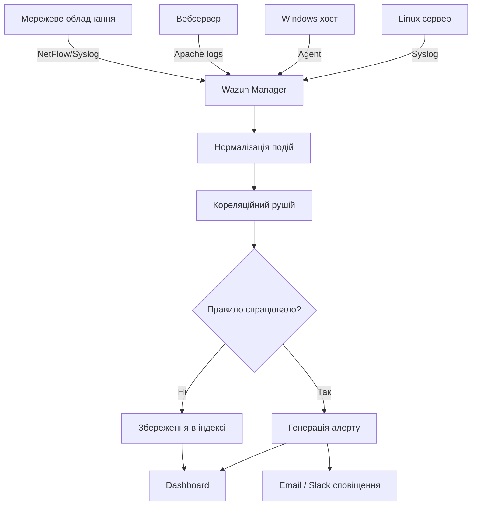
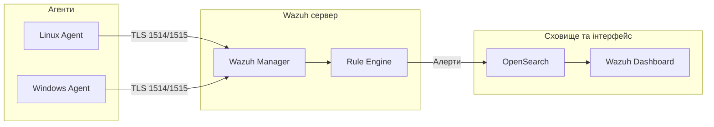

# Лабораторна робота 11 SIEM та моніторинг безпеки

## 🎯 Мета

Набути практичних навичок розгортання та налаштування системи управління подіями безпеки (SIEM): розгорнути платформу Wazuh за допомогою Docker Compose, налаштувати агентів для централізованого збору журналів, змоделювати реальні загрози (brute-force атаку та сканування портів), розробити дашборд для візуалізації подій безпеки та налаштувати автоматичні сповіщення на підозрілу активність.

## 📋 Завдання

1. Розгорнути SIEM-платформу Wazuh (Manager + Dashboard) за допомогою Docker Compose.
2. Встановити та підключити агент Wazuh на Linux-хості для збору системних журналів.
3. Переконатись у коректному отриманні подій: перевірити надходження журналів автентифікації, системних подій та подій файлової системи.
4. Змоделювати подію безпеки типу brute-force (підбір пароля SSH) та переконатись, що SIEM виявляє та класифікує атаку.
5. Змоделювати сканування портів за допомогою nmap та переконатись у генерації відповідного сповіщення.
6. Налаштувати дашборд у Wazuh для відображення ключових метрик безпеки.
7. Налаштувати правило (rule) у Wazuh для автоматичного сповіщення при виявленні підозрілої активності.
8. Підготувати звіт із описом архітектури розгорнутої системи та аналізом виявлених подій.

## ⭐ Критерії оцінювання

Максимальна кількість балів за лабораторну роботу: **6 балів**.

Розподіл балів за елементами роботи:

- **Розгортання SIEM та підключення агента** (2 бали): успішне розгортання Wazuh через Docker Compose, доступність вебінтерфейсу Dashboard, успішне підключення мінімум одного агента (статус Active), коректне надходження подій від агента до Manager.
- **Симуляція загроз та виявлення** (2 бали): проведення brute-force атаки з підтвердженням виявлення SIEM (скриншот алерту), проведення сканування портів nmap з відповідним алертом, аналіз деталей виявлених подій (rule ID, рівень критичності, опис).
- **Дашборд та правила сповіщення** (1 бал): налаштований дашборд з мінімум трьома візуалізаціями (географія подій, топ алертів, часовий графік), наявність кастомного або модифікованого правила виявлення з коректним порогом спрацювання.
- **Якість звіту** (1 бал): документована архітектура системи (схема), аналіз знайдених подій з поясненням їх значущості, рекомендації щодо налаштування SIEM для виробничого середовища.

## ⏰ Політика дедлайнів та штрафів

**Термін здачі:** Лабораторна робота має бути здана **протягом 3 тижнів** від дати проведення останнього аудиторного заняття з цієї теми.

**Система штрафів за прострочення:** Здача роботи в установлений термін дає можливість отримати повну оцінку 6 балів. Роботи, здані з запізненням, будуть оцінені максимум в 3 бали. Виняток становлять документально підтверджені поважні причини (хвороба, сімейні обставини), за яких термін може бути продовжений за погодженням з викладачем.

## 📚 Теоретичні відомості

### Концепція SIEM

SIEM (Security Information and Event Management) — це категорія програмного забезпечення, що поєднує дві функції: SIM (Security Information Management) — довготривале зберігання та аналіз журналів безпеки, та SEM (Security Event Management) — моніторинг подій та реагування в режимі реального часу.

Основна цінність SIEM полягає у централізації та кореляції даних із численних джерел. Окремо взятий журнал невдалого входу є звичайною подією. Але 500 невдалих спроб входу з однієї IP-адреси за 60 секунд — це явна ознака brute-force атаки. SIEM виявляє такі закономірності, що неможливо помітити при ручному перегляді окремих журналів.



Ключові можливості SIEM: збір та нормалізація журналів з різнорідних джерел у єдиний формат; кореляція подій за часом та іншими атрибутами для виявлення складних атак; базовий аналіз поведінки для виявлення аномалій; звітність та аудит для відповідності нормативним вимогам (GDPR, PCI DSS).

### Платформа Wazuh

Wazuh — відкрита SIEM-платформа з активною спільнотою та широкими можливостями. Вона є форком OSSEC та HIDS (Host-based Intrusion Detection System) і включає додаткові компоненти для збереження та візуалізації даних.

Архітектура Wazuh складається з кількох компонентів. Wazuh Manager — центральний сервер, що отримує дані від агентів, застосовує правила виявлення та генерує алерти. Wazuh Agent — легкий агент, що встановлюється на хости, збирає журнали, відстежує цілісність файлів та виявляє активні загрози. OpenSearch (або Elasticsearch) — сховище даних та пошуковий рушій, де зберігаються всі оброблені події. Wazuh Dashboard — вебінтерфейс для візуалізації алертів, пошуку по подіях та управління агентами.



### Правила виявлення у Wazuh

Правила (rules) — це основний механізм виявлення загроз у Wazuh. Кожне правило описує шаблон події та присвоює їй рівень критичності від 0 до 15.

Правила написані у форматі XML та включають кілька ключових елементів: `id` — унікальний ідентифікатор правила (>100000 для кастомних), `level` — рівень критичності (0 = не тривожний, 15 = критичний), `match` або `regex` — шаблон для пошуку в тексті події, `description` — людиночитаний опис. Правило може використовувати `frequency` та `timeframe` для кореляції подій: наприклад, спрацювати лише тоді, коли те саме подія з'являється 10 разів за 60 секунд.

```xml
<!-- Приклад правила виявлення brute-force SSH -->
<rule id="100010" level="10">
  <if_matched_sid>5716</if_matched_sid>
  <same_source_ip />
  <description>SSH brute force - 8 or more failed logins</description>
  <group>authentication_failures,pci_dss_10.2.4,pci_dss_10.2.5</group>
  <options>no_full_log</options>
  <frequency>8</frequency>
  <timeframe>120</timeframe>
</rule>
```

### Категорії журналів та джерела подій

Wazuh збирає події з різних джерел журналів. Журнали автентифікації (`/var/log/auth.log` або `/var/log/secure`) містять записи про спроби входу, використання sudo та зміни прав доступу. Системні журнали (`/var/log/syslog`) фіксують загальносистемні події. Журнали вебсервера (Apache, Nginx) відображають HTTP-запити, включаючи ознаки сканування або атак на вебдодатки. File Integrity Monitoring (FIM) відстежує зміни у критичних файлах та директоріях.

### Концепція симуляції загроз

У навчальному та тестовому середовищі симуляція загроз (threat simulation) є важливим методом перевірки ефективності SIEM. Замість очікування реальних атак дослідники навмисно відтворюють атакуючу поведінку в контрольованих умовах.

Brute-force SSH симулюється командою `hydra` або просто повторними спробами входу з невірним паролем. SIEM має виявити серію невдалих спроб (зазвичай 5–10 за короткий проміжок часу) та згенерувати алерт. Сканування портів за допомогою nmap генерує характерний мережевий трафік, що може бути виявлений як на рівні мережі, так і на рівні хоста (через журнали файрволу або системні події).

## 🔬 Хід роботи

### Крок 1. Розгортання Wazuh через Docker Compose

Переконайтесь, що на вашому комп'ютері встановлені Docker та Docker Compose. Перевірте версії:

```bash
docker --version
docker compose version
```

Завантажте офіційну конфігурацію Wazuh для Docker:

```bash
git clone https://github.com/wazuh/wazuh-docker.git -b v4.9.0
cd wazuh-docker/single-node
```

Для коректної роботи OpenSearch збільшіть значення `vm.max_map_count`:

```bash
# Linux / macOS з Docker Desktop
sudo sysctl -w vm.max_map_count=262144
```

Згенеруйте сертифікати та запустіть контейнери:

```bash
docker compose -f generate-indexer-certs.yml run --rm generator
docker compose up -d
```

Зачекайте 2–3 хвилини на ініціалізацію всіх сервісів. Перевірте статус контейнерів:

```bash
docker compose ps
```

Всі контейнери мають мати статус `healthy` або `running`. Відкрийте вебінтерфейс у браузері: `https://localhost` (прийміть самопідписаний сертифікат). Облікові дані за замовчуванням: `admin` / `SecretPassword` (або перегляньте у `.env` файлі).

### Крок 2. Підключення агента

Встановіть агент Wazuh на Linux-хост (VM або localhost). Офіційна інструкція для Ubuntu/Debian:

```bash
# Завантаження та встановлення агента
curl -s https://packages.wazuh.com/key/GPG-KEY-WAZUH | gpg --no-default-keyring --keyring gnupg-ring:/usr/share/keyrings/wazuh.gpg --import
echo "deb [signed-by=/usr/share/keyrings/wazuh.gpg] https://packages.wazuh.com/4.x/apt/ stable main" | tee -a /etc/apt/sources.list.d/wazuh.list

apt update
WAZUH_MANAGER="<IP_WAZUH_MANAGER>" apt install wazuh-agent

# Запуск агента
systemctl daemon-reload
systemctl enable wazuh-agent
systemctl start wazuh-agent
```

У вебінтерфейсі Wazuh перейдіть до Agents та підтвердіть, що новий агент з'явився зі статусом Active. Зробіть скриншот підключеного агента.

### Крок 3. Перевірка надходження журналів

Згенеруйте тестові події на хості, де встановлено агент:

```bash
# Спроба входу через SSH з невірним паролем (виконайте 3-5 разів)
ssh wronguser@localhost

# Спроба виконати команду через sudo без прав
sudo -u wronguser whoami

# Зміна файлу (для FIM-перевірки)
echo "test" >> /etc/hosts
```

У вебінтерфейсі Wazuh перейдіть до Security Events та перевірте, чи відображаються щойно згенеровані події. Відфільтруйте за агентом та проаналізуйте деталі декількох подій: rule ID, рівень критичності, вихідний журнал.

### Крок 4. Симуляція brute-force атаки

Для симуляції brute-force використайте hydra або просто скрипт з повторними спробами входу. Виконуйте цей крок лише в ізольованому тестовому середовищі:

```bash
# Встановлення hydra (якщо відсутній)
apt install -y hydra

# Симуляція brute-force SSH (замініть IP на IP хоста з агентом)
hydra -l admin -P /usr/share/wordlists/rockyou.txt.gz \
      -t 4 -V ssh://192.168.56.101
```

Або простіший варіант — скрипт для повторних невдалих входів:

```bash
for i in $(seq 1 20); do
    sshpass -p "wrongpassword" ssh -o StrictHostKeyChecking=no testuser@localhost
    sleep 1
done
```

Після виконання перейдіть до Wazuh Dashboard → Security Events та знайдіть алерт про виявлений brute-force. Зафіксуйте rule ID (зазвичай 5763 або подібний), рівень критичності та кількість подій.

### Крок 5. Симуляція сканування портів

З іншого хоста або VM виконайте nmap-сканування хоста з агентом:

```bash
# Повне сканування портів
nmap -sS -p- 192.168.56.101

# Сканування з визначенням версій
nmap -sV -A 192.168.56.101
```

Перевірте у Wazuh, чи з'явились відповідні алерти про мережеве сканування. Залежно від конфігурації системи, події можуть надходити з журналів firewall або через правила Wazuh для виявлення зондування.

### Крок 6. Налаштування дашборда

У вебінтерфейсі Wazuh Dashboard перейдіть до розділу Dashboard та налаштуйте власну панель. Додайте мінімум три віджети:

Перший — часовий графік кількості алертів за останні 24 години (Visualization → Line chart → підрахунок алертів у часі). Другий — кругова або стовпчаста діаграма топ-5 правил за кількістю спрацювань (Visualization → Pie chart → по полю `rule.description`). Третій — таблиця останніх критичних алертів (рівень > 9) з полями: час, агент, опис правила, IP-джерело.

Збережіть дашборд та зробіть скриншот.

### Крок 7. Налаштування кастомного правила

Підключіться до контейнера Wazuh Manager для додавання власного правила:

```bash
docker exec -it single-node-wazuh.manager-1 /bin/bash
```

Відкрийте файл локальних правил:

```bash
nano /var/ossec/etc/rules/local_rules.xml
```

Додайте правило, що генерує критичний алерт при 5 або більше невдалих спробах SSH-входу за 60 секунд:

```xml
<group name="local,syslog,sshd,">
  <rule id="100001" level="12">
    <if_matched_sid>5716</if_matched_sid>
    <same_source_ip />
    <description>Custom: SSH brute force detected (5+ failed logins in 60s)</description>
    <group>authentication_failures</group>
    <frequency>5</frequency>
    <timeframe>60</timeframe>
  </rule>
</group>
```

Перезапустіть Wazuh Manager для застосування правила:

```bash
/var/ossec/bin/ossec-control restart
```

Повторіть симуляцію brute-force та перевірте, що нове правило (ID 100001) спрацьовує у Dashboard.

### Крок 8. Підготовка звіту

Оформіть звіт у форматі PDF за такою структурою:

1. Титульна сторінка (тема, ПІБ, група).
2. Архітектура розгорнутої системи: схема з компонентами Wazuh та їх взаємодією, специфікація оточення (ОС, версія Docker, версія Wazuh).
3. Розгортання: скриншоти запущених контейнерів, вебінтерфейсу та підключеного агента.
4. Аналіз виявлених подій: деталізований розбір кожної симуляції (brute-force, сканування портів) з описом відповідних алертів, rule ID та рівнів критичності.
5. Дашборд: скриншот налаштованого дашборда з поясненням кожного віджета.
6. Кастомне правило: XML-код правила, результат його спрацювання та обґрунтування вибраних параметрів (threshold, timeframe).
7. Рекомендації щодо налаштування SIEM у реальному виробничому середовищі.

Формат здачі: `pdf`.

## ❓ Контрольні запитання

1. Поясніть різницю між SIEM та IDS/IPS. Чому організації, що вже мають IDS, все одно впроваджують SIEM? Які задачі вирішує кожна система?
2. Що таке кореляція подій у SIEM? Наведіть приклад, де окремі журнали виглядають нешкідливо, але в сукупності вказують на атаку.
3. Яку роль відіграє агент Wazuh порівняно з agentless-режимом збору журналів? У яких ситуаціях кожен підхід є більш доцільним?
4. Поясніть механізм виявлення brute-force атаки у Wazuh. Які параметри правила `frequency` та `timeframe` визначають поріг спрацювання? Як знайти баланс між чутливістю та хибними спрацюваннями?
5. Що таке False Positive та False Negative у контексті SIEM? Яку небезпеку несе кожен тип і як налаштування правил впливає на їх кількість?
6. Навіщо нормалізувати журнали з різних джерел у SIEM? Які проблеми виникнуть без нормалізації при кореляції подій між Windows та Linux системами?
7. Поясніть концепцію File Integrity Monitoring (FIM). Які файли та директорії є критичними для моніторингу та чому? Наведіть приклад реальної атаки, яку FIM міг би виявити.
