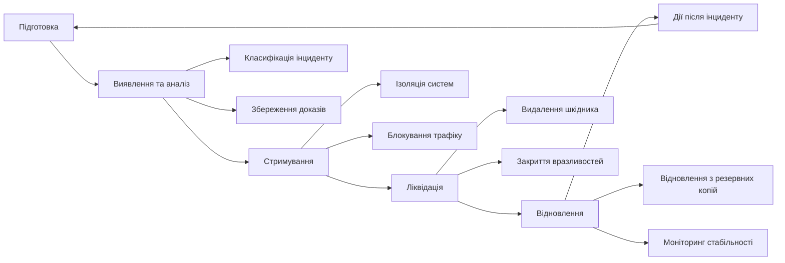
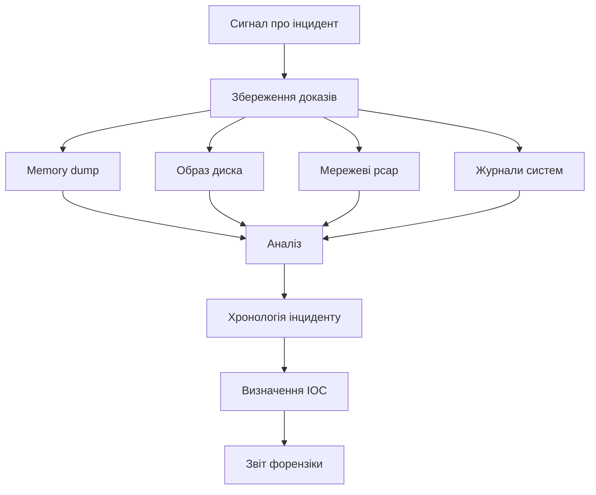

# Лабораторна робота 12 Incident Response, форензіка та розробка стратегічних рекомендацій

## 🎯 Мета

Сформувати комплексні компетентності у сфері реагування на інциденти інформаційної безпеки: навчитися проводити початкове розслідування та цифрову форензіку за наданим сценарієм інциденту, розробляти структурований Incident Response Plan відповідно до міжнародних стандартів, документувати хронологію подій та готувати executive summary для керівництва, а також формувати обґрунтовані стратегічні рекомендації щодо вдосконалення політик безпеки та плану навчання персоналу.

## 📋 Завдання

1. Отримати та проаналізувати сценарій інциденту, наданий викладачем (malware infection або data breach).
2. Провести початкове розслідування: проаналізувати надані журнали подій, мережевий трафік та артефакти.
3. Відновити хронологію (timeline) інциденту від першого компрометованого вектора до виявлення.
4. Розробити Incident Response Plan із конкретними кроками для чотирьох фаз: containment, eradication, recovery та post-incident activities.
5. Підготувати executive summary для керівництва організації — стислий нетехнічний звіт про інцидент, його наслідки та термінові заходи.
6. Розробити стратегічні рекомендації щодо вдосконалення політик інформаційної безпеки на основі виявлених слабких місць.
7. Скласти план навчання персоналу для підвищення рівня обізнаності про кіберзагрози.
8. Запропонувати конкретні технічні покращення інфраструктури безпеки організації.

## ⭐ Критерії оцінювання

Максимальна кількість балів за лабораторну роботу: **8 балів**.

Розподіл балів за елементами роботи:

- **Аналіз сценарію та форензіка** (2 бали): коректна ідентифікація вектора атаки та початкової точки компрометації з посиланням на конкретні докази в журналах, відновлення повної хронології інциденту з прив'язкою до часових позначок, ідентифікація скомпрометованих систем, облікових записів та витоку даних.
- **Incident Response Plan** (2 бали): детальний план із конкретними виконавськими кроками для фаз containment, eradication та recovery, реалістичні та технічно обґрунтовані заходи реагування, врахування пріоритетів бізнесу (мінімізація простою) поряд із вимогами безпеки.
- **Executive Summary** (1 бал): стисле (1–2 сторінки), нетехнічне пояснення інциденту та його бізнес-наслідків, чіткі рекомендації щодо термінових дій із вказівкою відповідальних осіб та термінів, прийнятне для читача-нефахівця з питань ІТ.
- **Стратегічні рекомендації щодо політик безпеки** (1 бал): конкретні та обґрунтовані рекомендації з посиланням на виявлені вразливості, пропозиції щодо нових або оновлених політик (парольна політика, реагування на інциденти, управління доступом), реалістичність впровадження з урахуванням ресурсів організації.
- **План навчання персоналу** (1 бал): структурований план із чітко визначеними темами, форматами навчання та цільовими аудиторіями, врахування реального вектора атаки інциденту (наприклад, якщо початком був фішинг — тренінг щодо розпізнавання фішингу), вимірювані метрики ефективності навчання.
- **Технічні рекомендації щодо інфраструктури** (1 бал): конкретні технічні засоби захисту, що усувають виявлені вразливості, обґрунтованість вибору засобів з урахуванням принципу defense in depth, пріоритизація рекомендацій за критичністю та складністю впровадження.

## ⏰ Політика дедлайнів та штрафів

**Термін здачі:** Лабораторна робота має бути здана **протягом 3 тижнів** від дати проведення останнього аудиторного заняття з цієї теми.

**Система штрафів за прострочення:** Здача роботи в установлений термін дає можливість отримати повну оцінку 8 балів. Роботи, здані з запізненням, будуть оцінені максимум в 4 бали. Виняток становлять документально підтверджені поважні причини (хвороба, сімейні обставини), за яких термін може бути продовжений за погодженням з викладачем.

## 📚 Теоретичні відомості

### Фреймворк реагування на інциденти

Реагування на інциденти (Incident Response, IR) — це структурований підхід до управління наслідками порушення безпеки або кібератаки з метою мінімізації збитків, скорочення часу відновлення та зменшення ймовірності повторення. Відсутність формального IR-процесу перетворює організаційну кризу з керованої на хаотичну.

Стандарт NIST SP 800-61 визначає чотири основні фази реагування на інцидент, що утворюють безперервний цикл.

Підготовка (Preparation) є найважливішою фазою: команда безпеки розробляє IR-план, визначає ролі та відповідальність, тренує персонал та готує необхідні інструменти ще до того, як стався інцидент. Без підготовки реагування буде повільним та неефективним.

Виявлення та аналіз (Detection and Analysis) включає ідентифікацію інциденту (з журналів, SIEM, повідомлень користувачів або зовнішніх джерел), визначення його типу та масштабу, збір та збереження доказів та первинний аналіз вектора атаки.

Стримування, ліквідація та відновлення (Containment, Eradication and Recovery) — практичне реагування. Стримування (Containment) обмежує поширення загрози: ізоляція скомпрометованих систем, блокування шкідливих IP-адрес, деактивація скомпрометованих облікових записів. Ліквідація (Eradication) усуває першопричину: видалення шкідливого програмного забезпечення, закриття вразливостей. Відновлення (Recovery) повертає системи до нормального стану в контрольований спосіб.

Дії після інциденту (Post-Incident Activity) включають ретроспективний аналіз (lessons learned), оновлення IR-плану та документацію для майбутнього використання.

### Цифрова форензіка

Цифрова форензіка (Digital Forensics) — це наукова дисципліна збору, збереження, аналізу та документування цифрових доказів у спосіб, що є юридично прийнятним. У контексті IR форензіка допомагає зрозуміти, що саме сталося, як зловмисник отримав доступ і які дані були скомпрометовані.

Принцип цілісності доказів є основоположним: будь-яка взаємодія зі скомпрометованою системою потенційно змінює докази. Тому першим кроком є знімок пам'яті (memory dump) та образ диска до будь-яких змін. Використання write-блокерів при роботі з носіями даних запобігає випадковій зміні доказів.

Ланцюг зберігання (chain of custody) документує кожну взаємодію з доказами: хто і коли отримав доступ, що було зроблено, де зберігались докази. Без коректного ланцюга зберігання докази можуть бути визнані неприйнятними у судовому провадженні.

Хронологія інциденту (incident timeline) відновлюється через аналіз часових позначок у журналах, системних метаданих файлів (timestamps: creation, modification, access) та мережевих записів. Зіставлення часових позначок із різних джерел дозволяє відновити послідовність дій зловмисника.

### Аналіз журналів та типові артефакти

Ефективна форензіка вимагає знання ключових джерел доказів у різних операційних системах.

У Linux-системах основними джерелами є `/var/log/auth.log` (або `/var/log/secure`) — журнали автентифікації; `/var/log/syslog` — загальносистемні події; журнали веб-сервера `/var/log/apache2/access.log` та `error.log`; а також записи crontab та скрипти автозапуску у `/etc/cron.*`, `/etc/rc.local`. Bash history (`~/.bash_history`) може містити команди зловмисника, якщо він не очистив їх.

У Windows-системах Журнал подій (Event Log) є основним джерелом: Security Log (events 4624, 4625 — вхід/невдалий вхід; 4720 — створення облікового запису), System Log (запуск/зупинка сервісів), Application Log. Реєстр Windows (Registry) зберігає записи про автозапуск (`HKLM\SOFTWARE\Microsoft\Windows\CurrentVersion\Run`), встановлене програмне забезпечення та нещодавно відкриті файли.

Мережеві артефакти включають записи DNS-запитів, з'єднання у файлах NetFlow або pcap, журнали firewall та proxy. Аналіз мережевого трафіку дозволяє виявити командно-контрольні сервери (C2), exfiltration трафік та латеральний рух по мережі.

### Показники компрометації (IoC)

Показники компрометації (Indicators of Compromise, IoC) — це артефакти, що свідчать про зловмисну активність у мережі або системі. Їх виявлення та документування є ключовим результатом форензіки.

Технічні IoC включають шкідливі IP-адреси та домени (C2-інфраструктура), хеші файлів шкідливого програмного забезпечення (MD5, SHA-256), специфічні URL-адреси, рядки та ключі реєстру. Поведінкові IoC описують аномалії: нетипові входи в нічний час, незвична кількість звернень до файлів, горизонтальне переміщення (lateral movement) між хостами.

IoC є цінними не лише для поточного розслідування: ними можна поділитися з іншими організаціями через платформи обміну (MISP, STIX/TAXII), щоб допомогти виявити ту саму атаку в інших місцях.

### Стратегічні рекомендації та безперервне вдосконалення

Кожен інцидент є можливістю для системного вдосконалення. Ефективні стратегічні рекомендації мають три рівні.

Технічний рівень охоплює конкретні засоби захисту: впровадження SIEM, покращення конфігурації firewall, патч-менеджмент, впровадження 2FA, сегментація мережі.

Процесний рівень стосується організаційних процедур: розробка або оновлення IR-плану, введення регулярних резервних копій з перевіркою відновлення, процедури управління вразливостями та привілейованим доступом.

Людський рівень є критичним, адже переважна більшість інцидентів починається з людської помилки (фішинг, слабкі паролі, незаблокований ноутбук). Навчання має бути практичним, повторюваним та прив'язаним до реальних загроз, а не лише у форматі річного прослуховування лекції.

## 🔬 Хід роботи

### Крок 1. Ознайомлення зі сценарієм інциденту

Викладач надає один з двох сценаріїв (або обидва для варіативних завдань):

**Сценарій А — Malware Infection:** Співробітник бухгалтерії відкрив вкладення електронного листа. Через деякий час спостерігається аномальний мережевий трафік з його робочої станції. Надані артефакти: журнал поштового сервера, журнал DNS-запитів за 24 години, системний журнал Windows Event Log скомпрометованого хоста, дамп мережевого трафіку (pcap).

**Сценарій Б — Data Breach:** На паблічному форумі з'явилось оголошення про продаж бази даних клієнтів компанії. Надані артефакти: журнал доступу до вебсервера (Apache access.log) за 7 днів, журнал запитів до бази даних, журнали VPN-автентифікації, записи файрволу.

Уважно прочитайте сценарій та наявні артефакти. Сформулюйте первинну гіпотезу: який тип атаки, коли приблизно відбулося, які системи задіяні.

### Крок 2. Аналіз журналів та форензіка

Проаналізуйте надані артефакти послідовно за кожним джерелом.

**Аналіз журналів автентифікації:** знайдіть аномальні входи — нетипові години, незвичні IP-адреси, нові облікові записи, використання привілейованих облікових записів. Звертайте увагу на послідовності невдалих спроб, що передують успішному входу (ознака brute-force з подальшим успіхом).

**Аналіз мережевого трафіку:** виявіть підозрілі зовнішні з'єднання (до незвичних доменів або IP), великі обсяги вихідного трафіку (ознака exfiltration), DNS-запити до незвичних доменів (ознака C2-комунікації або DNS tunneling).

**Аналіз журналів вебсервера:** шукайте ознаки сканування (велика кількість 404 помилок з однієї IP), SQL-ін'єкцій (підозрілі символи у параметрах запитів), незвично великих POST-запитів або відповідей (можлива exfiltration).

Для кожної знайденої аномалії фіксуйте: часову позначку, джерело (журнал, рядок), опис аномалії та інтерпретацію (що це означає в контексті інциденту).

### Крок 3. Відновлення хронології інциденту

На основі аналізу журналів відновіть хронологічну послідовність подій. Хронологія має охоплювати від моменту першого підозрілого запису (початок атаки) до виявлення інциденту.

Оформіть хронологію у вигляді таблиці:

| Час (UTC) | Система / Джерело | Подія | Інтерпретація |
|-----------|------------------|-------|---------------|
| 2024-11-15 08:23 | Поштовий сервер | Відкрито вкладення malware.docx | Початковий вектор зараження |
| 2024-11-15 08:25 | DNS | Запит до c2-server.xyz | Активація шкідника, зв'язок із C2 |
| 2024-11-15 08:26 | Windows Security Log | Успішний вхід SYSTEM у контексті процесу winword.exe | Ескалація привілеїв |
| ... | ... | ... | ... |

Визначте та задокументуйте IoC: IP-адреси зловмисника, домени C2, хеші або назви шкідливих файлів, скомпрометовані облікові записи.

### Крок 4. Розробка Incident Response Plan

Розробіть детальний IR-план із конкретними кроками для кожної фази реагування.

**Фаза стримування (Containment)** — негайні заходи для зупинки поширення загрози. Визначте, які системи ізолювати від мережі та яким чином (відключення мережевого кабелю, блокування порту на комутаторі, приміщення до окремого VLAN). Вкажіть IP-адреси та домени для блокування на firewall. Перелічіть облікові записи, що підлягають негайному відключенню або зміні паролю.

**Фаза ліквідації (Eradication)** — усунення присутності зловмисника та першопричини. Опишіть процедуру сканування всіх систем на наявність шкідливого програмного забезпечення, кроки з видалення виявлених загроз, закриття вразливостей (патч, зміна конфігурації), ревізію всіх облікових записів та привілеїв.

**Фаза відновлення (Recovery)** — повернення до нормальної роботи. Опишіть процедуру відновлення систем із чистих резервних копій (із вказівкою дати останньої відомо чистої копії), порядок поетапного повернення систем до мережі та моніторинг після повернення.

**Дії після інциденту (Post-Incident)** — ретроспектива та запобігання повторенню. Заплануйте зустріч команди для lessons learned протягом 2 тижнів після завершення інциденту.

### Крок 5. Підготовка Executive Summary

Виконавче резюме призначене для керівництва організації та має бути написане доступною мовою без технічного жаргону. Обсяг — 1–2 сторінки.

Executive summary має відповідати на ключові питання: що сталося (коротко, у 2–3 реченнях); коли відбулось і коли виявлено (gap між атакою та виявленням є важливим індикатором); які системи та дані постраждали; який потенційний вплив на бізнес (репутаційний, фінансовий, регуляторний); які термінові заходи вже вжиті або виконуються зараз; що потрібно вирішити керівництву (ресурси, повноваження, зовнішні комунікації).

Уникайте пасивних конструкцій на кшталт «були виявлені аномалії». Натомість: «Зловмисник отримав доступ до системи обліку клієнтів через фішинговий лист, отриманий 15 листопада».

### Крок 6. Розробка стратегічних рекомендацій щодо політик безпеки

На основі виявлених у сценарії слабких місць сформулюйте конкретні рекомендації щодо вдосконалення організаційних політик. Рекомендації мають бути адресними: кожна — відповідь на конкретну вразливість або прогалину, виявлену в ході розслідування.

Для кожної рекомендації вкажіть: назву та суть змін, проблему, яку вона вирішує (з посиланням на сценарій), орієнтовний терміна впровадження (коротко-, середньо-, довгостроковий), відповідального виконавця (CISO, IT-відділ, HR тощо).

Типові напрями рекомендацій можуть включати: впровадження або оновлення парольної політики (мінімальна довжина, складність, термін дії, заборона повторного використання); порядок надання та відкликання прав доступу (особливо привілейованих); процедуру управління патчами та оновленнями програмного забезпечення; порядок роботи з електронною поштою та вкладеннями; регламент реагування на інциденти.

### Крок 7. Складання плану навчання персоналу

Розробіть структурований план навчання з кібербезпеки для співробітників організації. План має враховувати реальний вектор атаки з досліджуваного сценарію.

Структура плану навчання охоплює кілька ключових елементів. Аудиторія та диференціація: навчання для рядових співробітників (широка аудиторія, базова обізнаність), для IT-персоналу (технічні деталі, процедури), для керівництва (ризики та відповідальність). Теми для рядових співробітників: розпізнавання фішингу та соціальної інженерії, безпечне поводження з паролями та 2FA, реагування при підозрі на інцидент (до кого звертатися), безпечне використання корпоративного обладнання поза офісом. Формати навчання: очні тренінги (1–2 рази на рік), онлайн-модулі з тестуванням (щоквартально), симуляції фішингових атак для перевірки ефективності (двічі на рік), щомісячні розсилки з актуальними загрозами (Security Awareness Newsletter). Метрики ефективності: відсоток співробітників, що пройшли навчання; відсоток успішно ідентифікованих фішингових симуляцій до та після навчання; кількість своєчасно зареєстрованих підозрілих подій.

### Крок 8. Формування технічних рекомендацій щодо інфраструктури

Запропонуйте конкретні технічні засоби захисту, що усувають вразливості, виявлені в ході розслідування. Для кожного засобу вкажіть: назву рішення, яку конкретну проблему вирішує, пріоритет впровадження (критичний / високий / середній) та орієнтовну складність реалізації.

Рекомендації можуть стосуватися: впровадження або розширення SIEM-системи для раннього виявлення аномалій; сегментації мережі (VLAN, DMZ) для обмеження латерального руху; посилення захисту електронної пошти (anti-phishing gateway, DMARC, DKIM, SPF); впровадження EDR (Endpoint Detection and Response) на всіх кінцевих точках; удосконалення управління привілейованим доступом (PAM); поліпшення резервного копіювання (правило 3-2-1, офлайн-копії, регулярне тестування відновлення).

### Крок 9. Підготовка фінального звіту

Оформіть комплексний звіт у форматі PDF. Звіт є підсумком всієї роботи та має бути структурованим, послідовним та самодостатнім.

Рекомендована структура звіту:

1. Титульна сторінка (тема, ПІБ, група, дата).
2. Зміст.
3. Executive Summary (1–2 сторінки для керівництва).
4. Опис сценарію та методологія розслідування.
5. Результати форензіки: аналіз артефактів, виявлені IoC.
6. Хронологія інциденту (таблиця).
7. Incident Response Plan: деталізовані кроки для чотирьох фаз.
8. Стратегічні рекомендації щодо політик безпеки.
9. План навчання персоналу.
10. Технічні рекомендації щодо інфраструктури.
11. Висновки.
12. Додатки: повні журнали з анотаціями, схема мережевої топології (якщо доречно).

Формат здачі: `pdf`.

## ❓ Контрольні запитання

1. Поясніть структуру фреймворку NIST SP 800-61 для реагування на інциденти. Чому підготовча фаза є найважливішою і що відбудеться з організацією, що не готувалась до інцидентів, коли він станеться?
2. Що таке фаза containment і чому її важливо розпочати якнайшвидше? Наведіть приклад, коли помилкова або пізня ізоляція призводить до гірших наслідків, ніж відсутність ізоляції.
3. Поясніть різницю між eradication та recovery. Чому недостатньо просто відновити систему з резервної копії, не виконавши eradication, навіть якщо резервна копія є чистою?
4. Що таке chain of custody у цифровій форензіці та чому його дотримання є критичним? Що відбудеться з доказами у судовому провадженні, якщо chain of custody був порушений?
5. Поясніть, чому gap між часом атаки та часом виявлення є одним із ключових показників зрілості системи безпеки організації. Який типовий розмір цього gap за статистикою галузевих звітів і що він означає на практиці?
6. Що таке Indicators of Compromise (IoC) і як вони використовуються як під час поточного розслідування, так і для превентивного захисту в майбутньому?
7. Чому executive summary вважається одним із найважливіших документів за результатами розслідування? Які помилки найчастіше роблять технічні спеціалісти при його підготовці?
8. Поясніть концепцію Security Awareness Training. Чому одноразового щорічного навчання недостатньо? Що робить програму навчання ефективною відповідно до сучасних досліджень у сфері кібербезпеки?
