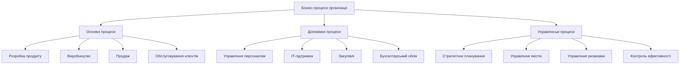
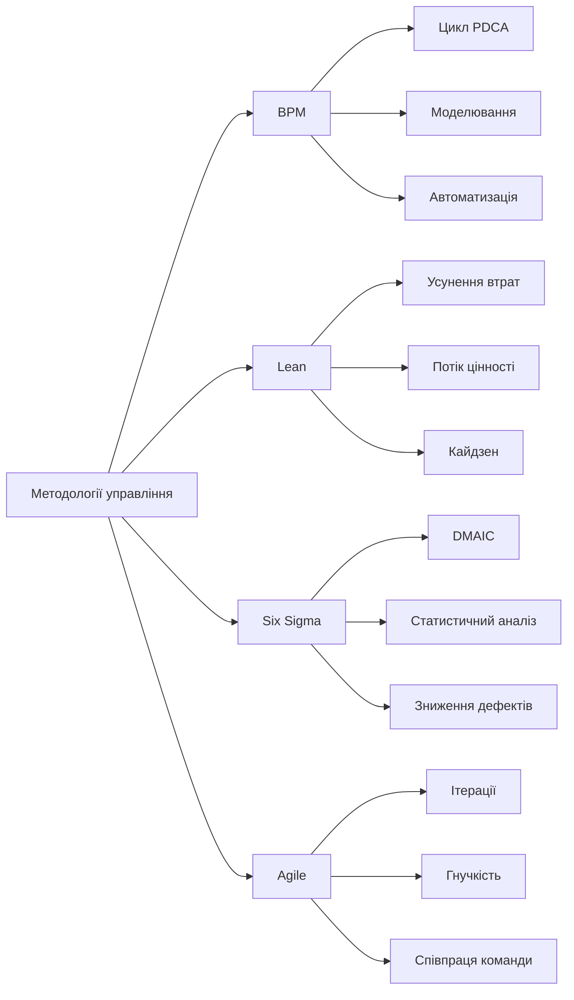
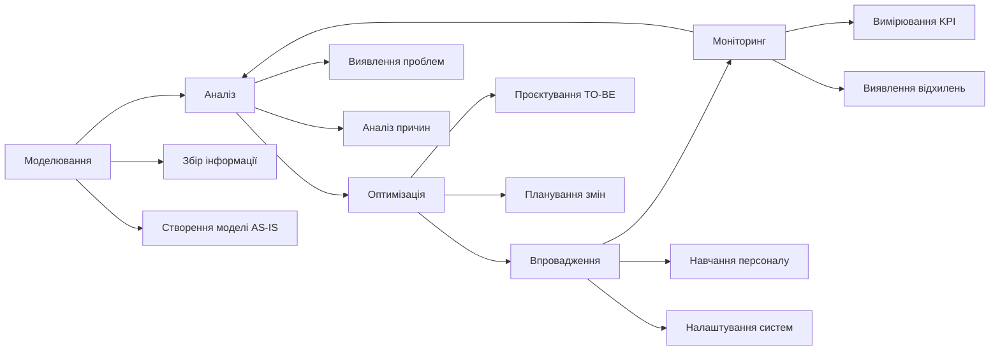

# Лекція 01 Основи бізнес-процесів

## Вступ

Сучасні організації функціонують у динамічному середовищі, де ефективність операційної діяльності визначає конкурентоспроможність та успішність бізнесу. Розуміння природи бізнес-процесів, методів їх управління та оптимізації становить фундаментальну компетенцію для фахівців з кібербезпеки, адже захист інформаційних активів нерозривно пов'язаний із розумінням того, як функціонує організація.

Ця лекція закладає теоретичний фундамент для подальшого вивчення дисципліни, розкриваючи сутність бізнес-процесів, методології їх управління та ключові метрики ефективності.

## Що таке бізнес-процес

Бізнес-процес являє собою структуровану послідовність взаємопов'язаних дій, які виконуються учасниками організації з метою перетворення вхідних ресурсів на результат, що має цінність для клієнта. Кожен процес характеризується чітко визначеними входами, виходами, правилами виконання та відповідальними особами.

Для глибшого розуміння концепції розглянемо класичне визначення. За Майклом Хаммером, одним із засновників теорії реінжинірингу бізнес-процесів, бізнес-процес це організована група пов'язаних видів діяльності, які разом створюють результат, що має цінність для споживача. Це визначення підкреслює три ключові аспекти: структурованість, взаємозв'язок дій та орієнтацію на створення цінності.

Розглянемо конкретний приклад процесу обробки замовлення в інтернет-магазині. Вхідними даними є замовлення клієнта, виходом виступає доставлений товар та підтверджена оплата. Послідовність дій включає прийом замовлення, перевірку наявності товару, резервування позиції на складі, формування документів, комплектацію, пакування, передачу кур'єрській службі та підтвердження доставки. Кожна дія виконується конкретним підрозділом або співробітником, використовує певні інформаційні системи та регламентується внутрішніми процедурами.

### Характеристики бізнес-процесів

Кожен бізнес-процес володіє набором характеристик, які визначають його природу та дозволяють здійснювати управління ним.

Процес завжди має власника, тобто особу або підрозділ, відповідального за результати виконання процесу та його постійне вдосконалення. Власник процесу наділяється повноваженнями приймати рішення щодо зміни процедур, розподілу ресурсів та вирішення конфліктних ситуацій. Наприклад, власником процесу обслуговування клієнтів може бути керівник відділу сервісу, який відповідає за якість та швидкість вирішення звернень.

Межі процесу визначають його початок та завершення. Чітке окреслення меж дозволяє уникнути дублювання функцій різними підрозділами та забезпечує зрозуміле розмежування відповідальності. Початком процесу зазвичай виступає подія-тригер, як-от надходження замовлення або виявлення інциденту безпеки. Завершенням є досягнення конкретного результату, який можна виміряти та оцінити.

Ресурси процесу охоплюють людські, фінансові, технологічні та інформаційні активи, необхідні для виконання діяльності. До людських ресурсів належать співробітники з відповідною кваліфікацією, до технологічних обладнання та інформаційні системи, до інформаційних бази даних, документи та знання.

Вимірюваність процесу передбачає наявність метрик, які дозволяють об'єктивно оцінити його ефективність. Кількісні показники можуть включати час виконання, вартість, кількість помилок, рівень задоволеності клієнтів. Без вимірювання неможливо визначити, чи є процес ефективним та чи потребує він покращення.

### Типи бізнес-процесів

Організаційні процеси класифікуються за різними критеріями, що дозволяє структурувати діяльність підприємства та визначити пріоритети управління.

За рівнем впливу на створення цінності виділяють основні, допоміжні та управлінські процеси.

Основні процеси безпосередньо створюють цінність для зовнішнього клієнта та генерують дохід організації. Вони формують ланцюг створення вартості від отримання сировини до доставки готового продукту споживачеві. У виробничому підприємстві основними є процеси розробки продукту, виробництва, збуту та післяпродажного обслуговування. У банку до основних належать процеси відкриття рахунків, видачі кредитів, здійснення платежів.

Допоміжні процеси забезпечують функціонування основних процесів, створюючи необхідні умови та ресурси. Вони генерують цінність для внутрішніх споживачів організації. Типовими прикладами допоміжних процесів є управління персоналом, IT-підтримка, облік та звітність, закупівлі, утримання інфраструктури. Хоча ці процеси безпосередньо не створюють продукт для клієнта, їх якість суттєво впливає на ефективність основної діяльності.

Управлінські процеси спрямовані на планування, координацію та контроль діяльності організації. До них відносяться стратегічне планування, бюджетування, управління якістю, управління ризиками, моніторинг показників ефективності. Ці процеси забезпечують узгодженість дій різних підрозділів та відповідність діяльності стратегічним цілям.

За ступенем формалізації розрізняють структуровані, слабоструктуровані та неструктуровані процеси.

Структуровані процеси характеризуються чітко визначеною послідовністю дій, формалізованими правилами прийняття рішень та можливістю повної автоматизації. Прикладом може служити процес нарахування заробітної плати, який виконується згідно з фіксованими алгоритмами та регламентами. Такі процеси легко піддаються моделюванню, вимірюванню та оптимізації.

Слабоструктуровані процеси мають певну регламентацію, проте допускають варіативність виконання залежно від ситуації та вимагають експертних рішень учасників. Наприклад, процес розгляду заявки на кредит передбачає стандартні етапи перевірки, але остаточне рішення може залежати від оцінки ризик-менеджера з урахуванням специфічних факторів.

Неструктуровані процеси характеризуються високим рівнем невизначеності, творчим характером діяльності та складністю формалізації. До них належать процеси наукових досліджень, розробки інноваційних продуктів, прийняття стратегічних рішень в умовах турбулентного середовища. Управління такими процесами вимагає гнучких підходів та високої кваліфікації виконавців.

## Методології управління процесами

Протягом останніх десятиліть сформувалися різноманітні методологічні підходи до управління бізнес-процесами, кожен з яких має специфічні принципи, інструменти та сфери застосування. Розуміння цих методологій дозволяє обирати оптимальний підхід для конкретної організаційної ситуації.

### Business Process Management

Business Process Management являє собою комплексний підхід до управління, що поєднує методи, технології та практики безперервного вдосконалення бізнес-процесів для досягнення стратегічних цілей організації. BPM розглядає процеси як ключовий актив підприємства, що потребує систематичного управління протягом усього життєвого циклу.

Філософія BPM ґрунтується на процесному мисленні, коли діяльність організації розглядається не як набір функцій окремих підрозділів, а як система взаємопов'язаних процесів, спрямованих на створення цінності для клієнта. Цей підхід долає традиційну функціональну роздрібненість, коли кожен відділ зосереджений на власних цілях, часто на шкоду загальній ефективності.

Цикл управління процесами в BPM охоплює послідовні етапи. Спочатку здійснюється моделювання процесів з використанням стандартизованих нотацій, що дозволяє отримати візуальне представлення поточного стану. Далі проводиться аналіз виявлених проблемних зон, вузьких місць та можливостей покращення. На основі аналізу розробляється оптимізована модель процесу, яка впроваджується в діяльність організації. Постійний моніторинг ключових показників забезпечує контроль ефективності та виявлення нових можливостей вдосконалення, що замикає цикл безперервного покращення.

Технологічну основу BPM становлять системи класу BPMS, які автоматизують моделювання, виконання, моніторинг та оптимізацію процесів. Ці платформи дозволяють швидко впроваджувати зміни в процеси без значного перепрограмування інформаційних систем, забезпечуючи гнучкість та адаптивність організації.

Застосування BPM особливо ефективне в організаціях зі складними міжфункціональними процесами, високими вимогами до регуляторного комплаєнсу та потребою в постійній адаптації до змін зовнішнього середовища. Банківський сектор, страхування, телекомунікації, державне управління активно використовують цей підхід для підвищення ефективності та забезпечення прозорості діяльності.

### Lean Management

Методологія Lean, що виникла в японській автомобілебудівній промисловості, зосереджена на максимізації цінності для клієнта через систематичне усунення всіх видів втрат у бізнес-процесах. Фундаментальним принципом Lean є розуміння цінності з точки зору споживача та організація всіх видів діяльності навколо її створення.

Концепція втрат у Lean охоплює сім класичних категорій. Перевиробництво означає створення продукції або виконання робіт у більшому обсязі, ніж потрібно клієнту в даний момент. Очікування виникає, коли процес простоює через незбалансованість потоків або недоступність ресурсів. Непотрібне транспортування включає переміщення матеріалів, інформації чи людей, що не додає цінності. Зайва обробка означає виконання операцій, результати яких не впливають на сприйняття цінності клієнтом. Надлишкові запаси заморожують капітал та приховують проблеми в процесах. Непотрібні переміщення працівників витрачають час та енергію без створення цінності. Дефекти та виправлення помилок споживають ресурси на повторне виконання роботи.

Ключовим інструментом Lean виступає картування потоку створення цінності, яке дозволяє візуалізувати всі етапи процесу від початкового запиту до отримання результату клієнтом. Аналіз карти розкриває діяльність, що додає цінність, та види діяльності, що є втратами. Це створює основу для цільового усунення втрат та реорганізації процесу.

Принцип витягування замість проштовхування передбачає виробництво або виконання роботи тільки тоді, коли є реальний попит від наступного етапу ланцюга. Це мінімізує запаси та очікування, прискорює виявлення проблем та підвищує гнучкість реагування на потреби клієнтів.

Філософія безперервного вдосконалення, відома як кайдзен, закликає до постійних невеликих покращень з залученням усіх співробітників організації. Культура кайдзен розглядає кожну проблему як можливість для навчання та розвитку, заохочує ініціативність та експериментування.

У сфері інформаційних технологій та кібербезпеки принципи Lean знаходять застосування в оптимізації процесів розробки, скороченні часу реагування на інциденти, усуненні дублювання зусиль різних команд. Наприклад, автоматизація рутинних перевірок безпеки усуває втрати очікування та вивільняє час аналітиків для складніших завдань.

### Six Sigma

Six Sigma являє собою дисципліновану, керовану даними методологію усунення дефектів у будь-якому процесі, від виробництва до послуг. Термін Six Sigma відображає статистичну мету досягнення рівня якості, при якому кількість дефектів не перевищує 3,4 на мільйон можливостей, що відповідає шести стандартним відхиленням від середнього значення.

Методологія ґрунтується на циклі DMAIC, що складається з п'яти фаз. Фаза визначення передбачає чітке формулювання проблеми, цілей проєкту покращення та вимог клієнтів. Фаза вимірювання зосереджена на збиранні даних про поточну продуктивність процесу та встановленні базової лінії показників. Фаза аналізу використовує статистичні методи для виявлення кореневих причин дефектів та варіацій у процесі. Фаза вдосконалення передбачає розробку та впровадження рішень, які усувають виявлені причини проблем. Фаза контролю забезпечує сталість досягнутих покращень через моніторинг показників та стандартизацію нових процедур.

Статистичні інструменти Six Sigma включають контрольні карти для виявлення особливих причин варіацій, аналіз можливостей та наслідків відмов для проактивного управління ризиками, регресійний аналіз для встановлення причинно-наслідкових зв'язків, планування експериментів для оптимізації параметрів процесу.

Організаційна структура Six Sigma передбачає ієрархію ролей з різними рівнями підготовки. Чемпіони виступають спонсорами проєктів покращення на рівні вищого керівництва. Чорні пояси є експертами методології, що керують складними проєктами та навчають інших. Зелені пояси виконують проєкти покращення у своїх функціональних зонах. Жовті пояси володіють базовими знаннями та підтримують проєктні команди.

Six Sigma особливо ефективна у процесах, де критичними є стабільність та передбачуваність результатів, де вартість дефектів висока, де існують жорсткі регуляторні вимоги. У кібербезпеці методологія може застосовуватися для зменшення помилок у процесах управління доступом, підвищення точності систем виявлення вторгнень, оптимізації процедур резервного копіювання.

### Agile

Agile представляє сімейство ітеративних та інкрементальних методологій розробки, що виникли як реакція на недоліки традиційних каскадних підходів у сфері створення програмного забезпечення. Філософія Agile сформульована в Маніфесті гнучкої розробки програмного забезпечення, який встановлює цінності та принципи.

Чотири ключові цінності Agile підкреслюють пріоритети методології. Люди та взаємодія важливіші за процеси та інструменти, що визнає вирішальну роль командної співпраці та комунікації. Працюючий продукт важливіший за вичерпну документацію, що зосереджує зусилля на створенні реальної цінності. Співпраця з замовником важливіша за узгодження умов контракту, що забезпечує орієнтацію на справжні потреби клієнта. Реагування на зміни важливіше за дотримання плану, що дозволяє адаптуватися до нових обставин та знань.

Scrum як одна з найпопулярніших Agile-методологій організовує роботу в короткі ітерації тривалістю два-чотири тижні, що називаються спринтами. Кожен спринт починається з планування, під час якого команда визначає набір завдань для реалізації. Щоденні короткі зустрічі забезпечують синхронізацію діяльності та виявлення перешкод. Завершується спринт демонстрацією результатів зацікавленим сторонам та ретроспективою для аналізу процесу роботи команди.

Kanban як альтернативний Agile-підхід фокусується на візуалізації робочого процесу та обмеженні обсягу незавершеної роботи. Kanban-дошка відображає етапи процесу у вигляді колонок, а завдання рухаються між ними у міру виконання. Встановлення лімітів на кількість одночасних завдань на кожному етапі запобігає перевантаженню та забезпечує плавний потік роботи. Метрики часу циклу та пропускної здатності дозволяють вимірювати та покращувати ефективність процесу.

У сфері кібербезпеки Agile-принципи застосовуються в процесах управління вразливостями, коли пріоритизація та усунення ризиків відбувається ітераціями. Командам реагування на інциденти Agile допомагає гнучко адаптувати тактики розслідування по мірі отримання нової інформації. Розробка політик безпеки може вестися інкрементально з регулярним зворотним зв'язком від зацікавлених сторін.

## Ключові метрики процесів

Управління бізнес-процесами неможливе без об'єктивного вимірювання їх ефективності. Система метрик дозволяє оцінити поточний стан процесів, виявити проблемні зони, відстежувати прогрес покращень та приймати обґрунтовані управлінські рішення. Метрики класифікуються за різними аспектами продуктивності процесу.

### Часові метрики

Часові характеристики процесу визначають швидкість створення цінності для клієнта та ефективність використання ресурсів організації.

Час виконання процесу являє собою загальну тривалість від ініціювання до завершення процесу. Ця метрика критична для процесів, чутливих до затримок, таких як обробка транзакцій, доставка послуг, реагування на інциденти безпеки. Скорочення часу виконання зазвичай підвищує задоволеність клієнтів та конкурентоспроможність організації.

Час створення цінності відображає тривалість діяльності, яка безпосередньо додає цінність для клієнта. Решта часу витрачається на очікування, транспортування, перевірки, виправлення помилок. Відношення часу створення цінності до загального часу виконання показує ефективність процесу. У багатьох організаційних процесах цей показник становить лише 5-10 відсотків, що свідчить про значний потенціал покращення.

Час циклу характеризує середню тривалість виконання одиниці роботи та використовується для процесів, що обробляють потік однотипних запитів. Зменшення часу циклу дозволяє збільшити пропускну здатність процесу без додаткових ресурсів.

Час очікування вимірює простої між етапами процесу, коли робота не виконується через недоступність ресурсів, черги завдань або несинхронізованість суміжних процесів. Високий час очікування сигналізує про вузькі місця та неефективну організацію роботи.

Для ілюстрації розглянемо процес розгляду звернення користувача в службу технічної підтримки. Якщо загальний час від отримання звернення до вирішення проблеми становить 24 години, а реальна робота аналітика займає 2 години, то час створення цінності складає лише 8 відсотків. Решта часу споживається на очікування в черзі, передачу між фахівцями, узгодження рішень. Аналіз компонентів часу дозволяє виявити можливості оптимізації, наприклад, впровадження автоматичної маршрутізації звернень або надання аналітикам більших повноважень для прийняття рішень.

### Якісні метрики

Якість виконання процесу визначає ступінь відповідності результатів очікуванням клієнтів та встановленим стандартам.

Рівень дефектів показує частку випадків виконання процесу, які містять помилки або не відповідають вимогам. Дефектом може бути невірно оформлений документ, неповна інформація у звіті, помилка в коді, порушення процедури безпеки. Високий рівень дефектів призводить до витрат на виправлення, незадоволеності клієнтів, репутаційних ризиків.

Показник першопрохідної якості вимірює частку випадків, коли робота виконана правильно з першого разу без необхідності переробки. Цей показник краще відображає справжню ефективність процесу, ніж рівень дефектів, оскільки враховує приховані витрати на виправлення помилок.

Індекс задоволеності клієнтів оцінює сприйняття якості процесу споживачами його результатів. Для зовнішніх процесів клієнтами виступають покупці продуктів або користувачі послуг, для внутрішніх процесів співробітники та підрозділи організації. Вимірювання здійснюється через опитування, збір відгуків, аналіз скарг.

Відхилення від стандарту характеризує варіативність результатів процесу. Процеси з високою варіативністю генерують непередбачувані результати, що ускладнює планування та знижує довіру клієнтів. Статистичні методи контролю якості дозволяють розрізняти природну варіативність процесу від варіативності, спричиненої особливими причинами, які потребують втручання.

У контексті кібербезпеки якісні метрики набувають особливого значення. Наприклад, для процесу реагування на інциденти безпеки критичним є показник помилкових спрацьовувань системи виявлення вторгнень. Високий рівень помилкових тривог перевантажує аналітиків, знижує пильність та може призвести до пропуску справжніх інцидентів. Оптимізація правил виявлення для досягнення балансу між чутливістю та специфічністю становить важливе завдання управління процесом.

### Економічні метрики

Економічні характеристики процесу відображають витрати ресурсів та фінансову ефективність діяльності.

Вартість процесу включає всі витрати, пов'язані з виконанням діяльності. Прямі витрати охоплюють заробітну плату виконавців, вартість матеріалів та послуг, амортизацію обладнання. Непрямі витрати включають накладні витрати, вартість простоїв, втрати від дефектів. Точний розрахунок вартості процесу потребує використання методів процесно-орієнтованого калькулювання, які розподіляють витрати на основі реального споживання ресурсів різними видами діяльності.

Вартість одиниці результату дозволяє порівнювати ефективність різних процесів або варіантів виконання. Наприклад, вартість обробки одного замовлення, вартість залучення одного клієнта, вартість закриття одного інциденту безпеки. Моніторинг цієї метрики у часі виявляє тренди ефективності та результати ініціатив покращення.

Продуктивність праці вимірює обсяг результатів, створених на одиницю робочого часу або одного працівника. Підвищення продуктивності може досягатися через автоматизацію рутинних операцій, стандартизацію процедур, навчання персоналу, усунення втрат.

Рентабельність інвестицій у процес оцінює економічну доцільність проєктів покращення. Розрахунок порівнює приріст вигод, таких як зростання доходів або зниження витрат, з витратами на реалізацію змін. Позитивний показник рентабельності обґрунтовує доцільність інвестування ресурсів у вдосконалення процесу.

Збалансована система метрик поєднує часові, якісні та економічні показники, забезпечуючи цілісне бачення ефективності процесу. Важливо уникати ситуації, коли оптимізація однієї метрики погіршує інші. Наприклад, агресивне зниження витрат може призвести до падіння якості або збільшення часу виконання, що зрештою негативно вплине на загальну результативність.

## Життєвий цикл процесу

Управління бізнес-процесами реалізується через циклічну послідовність етапів, що утворюють життєвий цикл процесу. Кожен етап має специфічні завдання, методи та результати, які в сукупності забезпечують безперервне вдосконалення діяльності організації.

### Моделювання процесів

Моделювання є початковим етапом життєвого циклу, на якому створюється формалізоване представлення бізнес-процесу у вигляді графічних діаграм або текстових описів. Мета моделювання полягає в отриманні спільного розуміння процесу всіма зацікавленими сторонами, документуванні поточного стану, формуванні основи для аналізу та покращення.

Процес моделювання починається зі збору інформації про діяльність через інтерв'ю з виконавцями, спостереження за роботою, аналіз документації та даних інформаційних систем. Важливо залучити до моделювання безпосередніх учасників процесу, оскільки вони володіють найточнішим знанням реальної практики, яка може відрізнятися від формальних регламентів.

Вибір нотації для моделювання залежить від цілей та аудиторії. Для високорівневого представлення процесу організації може використовуватися нотація SIPOC, яка фіксує постачальників, входи, процес, виходи та клієнтів. Для детального моделювання виконавчих процесів стандартом індустрії виступає нотація BPMN, яка надає багатий набір графічних елементів для опису потоків робіт, подій, рішень, виключень. Для аналізу міжфункціональної взаємодії застосовуються діаграми swimlane, що розділяють процес на доріжки відповідно до організаційних ролей або систем.

Розглянемо приклад моделювання процесу управління інцидентами безпеки. Модель AS-IS відображає поточний стан з усіма наявними недоліками. Виявляється, що звернення надходять різними каналами без централізованої реєстрації, розподіл інцидентів між аналітиками відбувається вручну, відсутня автоматизована класифікація за рівнями критичності, комунікація з ініціатором звернення не структурована. Ця модель стає основою для виявлення проблем та розробки покращеної версії.

Якість моделі визначається її точністю, повнотою, зрозумілістю та придатністю для аналізу. Модель повинна відображати реальний процес, а не бажаний стан чи формальні інструкції. Деталізація моделі має бути достатньою для досягнення цілей, але не надмірною, щоб не ускладнювати сприйняття.

### Аналіз процесів

Етап аналізу спрямований на глибоке розуміння характеристик процесу, виявлення проблем та можливостей покращення. Аналіз спирається на модель процесу, зібрані дані про продуктивність та експертизу учасників.

Аналіз вузьких місць виявляє етапи процесу з найменшою пропускною здатністю, які обмежують загальну продуктивність. Теорія обмежень стверджує, що в кожній системі існує принаймні одне вузьке місце, яке визначає її ефективність. Зосередження зусиль на розширенні вузького місця дає максимальний ефект для покращення процесу.

Аналіз кореневих причин проблем використовує техніки п'яти чому, діаграми Ішікави, аналіз Парето для виявлення справжніх джерел дефектів та неефективності. Поверхневі симптоми часто відволікають увагу від глибинних системних причин. Наприклад, високий рівень помилок у введенні даних може бути спричинений не неуважністю операторів, а незручним інтерфейсом системи або недостатнім навчанням персоналу.

Порівняльний аналіз співставляє показники процесу з найкращими практиками галузі або конкурентів. Бенчмаркінг розкриває потенціал покращення та надає орієнтири для встановлення цільових показників. Важливо порівнювати процеси в подібних умовах, враховуючи специфіку організації, регуляторні вимоги, доступні ресурси.

Аналіз ризиків процесу ідентифікує потенційні загрози, які можуть перешкодити досягненню цілей. Для кожного ризику оцінюється ймовірність реалізації та величина можливого впливу. Високопріоритетні ризики потребують розробки заходів мітігації або контролів, які знижують ймовірність або наслідки небажаних подій.

У контексті кібербезпеки аналіз процесу управління доступом може виявити ризик надмірних привілеїв, коли користувачам надаються права, що перевищують функціональні потреби. Кореневою причиною може бути відсутність регулярного перегляду прав доступу та автоматизованих механізмів відкликання привілеїв при зміні ролі співробітника. Результатом аналізу стає розуміння необхідності впровадження процедур періодичної сертифікації доступу та інтеграції системи управління ідентифікацією з HR-системою.

### Оптимізація процесів

Оптимізація передбачає проєктування покращеної моделі процесу на основі результатів аналізу. Цей етап вимагає творчого підходу, залучення міждисциплінарних команд, врахування технологічних можливостей та організаційних обмежень.

Стратегії оптимізації варіюються від радикального перепроєктування до інкрементальних покращень. Реінжиніринг означає фундаментальне переосмислення та радикальний редизайн процесу для досягнення різких покращень критичних показників. Цей підхід виправданий, коли існуючий процес застарів, неефективний або не відповідає змінам бізнес-моделі. Інкрементальна оптимізація фокусується на серії невеликих покращень, які в сукупності забезпечують суттєвий ефект при нижчих ризиках та витратах.

Типові напрями оптимізації включають усунення непродуктивних операцій, які не додають цінності, об'єднання або розпаралелення етапів для скорочення часу виконання, автоматизацію рутинних завдань, стандартизацію процедур для зниження варіативності, перерозподіл відповідальності для збалансування навантаження.

Автоматизація становить потужний важіль оптимізації, проте вимагає ретельної підготовки. Автоматизувати варто стабільні, добре відпрацьовані процеси зі значними обсягами транзакцій. Автоматизація неефективного процесу лише закріплює недоліки та створює додаткову складність. Тому важливо спочатку спростити та оптимізувати процес, а потім автоматизувати його.

Проєктування оптимізованого процесу управління вразливостями може включати впровадження автоматизованих сканерів для виявлення вразливостей, інтеграцію з базами даних загроз для пріоритизації ризиків, автоматичне призначення відповідальних за усунення на основі конфігурації активів, дашборди для моніторингу прогресу закриття вразливостей. Така оптимізація різко скорочує час від виявлення до усунення вразливості, знижує залежність від ручної роботи аналітиків, підвищує прозорість процесу для керівництва.

Важливим аспектом оптимізації є управління змінами. Навіть найкраще спроєктований процес не принесе результатів без ефективного впровадження. Необхідно забезпечити підтримку керівництва, залучити виконавців до розробки змін, провести навчання, комунікувати переваги нового процесу.

### Впровадження процесів

Впровадження перетворює модель оптимізованого процесу на операційну реальність організації. Цей етап охоплює розробку детальних інструкцій, налаштування інформаційних систем, навчання персоналу, пілотне тестування, повномасштабний розгорнання.

Планування впровадження визначає послідовність дій, розподіл відповідальності, терміни, ресурси та критерії успіху. Великомасштабні зміни процесів доцільно впроваджувати поетапно, починаючи з пілотного проєкту в обмеженому периметрі. Пілот дозволяє перевірити працездатність нового процесу, виявити непередбачені проблеми, відкоригувати деталі до широкого розгортання.

Документування процесу створює основу для консистентного виконання. Процедури повинні бути зрозумілими для виконавців, містити необхідні деталі, але не бути надмірно громіздкими. Електронні системи управління знаннями забезпечують доступність актуальної документації в контексті роботи.

Навчання персоналу є критичним фактором успіху впровадження. Співробітники повинні розуміти не лише як виконувати нові процедури, але й чому вони важливі, як нові підходи покращують результати роботи. Формати навчання можуть включати семінари, практичні тренінги, електронні курси, наставництво.

Технологічна підтримка процесу передбачає налаштування інформаційних систем, розробку інтеграцій, створення автоматизованих робочих потоків. Системи класу BPMS дозволяють безпосередньо виконувати моделі процесів, автоматично маршрутизувати завдання, контролювати виконання термінів, збирати дані про продуктивність.

Під час впровадження важливо забезпечити підтримку виконавців, швидко вирішувати виникаючі питання, корегувати процедури на основі практичного досвіду. Регулярні зустрічі команди впровадження дозволяють відстежувати прогрес, виявляти перешкоди, координувати дії.

Після повномасштабного впровадження процес переходить у режим стабільного функціонування. Проте це не означає завершення життєвого циклу. Постійний моніторинг показників виявляє нові можливості покращення, що ініціює наступну ітерацію аналізу та оптимізації.

## Висновки

Розуміння природи бізнес-процесів, володіння методологіями їх управління та здатність ефективно вимірювати продуктивність становлять фундаментальну компетенцію сучасного фахівця з кібербезпеки. Безпека інформаційних активів не існує у вакуумі, вона вбудована в операційні процеси організації та безпосередньо впливає на їх ефективність.

Процесне мислення дозволяє системно підходити до проєктування та впровадження контролів безпеки, враховуючи їх вплив на продуктивність бізнес-діяльності. Методології BPM, Lean, Six Sigma, Agile надають інструментарій для балансування вимог безпеки з операційними цілями організації, для усунення неефективності процесів управління ризиками, для безперервного вдосконалення практик захисту інформації.

Ключові метрики процесів забезпечують об'єктивну основу для оцінки ефективності заходів безпеки, виявлення проблемних зон, обґрунтування інвестицій у захист. Часові метрики показують швидкість реагування на інциденти та вразливості. Якісні метрики відображають точність виявлення загроз та рівень помилкових спрацьовувань. Економічні метрики дозволяють оцінити вартість безпеки та рентабельність інвестицій у захист.

Життєвий цикл процесу від моделювання через аналіз та оптимізацію до впровадження та моніторингу створює структурований підхід до вдосконалення практик безпеки. Регулярне моделювання процесів управління інцидентами, доступом, вразливостями виявляє вузькі місця та можливості автоматизації. Аналіз кореневих причин інцидентів запобігає їх повторенню. Оптимізація процесів підвищує зрілість системи управління інформаційною безпекою.
