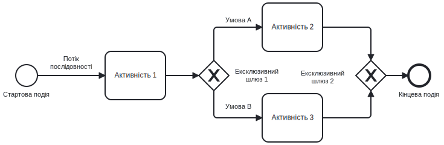
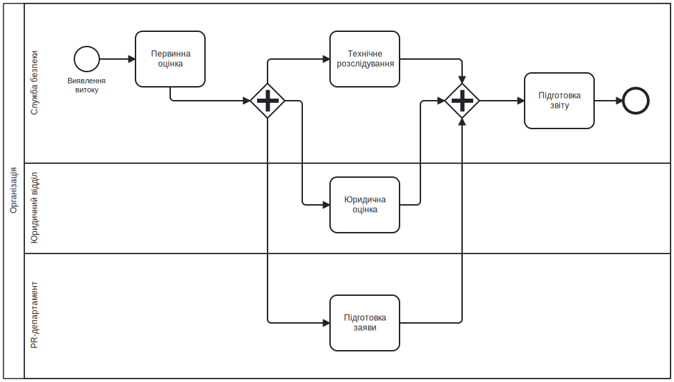
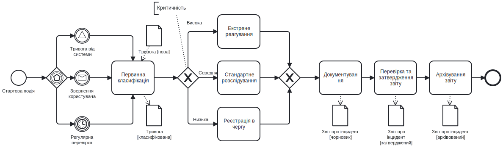

# Лекція 02 Нотація BPMN 2.0

## Вступ

Моделювання бізнес-процесів потребує уніфікованої мови, яка дозволяє однозначно та зрозуміло відображати складні робочі потоки. Протягом еволюції процесного підходу виникали різноманітні нотації та методи графічного опису діяльності, проте саме BPMN стала стандартом де-факто завдяки виразності, строгості та широкій підтримці інструментальних засобів.

Business Process Model and Notation у версії 2.0 представляє потужну мову моделювання, яка поєднує інтуїтивність для бізнес-аналітиків із точністю, необхідною для технічної реалізації. Ця лекція розкриває структуру стандарту, детально описує елементи нотації та демонструє практичне застосування для моделювання процесів у сфері кібербезпеки.

.png)

## Огляд стандарту BPMN

BPMN розроблена консорціумом Object Management Group як відкритий стандарт для моделювання бізнес-процесів. Перша версія з'явилася у 2004 році, суттєво вдосконалена версія 2.0 опублікована у 2011 році та залишається актуальною дотепер.

### Цілі та принципи стандарту

Фундаментальна мета BPMN полягає у створенні нотації, яка була б зрозумілою всім учасникам проєктів управління процесами. Бізнес-аналітики повинні мати можливість створювати високорівневі моделі без глибокого технічного знання. Розробники інформаційних систем потребують деталізації, достатньої для реалізації автоматизації. Керівники бізнесу очікують візуалізації, яка допомагає приймати стратегічні рішення. BPMN прагне задовольнити потреби всіх цих груп.

Принцип універсальності передбачає застосовність нотації для моделювання процесів будь-якої галузі та функціональної області. Від виробничих операцій до фінансових послуг, від охорони здоров'я до кібербезпеки, BPMN надає необхідні конструкції для точного опису діяльності.

Принцип виконуваності означає, що BPMN-моделі можуть безпосередньо виконуватися системами управління бізнес-процесами. Це передбачає формальну семантику елементів нотації, яка дозволяє однозначно інтерпретувати поведінку процесу. Модель стає не лише документацією, а й виконуваною специфікацією.

Принцип розширюваності забезпечує можливість адаптації стандарту до специфічних потреб організацій через механізми розширень. Базовий набір елементів покриває типові сценарії моделювання, додаткові атрибути дозволяють фіксувати галузеву специфіку без порушення сумісності.

### Рівні моделювання

BPMN підтримує три рівні деталізації моделей, які відповідають різним цілям та аудиторіям.

Описові моделі створюються для швидкого документування високорівневого потоку процесу. Вони використовують обмежений набір елементів, зосереджуються на послідовності основних дій, уникають технічних деталей. Описові моделі служать засобом комунікації між бізнесом та IT, основою для обговорення покращень процесу, вхідним артефактом для подальшої деталізації.

Аналітичні моделі розширюють описові додатковими елементами для повного відображення логіки процесу. Вони включають різноманітні типи подій, що ініціюють або переривають виконання, шлюзи для моделювання складних умов розгалуження, виключні ситуації та правила їх обробки. Аналітичні моделі дозволяють виявляти проблемні зони, симулювати поведінку процесу, оцінювати вплив змін.

Виконувані моделі містять всю інформацію, необхідну для автоматизованого виконання процесу в системі BPMS. Це включає технічні деталі викликів сервісів, відображення даних між системами, параметри маршрутизації завдань, інтеграційні специфікації. Виконувані моделі перетворюють бізнес-логіку на робочий програмний код.

У контексті навчання фокус робиться на аналітичних моделях, які забезпечують оптимальний баланс між виразністю та складністю для розуміння сутності процесів кібербезпеки.

### Структура специфікації

Специфікація BPMN 2.0 складається з кількох взаємопов'язаних частин, які разом визначають стандарт.

Мета-модель описує абстрактний синтаксис нотації через класи, атрибути та відношення між елементами. Вона визначає, які елементи можуть існувати в моделі, які властивості вони мають, як можуть з'єднуватися між собою. Мета-модель забезпечує формальну основу для валідації коректності моделей.

Графічна нотація встановлює візуальне представлення елементів мета-моделі. Кожен клас мета-моделі має відповідну графічну форму із визначеними атрибутами оформлення. Стандартизація зовнішнього вигляду елементів гарантує однакове сприйняття моделей різними інструментами та людьми.

Семантика виконання визначає точне значення елементів в контексті виконання процесу. Вона специфікує поведінку потоку управління, обробку даних, реакцію на події, правила інстанціювання. Формальна семантика дозволяє різним BPMS-системам виконувати BPMN-моделі консистентним чином.

Формат обміну BPMN XML забезпечує переносимість моделей між різними інструментами. Це дозволяє створити модель в одному редакторі, виконати в іншій системі, проаналізувати третім інструментом без втрати інформації.

## Базові елементи BPMN

Нотація оперує чотирма категоріями базових елементів, які в комбінації дозволяють моделювати процеси будь-якої складності.

[👉 Переглянути повну нотацію](https://processmind.com/resources/BPMNPoster/BPMN2_0_Poster_UA.pdf)

### Події (Event)

Події представляють щось, що відбувається під час виконання процесу. Вони впливають на потік процесу, зазвичай мають причину або наслідок. Події графічно зображуються колами з різними маркерами всередині залежно від типу.

За позицією в процесі розрізняють стартові, проміжні та кінцеві події. Стартова подія ініціює виконання процесу або підпроцесу. Графічно вона зображується колом з тонким контуром. Проміжна подія відбувається між початком та завершенням процесу, впливає на потік виконання. Графічно це коло з подвійним контуром. Кінцева подія означає завершення процесу або гілки виконання. Графічно це коло з товстим контуром.

За механізмом дії події поділяються на такі, що кидають сигнали, та такі, що їх ловлять. Події, що ловлять, очікують виникнення певної умови або отримання повідомлення. Події, що кидають, генерують результат або повідомлення. Ця відмінність графічно позначається порожнім або заповненим маркером всередині кола.

Типи подій визначаються їх тригерами. Подія повідомлення представляє отримання або відправлення повідомлення між учасниками процесу. Графічний маркер це конверт. Подія таймера ініціюється досягненням певного моменту часу або закінченням інтервалу. Маркер годинник. Подія помилки сигналізує виникнення виключної ситуації, що вимагає обробки. Маркер блискавка. Подія умови активується досягненням певного стану даних. Маркер документ з галочкою.

Розглянемо приклад моделювання початку процесу реагування на інцидент інформаційної безпеки. Стартовою подією може бути повідомлення від системи моніторингу про виявлену аномалію. Графічно це коло з тонким контуром, всередині якого міститься маркер конверта. Альтернативно, процес може ініціюватися таймером, який запускає регулярну перевірку логів. В цьому випадку маркером буде годинник.

### Активності (Activity)

Активності представляють роботу, яка виконується в процесі. Вони споживають час та ресурси, перетворюють входи на виходи. Графічно активності зображуються прямокутниками з округленими кутами.

Базовим типом активності є задача, що представляє атомарну одиницю роботи, яка не деталізується далі в межах поточного рівня моделі. Задачі можуть мати різну природу залежно від способу виконання. Користувацька задача виконується людиною з використанням програмного додатку. Сервісна задача виконується автоматизовано через виклик веб-сервісу або програмного компонента. Скриптова задача виконує код безпосередньо в рушії процесів. Задача відправлення надсилає повідомлення зовнішньому учаснику. Задача отримання очікує вхідне повідомлення.

Підпроцес являє собою складову активність, яка містить внутрішній деталізований потік. Це дозволяє структурувати складні процеси ієрархічно, приховувати деталі на високому рівні, повторно використовувати спільні фрагменти логіки. Графічно підпроцес зображується прямокутником з маркером плюса, який вказує на наявність внутрішньої структури.

Спеціальні типи підпроцесів включають транзакцію, що гарантує атомарність виконання групи активностей з можливістю компенсації у разі відміни, та Ad-hoc підпроцес, який дозволяє учасникам гнучко визначати послідовність виконання активностей.

У процесі аналізу інциденту безпеки активність глибокого технічного розслідування доцільно моделювати як підпроцес. На верхньому рівні це одна активність, всередині якої деталізується послідовність дій збір артефактів, аналіз малварі, вивчення мережевого трафіку, кореляція подій, формування звіту. Така ієрархічна структура спрощує сприйняття загального потоку без втрати важливих деталей.

### Шлюзи (Gateway)

Шлюзи контролюють розгалуження та злиття потоків виконання в процесі. Вони визначають, як процес реагує на умови, як обробляє паралельні шляхи. Графічно шлюзи зображуються ромбами з маркерами всередині.

Ексклюзивний шлюз створює розгалуження, де виконується тільки один з можливих шляхів залежно від умови. Це аналог конструкції if-then-else у програмуванні. При злитті ексклюзивний шлюз очікує на прибуття токена з будь-якого вхідного потоку, після чого продовжує виконання. Графічний маркер порожній ромб або ромб з хрестиком.

Паралельний шлюз створює розгалуження, де всі вихідні потоки виконуються одночасно. При злитті він очікує прибуття токенів з усіх вхідних потоків перед продовженням. Це дозволяє моделювати паралельне виконання незалежних активностей. Маркер плюс.

Інклюзивний шлюз являє комбінацію властивостей ексклюзивного та паралельного. При розгалуженні він активує один або більше вихідних потоків залежно від виконання умов. При злитті він очікує на прибуття токенів тільки з тих потоків, які були активовані. Маркер коло.

Складний шлюз використовується для нестандартних сценаріїв синхронізації, де поведінка визначається складною логічною умовою. Маркер зірочка.

Подієвий шлюз створює ексклюзивне розгалуження на основі подій, а не умов даних. Виконується той шлях, подія якого відбулася першою. Інші події відкидаються. Маркер багатокутник.

Моделюючи процес класифікації інциденту безпеки, використовуємо ексклюзивний шлюз для розгалуження потоку залежно від критичності. Після активності оцінка критичності йде ексклюзивний шлюз з трьома вихідними потоками низька, середня, висока критичність. Кожен потік веде до відповідної процедури обробки. Умови на потоках базуються на значенні атрибута даних критичність.

Для моделювання паралельного збору доказів використовуємо паралельний шлюз. Після ініціації розслідування процес розгалужується на три паралельні гілки аналіз логів, дослідження зразків коду, опитування свідків. Всі три активності виконуються незалежно та одночасно. Наступний паралельний шлюз злиття очікує завершення всіх трьох гілок перед переходом до консолідації результатів.

### Потоки (Flow)

Потоки з'єднують елементи процесу, визначають порядок виконання та рух інформації. Розрізняють три типи потоків.

Потік послідовності показує порядок виконання активностей та подій в межах одного процесу. Він визначає, яка активність виконується після завершення попередньої. Графічно це суцільна лінія зі стрілкою. Потік послідовності може мати умову, яка визначає, чи буде він активований. Умовні потоки виходять з шлюзів або активностей.

Потік повідомлень показує обмін повідомленнями між різними учасниками процесу, які представлені окремими пулами. Повідомлення перетинає межі організаційних одиниць або систем. Графічно це пунктирна лінія зі стрілкою.

Асоціація з'єднує артефакти з елементами процесу для додаткової документації. Вона не впливає на потік виконання, лише надає контекстну інформацію. Графічно це точкова лінія.

Правила використання потоків включають обмеження на типи елементів, які можуть з'єднуватися. Потік послідовності не може перетинати межі пулів. Події не можуть бути джерелом потоку повідомлень. Кінцеві події не можуть мати вихідних потоків послідовності.

## Swimlanes: Pool та Lane

Swimlanes надають механізм для організації елементів процесу за організаційними або функціональними межами. Вони створюють візуальну структуру, яка показує розподіл відповідальності та взаємодію між учасниками.

### Пули

Пул представляє учасника процесу, який може бути організацією, організаційною роллю або системою. Кожен пул містить окремий процес з власними елементами. Графічно пул це великий прямокутник, який охоплює всі елементи процесу даного учасника.

Пули використовуються для моделювання взаємодії між різними сторонами. Наприклад, процес обробки заявки на доступ до системи може включати два пули співробітник, який подає заявку, та служба безпеки, яка її обробляє. Кожен пул має власний потік активностей. Взаємодія між пулами відбувається через потоки повідомлень.

Чорний ящик пул представляє зовнішнього учасника, внутрішній процес якого не моделюється або невідомий. Він зображується порожнім прямокутником з назвою. Такі пули використовуються для показу контексту взаємодії без розкриття деталей зовнішніх систем.

Білий ящик пул містить повністю змодельований процес з усіма елементами активностями, подіями, шлюзами. Це дозволяє деталізувати внутрішню логіку учасника.

Важливе обмеження стандарту полягає в тому, що потоки послідовності не можуть перетинати межі пулів. Взаємодія між пулами виключно через повідомлення. Це відображає реальність, де різні організації або системи координуються через обмін даними, а не прямим управлінням внутрішніми процесами одне одного.

### Доріжки

Доріжка це підрозділ пулу, який групує активності за певним критерієм, зазвичай за організаційною роллю або відповідальністю. Графічно доріжка це горизонтальна або вертикальна секція всередині пулу з власною міткою.

Доріжки дозволяють показати, хто виконує конкретні активності без створення окремих пулів. Це зручно для моделювання внутрішньої структури організації або системи. Наприклад, процес управління інцидентами в службі безпеки може включати доріжки аналітик першої лінії, аналітик другої лінії, керівник служби безпеки.

Активності розміщуються в тій доріжці, яка відповідає виконавцю. Потоки послідовності вільно перетинають межі доріжок всередині одного пулу, показуючи передачу роботи між ролями. Візуально це створює чітку картину розподілу відповідальності та координації дій.

Множинні рівні доріжок дозволяють моделювати складнішу організаційну структуру. Наприклад, верхній рівень може представляти департаменти, нижній рівень ролі всередині департаментів. Проте надмірна складність ієрархії доріжок може ускладнити читабельність моделі.

Розглянемо моделювання процесу реагування на витік даних. Створюємо пул Організація з трьома доріжками Служба безпеки, Юридичний відділ, PR-департамент. Стартова подія виявлення витоку розміщується в доріжці Служба безпеки. Активність первинна оцінка масштабу також там. Далі потік розгалужується паралельним шлюзом на три гілки. Перша гілка технічне розслідування залишається в доріжці Служби безпеки. Друга гілка юридична оцінка наслідків переходить в доріжку Юридичного відділу. Третя гілка підготовка публічної заяви йде до доріжки PR-департаменту. Після виконання всіх трьох паралельних гілок відбувається злиття, та контроль переходить до активності підготовка звіту для керівництва в доріжці Служби безпеки.

## Артефакти та анотації

Артефакти надають додатковий контекст моделі без прямого впливу на потік виконання. Вони документують входи, виходи, правила, коментарі.

### Об'єкти даних

Об'єкт даних представляє інформацію, яка проходить через процес або яка необхідна для виконання активностей. Він моделює документи, записи баз даних, повідомлення. Графічно це прямокутник з складеним кутом, схожий на аркуш паперу.

Об'єкти даних можуть мати стани, які відображають еволюцію інформації протягом процесу. Наприклад, документ Звіт про інцидент може мати стани чорновик, на перевірці, затверджений. Стан показується в дужках під назвою об'єкта.

Зв'язок активності з об'єктом даних здійснюється через асоціації. Вхідна асоціація показує, що активність читає або використовує дані. Вихідна асоціація показує, що активність створює або модифікує дані. Графічно це пунктирна лінія від об'єкта до активності або навпаки.

Моделюючи процес аналізу вразливості, створюємо об'єкт даних Звіт сканера зі станами отриманий, проаналізований, архівований. Активність аналіз результатів сканування має вхідну асоціацію з об'єктом Звіт сканера у стані отриманий та вихідну асоціацію з тим же об'єктом у стані проаналізований. Наступна активність формування плану усунення має вхідну асоціацію з об'єктом у стані проаналізований.

### Сховища даних

Сховище даних представляє постійне місце збереження інформації, яке існує поза межами виконання окремого екземпляру процесу. Це бази даних, файлові системи, репозиторії документів. Графічно це циліндр, що нагадує іконку бази даних.

Активності можуть читати дані зі сховища або записувати туди. Це моделюється асоціаціями. На відміну від об'єктів даних, сховища зазвичай не мають станів, оскільки вони є контейнерами для множини записів.

У процесі управління доступом можна змоделювати сховище даних Active Directory, з якого активність перевірка поточних прав читає інформацію, та в яке активність надання доступу записує зміни.

### Групи та текстові анотації

Група візуально об'єднує набір елементів процесу для документаційних цілей без зміни семантики. Графічно це пунктирний прямокутник навколо елементів. Групи можуть використовуватися для виділення фаз процесу, категорій активностей, зон відповідальності.

Текстова анотація додає текстові коментарі до елементів моделі. Вона пояснює призначення, обґрунтовує рішення, фіксує припущення. Графічно це прямокутник з текстом, з'єднаний асоціацією з відповідним елементом.

Анотації особливо корисні для документування складних бізнес-правил, що визначають умови на шлюзах, для пояснення виключних ситуацій, для фіксації зовнішніх обмежень та вимог.

## Практичні приклади моделювання

Застосування нотації BPMN для моделювання реальних процесів кібербезпеки демонструє потужність та гнучкість стандарту.

### Процес обробки запиту на доступ

Розглянемо детальну модель процесу обробки запиту співробітника на доступ до інформаційної системи. Цей процес включає взаємодію кількох ролей та автоматизованих систем.

Процес ініціюється стартовою подією отримання запиту від співробітника. Перша активність автоматична перевірка коректності заповнення форми виконується системою. Це сервісна задача, яка викликає валідаційний сервіс. Наступний ексклюзивний шлюз перевіряє результат валідації. Якщо форма заповнена некоректно, потік йде до активності повернення запиту на доопрацювання, яка відправляє повідомлення співробітнику. Далі проміжна подія очікування виправленого запиту, після отримання якого потік повертається до початку.

Якщо валідація пройшла успішно, потік продовжується до активності перевірка необхідності підтвердження керівника. Це бізнес-правило, яке залежить від типу запитуваного доступу. Черговий ексклюзивний шлюз розгалужує потік. Для привілейованого доступу потік йде до користувацької задачі підтвердження керівником, яка призначається безпосередньому керівнику співробітника в системі управління завданнями. Після підтвердження або у випадку стандартного доступу потік продовжується.

Наступна активність технічна перевірка можливості надання доступу виконується адміністратором системи. Це користувацька задача, яка включає перевірку ліцензій, відповідності політикам безпеки, технічних обмежень. Адміністратор приймає рішення схвалити або відхилити запит.

Ексклюзивний шлюз розгалужує потік за рішенням. У разі відхилення потік йде до активності повідомлення співробітника про відмову та кінцевої події. У разі схвалення виконується автоматична активність створення облікового запису або модифікація прав, яка викликає API системи управління ідентифікацією.

Після успішного виконання технічних змін запускається паралельний шлюз, який розгалужує потік на дві гілки. Перша гілка активність відправлення повідомлення співробітнику про надання доступу. Друга гілка активність реєстрація зміни в системі аудиту. Обидві гілки зливаються паралельним шлюзом, після чого настає кінцева подія завершення процесу.

Ця модель використовує доріжки для розподілу відповідальності. Доріжка Система для автоматичних активностей валідації та створення облікових записів. Доріжка Керівник для задачі підтвердження. Доріжка Адміністратор для технічної перевірки. Потоки повідомлень з'єднують активності відправлення повідомлень з пулом Співробітник, який показаний як чорний ящик.

### Процес реагування на інцидент безпеки

Моделювання процесу реагування на інцидент демонструє використання подій, підпроцесів та обробку виключень.

Процес може бути ініційований різними стартовими подіями, що моделюється через подієвий шлюз. Перша подія повідомлення від системи моніторингу про підозрілу активність. Друга подія таймер для регулярної перевірки черги тривог. Третя подія повідомлення від користувача про можливий інцидент. Подієва природа шлюзу означає, що процес запуститься при першій події, що відбулася.

Після старту виконується активність первинна класифікація інциденту. Це користувацька задача аналітика першої лінії, який визначає тип інциденту та критичність. На основі критичності ексклюзивний шлюзи спрямовує потік до різних гілок обробки.

Для інцидентів високої критичності потік йде до підпроцесу екстрене реагування. Цей підпроцес містить паралельні активності ізоляція скомпрометованих систем, збір волатильних доказів, повідомлення керівництва. Всередині підпроцесу також моделюється межова подія таймера, яка запускається, якщо ізоляція не завершилася протягом 15 хвилин. У цьому випадку ініціюється виключна гілка ескалація до вищого керівництва.

Для інцидентів середньої критичності виконується стандартна активність розслідування аналітиком другої лінії. Для інцидентів низької критичності активність реєстрація для подальшого аналізу та поміщення в чергу.

Після завершення відповідних гілок обробки потоки зливаються інклюзивним шлюзом, оскільки може виконуватися одна або більше гілок залежно від ситуації. Далі виконується активність документування інциденту та актуалізація бази знань.

Кінцева подія може бути різних типів. Звичайна кінцева подія для успішно вирішеного інциденту. Кінцева подія помилки, якщо виявилося неможливим ідентифікувати джерело загрози. Така подія може ініціювати компенсаційні дії на вищому рівні процесу, наприклад, запуск розширеного аудиту безпеки.

Модель використовує об'єкти даних для показу документів, що проходять через процес. Об'єкт Тривога зі станами нова, класифікована, закрита. Об'єкт Звіт про інцидент зі станами чорновик, затверджений, архівований. Асоціації показують, які активності читають або створюють ці документи.

### Процес управління вразливостями

Модель процесу управління вразливостями ілюструює циклічну природу безперервного моніторингу та покращення.

Стартова подія таймер запускає процес щотижня для регулярного сканування. Перша активність автоматичне сканування мережі це сервісна задача, яка викликає сканер вразливостей. Результати сканування зберігаються в об'єкті даних Результати сканування зі станом необроблені.

Наступна активність аналіз та пріоритизація вразливостей виконується аналітиком безпеки. Це користувацька задача, яка включає співставлення виявлених вразливостей з базами даних загроз, оцінку ризику для конкретного середовища, встановлення пріоритетів усунення. Результатом є об'єкт даних План усунення вразливостей.

Далі відбувається розгалуження на кілька паралельних потоків за категоріями вразливостей. Кожна категорія має власну гілку обробки з відповідальним підрозділом. Критичні вразливості в доріжці Служби безпеки, системні вразливості в доріжці ІТ-департаменту, вразливості додатків в доріжці Розробки. Кожна гілка включає активності усунення вразливостей відповідного типу.

Важливий аспект моделі це використання межової події для моделювання ескалації при порушенні термінів. До активності усунення критичної вразливості приєднується межова подія таймера з інтервалом 48 годин. Якщо усунення не завершилося протягом цього часу, межова подія перериває нормальний потік та запускає виключну гілку ескалація до керівництва та призначення додаткових ресурсів.

Після завершення всіх паралельних гілок усунення виконується активність верифікаційне сканування для підтвердження усунення вразливостей. Результат перевіряється ексклюзивним шлюзом. Якщо вразливості залишилися, потік повертається до активності аналізу для коригування плану. Це моделюється зворотнім потоком послідовності, який створює цикл.

Якщо верифікація підтвердила успішне усунення, виконується фінальна активність оновлення реєстру вразливостей та формування метрик для керівництва. Процес завершується до наступного циклу сканування.

Модель демонструє використання сховища даних База даних вразливостей, з якої читається історична інформація під час аналізу та в яку записуються результати для тренд-аналізу.

## Розширені концепції

Стандарт BPMN надає додаткові можливості для моделювання складних сценаріїв виконання.

### Обробка виключень

Реальні процеси часто стикаються з непередбаченими ситуаціями, які потребують спеціальної обробки. BPMN пропонує кілька механізмів моделювання виключень.

Межові події приєднуються до активності або підпроцесу та моніторять виникнення певних умов під час їх виконання. Вони можуть бути переривальними або непереривальними. Переривальна межова подія зупиняє виконання основної активності та передає управління виключній гілці. Непереривальна дозволяє основній активності продовжити виконання паралельно з обробкою події.

Графічно переривальна межова подія зображується суцільним колом на межі активності, непереривальна пунктирним колом. Типи межових подій включають таймер для обмеження часу виконання, помилку для обробки виключних ситуацій, сигнал для реагування на зовнішні події, умову для моніторингу стану даних.

Подія помилки сигналізує про виникнення виключної ситуації, яка не може бути оброблена в межах активності. Вона може бути кинута з активності або підпроцесу та спіймана межовою подією помилки на вищому рівні. Це дозволяє моделювати централізовану обробку помилок.

Компенсація використовується для скасування ефектів вже виконаних активностей у разі необхідності відкату транзакції. Активності можуть мати приєднані компенсаційні обробники, які виконуються у зворотному порядку при ініціюванні компенсації.

### Під-процеси та повторне використання

Складні процеси доцільно структурувати ієрархічно, виділяючи спільні фрагменти для повторного використання.

Згорнутий підпроцес інкапсулює деталі виконання, показуючи на діаграмі лише одну активність з маркером плюса. Розгорнутий підпроцес показує всю внутрішню структуру безпосередньо на діаграмі. Вибір між згорнутим та розгорнутим представленням залежить від необхідного рівня деталізації для конкретної аудиторії.

Викликаний підпроцес або глобальна задача дозволяє визначити багаторазово використовувану логіку в одному місці та посилатися на неї з різних процесів. Це сприяє консистентності, спрощує підтримку, зменшує дублювання моделей. Викликана активність графічно має товстий контур.

Ad-hoc підпроцес дає гнучкість виконавцям у визначенні послідовності та необхідності виконання активностей. Він підходить для моделювання творчих або експертних процесів, де жорстка послідовність неприйнятна.

### Транзакції

Транзакційний підпроцес гарантує атомарність виконання групи активностей. Всі активності всередині транзакції повинні успішно завершитися, інакше транзакція відкочується. Графічно це підпроцес з подвійним контуром.

Транзакції корисні для моделювання бізнес-операцій, які потребують узгодженості стану, наприклад, фінансових транзакцій, процесів замовлення з резервуванням ресурсів, операцій з критичними даними.

Механізм компенсації дозволяє визначити дії для відміни ефектів активностей при відкоті транзакції. Кожна активність в транзакції може мати асоційовану компенсаційну активність, яка виконується у зворотному порядку.

## Рекомендації щодо моделювання

Ефективне використання BPMN вимагає дотримання певних практик та принципів.

### Рівні деталізації

Вибір відповідного рівня деталізації критичний для успіху моделювання. Надмірна деталізація створює складні, нечитабельні діаграми. Недостатня деталізація не дає необхідної інформації для аналізу чи автоматизації.

Для стратегічного рівня керівництва достатньо високорівневих моделей з основними етапами процесу без технічних деталей. Для операційного рівня виконавців потрібні детальні інструкції з усіма варіантами та виключеннями. Для технічної реалізації необхідна повна специфікація з параметрами викликів сервісів та відображенням даних.

Рекомендується створювати ієрархію моделей від високорівневого огляду до деталізованих підпроцесів. Кожен рівень моделі має свою аудиторію та мету.

### Найменування елементів

Назви елементів моделі повинні бути зрозумілими, несуперечливими, описовими. Активності іменуються дієсловом з об'єктом, наприклад, перевірити права доступу, сформувати звіт, повідомити користувача. Події іменуються іменниками, що описують стан або подію, наприклад, запит отримано, термін минув, помилка виявлена.

Використання єдиної термінології в усій організації забезпечує консистентність моделей. Глосарій бізнес-термінів допомагає уникнути непорозумінь.

### Валідація моделей

Моделі повинні перевірятися на синтаксичну та семантичну коректність. Синтаксична валідація перевіряє дотримання правил нотації, коректність з'єднань, повноту обов'язкових атрибутів. Семантична валідація аналізує логічну правильність потоків, відсутність тупиків, досяжність всіх гілок.

Сучасні інструменти моделювання надають автоматичну валідацію, яка виявляє типові помилки. Проте логічна коректність вимагає експертного перегляду.

Перевірка моделі з виконавцями процесу підтверджує відповідність реальній практиці, виявляє пропущені сценарії, коригує неточності.

## Висновки

Нотація BPMN 2.0 надає потужний, стандартизований інструментарій для моделювання бізнес-процесів будь-якої складності. Чіткий набір графічних елементів з формально визначеною семантикою забезпечує однозначне розуміння моделей різними зацікавленими сторонами та можливість автоматизованого виконання.

Базові елементи події, активності, шлюзи, потоки в комбінації дозволяють моделювати послідовні, паралельні, умовні, циклічні потоки виконання. Swimlanes структурують процеси за організаційними межами, показують розподіл відповідальності та взаємодію учасників. Артефакти додають контекстну інформацію без ускладнення потоку.

Для фахівців з кібербезпеки володіння BPMN відкриває можливості точного документування процесів управління інцидентами, вразливостями, доступом, забезпечення непереривності. Моделі стають основою для аналізу ефективності, виявлення вузьких місць, обґрунтування автоматизації. Вони створюють спільну мову для комунікації з бізнесом, що є критичним для інтеграції безпеки в діяльність організації.

Практичне застосування нотації вимагає балансу між повнотою опису та зрозумілістю представлення. Ієрархічний підхід, коли складні процеси розбиваються на керовані фрагменти, дозволяє створювати моделі, придатні для різних рівнів деталізації та аудиторій.
