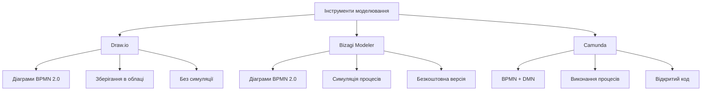
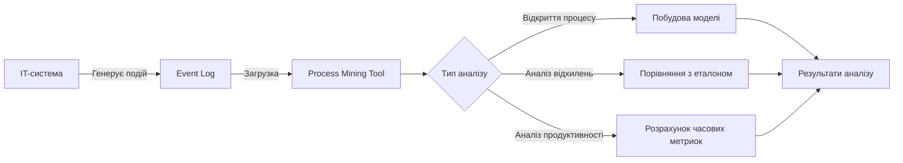
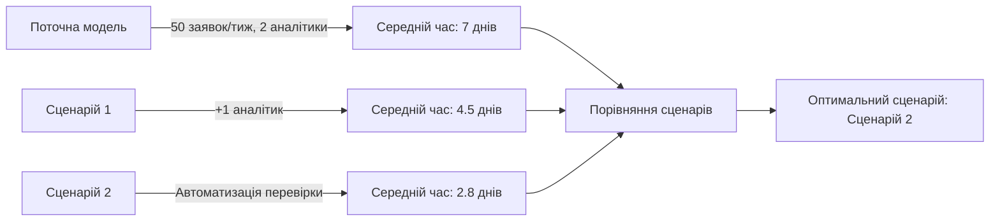
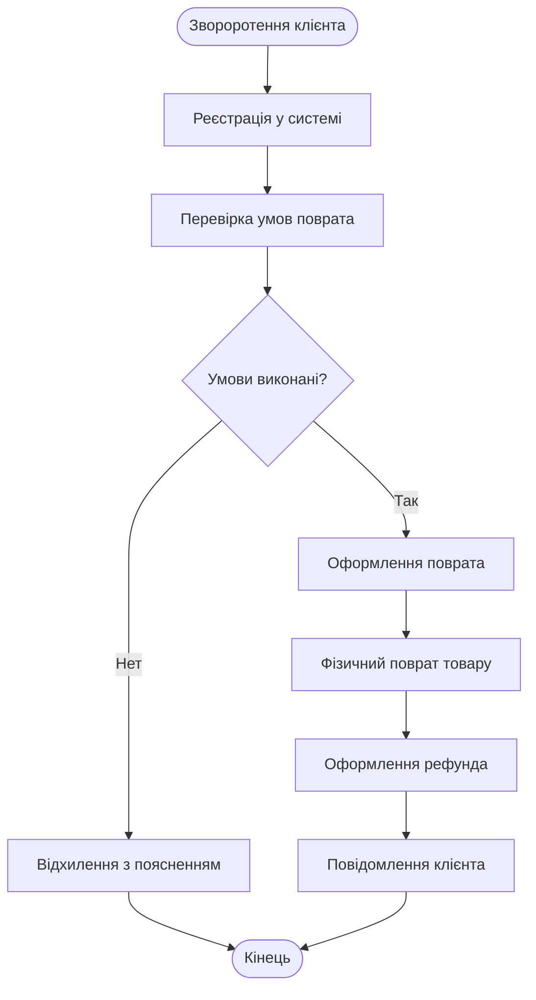

# Лекція 03 Інструменти моделювання та аналізу процесів

## 1. Огляд інструментів моделювання

На попередніх лекціях ми розглянули теоретичні основи бізнес-процесів та нотацію BPMN 2.0. Тепер настав час перейти від теорії до практики: ознайомимося з інструментами, за допомогою яких ці процеси моделюються, аналізуються та оптимізуються. Інструменти моделювання — це не просто редактори діаграм, вони являють собою повноциклові платформи, що підтримують весь ланцюг від створення моделі до її аналізу та впровадження.

Розглянемо три ключові інструменти, які широко використовуються в індустрії та доступні для навчальних цілей.

### Draw.io (diagrams.net)

Draw.io — безкоштовний інструмент для створення діаграм, що підтримує повну бібліотеку елементів BPMN 2.0. Він працює як у вебверсії, так і як настольний додаток, зберігає файли локально або в облачних сервісах (Google Drive, GitHub). Незважаючи на відносну простоту інтерфейсу, Draw.io достатньо потужний для створення складних моделей процесів, включаючи swimlanes, підпроцеси та кореляційні події. Основний недолік — відсутність встроєних аналітичних інструментів: діаграми створюються вручну, без можливості автоматичної генерації з даних.

### Bizagi Modeler

Bizagi Modeler — безкоштовна версія інструменту від компанії Bizagi, який є одним з провідних рішень для управління бізнес-процесами. Безкоштовна версія включає повноценний редактор BPMN 2.0 з підтримкою симуляції процесів. Bizagi дозволяє задавати часові характеристики для кожної задачі та моделювати альтернативні сценарії виконання процесу. Однак для повноценної інтеграції з IT-системами та автоматичної оптимізації потрібна платна версія.

### Camunda

Camunda — відкритий інструмент для управління бізнес-процесами та рішень, побудований на стандартах BPMN та DMN (Decision Model and Notation). Комунітейна версія включає потужний двигун виконання процесів, що дозволяє не просто моделювати, а і запускати процеси в продукційній середі. Camunda часто використовуються в IT-компаніях для автоматизації складних робочих процесів.

Порівняльна схема цих інструментів:

## 2. Process Mining: аналіз логів

Process Mining — це наукова дисципліна, що дозволяє відновлювати реальні процеси з даних, зібраних системами інформаційних технологій. Якщо моделювання процесів — це побудова тої моделі, яку ми хочемо видати за реальність, то Process Mining — це спосіб узнати, як процес насправді виконується, без будь-яких припущень або ідеалізацій.

### Джерела даних: event logs

Основним джерелом даних для Process Mining служить журнал подій (event log). Журнал подій — це структурований запис подій, що відбувались протягом виконання процесу. Кожна запис містить три мінімально необхідні поля: case ID, яким позначається окремий інстанс процесу; назва подій (activity), яка описує, що саме відбулось; та часова марка (timestamp), що фіксує момент подій.

Наприклад, журнал подій для процесу обробки заявок на відпустку може виглядати наступним чином:

| Case ID | Activity | Timestamp |
|---|---|---|
| 101 | Подача заявки | 2024-03-01 09:00 |
| 101 | Перевірка графіку | 2024-03-01 10:30 |
| 102 | Подача заявки | 2024-03-01 11:00 |
| 101 | Затвердження руководителем | 2024-03-02 14:00 |
| 102 | Перевірка графіку | 2024-03-01 15:45 |
| 101 | Інформування HR | 2024-03-02 14:15 |
| 102 | Відхилення руководителем | 2024-03-03 09:10 |

З цього журналу можна відновити два окремих маршрути виконання процесу: для заявки 101 процес завершився успішно, а для заявки 102 — з відхиленням.

### Алгоритми відкриття процесів

Для автоматичного відновлення моделі процесу з журналу подій існує декілька алгоритмів:

Альфа-алгоритм — один з перших і найпростих алгоритмів відкриття процесів. Він аналізує порядок відповідей подій в журналі та будує граф процесу на основі відношень "до-після" між заходами. Однако альфа-алгоритм не справляється зі складними структурами, такими як паралельні або циклічні процеси.

Інтуітивний алгоритм (Inductive Miner) — більш сучасний підхід, який аналізує частоту різних маршрутів виконання та будує моделі на основі дерев процесів. Цей алгоритм здатний обробати складніші структури та генерує моделі, що гарантовано відповідають стандарту BPMN.

Схема процесу аналізу з використанням Process Mining:

### Типи аналізу в Process Mining

Process Mining включає три основних типи аналізу. Перший — відкриття процесу (process discovery), що ми описували вище: побудова моделі процесу з даних без будь-яких попередніх знань. Другий — аналіз відхилень (conformance checking): порівняння реального процесу з еталонною моделем для виявлення девіацій. Третій — аналіз продуктивності (performance analysis): розрахунок часових характеристик процесу, виявлення бутилнеків та точок зростання.

## 3. Симуляція процесів

Симуляція процесів — це метод аналізу, що дозволяє моделювати поведінку процесу при різних умовах без реального впровадження змін. За допомогою симуляції можна відповісти на ключові "а що, якщо" запитання: що відбудеться, якщо ми додаємо ще одного сотрудника до обробки заявок? Як зменшиться час обробки, якщо автоматизуємо перевірку документів?

### Принцип роботи симуляції

Симуляція працює на основі статистичних моделей. Для кожної задачі в процесі задаються параметри: середня тривалість виконання, розподіл часу (рівномірний, нормальний, exponential), вероятність різних маршрутів. Система потім генерує множину виконань процесу, моделюючи поведінку реальних учасників.

Ключові параметри для налаштування симуляції:

- кількість ресурсів (людей або систем), що задействовані в процесі;
- часовий розподіл для кожної задачі;
- інтенсивність потоку заявок (скільки нових запитів надходить за час);
- вероятності альтернативних маршрутів на шлюзах.

### Приклад сценарію симуляції

Розглянемо процес обробки кредитної заявки банку. В поточній моделі заявки обробляються двома аналітиками, середня час обробки — 3 дні, інтенсивність — 50 заявок на тиждень. Симуляція показує, що при такому навантаженні в системі накопичуються залишки, і середній час від подачі до рішення складає 7 днів.

Якщо в симуляції додати третього аналітика, час обробки скорочається до 4.5 днів. Якщо автоматизувати початкову перевірку документів (зменшивши час обробки кожної заявки з 3 до 1.5 днів), результат буде значно кращим — 2.8 дні — і при цьому не потрібна додаткова людина.

## 4. Розрахунок ефективності оптимізацій

Оптимізація процесу має смисл тільки тоді, коли ми можемо виміряти її ефект. Розрахунок ефективності оптимізацій — це ключовий крок в будь-якому проєкті по покращенню бізнес-процесів, і він повинен бути заснований на конкретних метриках, а не на довільних припущеннях.

### Основні метрики ефективності

Часові метрики включають cycle time — повний час виконання процесу від початку до кінця; waiting time — час, протягом якого процес "стоїть" в очереді або ожидає зовнішніх дій; та processing time — час активної роботи над завданням. Різниця між cycle time та processing time дає нам waiting time — тобто частку часу, яка витрачається не на роботу, а на ожидання.

Кількісні метрики включають кількість handoffs — передач відповідальності між учасниками; частоту помилок та повторних обробок; та кількість документів, задействованих в процесі.

Економічні метрики включають вартість обробки однієї заявки; загальну вартість процесу за період; та Return on Investment від проведених змін.

### Формули для розрахунку ефективності

Ефективність оптимізації можна розрахувати за допомогою декількох формул. Зниження часу обробки розрахується як відношення різниці між часом "до" та "після" оптимізації до часу "до":

Зниження часу (%) = (Час_до − Час_після) / Час_до × 100

Зниження вартості розрахується аналогічно:

Зниження вартості (%) = (Вартість_до − Вартість_після) / Вартість_до × 100

ROI (Return on Investment) від оптимізації розрахується як:

ROI (%) = (Заощаджені кошти за період − Інвестиції) / Інвестиції × 100

### Приклад розрахунку

Розглянемо процес оформлення командировки. До оптимізації цей процес включав 8 ручних кроків, cycle time складав 5 днів, вартість обробки однієї командировки (з урахуванням часу, витраченого сотрудником та менеджером) — 2,400 грн. Компанія обробляє в середньому 200 командировок на квартал.

Після оптимізації (автоматизація перевірки документів та автоматичних повідомлень) кількість ручних кроків зменшилась до 3, cycle time — до 1.5 дня, вартість — до 960 грн за заявку. Інвестиції в автоматизацію складали 50,000 грн.

Зниження часу: (5 − 1.5) / 5 × 100 = 70%.
Зниження вартості: (2400 − 960) / 2400 × 100 = 60%.
Заощаджені кошти за квартал: (2400 − 960) × 200 = 288,000 грн.
ROI: (288,000 − 50,000) / 50,000 × 100 = 476%.

Таким чином, інвестиції в автоматизацію окупаються протягом менше ніж одного кварталу.

## 5. Демонстрація створення моделі

Для закриття лекції на практичному прикладі покажемо повний цикл: від формулювання процесу до побудови моделі та її аналізу.

### Опис процесу: обробка зворотення клієнта

Розглянемо процес обробки зворотення клієнта в e-commerce компаній:

1. Клієнт звертається через вебсайт або email з запитом про поврат товару.
2. Система реєструє зворотення та присвоює номер.
3. Оператор перевірає статус замовлення та умови поврата.
4. Якщо умови виконані — процес продовжається до оформлення поврата; якщо ні — клієнту надсилається відхилення з поясненням.
5. Складка виконує фізичний поврат товару.
6. Бухгалтерія оформляє рефунд.
7. Клієнт отримує підтвердження рефунда.

### Аналіз процесу

Аналізуючи цей процес, можна вже на стадії моделювання виявити декілька проблем. По-перше, між реєстрацією зворотення та перевіркою умов немає обмеження часу — заявка може лежати тижнями. По-друге, фізичний поврат товару від клієнта до складки не включений в модель, хоча він часто стає бутилнеком. По-третє, бухгалтерія обробляє рефунди "в пакеті", а не по-одному, що додає затримку.

Ці проблеми можна вирішити за допомогою таких заходів: встановлення часових обмежень (таймери) на кожному кроці; включення кроку отримання товару на складці; автоматизації оформлення рефунда через API банку.

### Підсумки лекції

Ми розглянули основні інструменти моделювання процесів та їх можливості, зрозуміли принцип Process Mining та як він дозволяє відновлювати реальні процеси з даних, ознайомились з симуляцією процесів та її значенням для прийняття рішень, а також навчились розрахувати ефективність оптимізацій на конкретних прикладах. На наступній лекції ми перейдемо до ERP та CRM систем — платформам, що автоматизують бізнес-процеси на рівні цілої організації.
