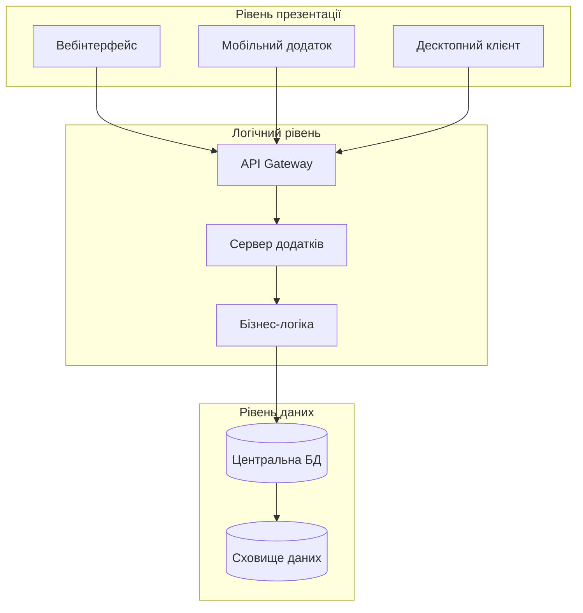
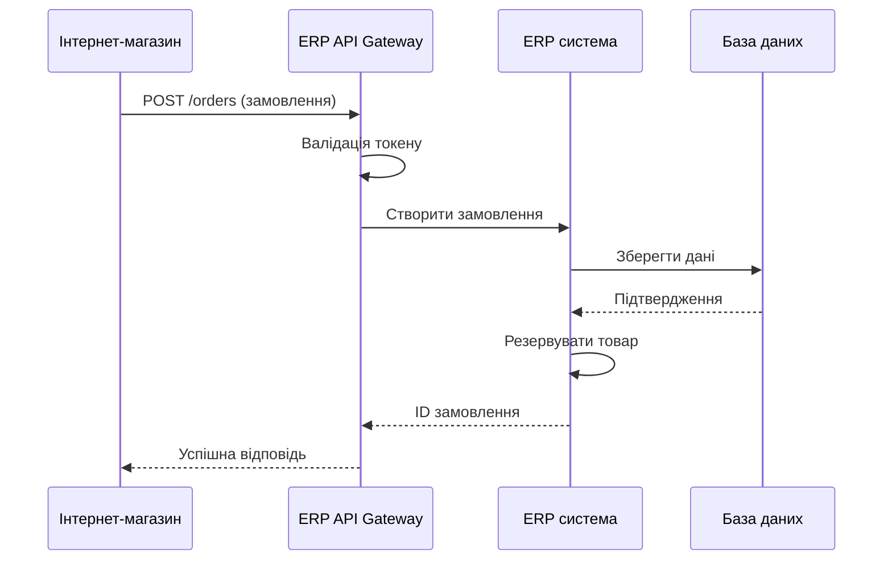
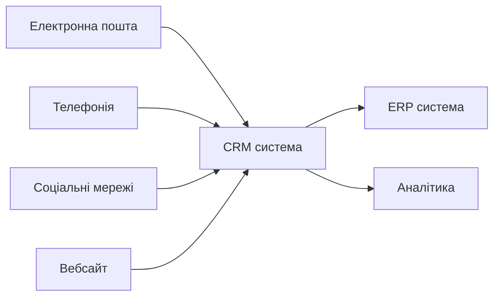

# Лекція 04 ERP та CRM системи

## Вступ

Сучасні організації щодня обробляють величезні обсяги інформації: замовлення клієнтів, фінансові операції, управління запасами, взаємодія з постачальниками. Без автоматизації ці процеси стають джерелом помилок, затримок та неефективності. Саме для вирішення цих проблем були розроблені корпоративні інформаційні системи. У цій лекції ми розглянемо дві ключові категорії таких систем: ERP (Enterprise Resource Planning) та CRM (Customer Relationship Management). Ці технології не просто автоматизують окремі завдання, вони трансформують весь підхід до управління бізнесом, створюючи єдиний інформаційний простір для всіх підрозділів організації.

Розуміння архітектури, можливостей та особливостей впровадження ERP і CRM систем є критично важливим для фахівців з кібербезпеки. Адже саме ці системи зберігають найбільш цінні дані організації, і їхній захист стає пріоритетним завданням. Крім того, процес впровадження таких систем супроводжується численними ризиками безпеки, які необхідно передбачити та мінімізувати.

## Частина 1: ERP системи

### Що таке ERP система

ERP (Enterprise Resource Planning) система являє собою інтегроване програмне рішення, яке об'єднує всі ключові бізнес-процеси організації в єдину інформаційну систему. Основна ідея ERP полягає в централізації даних: замість десятків окремих програм для бухгалтерії, складу, продажів та виробництва використовується одна система з єдиною базою даних.

Історично ERP системи виникли як еволюція MRP (Material Requirements Planning) систем, які у 1960-х роках використовувалися виключно для планування матеріальних потреб виробництва. З часом функціонал розширився, охопивши фінанси, персонал, логістику та інші аспекти управління підприємством. Сучасні ERP системи стали платформами для цифрової трансформації бізнесу.

Ключові принципи роботи ERP включають єдину базу даних, модульну архітектуру та інтеграцію процесів. Коли менеджер з продажу створює замовлення в системі, ця інформація автоматично стає доступною відділу логістики для планування відвантаження, бухгалтерії для виставлення рахунку, а складу для резервування товару. Такий підхід усуває дублювання даних та мінімізує ймовірність помилок.

### Архітектура ERP систем

Типова архітектура ERP системи базується на трирівневій моделі. Рівень презентації забезпечує інтерфейс користувача, який може бути реалізований як вебдодаток, десктопний клієнт або мобільний застосунок. Логічний рівень містить бізнес-логіку системи: правила обробки транзакцій, розрахунки, валідацію даних. Рівень даних включає систему управління базами даних, де зберігається вся корпоративна інформація.

Сучасні ERP системи часто використовують сервісно-орієнтовану архітектуру (SOA) або мікросервісний підхід. Це дозволяє окремі модулі розгортати незалежно, масштабувати відповідно до навантаження та оновлювати без зупинки всієї системи. Наприклад, модуль електронної комерції може обробляти тисячі запитів на секунду в пікові періоди, тоді як модуль управління персоналом працює зі значно меншим навантаженням.

Інтеграційна шина (Enterprise Service Bus) відіграє ключову роль в архітектурі, забезпечуючи взаємодію між модулями та зовнішніми системами. Вона обробляє перетворення форматів даних, маршрутизацію повідомлень та забезпечує надійність обміну інформацією.

### Основні модулі ERP

Фінансовий модуль є серцем будь-якої ERP системи. Він охоплює головну книгу, дебіторську та кредиторську заборгованість, управління активами, бюджетування та фінансову звітність. Цей модуль забезпечує відповідність бухгалтерським стандартам та нормативним вимогам. Наприклад, при проведенні оплати постачальнику система автоматично створює відповідні проводки, оновлює залишки на рахунках та відображає зміни в балансі.

Модуль управління ланцюгами постачання включає функції закупівель, управління складом, планування виробництва та логістики. Він дозволяє оптимізувати рівень запасів, автоматизувати процес замовлення у постачальників та відстежувати переміщення товарів від надходження до відвантаження клієнту. Сучасні системи використовують алгоритми машинного навчання для прогнозування попиту та оптимізації закупівель.

Модуль управління людськими ресурсами автоматизує процеси найму, обліку робочого часу, нарахування заробітної плати, управління компетенціями та розвитком персоналу. Інтеграція з фінансовим модулем забезпечує автоматичне відображення витрат на персонал у звітності. Модуль також може включати функціонал для оцінки ефективності співробітників та планування кар'єрного зростання.

Виробничий модуль підтримує планування виробництва, управління виробничими замовленнями, контроль якості та обслуговування обладнання. Він дозволяє розраховувати потреби в матеріалах, планувати завантаження виробничих потужностей та відстежувати виконання замовлень у реальному часі. Інтеграція з обладнанням через промислові протоколи дає можливість збирати дані безпосередньо з виробничої лінії.

Модуль продажів та маркетингу управляє процесом від лідогенерації до укладення угоди. Він включає управління контактами, можливостями продажу, ціноутворенням, знижками та програмами лояльності. Аналітика продажів допомагає виявляти тренди, найбільш прибуткові продукти та ефективні канали збуту.

### Приклади ERP систем

SAP S/4HANA є одним з лідерів ринку корпоративних систем. Ця система побудована на платформі in-memory обчислень HANA, що забезпечує обробку транзакцій та аналітику в реальному часі. SAP пропонує галузеві рішення для виробництва, роздрібної торгівлі, фінансових послуг та інших секторів. Система підтримує складні сценарії глобального бізнесу: мультивалютність, міжнародну звітність, управління розподіленими ланцюгами постачання. Основний недолік SAP полягає у високій вартості ліцензій та складності впровадження, що робить систему доступною переважно для великих корпорацій.

Oracle ERP Cloud пропонує комплексне хмарне рішення для управління фінансами, проєктами, закупівлями та ланцюгами постачання. Система інтегрується з іншими продуктами Oracle, включаючи базу даних та платформу для розробки додатків. Ключова перевага Oracle полягає в потужних аналітичних можливостях та штучному інтелекті для автоматизації рутинних завдань. Наприклад, система може автоматично категоризувати витрати, виявляти аномалії у фінансових операціях або рекомендувати оптимальні терміни оплати рахунків.

Microsoft Dynamics 365 об'єднує ERP та CRM функціонал в єдиній платформі. Тісна інтеграція з екосистемою Microsoft (Office 365, Azure, Power Platform) робить систему привабливою для організацій, які вже використовують продукти Microsoft. Dynamics 365 пропонує гнучку модель ліцензування, де компанія платить лише за використані модулі та кількість користувачів. Система підтримує розширення через Power Apps та автоматизацію через Power Automate.

Odoo є відкритою ERP системою з модульною архітектурою, яка включає понад 30 основних додатків: від CRM і електронної комерції до виробництва та обліку. Ключова перевага Odoo полягає у відсутності вартості ліцензій за базовий функціонал та можливості самостійної кастомізації. Система має велику спільноту розробників, які створюють додаткові модулі. Odoo підходить для малого та середнього бізнесу, хоча може масштабуватися для більших організацій. Community Edition є безкоштовною, а Enterprise Edition пропонує додатковий функціонал та підтримку.

### Інтеграція ERP з іншими системами

ERP система рідко функціонує ізольовано. Вона повинна обмінюватися даними з платіжними системами, банківськими API, електронними торговельними майданчиками, логістичними сервісами та багатьма іншими зовнішніми додатками. Інтеграція може реалізовуватися різними способами залежно від вимог до надійності, швидкості та обсягу даних.

REST API є найпопулярнішим методом інтеграції сучасних систем. ERP система надає набір endpoints для виконання операцій: створення замовлення, отримання інформації про клієнта, оновлення залишків на складі. Зовнішні системи можуть викликати ці API, передаючи дані у форматі JSON або XML. Автентифікація зазвичай реалізується через OAuth 2.0 або API ключі.

Messaging queues забезпечують асинхронну інтеграцію між системами. Коли ERP система створює рахунок, вона публікує повідомлення в чергу. Система електронної пошти читає це повідомлення та відправляє рахунок клієнту. Якщо поштовий сервіс тимчасово недоступний, повідомлення залишається в черзі до моменту обробки. Популярні рішення включають RabbitMQ, Apache Kafka та AWS SQS.

ETL процеси (Extract, Transform, Load) використовуються для масового перенесення даних між системами. Наприклад, щоночі фінансові дані з ERP експортуються в окреме сховище даних для аналітики. ETL інструменти забезпечують трансформацію форматів, валідацію та обробку помилок.

Веб-хуки дозволяють ERP системі надсилати події до зовнішніх систем в реальному часі. Коли статус замовлення змінюється на "відвантажено", система викликає вебхук, який сповіщає клієнта через SMS або push-повідомлення.

## Частина 2: CRM системи

### Що таке CRM система

CRM (Customer Relationship Management) система призначена для управління взаємодією з клієнтами на всіх етапах їхнього життєвого циклу. На відміну від ERP, яка фокусується на внутрішніх процесах організації, CRM орієнтована на зовнішні відносини: залучення потенційних клієнтів, підтримку поточних та повернення тих, хто пішов.

Основна цінність CRM полягає в централізації інформації про клієнтів. Замість ситуації, коли менеджер з продажу зберігає контакти у телефоні, маркетолог веде окрему базу, а служба підтримки використовує власну систему, вся інформація консолідується в єдиному місці. Це дозволяє бачити повну історію взаємодії: які листи отримував клієнт, які продукти купував, які проблеми виникали та як вони вирішувалися.

Сучасні CRM системи еволюціонували від простих баз даних контактів до складних платформ з автоматизацією маркетингу, аналітикою поведінки клієнтів та штучним інтелектом для прогнозування. Вони інтегруються з електронною поштою, телефонією, соціальними мережами та іншими каналами комунікації.

### Ключові функції CRM

Управління контактами та потенційними клієнтами є фундаментальною функцією CRM. Система зберігає інформацію про компанії та окремих осіб: контактні дані, посади, історію спілкування, джерело залучення. Ліди проходять через воронку продажів від першого контакту до укладення угоди. На кожному етапі менеджер виконує певні дії: відправляє комерційну пропозицію, проводить презентацію, узгоджує умови договору. CRM система автоматизує нагадування про необхідні дії та відстежує конверсію між етапами.

Автоматизація маркетингу дозволяє створювати персоналізовані кампанії на основі поведінки клієнтів. Наприклад, якщо клієнт відвідав сторінку певного продукту, але не зробив покупку, система автоматично надішле електронний лист зі знижкою на цей продукт. Сегментація аудиторії дає можливість групувати клієнтів за різними критеріями та надсилати релевантні повідомлення кожній групі. A/B тестування допомагає визначити найефективніші теми листів, час розсилки та креативи.

Управління продажами включає прогнозування виручки, відстеження виконання планів продажів та аналіз ефективності менеджерів. Система може автоматично призначати ліди менеджерам на основі географії, галузі клієнта або навантаження співробітника. Мобільний доступ дозволяє менеджерам оновлювати інформацію безпосередньо під час зустрічей з клієнтами.

Обслуговування клієнтів та тікет-система забезпечують централізоване управління запитами від клієнтів. Коли клієнт надсилає електронний лист або дзвонить у підтримку, автоматично створюється тікет. Система маршрутизує запит до відповідального спеціаліста, відстежує час обробки та SLA. База знань дозволяє клієнтам самостійно знаходити відповіді на типові питання, зменшуючи навантаження на службу підтримки.

Аналітика та звітність надають інсайти про ефективність маркетингу та продажів. Дашборди показують ключові метрики: конверсію лідів, середній чек, LTV (lifetime value) клієнта, вартість залучення. Когортний аналіз допомагає оцінити утримання клієнтів з різних каналів залучення. Прогнозна аналітика на основі машинного навчання визначає, які ліди мають найвищу ймовірність конверсії.

### Типи CRM систем

Операційні CRM фокусуються на автоматизації процесів взаємодії з клієнтами: продажу, маркетингу та обслуговування. Вони оптимізують щоденні операції та забезпечують ефективну комунікацію. Salesforce Sales Cloud, HubSpot CRM та Zoho CRM є прикладами операційних систем.

Аналітичні CRM призначені для глибокого аналізу даних про клієнтів. Вони використовують data mining, прогнозне моделювання та сегментацію для виявлення патернів поведінки. Такі системи допомагають визначити найприбутковіші сегменти клієнтів, передбачити відтік та оптимізувати маркетингові бюджети. Adobe Analytics та SAP Customer Experience включають потужні аналітичні можливості.

Колаборативні CRM забезпечують обмін інформацією про клієнтів між різними підрозділами організації. Вони усувають бар'єри між відділами продажів, маркетингу та підтримки, створюючи єдине розуміння потреб клієнта. Така система гарантує, що клієнт не отримає маркетинговий лист з пропозицією купити продукт, який він щойно придбав.

### Популярні CRM платформи

Salesforce є лідером ринку CRM з екосистемою тисяч додатків та інтеграцій. Платформа пропонує рішення для різних галузей та розмірів бізнесу. Sales Cloud автоматизує процес продажів, Service Cloud забезпечує обслуговування клієнтів, Marketing Cloud керує мультиканальними кампаніями. Унікальна перевага Salesforce полягає в можливості створення власних додатків без програмування через платформу Lightning. Система також пропонує Einstein AI для прогнозування продажів та рекомендацій.

HubSpot CRM надає безкоштовний базовий функціонал, що робить систему привабливою для стартапів та малого бізнесу. Платформа включає інструменти для маркетингу, продажів та обслуговування клієнтів. Інтеграція з вебсайтом дозволяє відстежувати поведінку відвідувачів та автоматично створювати контакти. HubSpot відомий простотою використання та швидким впровадженням. Платні версії додають функції автоматизації маркетингу, A/B тестування та просунутої аналітики.

Microsoft Dynamics 365 Customer Engagement об'єднує CRM з можливостями штучного інтелекту та інтеграцією з Office 365. Користувачі можуть працювати з даними клієнтів безпосередньо в Outlook, створювати звіти в Power BI та автоматизувати процеси через Power Automate. LinkedIn Sales Navigator інтегрується з Dynamics, надаючи інсайти про потенційних клієнтів з професійної мережі.

Pipedrive спрощує управління продажами через візуальну воронку угод. Система розроблена менеджерами з продажу для менеджерів, тому інтерфейс інтуїтивно зрозумілий. Автоматизація рутинних завдань та нагадування допомагають не втрачати потенційні угоди. Мобільний додаток дозволяє працювати з CRM під час зустрічей з клієнтами.

### Інтеграція CRM з іншими інструментами

Ефективність CRM системи значно зростає при інтеграції з іншими бізнес-додатками. Інтеграція з електронною поштою дозволяє автоматично зберігати всю кореспонденцію з клієнтами в системі. Коли менеджер відправляє лист потенційному клієнту з Gmail або Outlook, система автоматично прикріплює його до відповідного контакту. Шаблони листів та відстеження відкриттів допомагають оптимізувати комунікацію.

Телефонія інтеграція забезпечує автоматичне логування дзвінків, запис розмов та pop-up з інформацією про клієнта при вхідному дзвінку. Менеджер бачить всю історію взаємодії ще до того, як підняти слухавку. Click-to-call функція дозволяє дзвонити клієнтам безпосередньо з CRM інтерфейсу.

Соціальні мережі інтеграція агрегує взаємодію з клієнтами в Facebook, LinkedIn, Twitter та інших платформах. Коментарі, повідомлення та згадки бренду автоматично створюють завдання для відповідального менеджера. Соціальний профіль клієнта допомагає краще зрозуміти його інтереси та персоналізувати комунікацію.

Інтеграція з вебсайтом через чат-віджети, форми захоплення лідів та трекінг поведінки перетворює анонімних відвідувачів на ідентифікованих лідів. Система відстежує, які сторінки відвідував користувач, скільки часу провів на сайті та які дії виконав. Ця інформація допомагає менеджерам розуміти рівень зацікавленості та персоналізувати пропозицію.

## Частина 3: Вибір та впровадження систем

### Критерії вибору ERP/CRM системи

Вибір корпоративної інформаційної системи є стратегічним рішенням, яке впливає на організацію протягом багатьох років. Помилковий вибір може призвести до втрати мільйонів на невдале впровадження або необхідності міграції на іншу платформу.

Функціональні вимоги визначаються на основі бізнес-процесів організації. Необхідно детально описати, які процеси потребують автоматизації, які звіти необхідні менеджменту, які інтеграції критичні. Наприклад, виробнича компанія потребує потужного модуля планування виробництва, тоді як для торгової організації пріоритетом є управління запасами та логістика. Важливо оцінити, наскільки стандартний функціонал системи покриває потреби без значних кастомізацій.

Масштабованість системи забезпечує можливість зростання без необхідності заміни платформи. Якщо сьогодні компанія має 50 співробітників, але планує зростання до 500, система повинна підтримувати таке навантаження. Хмарні рішення зазвичай легше масштабуються порівняно з он-прем системами. Також важлива можливість додавання нових модулів у міру розвитку бізнесу.

Вартість володіння включає не лише ціну ліцензій, але й витрати на впровадження, навчання персоналу, підтримку та оновлення. Для он-прем систем додаються витрати на серверне обладнання, системних адміністраторів та резервне копіювання. Хмарні системи мають передбачувану місячну або річну вартість, але можуть бути дорожчими в довгостроковій перспективі. Необхідно розраховувати TCO (Total Cost of Ownership) на період 3-5 років.

Складність впровадження та час до отримання результатів варіюються між системами. Деякі рішення можна запустити за кілька тижнів, інші потребують років налаштування. Важливо реалістично оцінити ресурси організації та готовність до змін. Поетапне впровадження знижує ризики порівняно з big bang підходом.

Екосистема партнерів та доступність консультантів впливають на успіх впровадження. Для популярних платформ легше знайти кваліфікованих спеціалістів та готові рішення. Наявність локальних партнерів важлива для своєчасної підтримки та консультацій українською мовою.

Безпека та відповідність нормативним вимогам критичні для багатьох галузей. Система повинна підтримувати необхідні стандарти шифрування, управління доступом та аудит. Для компаній, що працюють з персональними даними, важлива відповідність GDPR. Фінансові організації потребують сертифікації за PCI DSS.

### Процес впровадження

Впровадження ERP або CRM системи є складним проєктом, що вимагає ретельного планування та управління змінами. Успішність впровадження залежить не стільки від технології, скільки від організаційних факторів.

Підготовча фаза включає формування проєктної команди, аналіз поточних процесів та формулювання вимог. Команда повинна включати представників всіх ключових підрозділів та зовнішніх консультантів. Документування процесів AS-IS допомагає виявити неефективності та визначити пріоритети автоматизації. На цьому етапі важливо отримати підтримку топ-менеджменту, оскільки опір змінам є основною причиною невдач.

Проєктування рішення передбачає налаштування системи під бізнес-процеси організації. Необхідно визначити баланс між адаптацією процесів під best practices системи та кастомізацією системи під поточні процеси. Надмірна кастомізація ускладнює оновлення та підтримку. Проєктування включає налаштування робочих процесів, звітів, інтеграцій та користувацьких ролей.

Міграція даних є критичним етапом, що часто недооцінюється. Необхідно очистити дані від дублікатів, виправити помилки та стандартизувати формати. Тестова міграція допомагає виявити проблеми до фінального переносу. Важливо визначити, які історичні дані мігрувати, оскільки перенесення всього архіву може бути недоцільним.

Навчання користувачів визначає, наскільки ефективно персонал використовуватиме нову систему. Навчання повинно бути ролевим: бухгалтери вивчають фінансовий модуль, менеджери з продажу фокусуються на CRM. Практичні вправи на реальних сценаріях ефективніші за теоретичні презентації. Створення внутрішніх суперюзерів, які можуть підтримувати колег, зменшує навантаження на IT відділ.

Тестування охоплює перевірку функціоналу, інтеграцій, продуктивності та безпеки. User acceptance testing (UAT) залучає кінцевих користувачів для валідації, що система відповідає їхнім потребам. Важливо тестувати не лише стандартні сценарії, але й edge cases.

Go-live та підтримка потребують ретельної підготовки. Можливі підходи включають big bang (одночасний перехід всієї організації), поетапний (впровадження по підрозділам або регіонах) та паралельний (тимчасова робота в двох системах). Після запуску критично важлива гаряча підтримка для швидкого вирішення проблем користувачів.

### Типові виклики впровадження

Опір змінам є найпоширенішою причиною невдач. Співробітники звикли до поточних процесів і можуть сприймати нову систему як загрозу або додаткову роботу. Комунікація переваг, залучення користувачів до процесу проєктування та швидкі перемоги допомагають подолати опір. Керівництво повинно демонструвати підтримку змін особистим прикладом.

Недооцінка складності проєкту призводить до перевитрат бюджету та затримок. Реалістичне планування з урахуванням ризиків та резервів часу знижує ймовірність невдачі. Agile підхід з ітеративним впровадженням дозволяє отримувати зворотний зв'язок та коригувати курс.

Проблеми з якістю даних виявляються під час міграції. Якщо поточні системи містять дублікати, застарілу або некоректну інформацію, це ускладнює перехід. Очищення даних потребує значних зусиль, але критично для успіху.

Недостатня інтеграція між модулями або зовнішніми системами створює інформаційні розриви. Користувачам доводиться вручну переносити дані між системами, що нівелює переваги автоматизації. Планування інтеграцій на ранніх етапах та виділення достатніх ресурсів для їхньої реалізації є необхідним.

Брак компетенцій у команді впровадження сповільнює проєкт. Інвестиції в навчання або залучення зовнішніх експертів окупаються через скорочення термінів та зменшення ризиків.

### Безпека при впровадженні ERP/CRM

Впровадження нової корпоративної системи створює численні ризики безпеки, які необхідно адресувати на всіх етапах проєкту. ERP та CRM системи зберігають найбільш цінні дані організації: фінансову інформацію, комерційні таємниці, персональні дані клієнтів та співробітників.

Управління доступом повинно базуватися на принципі найменших привілеїв. Кожен користувач отримує лише ті права, які необхідні для виконання його обов'язків. Рольова модель (RBAC) спрощує управління правами: замість налаштування для кожного користувача окремо, визначаються ролі з відповідними правами. Регулярний аудит прав доступу виявляє надлишкові дозволи, особливо після зміни посади або звільнення співробітників.

Шифрування даних захищає інформацію як при зберіганні, так і при передачі. Конфіденційні дані (номери кредитних карток, паспортні дані) повинні зберігатися в зашифрованому вигляді. HTTPS забезпечує захищену передачу даних між користувачем та системою. Для он-прем систем необхідно налаштувати шифрування дисків та резервних копій.

Аудит та моніторинг дій користувачів дозволяє виявляти підозрілу активність. Система повинна логувати всі критичні операції: зміни фінансових даних, експорт великих обсягів інформації, модифікацію прав доступу. SIEM система агрегує логи та аналізує їх на предмет аномалій. Регулярний перегляд логів допомагає виявити інсайдерські загрози.

Захист інтеграцій критичний, оскільки API часто стають вектором атак. Автентифікація API через токени, обмеження rate limits та валідація вхідних даних знижують ризики. Секретні ключі та паролі не повинні зберігатися в коді, використовуйте secrets management системи типу HashiCorp Vault.

Резервне копіювання та disaster recovery план забезпечують відновлення після інциденту. Регулярні бекапи повинні зберігатися в окремому місці, ізольованому від основної системи. Тестування процедур відновлення гарантує, що у критичний момент вони спрацюють.

## Частина 4: ROI від автоматизації

### Розрахунок економічного ефекту

Обгрунтування інвестицій в ERP або CRM систему вимагає чіткої демонстрації фінансової вигоди. ROI (Return on Investment) показує, наскільки інвестиція є прибутковою та за який період окупиться.

Базова формула ROI виглядає так: ROI = (Вигода - Витрати) / Витрати × 100%. Якщо впровадження системи коштувало 100000 доларів, а річна вигода становить 40000 доларів, то ROI = (40000 - 100000) / 100000 = -60% за перший рік. Проте за три роки сукупна вигода становитиме 120000 доларів, що дає позитивний ROI = 20%.

Витрати включають ліцензії на програмне забезпечення, вартість впровадження (консультанти, налаштування, розробка інтеграцій), навчання персоналу, апаратне забезпечення для он-прем систем, витрати на підтримку та оновлення. Для хмарних систем щомісячна абонентська плата множиться на кількість користувачів та додаткові модулі.

Вигоди поділяються на прямі (легко вимірювані) та непрямі (складніше квантифікувати). Прямі вигоди включають скорочення персоналу через автоматизацію, зменшення помилок у обліку, економію на паперових документах та друку, зменшення витрат на зберігання через оптимізацію запасів. Непрямі вигоди охоплюють покращення якості обслуговування клієнтів, швидшу обробку замовлень, кращу видимість бізнесу для прийняття рішень, зростання продажів через ефективніший CRM.

### Приклади розрахунку ROI

Розглянемо виробничу компанію з річним оборотом 5 мільйонів доларів, яка впроваджує ERP систему. Поточні проблеми включають ручне планування виробництва, що призводить до перевиробництва певних товарів та нестачі інших. Запаси становлять 20% від річного обороту (1 мільйон доларів), що є високим показником.

Витрати на впровадження: ліцензії Odoo Enterprise на 50 користувачів - 15000 доларів на рік, консультанти для налаштування - 50000 доларів, навчання персоналу - 10000 доларів, перший рік підтримки - 15000 доларів. Загальні витрати першого року становлять 90000 доларів.

Очікувані вигоди: оптимізація запасів зменшить їх на 30%, вивільнивши 300000 доларів оборотного капіталу. Якщо компанія платить 10% за кредитні кошти, це економія 30000 доларів на рік. Автоматизація обліку дозволить скоротити 2 позиції бухгалтерів, економія 60000 доларів на рік. Зменшення простоїв виробництва через краще планування збільшить випуск на 5%, що дає додатковий прибуток 50000 доларів на рік. Сукупна річна вигода становить 140000 доларів.

ROI за перший рік: (140000 - 90000) / 90000 = 56%. Період окупності: 90000 / 140000 = 0.64 року, тобто близько 8 місяців. За три роки сукупна вигода становитиме 420000 доларів при загальних витратах 135000 (враховуючи щорічні ліцензії та підтримку), що дає ROI = 211%.

Для CRM системи в B2B компанії з 10 менеджерами з продажу розрахунок буде іншим. Поточна конверсія лідів у клієнтів становить 15%, середній чек 10000 доларів. Менеджери втрачають потенційні угоди через відсутність нагадувань про followup.

Витрати на CRM: HubSpot Sales Professional для 10 користувачів - 5000 доларів на рік, впровадження та налаштування - 5000 доларів, навчання - 2000 доларів. Загальні витрати першого року 12000 доларів.

Вигоди: підвищення конверсії лідів з 15% до 18% через кращу роботу з воронкою. При 1000 лідів на рік це означає додатково 30 клієнтів та 300000 доларів виручки. При марже 20% додатковий прибуток становить 60000 доларів. Скорочення часу на адміністративні завдання на 2 години на тиждень на менеджера дає 1000 годин на рік, які можна використати для роботи з клієнтами, додатково 20000 доларів прибутку.

ROI: (80000 - 12000) / 12000 = 567% за перший рік. Період окупності менше 2 місяців.

### Нефінансові вигоди

Окрім прямого фінансового ефекту, ERP та CRM системи надають стратегічні переваги, які складно виміряти в грошах, але які є критичними для конкурентоспроможності.

Покращення якості даних та прийняття рішень дозволяє менеджменту базувати стратегію на фактах, а не інтуїції. Реал-тайм дашборди показують ключові метрики бизнесу, дозволяючи швидко реагувати на зміни. Прогнозна аналітика на основі історичних даних допомагає планувати закупівлі, виробництво та маркетинг.

Стандартизація процесів зменшує залежність від окремих співробітників та їхніх знань. Коли всі дотримуються єдиного процесу, закріпленого в системі, якість роботи стає передбачуваною. Нові співробітники швидше адаптуються, оскільки процеси документовані та автоматизовані.

Масштабованість бізнесу без пропорційного зростання операційних витрат стає можливою. Компанія може збільшити обсяг продажів у кілька разів, додавши лише кілька нових співробітників, оскільки система автоматизує рутинні операції.

Покращення обслуговування клієнтів через швидші відповіді, персоналізацію та проактивну підтримку підвищує лояльність. Задоволені клієнти повертаються частіше та рекомендують компанію іншим.

Compliance та зниження ризиків забезпечуються через вбудовані контролі та аудит. Система не дозволить провести операцію, яка порушує фінансові правила, автоматично перевіряє відповідність нормативним вимогам.

## Висновки

ERP та CRM системи є фундаментом цифрової трансформації сучасного бізнесу. Вони інтегрують та автоматизують ключові процеси, створюючи єдиний інформаційний простір для всієї організації. Правильно обрана та впроваджена система може суттєво підвищити ефективність, знизити витрати та покращити якість обслуговування клієнтів.

Проте впровадження корпоративних систем є складним проєктом, що вимагає ретельного планування, залучення користувачів та управління змінами. Безпека повинна розглядатися як невід'ємна частина проєкту, а не як додаткова опція. Від захисту даних, управління доступом та моніторингу залежить не лише успіх впровадження, але й репутація та виживання організації.

Розуміння архітектури, можливостей та обмежень ERP і CRM систем є критичним для фахівців з кібербезпеки. У наступних лекціях ми детальніше розглянемо, як захищати ці системи від сучасних кіберзагроз та забезпечувати їхню стійкість до атак.
