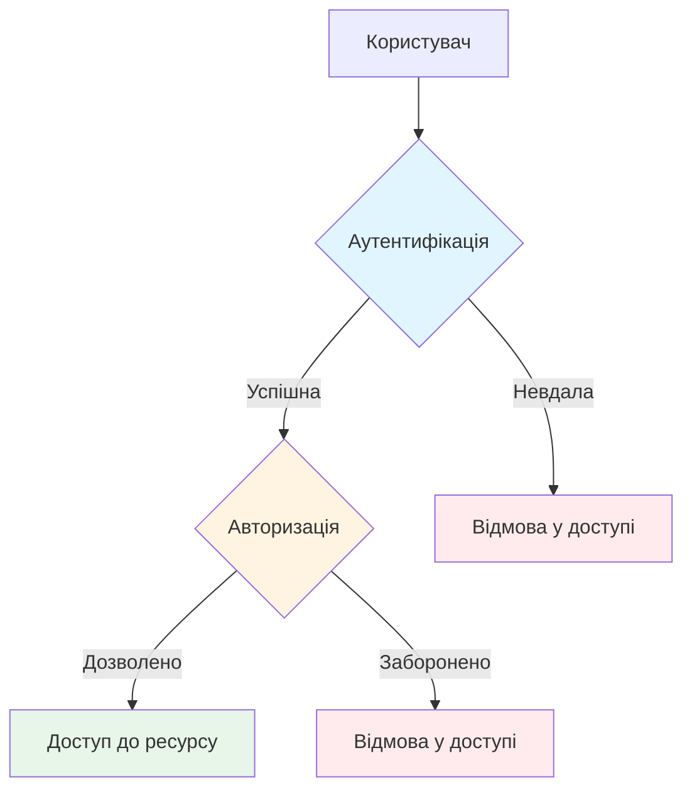
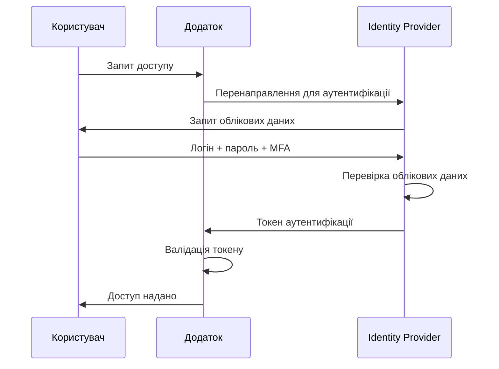
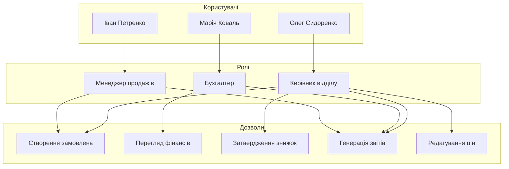
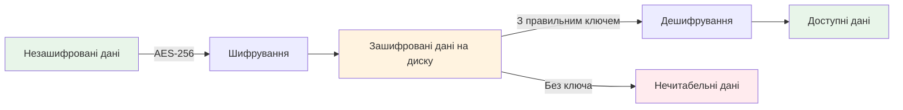
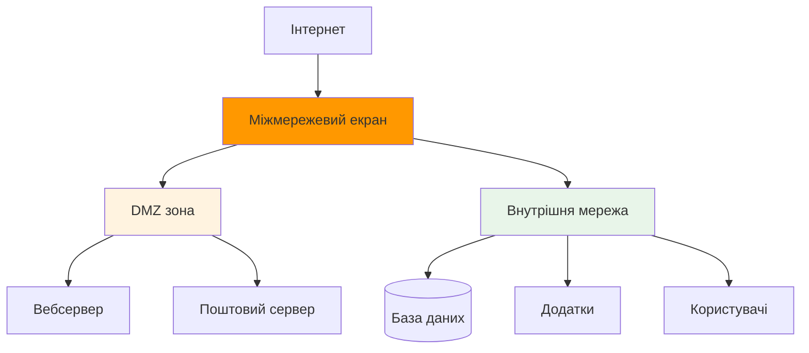
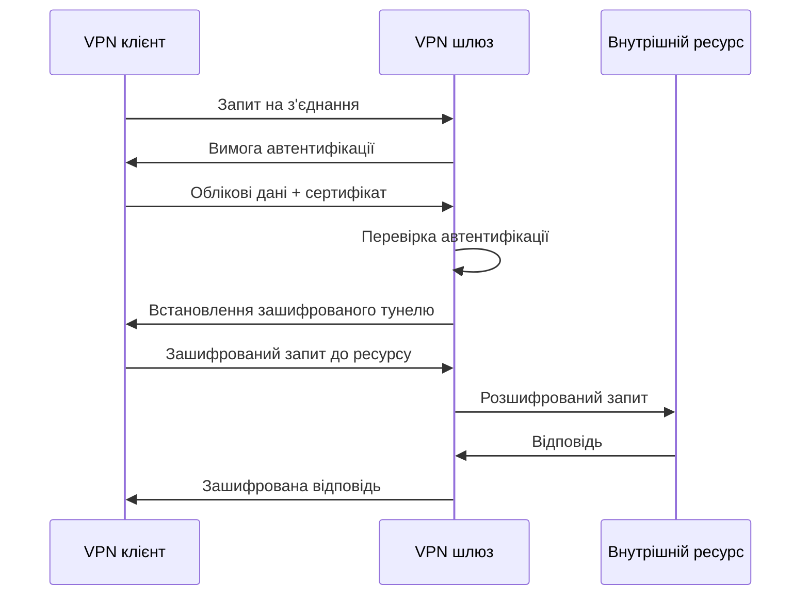
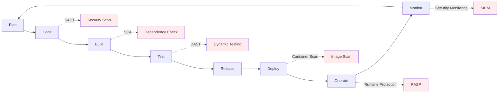

# Лекція 08 Захист бізнес-процесів: технічні заходи

## Вступ

Сучасні бізнес-процеси значною мірою залежать від інформаційних технологій. Автоматизація, цифровізація та інтеграція систем створюють нові можливості для підвищення ефективності, але водночас відкривають нові вектори атак для зловмисників. Технічні заходи захисту є фундаментом безпеки бізнес-процесів, що дозволяє організаціям захищати критичні активи, забезпечувати конфіденційність даних клієнтів та підтримувати безперервність операцій.

Ця лекція присвячена комплексному огляду технічних механізмів захисту, які охоплюють контроль доступу, криптографічні методи, мережеву безпеку, захист кінцевих пристроїв та інтеграцію безпеки в процес розробки програмного забезпечення. Розуміння цих механізмів є критично важливим для фахівців з кібербезпеки, оскільки саме технічні заходи формують перший рубіж оборони від кіберзагроз.

## 1. Аутентифікація та авторизація

### 1.1. Основні поняття та принципи

Аутентифікація є процесом перевірки ідентичності користувача або системи. Це відповідь на питання "хто ви?". Авторизація визначає, які дії та ресурси доступні автентифікованому користувачу, відповідаючи на питання "що вам дозволено робити?". Ці два механізми тісно взаємопов'язані, але виконують різні функції в системі безпеки.

Традиційно аутентифікація базується на трьох факторах. Перший фактор - це щось, що ви знаєте, наприклад пароль, PIN-код або відповідь на секретне питання. Другий фактор - це щось, що ви маєте, наприклад фізичний токен, смартфон або смарт-карта. Третій фактор - це щось, чим ви є, що включає біометричні характеристики, такі як відбитки пальців, розпізнавання обличчя або сканування райдужної оболонки ока.

Сучасні системи все частіше використовують комбінацію цих факторів для підвищення рівня безпеки. Це призводить нас до концепції багатофакторної аутентифікації, яка значно ускладнює несанкціонований доступ навіть у разі компрометації одного з факторів.

### 1.2. Багатофакторна аутентифікація (MFA)

Багатофакторна аутентифікація вимагає від користувача надання двох або більше незалежних факторів для підтвердження ідентичності. Найпоширенішим варіантом є двофакторна аутентифікація, яка зазвичай поєднує пароль з одноразовим кодом, згенерованим на мобільному пристрої або надісланим через SMS.

Розглянемо типову реалізацію MFA на основі одноразових паролів з обмеженим терміном дії. Після введення логіна та пароля користувач отримує шестизначний код, що генерується алгоритмом TOTP (Time-based One-Time Password). Цей код є дійсним протягом 30 секунд і базується на поточному часі та секретному ключі, унікальному для кожного користувача. Навіть якщо зловмисник дізнається пароль користувача, він не зможе увійти в систему без доступу до генератора одноразових кодів.

Однак важливо розуміти обмеження різних методів MFA. SMS-коди вразливі до атак типу SIM-swapping, коли зловмисник переконує оператора мобільного зв'язку перенести номер жертви на нову SIM-карту. Push-повідомлення в додатках можуть страждати від втоми користувачів від повідомлень, коли людина автоматично підтверджує запит, не перевіряючи його легітимність. Найбільш захищеними вважаються апаратні токени FIDO2/WebAuthn та біометрична аутентифікація на рівні пристрою.

У контексті бізнес-процесів MFA особливо критична для доступу до систем, що обробляють фінансові транзакції, персональні дані клієнтів або критичну бізнес-інформацію. Наприклад, процес затвердження платежів у ERP-системі може вимагати не лише входу з MFA, але й додаткового підтвердження кожної транзакції понад певну суму.

### 1.3. Єдиний вхід (SSO)

Технологія єдиного входу дозволяє користувачам автентифікуватися один раз і отримувати доступ до множини пов'язаних, але незалежних програмних систем без повторної аутентифікації. Це значно покращує зручність використання для співробітників, які працюють з десятками різних додатків протягом робочого дня.

SSO базується на концепції довіреного центру ідентифікації, який називається Identity Provider. Коли користувач намагається отримати доступ до додатка, що підтримує SSO, додаток перенаправляє його до Identity Provider. Після успішної аутентифікації Identity Provider генерує токен або assertion, який підтверджує ідентичність користувача. Цей токен передається назад додатку, який приймає його як доказ автентифікації.

Найпоширенішими протоколами для реалізації SSO є SAML 2.0, OpenID Connect та OAuth 2.0. SAML традиційно використовується в корпоративному середовищі для інтеграції з хмарними SaaS-додатками. OpenID Connect, побудований поверх OAuth 2.0, став стандартом де-факто для сучасних вебдодатків завдяки своїй простоті та гнучкості.

Впровадження SSO в організації має значні переваги з точки зору безпеки. Централізоване управління ідентичністю дозволяє швидко відкликати доступ співробітника до всіх систем при звільненні. Користувачам потрібно запам'ятовувати лише один надійний пароль замість десятків різних. Це знижує ймовірність використання слабких паролів або їх повторення між системами.

Однак SSO створює і нові ризики. Identity Provider стає критичною точкою відмови. Якщо зловмисник отримає доступ до облікового запису користувача в системі SSO, він автоматично отримає доступ до всіх інтегрованих додатків. Тому критично важливо захищати SSO-систему додатковими рівнями безпеки, включаючи обов'язкове використання MFA, моніторинг підозрілих сесій та обмеження доступу за IP-адресами або географічним розташуванням.

### 1.4. Рольова модель доступу (RBAC)

Role-Based Access Control є методом обмеження доступу до ресурсів системи на основі ролей користувачів в організації. Замість призначення прав доступу безпосередньо окремим користувачам, права групуються в ролі, а користувачі отримують одну або кілька ролей відповідно до своїх службових обов'язків.

Розглянемо практичний приклад з процесу обробки замовлень. У системі можуть бути визначені ролі "Менеджер продажів", "Бухгалтер", "Керівник відділу" та "Адміністратор". Менеджер продажів може створювати нові замовлення та переглядати статус існуючих, але не може їх видаляти або змінювати ціни. Бухгалтер має доступ до фінансової інформації замовлень та може генерувати рахунки, але не може змінювати деталі замовлення. Керівник відділу може затверджувати знижки та переглядати всі замовлення свого підрозділу. Адміністратор має повний доступ до всіх функцій системи.

RBAC спрощує адміністрування доступу в великих організаціях. Коли новий співробітник приєднується до відділу продажів, йому просто призначається роль "Менеджер продажів", і він автоматично отримує всі необхідні права. При переведенні на іншу посаду достатньо змінити роль користувача, замість ручного додавання або видалення окремих прав.

Важливим принципом при реалізації RBAC є концепція найменших привілеїв. Кожна роль повинна мати лише ті права, які абсолютно необхідні для виконання відповідних робочих функцій. Надмірні привілеї збільшують потенційний збиток від компрометації облікового запису або зловживань з боку інсайдерів.

Сучасні системи часто використовують розширення RBAC, такі як Attribute-Based Access Control, де права доступу визначаються не лише роллю, але й додатковими атрибутами, такими як час доби, географічне розташування, рівень конфіденційності даних або поточний статус проєкту. Наприклад, менеджер може мати доступ до конфіденційних документів проєкту лише протягом робочого часу та лише з корпоративної мережі.

## 2. Шифрування даних

### 2.1. Фундаментальні концепції криптографії

Шифрування є процесом перетворення інформації у форму, яка є нечитабельною без знання спеціального ключа. Це один з найпотужніших інструментів захисту даних, оскільки навіть якщо зловмисник отримає доступ до зашифрованих даних, вони залишаться для нього безглузді без ключа дешифрування.

Існують два основні типи криптографічних систем. Симетричне шифрування використовує один і той самий ключ для шифрування та дешифрування даних. Алгоритми симетричного шифрування, такі як AES, надзвичайно швидкі та ефективні, що робить їх ідеальними для шифрування великих обсягів даних. Однак виникає проблема безпечного обміну ключем між сторонами.

Асиметричне шифрування вирішує цю проблему, використовуючи пару математично пов'язаних ключів - публічний та приватний. Дані, зашифровані публічним ключем, можуть бути розшифровані лише відповідним приватним ключем. Це дозволяє безпечно обмінюватися публічними ключами через незахищені канали. Алгоритми асиметричного шифрування, такі як RSA та ECC, є значно повільнішими за симетричні, тому на практиці часто використовується гібридний підхід. Асиметричне шифрування застосовується для безпечного обміну симетричним ключем, а потім цей симетричний ключ використовується для шифрування основних даних.

Крім конфіденційності, криптографія забезпечує цілісність та автентичність даних. Хеш-функції, такі як SHA-256, генерують унікальний цифровий відбиток даних. Будь-яка зміна в даних призводить до зміни хеша, що дозволяє виявити несанкціоновані модифікації. Цифрові підписи поєднують хешування з асиметричним шифруванням для підтвердження, що дані були створені конкретною особою і не були змінені.

### 2.2. Шифрування даних у спокої

Дані у спокої (data at rest) включають всю інформацію, що зберігається на фізичних носіях - жорстких дисках, SSD, резервних копіях, USB-накопичувачах, мобільних пристроях. Шифрування цих даних критично важливе для захисту від фізичної крадіжки пристроїв, несанкціонованого доступу до дата-центрів або витоку резервних копій.

Повне шифрування диска забезпечує захист всього вмісту накопичувача. Сучасні операційні системи мають вбудовані рішення, такі як BitLocker для Windows, FileVault для macOS та LUKS для Linux. Ці системи шифрують весь диск, включаючи операційну систему, за допомогою AES-256. Ключ шифрування зберігається у захищеному модулі TPM на материнській платі або захищений паролем користувача.

Шифрування на рівні файлової системи дозволяє вибірково шифрувати окремі файли або директорії. Це корисно, коли потрібно захистити лише конфіденційні дані, залишаючи решту системи незашифрованою для продуктивності. Наприклад, в корпоративному середовищі можна автоматично шифрувати всі файли в папці "Конфіденційно", використовуючи корпоративні ключі, керовані централізовано.

У контексті бізнес-процесів особливої уваги потребують бази даних. Шифрування на рівні бази даних може відбуватися на різних рівнях. Transparent Data Encryption шифрує файли бази даних на диску, захищаючи від крадіжки фізичних носіїв, але дані залишаються незашифрованими в пам'яті під час роботи системи. Шифрування на рівні колонок дозволяє захистити окремі поля таблиць, що містять чутливу інформацію, такі як номери кредитних карт або персональні ідентифікатори.

Хмарні провайдери пропонують різні моделі управління ключами шифрування. У моделі provider-managed encryption провайдер автоматично шифрує всі дані, але контролює ключі шифрування. У моделі customer-managed encryption організація зберігає контроль над ключами, використовуючи власний Key Management Service. Для найбільш чутливих даних можна використовувати client-side encryption, коли дані шифруються на стороні клієнта до їх відправки в хмару, і провайдер ніколи не має доступу до незашифрованих даних.

### 2.3. Шифрування даних при передачі

Дані при передачі (data in transit) є вразливими до перехоплення через атаки типу man-in-the-middle, прослуховування мережевого трафіку або компрометацію мережевого обладнання. Шифрування каналу зв'язку гарантує, що навіть якщо зловмисник перехопить трафік, він не зможе прочитати або модифікувати передані дані.

Протокол Transport Layer Security є стандартом для захищеної передачі даних в інтернеті. TLS використовується в HTTPS для захисту вебтрафіку, в SMTPS для електронної пошти, в FTPS для передачі файлів. Процес встановлення TLS-з'єднання включає кілька етапів. Спочатку клієнт та сервер узгоджують версію протоколу та набір криптографічних алгоритмів, що буде використовуватися. Сервер надає свій цифровий сертифікат для підтвердження ідентичності. Клієнт перевіряє сертифікат, переконуючись що він виданий довіреним центром сертифікації та не прострочений. Після цього сторони обмінюються ключами для створення симетричного ключа сесії, який буде використовуватися для шифрування подальшої комунікації.

Важливо розуміти різницю між шифруванням та автентифікацією в контексті TLS. Шифрування захищає конфіденційність даних, але не гарантує, що ви спілкуєтеся саме з тим сервером, за який він себе видає. Цифровий сертифікат вирішує цю проблему, підтверджуючи ідентичність сервера. Саме тому критично важливо перевіряти валідність сертифікатів та ніколи не ігнорувати попередження браузера про проблеми з сертифікатом.

У корпоративних мережах VPN створює зашифрований тунель між пристроєм користувача та корпоративною мережею. Весь трафік, що проходить через цей тунель, захищений від прослуховування. Сучасні VPN-рішення використовують протоколи IPsec або OpenVPN, які забезпечують надійне шифрування та автентифікацію. Для віддалених співробітників VPN є критичним інструментом безпеки, особливо при роботі з публічних Wi-Fi мереж.

Шифрування також застосовується в міжсервісній комунікації всередині інфраструктури організації. Навіть якщо сервіси знаходяться в одному дата-центрі, рекомендується шифрувати трафік між ними. Це захищає від lateral movement атак, коли зловмисник, що скомпрометував один сервер, намагається перехопити трафік до інших систем. Протокол mutual TLS вимагає автентифікації обох сторін з'єднання, гарантуючи що кожен сервіс перевіряє ідентичність свого партнера по комунікації.

## 3. Мережева безпека

### 3.1. Міжмережеві екрани (Firewall)

Міжмережевий екран є першою лінією оборони мережевої інфраструктури. Він контролює вхідний та вихідний трафік на основі попередньо визначених правил безпеки, діючи як бар'єр між довіреною внутрішньою мережею та недовіреним зовнішнім світом, зазвичай інтернетом.

Традиційні пакетні фільтри працюють на мережевому та транспортному рівнях моделі OSI, приймаючи рішення на основі IP-адрес джерела та призначення, портів та протоколів. Наприклад, правило може дозволяти вхідні з'єднання на порт 443 для HTTPS-трафіку до вебсервера, але блокувати всі інші вхідні з'єднання. Хоча такі фільтри ефективні та продуктивні, вони не розуміють контекст з'єднання та можуть бути обійдені за допомогою складніших атак.

Stateful firewall відстежує стан мережевих з'єднань та приймає рішення на основі контексту. Наприклад, якщо внутрішній користувач ініціював з'єднання до зовнішнього сервера, firewall запам'ятає це та автоматично дозволить відповідні пакети від сервера, навіть якщо немає явного правила для вхідного трафіку з цієї адреси. Це значно зменшує складність конфігурації та покращує безпеку.

Next-generation firewall поєднує традиційні функції firewall з додатковими можливостями. Вони можуть інспектувати трафік на рівні додатків, розпізнаючи конкретні програми незалежно від порту. Наприклад, NGFW може виявити та заблокувати BitTorrent трафік навіть якщо він використовує нестандартні порти для обходу традиційного firewall. Інтегрована система запобігання вторгненням аналізує вміст трафіку на наявність відомих сигнатур атак. Деякі NGFW включають функції Web Application Firewall для захисту вебдодатків від специфічних атак, таких як SQL injection або cross-site scripting.

У контексті захисту бізнес-процесів firewall дозволяє сегментувати мережу за принципом найменших привілеїв. Наприклад, сервери з персональними даними клієнтів можуть бути ізольовані в окремому сегменті з суворими правилами доступу, дозволяючи з'єднання лише від конкретних додатків, що мають легітимну потребу в цих даних. Robotic process automation боти можуть працювати в окремому сегменті з обмеженим доступом до критичних систем, знижуючи ризик від потенційної компрометації автоматизованих процесів.

### 3.2. Системи виявлення та запобігання вторгненням (IDS/IPS)

Intrusion Detection System пасивно моніторить мережевий трафік та системні логи для виявлення підозрілої активності або відомих патернів атак. При виявленні потенційної загрози IDS генерує алерт для адміністраторів безпеки, але не блокує трафік самостійно. Це дозволяє уникнути помилкових спрацьювань, що можуть порушити легітимну роботу, але вимагає швидкої реакції людини на інциденти.

Intrusion Prevention System робить наступний крок, автоматично блокуючи трафік, що відповідає сигнатурам атак або аномальній поведінці. IPS зазвичай розміщується inline в мережевому шляху, аналізуючи всі пакети в реальному часі та відкидаючи підозрілі з'єднання до того, як вони досягнуть цільової системи.

Існують два основні підходи до виявлення вторгнень. Signature-based detection порівнює трафік з базою даних відомих сигнатур атак. Цей метод надзвичайно ефективний для виявлення відомих загроз з мінімальною кількістю помилкових спрацьювань. Однак він безсилий проти нових, раніше невідомих атак, поки сигнатури для них не будуть створені та розповсюджені. Anomaly-based detection встановлює базовий профіль нормальної поведінки мережі та піднімає алерти при значних відхиленнях. Цей підхід може виявляти zero-day атаки, але часто генерує більше помилкових спрацьювань.

Практичний приклад використання IPS в бізнес-процесах стосується захисту процесу онлайн-платежів. IPS може виявити та заблокувати спроби SQL injection на сторінку оформлення замовлення, перш ніж вони досягнуть бази даних з інформацією про кредитні карти. Система може також виявити аномально високу частоту запитів до API платіжної системи, що може вказувати на атаку brute-force або credential stuffing, та автоматично заблокувати джерело атаки.

Для ефективного використання IDS/IPS критично важливо регулярно оновлювати сигнатури загроз та тюнінгувати правила під специфіку організації. Системи потребують постійного моніторингу та аналізу алертів для відрізнення реальних загроз від помилкових спрацьовувань. Інтеграція з SIEM-системами дозволяє корелювати події від IDS/IPS з іншими джерелами даних для більш точного виявлення складних багатоетапних атак.

### 3.3. Віртуальні приватні мережі (VPN)

Віртуальна приватна мережа створює безпечне з'єднання через незахищену мережу, зазвичай інтернет. VPN інкапсулює та шифрує весь трафік між кінцевими точками, створюючи ілюзію прямого з'єднання навіть коли дані фізично проходять через публічну інфраструктуру.

Site-to-site VPN з'єднує дві або більше географічно розподілені мережі організації. Наприклад, головний офіс компанії в Києві може бути з'єднаний через VPN з філіями в Львові та Одесі, дозволяючи співробітникам усіх офісів безпечно працювати з централізованими ресурсами так, ніби вони знаходяться в одній локальній мережі. Такі VPN зазвичай працюють постійно та використовують протокол IPsec для забезпечення автентифікації, цілісності та конфіденційності.

Remote access VPN дозволяє окремим користувачам безпечно підключатися до корпоративної мережі з віддалених локацій. Це критично важливо для віддалених співробітників, які працюють з дому або подорожують. Користувач встановлює VPN-клієнт на своєму пристрої, який створює зашифрований тунель до VPN-шлюзу в корпоративній мережі. Весь трафік користувача маршрутизується через цей тунель, захищаючи від прослуховування в публічних мережах та забезпечуючи доступ до внутрішніх ресурсів.

Сучасний підхід Zero Trust Network Access переосмислює концепцію VPN. Замість надання доступу до всієї корпоративної мережі після автентифікації, ZTNA забезпечує гранульований доступ лише до конкретних додатків, які необхідні користувачу для роботи. Кожен запит перевіряється на основі ідентичності користувача, стану пристрою, контексту запиту та політик безпеки. Це значно зменшує поверхню атаки та обмежує потенційний збиток від компрометації облікового запису.

У контексті бізнес-процесів VPN дозволяє безпечно інтегрувати віддалені системи та партнерів. Наприклад, постачальник може мати VPN-доступ до системи управління замовленнями клієнта для автоматичного оновлення статусу поставок, при цьому доступ обмежений лише до необхідних функцій без надання доступу до решти корпоративної інфраструктури. Аудитори можуть отримувати тимчасовий VPN-доступ для перегляду фінансових систем протягом періоду аудиту, який автоматично відкликається після завершення робіт.

## 4. Захист endpoint пристроїв

### 4.1. Багаторівневий захист робочих станцій

Endpoint пристрої, такі як ноутбуки, настільні комп'ютери, смартфони та планшети, є найчастішою точкою входу для кібератак. Співробітник, що відкрив шкідливий attachment в електронному листі або підключив інфікований USB-накопичувач, може скомпрометувати безпеку всієї організації. Тому захист endpoint пристроїв є критичною складовою стратегії безпеки.

Сучасний антивірус виходить далеко за межі традиційного сигнатурного аналізу. Endpoint Detection and Response системи поєднують кілька технологій для комплексного захисту. Поведінковий аналіз відстежує дії програм в реальному часі, виявляючи підозрілу активність, таку як несанкціоноване шифрування файлів, що може вказувати на ransomware. Machine learning моделі аналізують характеристики файлів та мережевої активності для виявлення раніше невідомих загроз. Sandboxing дозволяє безпечно виконувати підозрілі програми в ізольованому середовищі для спостереження за їх поведінкою до надання доступу до реальної системи.

Критично важливим є управління оновленнями програмного забезпечення. Більшість успішних атак експлуатують відомі вразливості, для яких вже існують патчі, але які не були встановлені своєчасно. Централізована система patch management дозволяє автоматично розповсюджувати критичні оновлення безпеки на всі endpoint пристрої організації. Однак процес потребує ретельного тестування патчів на сумісність з бізнес-додатками перед масовим розгортанням, оскільки несумісне оновлення може порушити критичні бізнес-процеси.

Application whitelisting інвертує традиційну модель безпеки, дозволяючи виконання лише явно схвалених програм замість спроб заблокувати відомі шкідливі. Цей підхід особливо ефективний для захисту критичних систем з передбачуваним набором необхідного програмного забезпечення. Наприклад, робоча станція оператора SCADA-системи може бути налаштована на виконання лише промислового ПЗ та стандартних системних утиліт, блокуючи будь-які спроби запуску сторонніх програм.

### 4.2. Захист мобільних пристроїв

Мобільні пристрої представляють унікальні виклики для безпеки бізнес-процесів. Вони часто містять корпоративну інформацію, але використовуються в незахищених середовищах, підключаються до ненадійних Wi-Fi мереж та можуть бути легко загублені або вкрадені. Mobile Device Management рішення дозволяють організаціям централізовано керувати та захищати корпоративні дані на мобільних пристроях.

MDM дозволяє віддалено налаштовувати політики безпеки на пристроях співробітників. Це включає вимогу надійного пароля або біометричної автентифікації, автоматичне блокування після періоду неактивності, шифрування даних на пристрої. У разі втрати або крадіжки пристрою адміністратор може віддалено заблокувати доступ до корпоративних даних або повністю видалити всю інформацію з пристрою.

Контейнеризація розділяє особисті та робочі дані на одному пристрої. Робочі додатки та дані зберігаються в зашифрованому контейнері, ізольованому від особистих додатків. Корпоративні політики застосовуються лише до робочого контейнера, залишаючи особистий простір користувача недоторканим. Це дозволяє реалізувати BYOD (Bring Your Own Device) політику, при якій співробітники можуть використовувати особисті пристрої для роботи без ризику для приватності та без надання організації повного контролю над пристроєм.

Mobile Application Management фокусується на захисті конкретних додатків. Корпоративні додатки можуть бути налаштовані з додатковими рівнями безпеки, такими як заборона копіювання даних в особисті додатки, блокування знімків екрана конфіденційної інформації, вимога VPN-з'єднання для доступу до серверів. Наприклад, мобільний додаток CRM може дозволяти перегляд інформації про клієнтів, але блокувати можливість експорту контактів на особисті облікові записи або обміну через месенджери.

### 4.3. Безпека Internet of Things пристроїв

Зростання Internet of Things створює нові точки входу для атак на бізнес-процеси. Розумні термостати, камери відеоспостереження, принтери, промислові сенсори та інші IoT пристрої часто мають слабкий захист, використовують застарілі операційні системи та рідко оновлюються. Скомпрометовані IoT пристрої можуть використовуватися як плацдарм для атак на решту мережі або для створення ботнетів.

Ключовим принципом захисту IoT є мережева сегментація. Всі IoT пристрої повинні бути ізольовані в окремому VLAN без прямого доступу до корпоративної мережі. Комунікація між IoT пристроями та бізнес-системами має проходити через контрольовані gateway з суворою фільтрацією трафіку. Наприклад, IP-камери можуть передавати відео на виділений сервер відеоспостереження, але не мати доступу до інтернету або інших корпоративних ресурсів.

Важливо змінювати стандартні паролі та облікові записи на IoT пристроях одразу після встановлення. Багато IoT пристроїв постачаються з однаковими заводськими паролями, які є загальновідомими та активно скануються зловмисниками. Якщо пристрій не підтримує зміну пароля або використовує застарілі протоколи без шифрування, варто розглянути його заміну на більш захищену альтернативу.

## 5. Безпечна розробка: DevSecOps

### 5.1. Інтеграція безпеки в життєвий цикл розробки

Традиційний підхід до безпеки програмного забезпечення передбачав тестування безпеки на фінальних етапах розробки або навіть після розгортання в продакшн. Це призводило до виявлення критичних вразливостей на пізніх стадіях, коли їх виправлення було дорогим та трудомістким. DevSecOps інтегрує безпеку в кожен етап життєвого циклу розробки, роблячи її відповідальністю всієї команди, а не лише спеціалізованого відділу безпеки.

Концепція Shift Left означає перенесення активностей безпеки на більш ранні етапи розробки. Замість того, щоб чекати завершення розробки для проведення пентесту, команда впроваджує автоматизовані перевірки безпеки безпосередньо в CI/CD pipeline. Кожен commit коду автоматично сканується на наявність вразливостей, небезпечних патернів, жорстко вписаних секретів. Якщо виявляються проблеми безпеки вище певного рівня severity, білд автоматично відхиляється, запобігаючи потраплянню вразливого коду в продакшн.

Threat modeling на етапі проєктування дозволяє виявляти потенційні загрози та вразливості архітектури до написання коду. Команда систематично аналізує архітектуру системи, визначаючи активи, точки входу, довірені межі та потенційні вектори атак. Це дозволяє приймати архітектурні рішення з урахуванням безпеки. Наприклад, вирішення зберігати чутливі дані в окремій базі даних з обмеженим доступом замість загальної бази додатку.

### 5.2. Автоматизація перевірок безпеки

Static Application Security Testing аналізує вихідний код додатку без його виконання, шукаючи відомі небезпечні патерни та потенційні вразливості. SAST інструменти можуть виявляти SQL injection вразливості, випадки використання небезпечних функцій, жорстко вписані паролі та API ключі, проблеми з управлінням пам'яттю. Перевага SAST в тому, що аналіз виконується на ранніх етапах розробки, коли виправлення проблем є найменш затратним. Однак SAST може генерувати значну кількість помилкових спрацьовувань та не виявляє вразливості, що залежать від конфігурації runtime середовища.

Dynamic Application Security Testing тестує запущений додаток, надсилаючи йому різноманітні запити та аналізуючи відповіді для виявлення вразливостей. DAST симулює атаки на додаток так, як це робив би реальний зловмисник, не маючи доступу до вихідного коду. Цей підхід ефективно виявляє вразливості конфігурації, проблеми автентифікації та авторизації, injection вразливості. DAST зазвичай виконується на пізніших етапах розробки, коли додаток вже функціонує в тестовому середовищі.

Software Composition Analysis фокусується на сторонніх компонентах та бібліотеках, що використовуються в додатку. Сучасні додатки часто включають сотні залежностей, кожна з яких може містити вразливості. SCA інструменти сканують файли залежностей проєкту, ідентифікують використані бібліотеки та їх версії, перевіряють наявність відомих вразливостей в базах даних типу National Vulnerability Database. При виявленні вразливої залежності інструмент повідомляє розробників та рекомендує безпечну версію для оновлення.

Приклад інтеграції в GitHub Actions workflow може виглядати так. При створенні pull request автоматично запускається SAST аналіз коду. Паралельно SCA перевіряє всі залежності проєкту. Якщо виявляються критичні вразливості, PR не може бути змержений до їх виправлення. Після мержу в main гілку створюється Docker образ додатку, який сканується на наявність вразливостей операційної системи та встановленого ПЗ. Лише після успішного проходження всіх перевірок образ може бути розгорнутий в продакшн середовище.

### 5.3. Безпечне управління секретами

Секрети, такі як API ключі, паролі баз даних, приватні ключі шифрування, токени доступу, є критично важливими для безпеки додатків. Жорстке вписування секретів безпосередньо в код є небезпечною практикою, оскільки вони потрапляють в систему контролю версій, стають доступними всім розробникам та можуть випадково оприлюднитися при публікації коду.

Secret management системи, такі як HashiCorp Vault, AWS Secrets Manager або Azure Key Vault, надають централізоване безпечне сховище для секретів. Додатки отримують секрети динамічно під час виконання, автентифікуючись в secret manager. Секрети ніколи не зберігаються локально на диску додатку. Системи підтримують ротацію секретів, автоматично генеруючи нові паролі через певні інтервали часу та оновлюючи їх у всіх залежних системах.

Для локальної розробки рекомендується використовувати файли змінних середовища, що не включаються в систему контролю версій. Проєкт містить приклад файлу з шаблонними значеннями, але реальні секрети кожен розробник зберігає локально. В CI/CD pipeline секрети інжектуються як змінні середовища з захищеного сховища платформи, такого як GitHub Secrets або GitLab CI/CD Variables.

Автоматизовані інструменти типу git-secrets або truffleHog сканують репозиторії на наявність випадково коммітнутих секретів. Вони можуть бути налаштовані як pre-commit hook, запобігаючи commit коду, що містить потенційні секрети. Якщо секрет все ж потрапив в репозиторій, його недостатньо просто видалити в наступному комміті, оскільки він залишається в історії Git. Секрет необхідно негайно скасувати та замінити новим, припускаючи що він вже міг бути скомпрометований.

### 5.4. Захист контейнерів та Kubernetes

Контейнеризація додатків створює нові виміри безпеки. Образи контейнерів можуть містити вразливості базової операційної системи або встановлених пакетів. Container image scanning аналізує образи на наявність відомих вразливостей перед їх розгортанням. Інструменти типу Trivy або Clair сканують кожен layer образу, ідентифікуючи встановлені пакети та перевіряючи їх на відповідність базам вразливостей.

Принцип найменших привілеїв застосовується і до контейнерів. Контейнери не повинні виконуватися від імені root користувача без крайньої необхідності. Файлова система контейнера має бути доступна лише для читання де можливо, з явно визначеними volume для запису даних. Capabilities Linux ядра обмежуються мінімально необхідним набором. Наприклад, вебдодатку не потрібна можливість відкривати raw network sockets або модифікувати системний час.

В Kubernetes середовищі Pod Security Standards визначають політики безпеки для pod. Baseline рівень забороняє найнебезпечніші практики, такі як privileged containers або host namespace sharing. Restricted рівень застосовує суворі обмеження, включаючи заборону виконання від root, вимогу read-only root filesystem, drop всіх capabilities. Network policies контролюють дозволену комунікацію між pods, реалізуючи мікросегментацію всередині кластера.

Service mesh, такий як Istio або Linkerd, додає додатковий рівень безпеки для міжсервісної комунікації. Автоматичне mutual TLS шифрування між всіма сервісами захищає від прослуховування трафіку всередині кластера. Детальні політики авторизації визначають які сервіси можуть комунікувати між собою. Наприклад, frontend сервіс може мати дозвіл на виклики API gateway, але не може напряму звертатися до бази даних.

## Висновки

Технічні заходи захисту бізнес-процесів формують багаторівневу систему безпеки, де кожен компонент виконує специфічну роль, доповнюючи інші. Аутентифікація та авторизація контролюють хто має доступ до ресурсів та що їм дозволено робити. Шифрування захищає конфіденційність даних як під час зберігання, так і при передачі. Мережева безпека фільтрує та моніторить трафік, запобігаючи несанкціонованому доступу та виявляючи атаки. Захист endpoint пристроїв забезпечує безпеку найбільш вразливих точок входу в інфраструктуру. DevSecOps інтегрує безпеку в процес створення програмного забезпечення, запобігаючи появі вразливостей.

Важливо розуміти, що жоден окремий технічний захід не може гарантувати повну безпеку. Ефективна стратегія базується на принципі defense in depth, де множинні рівні захисту працюють разом. Якщо зловмисник обходить один захист, інші рівні запобігають успішній атаці. Наприклад, навіть якщо атакуючий отримує облікові дані користувача через phishing, багатофакторна аутентифікація блокує несанкціонований вхід. Якщо вразливість додатку дозволяє виконати код на сервері, мережева сегментація та firewall обмежують можливість lateral movement до інших систем.

Технічні заходи повинні підтримуватися організаційними та процесними контролями. Навіть найдосконаліші технології безпеки будуть неефективні без належної конфігурації, регулярного оновлення, постійного моніторингу та навченого персоналу. Безпека є безперервним процесом, а не одноразовим проєктом. Ландшафт загроз постійно еволюціонує, з'являються нові вектори атак, виявляються нові вразливості. Організації повинні постійно адаптувати свої технічні заходи захисту, залишаючись в курсі останніх трендів кібербезпеки та найкращих практик галузі.
