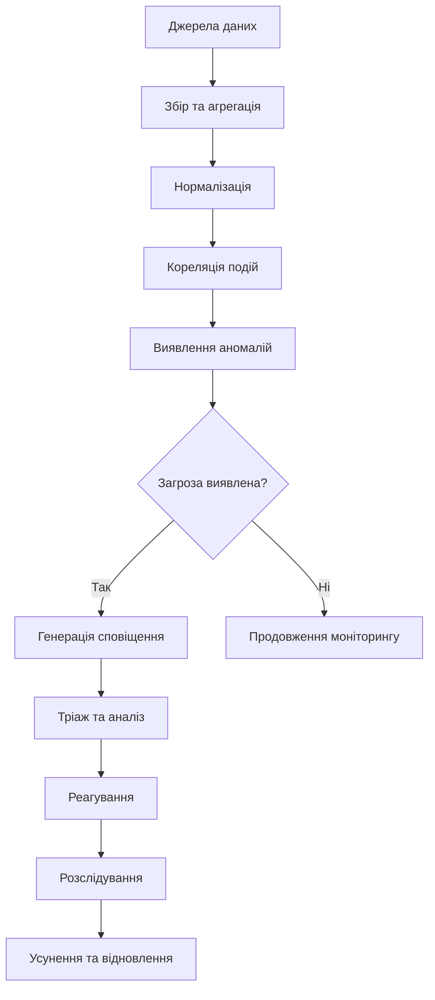

# Лекція 10 Системи управління подіями безпеки, моніторинг та реагування на інциденти

## Вступ

Сучасні кіберзагрози характеризуються зростаючою складністю, швидкістю розвитку та потенційним масштабом впливу. Для ефективного захисту організація повинна не лише впроваджувати превентивні заходи, але й мати можливість швидко виявляти, аналізувати та реагувати на інциденти безпеки. Ця лекція охоплює технології та процеси моніторингу безпеки, системи управління подіями та інформацією про безпеку, методології реагування на інциденти, а також підходи до забезпечення безперервності бізнесу та відновлення після катастроф.

## Концепція моніторингу безпеки

Моніторинг безпеки це постійний процес спостереження, виявлення та аналізу подій, які можуть вказувати на інциденти безпеки або порушення політик. На відміну від реактивних підходів, які реагують на вже відомі проблеми, проактивний моніторинг дозволяє виявляти загрози на ранніх стадіях, коли можливості атакуючого обмежені, а потенційні збитки мінімальні.

Ефективний моніторинг базується на декількох фундаментальних принципах. Повнота покриття означає збір даних з усіх критичних джерел, включаючи мережеве обладнання, сервери, кінцеві пристрої, хмарні сервіси, додатки та бази даних. Своєчасність виявлення передбачає мінімізацію часу між подією та її виявленням, оскільки кожна хвилина затримки дає атакуючому більше можливостей. Точність детекції балансує між чутливістю системи та кількістю хибних спрацювань, оскільки надто багато помилкових тривог виснажують ресурси команди безпеки.

Джерела даних для моніторингу є різноманітними. Мережеві пристрої генерують журнали про трафік, з'єднання, заблоковані пакети. Операційні системи фіксують входи користувачів, зміни файлів, запуск процесів, системні помилки. Додатки журналюють автентифікацію, транзакції, помилки, доступ до даних. Системи безпеки, такі як міжмережеві екрани, системи виявлення вторгнень, антивіруси, генерують сповіщення про виявлені загрози. Хмарні платформи надають метадані про конфігурацію, доступ до ресурсів, виклики програмних інтерфейсів.

Основні показники моніторингу безпеки дозволяють оцінити ефективність процесу. Середній час виявлення показує середній час від початку інциденту до його виявлення. Середній час реагування вимірює середній час від виявлення до початку реагування. Середній час обмеження відображає час, необхідний для обмеження поширення інциденту. Середній час відновлення показує час повного відновлення після інциденту. Показник помилкових спрацювань вимірює відсоток хибних сповіщень про загрози.

## Системи управління подіями безпеки: архітектура та функціональність

Системи управління інформацією та подіями безпеки є центральним компонентом сучасної інфраструктури безпеки. Ці системи агрегують, нормалізують, аналізують та зберігають величезні обсяги даних безпеки з різних джерел, надаючи єдине вікно для моніторингу та аналізу.

Архітектура типової системи включає декілька ключових компонентів. Агенти та збирачі встановлюються на джерелах даних для збору журналів та показників, можуть працювати як агентські рішення на кінцевих пристроях, так і через безагентський збір через системний журнал або програмні інтерфейси. Транспортний шар забезпечує надійну та захищену передачу даних до центрального сервера, часто з використанням стиснення та шифрування. Сервер агрегації та нормалізації отримує дані з різних джерел, приводить їх до єдиного формату, збагачує контекстом, таким як геолокація та оцінки репутації.

Кореляційний механізм аналізує потоки подій, застосовуючи правила для виявлення складних патернів атак, використовуючи як підходи на основі правил, так і машинного навчання. Сховище даних зберігає як необроблені журнали для форензіки, так і агреговані дані для аналітики, забезпечує швидкий доступ до історичних даних. Аналітичний шар надає інтерфейси для пошуку, візуалізації та побудови звітів, підтримує панелі керування для різних ролей. Система управління сповіщеннями генерує, встановлює пріоритети та маршрутизує повідомлення, інтегрується з системами обліку заявок та каналами комунікації.

Основні можливості систем є різноманітними. Управління журналами забезпечує централізоване зберігання журналів з різних джерел, зберігання протягом тривалого періоду для відповідності регуляціям, пошук та аналіз історичних даних. Кореляція подій виявляє складні атаки через кореляцію множини подій, створює часову лінію активності атакуючого, підтримує спеціальні правила кореляції. Інтелектуальний аналіз загроз інтегрується з потоками індикаторів компрометації, збагачує події інформацією про відомі загрози, автоматично блокує шкідливі адреси та домени. Аналітика поведінки користувачів та об'єктів будує базову лінію нормальної поведінки користувачів та систем, виявляє аномалії та відхилення від нормальної активності, ідентифікує внутрішні загрози та скомпрометовані облікові записи.

Wazuh є безкоштовною платформою з відкритим кодом, яка надає комплексне рішення для моніторингу безпеки. Архітектура включає агенти на моніторингових вузлах, що збирають журнали, виконують моніторинг цілісності файлів, сканують вразливості та здійснюють виявлення руткітів. Центральний менеджер отримує дані від агентів, застосовує правила виявлення, зберігає сповіщення та журнали. Інтеграція з набором інструментів для аналізу даних забезпечує потужну візуалізацію та аналітику.

Ключові можливості охоплюють декілька напрямків. Моніторинг цілісності файлів відстежує зміни в критичних системних файлах. Виявлення вторгнень аналізує журнали на предмет підозрілої активності. Оцінка вразливостей сканує системи на відомі вразливості. Відповідність регуляціям перевіряє дотримання вимог різних стандартів. Реагування на інциденти автоматично виконує дії у відповідь на загрози. Моніторинг хмарних середовищ підтримує основні хмарні платформи.

Альтернативний набір інструментів для побудови системи включає компонент для збору та обробки, компонент для зберігання та пошуку, та компонент для візуалізації. Перший збирає, аналізує та трансформує журнали з різних джерел, підтримує численні плагіни, може збагачувати дані додатковим контекстом. Другий забезпечує розподілене зберігання та швидкий пошук, масштабується горизонтально для великих обсягів даних, підтримує складні запити та агрегації. Третій надає вебінтерфейс для візуалізації даних, дозволяє будувати спеціальні панелі керування та звіти, підтримує сповіщення через інтеграцію з іншими інструментами.

Комерційні платформи надають потужні можливості, індексуючи машинні дані з будь-яких джерел, надаючи власну мову пошуку, підтримуючи аналітику в реальному часі та історичну, маючи розвинену екосистему додатків. Такі платформи особливо популярні у великих корпоративних середовищах, але мають значну вартість ліцензування, що базується на обсязі даних.

## Побудова ефективного моніторингу

Впровадження системи управління подіями вимагає ретельного планування та поетапного підходу. Визначення сценаріїв використання є критично важливим першим кроком. Організація повинна ідентифікувати, які типи інцидентів найбільш ймовірні та критичні, які вимоги відповідності необхідно задовольнити, які бізнес-процеси потребують моніторингу.

Типові сценарії включають виявлення атак підбору паролів через аналіз невдалих спроб входу, виявлення шкідливого програмного забезпечення через аномальну мережеву активність та виконання процесів, виявлення витоку даних через моніторинг великих обсягів вихідного трафіку, виявлення внутрішніх загроз через незвичну поведінку привілейованих користувачів, звітність про відповідність для регулярних аудитів.

Вибір джерел даних базується на визначених сценаріях. Критичні джерела включають журнали автентифікації з каталогу служб, міжмережевий екран та системи виявлення для мережевого трафіку, журнали кінцевих пристроїв з антивірусів та рішень виявлення на кінцевих точках, журнали додатків, особливо тих, що обробляють конфіденційні дані, хмарні журнали з основних хмарних платформ.

Розробка правил виявлення є ітеративним процесом. Початкові правила базуються на відомих патернах атак та інтелектуальному аналізі загроз. Налаштування правил адаптує базові правила під специфіку організації. Оптимізація зменшує помилкові спрацювання без втрати чутливості. Регулярне оновлення додає нові правила для нових загроз.

Створення панелей керування для різних аудиторій забезпечує ефективну комунікацію. Панель для керівництва показує загальні показники та тенденції. Панель для аналітика надає деталі для розслідування інцидентів. Панель відповідності демонструє дотримання регуляторних вимог. Панель інфраструктури моніторить здоров'я самої системи.

Інтеграція з іншими системами розширює можливості. Системи обліку заявок автоматизують створення тікетів для інцидентів. Платформи аналізу загроз збагачують події контекстом про загрози. Платформи оркестрації автоматизують процеси реагування. Інструменти комунікації забезпечують оперативні сповіщення.

## Реагування на інциденти: методологія та процеси

План реагування на інциденти є документованим набором процедур для виявлення, аналізу, обмеження та відновлення після інцидентів безпеки. Ефективний план забезпечує координовані дії команди, мінімізує час реагування та збитки, задовольняє регуляторні вимоги щодо повідомлення про інциденти.

Фази життєвого циклу реагування традиційно включають шість етапів. Підготовка передбачає створення команди з чітко визначеними ролями, розробку та затвердження плану, впровадження інструментів для моніторингу та аналізу, регулярні тренування та настільні вправи, налагодження каналів комунікації.

Виявлення та аналіз включає моніторинг сповіщень з систем, тріаж для визначення, чи є подія реальним інцидентом, початковий аналіз для розуміння масштабу та серйозності інциденту, класифікацію за типом та критичністю, документування всіх спостережень.

Обмеження поширення інциденту відбувається на двох рівнях. Короткострокове обмеження передбачає ізоляцію скомпрометованих систем від мережі, блокування шкідливих адрес та доменів на міжмережевому екрані, деактивацію скомпрометованих облікових записів. Довгострокове обмеження включає впровадження тимчасових виправлень або обхідних шляхів, посилення моніторингу потенційно вразливих систем, підготовку до повного відновлення.

Викорінення видаляє причину інциденту через видалення шкідливого програмного забезпечення та прихованих доступів, закриття вразливостей, які були експлуатовані, зміну всіх потенційно скомпрометованих паролів, аналіз та видалення механізмів збереження присутності атакуючого.

Відновлення повертає нормальне функціонування систем шляхом відновлення з чистих резервних копій, поступового повернення систем у робочий стан, посиленого моніторингу відновлених систем, верифікації повного видалення загрози.

Діяльність після інциденту включає детальне документування часової лінії, проведення сесії вивчення уроків, оновлення плану та процедур, покращення виявлення та превентивних контролів, підготовку звітів для керівництва та регуляторів.

Команда зазвичай включає декілька ключових ролей. Керівник координує всі активності, комунікує з керівництвом та зацікавленими сторонами, приймає стратегічні рішення. Аналітики безпеки розслідують технічні деталі інциденту, аналізують журнали та артефакти, створюють часову лінію подій. Спеціалісти форензіки збирають та зберігають докази, проводять глибокий аналіз скомпрометованих систем, готують технічні звіти. Операційна група забезпечує технічну підтримку для обмеження та відновлення, виконує встановлення виправлень та конфігураційні зміни. Юридична служба та відповідність оцінюють юридичні наслідки, забезпечують дотримання вимог повідомлення, координують з правоохоронними органами. Комунікації управляють внутрішньою та зовнішньою комунікацією, готують публічні заяви якщо необхідно.

Класифікація інцидентів допомагає визначити пріоритети реагування. Критичність визначається за впливом на бізнес операції, кількістю та конфіденційністю скомпрометованих даних, потенційними юридичними та репутаційними наслідками. Категорії часто включають низький рівень з мінімальним впливом, середній рівень з помірним впливом що потребує швидкого реагування, високий рівень зі значним впливом що потребує невідкладної дії, критичний рівень з катастрофічним впливом що вимагає активації повного плану.

## Цифрове розслідування

Цифрова форензіка є процесом збору, збереження, аналізу та презентації цифрових доказів таким чином, щоб вони були прийнятні в юридичних процедурах. У контексті реагування на інциденти, форензіка допомагає зрозуміти, що сталося, як це сталося, хто відповідальний та який масштаб компрометації.

Ключовим принципом форензіки є збереження ланцюга зберігання, тобто документована історія того, хто, коли і як мав доступ до доказів. Це критично важливо для юридичної прийнятності доказів. Весь процес збору та аналізу повинен бути ретельно задокументований.

Процес форензічного розслідування включає декілька етапів. Ідентифікація визначає, які системи та дані є релевантними для інциденту, які докази потенційно доступні. Збереження створює форензічні образи дисків та пам'яті, ізолює системи для запобігання змінам, документує стан системи на момент виявлення інциденту.

Збір даних використовує спеціалізовані інструменти для створення побітових копій, збирає мінливі дані з оперативної пам'яті перед вимкненням системи, зберігає мережеві перехоплення та журнали. Аналіз досліджує файлові системи на предмет шкідливих файлів, аналізує реєстр для механізмів збереження присутності, вивчає мережеві з'єднання та процеси, проводить аналіз часової лінії для реконструкції подій. Документація та звітування готують детальний технічний звіт, створюють резюме для керівництва, документують усі знахідки з доказами.

Основні типи форензіки включають різні напрямки. Форензіка дисків аналізує файлові системи, видалені файли, метадані файлів, невикористаний простір. Форензіка пам'яті досліджує запущені процеси, мережеві з'єднання, завантажені драйвери та модулі, впроваджений код та руткіти. Мережева форензіка аналізує перехоплені пакети, потокові дані, запити до системи доменних імен, вебтрафік. Форензіка журналів вивчає системні журнали, журнали додатків, журнали безпеки, журнали вебсерверів.

Інструменти для форензіки є різноманітними. Спеціалізовані платформи надають можливості для аналізу дисків. Фреймворки для аналізу пам'яті дозволяють досліджувати оперативну пам'ять. Інструменти для аналізу мережевого трафіку використовуються для перехоплення та аналізу пакетів. Утиліти для створення образів дозволяють створювати форензічні копії та попередній перегляд даних. Спеціалізовані дистрибутиви операційних систем містять набір форензічних інструментів.

Збір мінливих даних повинен відбуватися в правильному порядку через їх швидкоплинність. Регістри та кеш зникають практично миттєво. Оперативна пам'ять зберігається поки система увімкнена. Мережеві з'єднання існують поки активні. Запущені процеси можуть бути зупинені або змінені. Дані на диску є найбільш стабільними.

## Безперервність бізнесу та відновлення після катастроф

Планування безперервності бізнесу забезпечує здатність організації продовжувати критичні бізнес-функції під час та після серйозних інцидентів. Воно охоплює ширший спектр сценаріїв, ніж тільки кібер-інциденти, включаючи природні катастрофи, пожежі, збої інфраструктури.

Ключові концепції включають декілька показників. Ціль часу відновлення визначає максимально допустимий час простою для кожної системи або процесу. Ціль точки відновлення визначає максимально допустиму втрату даних, вимірювану в часі. Максимально допустимий час простою показує максимальний час, протягом якого процес може бути недоступним перед критичним впливом на бізнес. Мінімальна ціль безперервності бізнесу визначає мінімальний рівень сервісу, який повинен підтримуватися під час інциденту.

Аналіз впливу на бізнес є процесом визначення критичності різних бізнес-функцій та їх залежностей. Він включає ідентифікацію критичних бізнес-процесів, визначення залежностей від систем, персоналу, третіх сторін, оцінку фінансового та операційного впливу простою, встановлення цілей відновлення для кожного процесу.

План відновлення після катастроф фокусується на відновленні систем та інфраструктури. Ключові компоненти включають стратегію резервного копіювання та відновлення з регулярними тестами, географічно розподілені резервні майданчики, процедури переключення для критичних систем, інвентаризацію активів та конфігурацій, списки контактів та процедури ескалації.

Стратегії резервного копіювання є фундаментом відновлення. Повне резервне копіювання створює повну копію всіх даних, займає найбільше часу та місця, але найшвидше відновлюється. Інкрементне резервне копіювання копіює тільки зміни з останнього будь-якого резервного копіювання, займає мінімум місця, але відновлення повільне. Диференційне резервне копіювання копіює зміни з останнього повного резервного копіювання, балансує між інкрементним та повним.

Правило трьох копій є найкращою практикою. Три копії даних включають робочу версію та два резервні копії, дві різні технології або носії, одна копія поза межами основного майданчика для захисту від локальних катастроф.

Архітектури високої доступності мінімізують простої. Надлишковість на всіх рівнях включає множинні сервери, мережеві шляхи, джерела живлення. Балансування навантаження розподіляє трафік між серверами. Автоматичне переключення швидко перемикає на резервні системи. Географічний розподіл захищає від регіональних катастроф. Регулярне тестування верифікує, що високодоступні системи працюють як очікується.

Тестування плану є критично важливим. Настільні вправи обговорюють сценарії без фактичного виконання. Покрокове проходження детально проходить через процедури. Симуляція імітує інцидент з обмеженим впливом. Повномасштабний тест виконує повне відновлення в тестовому середовищі. Регулярне тестування, принаймні щорічно, забезпечує актуальність планів.

## Автоматизація реагування

Платформи оркестрації, автоматизації та реагування на безпеку автоматизують рутинні завдання та координують складні процеси реагування. Вони інтегруються з системами управління подіями, платформами аналізу загроз, системами обліку заявок та іншими інструментами для створення автоматизованих робочих процесів.

Ключові можливості включають оркестрацію для координації між різними інструментами безпеки, автоматизацію рутинних завдань, таких як збір доказів та збагачення даних, управління справами для відстеження інцидентів та їх розслідування, сценарії дій для стандартизації процесів реагування, показники та звітність для аналізу ефективності центру операцій безпеки.

Типові сценарії автоматизації охоплюють реагування на фішинг з автоматичною перевіркою адрес та вкладень, витягом індикаторів компрометації з листів, блокуванням шкідливих доменів, повідомленням користувачів. Інциденти зі шкідливим програмним забезпеченням включають автоматичну ізоляцію заражених вузлів, збір форензічних артефактів, подання до пісочниці для аналізу, оновлення інтелектуального аналізу загроз. Компрометація облікового запису користувача передбачає автоматичну деактивацію облікового запису, примусову зміну пароля, аудит недавньої активності, повідомлення керівництва.

Переваги є суттєвими. Швидкість реагування зростає через автоматизацію рутинних завдань. Консистентність забезпечується через стандартизовані сценарії. Масштабованість дозволяє обробляти більше інцидентів з тими ж ресурсами. Зменшення втоми аналітиків досягається через автоматизацію нудних завдань. Покращення показників надає краще розуміння ефективності центру операцій.

Популярні платформи включають комерційні рішення від провідних вендорів та альтернативи з відкритим кодом, які надають базову функціональність безкоштовно.

## Показники ефективності операцій безпеки

Вимірювання ефективності операцій безпеки є критично важливим для постійного покращення. Ключові показники включають декілька категорій.

Показники виявлення охоплюють кількість виявлених інцидентів за період, показник виявлення як відсоток виявлених атак з симуляцій, час до виявлення, показник помилкових спрацювань, покриття як відсоток моніторингових джерел даних.

Показники реагування включають середній час підтвердження сповіщення, середній час тріажу, середній час обмеження, середній час викорінення, середній час відновлення, кількість ескальованих інцидентів.

Показники ефективності стосуються кількості сповіщень на аналітика за день, відсоток автоматизованих відповідей, вартість на інцидент, показник використання аналітиків, розмір невиконаної роботи.

Показники стану безпеки охоплюють кількість невиправлених вразливостей, час до встановлення критичних виправлень, відсоток активів з агентами безпеки, оцінка відповідності, кількість порушень політик безпеки.

Звітність цих показників різним аудиторіям вимагає різних підходів. Вище керівництво потребує загальних тенденцій, показників впливу на бізнес, порівняння з галузевими еталонами, рентабельності інвестицій у безпеку. Керівництво центру операцій потребує операційних показників, продуктивності команди, ефективності процесів, даних для планування потужностей. Аналітики потребують детальних даних про інциденти, результатів розслідування, областей для покращення.

## Висновки

Ефективний моніторинг та реагування на інциденти є невід'ємною частиною сучасної стратегії кібербезпеки. Системи управління подіями надають технологічну основу для збору, аналізу та візуалізації величезних обсягів даних безпеки, дозволяючи організаціям виявляти складні загрози, які неможливо побачити через аналіз окремих систем.

Однак технології самі по собі недостатні. Успішна програма реагування на інциденти вимагає чітко визначених процесів, добре підготовленої команди, регулярних тренувань та постійного покращення. Організації повинні інвестувати як у технології, так і в людей та процеси, розробляти та регулярно тестувати плани реагування, автоматизувати рутинні завдання для фокусування аналітиків на складних завданнях, інтегрувати інтелектуальний аналіз загроз для проактивного виявлення.

Інтеграція моніторингу безпеки з бізнес-процесами забезпечує, що операції безпеки підтримують бізнес-цілі, а не заважають їм. Розуміння бізнес-контексту дозволяє правильно встановлювати пріоритети інцидентів, визначати адекватні цілі відновлення та ефективно комунікувати з нетехнічними зацікавленими сторонами.

У світі, де кіберзагрози постійно еволюціонують, здатність швидко виявляти, розслідувати та реагувати на інциденти стає критичною конкурентною перевагою. Організації, які інвестують у побудову зрілих можливостей операцій безпеки, не тільки краще захищені, але й здатні швидше відновлюватися та вчитися на інцидентах, постійно покращуючи свою позицію безпеки.
