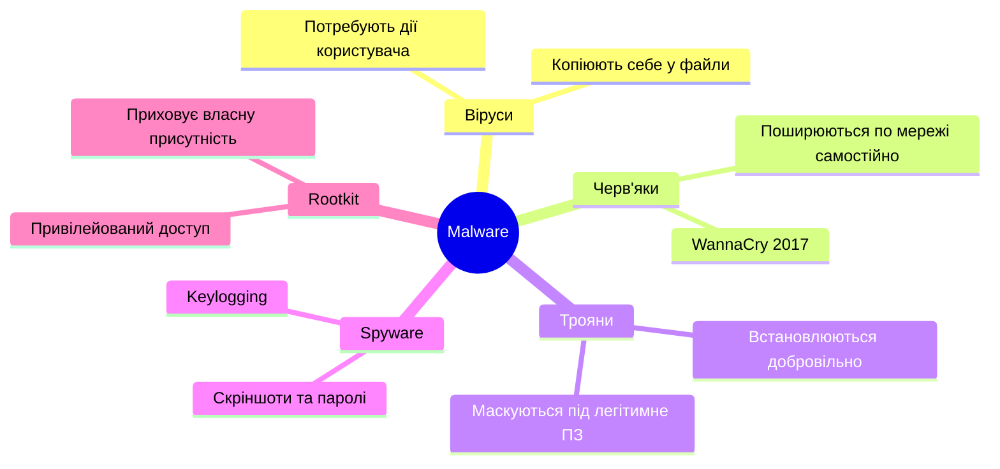
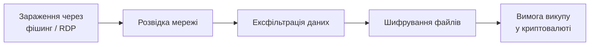
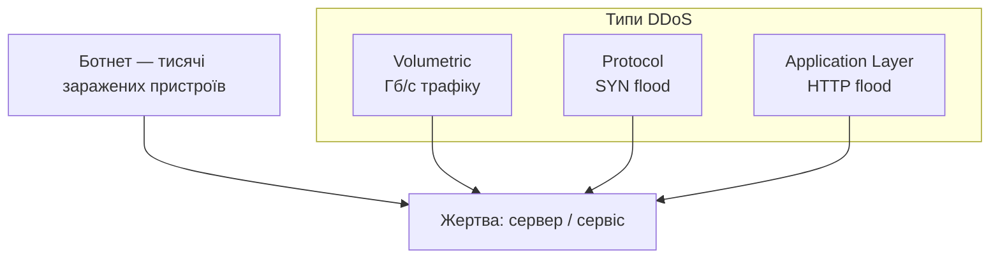
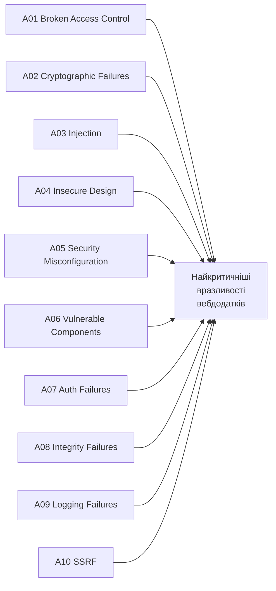
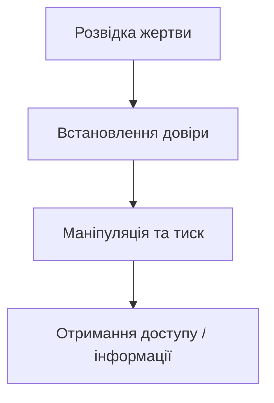
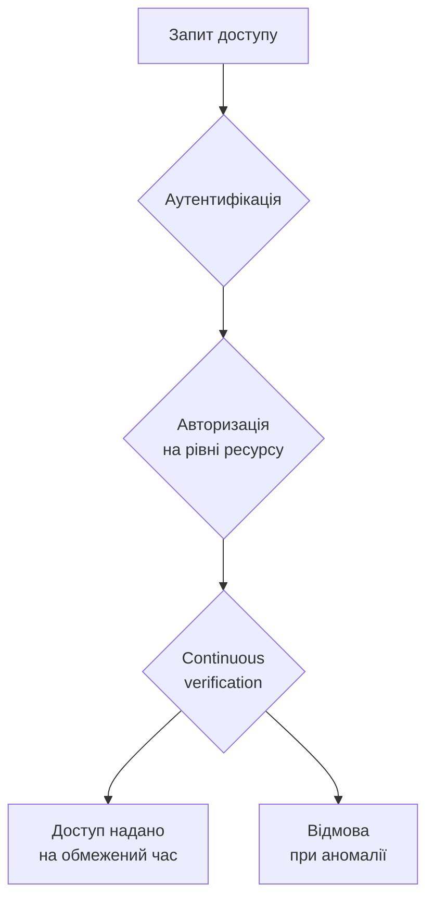
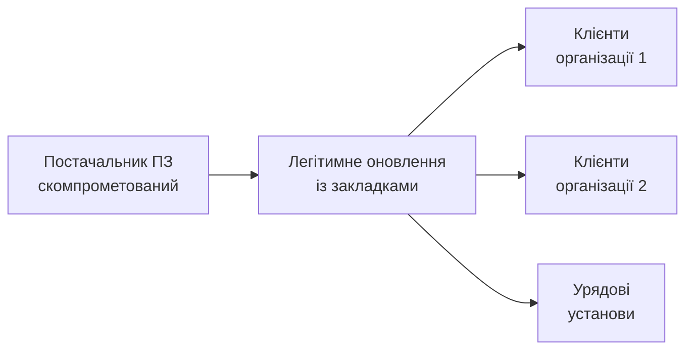
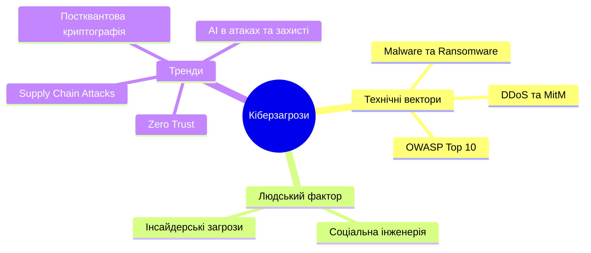

# 🛡️ Ландшафт кіберзагроз

---

## 💸 Чому це важливо?

- Середня вартість витоку даних у 2023 році — **4,45 млн USD**
- Час виявлення та локалізації інциденту — **277 днів**
- Кожна автоматизована система — потенційний вектор атаки

> Цифровізація відкриває можливості — і одночасно нові вразливості.

---

## 🗺️ План лекції

1. Типи кібератак: Malware, Ransomware, Phishing, DDoS, MitM
2. OWASP Top 10 — критичні вразливості вебдодатків
3. Соціальна інженерія та інсайдерські загрози
4. Актуальні тренди в кібербезпеці

---

## 🦠 Malware — шкідливе ПЗ



**Реальні кейси:**

| Malware | Рік | Наслідки |
|---------|-----|----------|
| WannaCry (черв'як) | 2017 | 150+ країн, $4 млрд збитків, зупинка NHS у Великій Британії |
| Stuxnet (черв'як) | 2010 | Фізичне пошкодження центрифуг на ядерному об'єкті Ірану |
| FinFisher (trojan) | 2011–2019 | Комерційний spyware проти журналістів та активістів |

---

## 🔒 Ransomware — шифрувальники-вимагачі

**Як відбувається атака:**



- Модель **Ransomware-as-a-Service** (RaaS) — знизила поріг входу для злочинців
- **Подвійне вимагання** — шифрування + погроза публікації даних
- Відомі групи: LockBit, BlackCat, Conti

**Кейс: Colonial Pipeline (2021)**
Група DarkSide зупинила найбільший трубопровід США. Компанія заплатила **$4,4 млн** викупу. Дефіцит палива на Східному узбережжі тривав 6 днів.

---

## 🎣 Phishing — типи атак

| Тип | Ціль | Особливість |
|-----|------|-------------|
| Email phishing | Масова аудиторія | Імітація банків, сервісів |
| **Spear phishing** | Конкретна особа | Персоналізована інформація |
| **Whaling** | Топ-менеджери | Фальшиві ділові листи |
| Vishing | Телефонні дзвінки | Імітація банку / підтримки |
| Smishing | SMS | Посилання на шкідливі сайти |

**Приклад фішингового листа — знайдіть 5 ознак:**

```
Від:    security@paypa1.com          ← (1) цифра 1 замість літери l
Тема:   Термінове повідомлення!      ← (2) штучна терміновість

Шановний користувач,                 ← (3) немає імені одержувача
Виявлено підозрілу активність.
Підтвердіть особу протягом 24 год.  ← (4) тиск часом

[Підтвердити] → paypal-verify.tk    ← (5) підозрілий домен
```

---

## 💥 DDoS — атаки на відмову в обслуговуванні



**Захист:** CDN, rate limiting, DDoS mitigation сервіси (Cloudflare).

---

## 🕵️ Man-in-the-Middle (MitM)

Зловмисник перехоплює комунікацію між двома сторонами.

- **ARP spoofing** — підміна MAC-адреси в локальній мережі
- **DNS spoofing** — перенаправлення на фальшивий сайт
- **SSL stripping** — примусовий перехід з HTTPS на HTTP
- **Evil Twin** — фальшива Wi-Fi точка доступу

**Захист:** HTTPS + HSTS, VPN, certificate pinning, уникати публічного Wi-Fi.

---

## 📋 OWASP Top 10 (2021)



---

## 🔑 A01: Broken Access Control

Користувач виходить за межі своїх повноважень.

**IDOR-приклад:**
```
/account?id=12345  ← ваш рахунок
/account?id=12346  ← рахунок іншої особи (доступний!)
```

**Privilege escalation:**
```json
POST /api/users/update
{ "user_id": 123, "role": "admin" }
```

**Захист:** перевірка прав на сервері для кожного запиту, RBAC, логування спроб.

---

## 💉 A03: Injection

**SQL Injection — класичний приклад:**

```sql
-- Вхід: admin' OR '1'='1' --
SELECT * FROM users
WHERE username='admin' OR '1'='1' --' AND password=''
```

Умова `'1'='1'` завжди істинна → зловмисник отримує доступ.

**Захист:** параметризовані запити, ORM, валідація вводу.

```python
# Безпечно
cursor.execute("SELECT * FROM users WHERE username=? AND password=?",
               (username, password))
```

---

## ⚙️ A05: Security Misconfiguration

Найпоширеніші помилки налаштування:

- Default credentials: `admin` / `admin`
- Directory listing увімкнений — відкрита структура файлів
- Stack traces у повідомленнях про помилки
- Незакриті адміністративні панелі
- Застаріле ПЗ без патчів безпеки

> Безпека за замовчуванням — обов'язкова, а не бажана.

---

## 🎭 Соціальна інженерія

**Людський фактор — найслабша ланка безпеки.**



**Техніки:**
- Pretexting — вигадана правдоподібна легенда
- Baiting — заражений USB, фальшивий виграш
- Quid pro quo — "я допомагаю вам, а ви мені"
- Tailgating — фізичне проникнення слідом за авторизованою особою

**Кейс: Deepfake-голос (2019)**
Зловмисники за допомогою AI синтезували голос CEO материнської компанії та зателефонували фінансовому директору дочірньої фірми у Великій Британії. Той переказав **€220 000** на рахунок «постачальника» протягом однієї години.

---

## 🏢 Інсайдерські загрози

**Типи інсайдерів:**

| Тип | Мотивація |
|-----|-----------|
| Зловмисний | Фінансова вигода, помста |
| Необережний | Помилки, недотримання правил |
| Скомпрометований | Жертва зовнішньої атаки |

**Сигнали тривоги:**
- Копіювання великих обсягів даних перед звільненням
- Доступ до даних поза межами обов'язків
- Незвична активність у неробочий час

---

## 🤖 Тренд: AI в кібербезпеці

**Атакувальники використовують AI для:**
- Автоматизації розвідки та фішингу
- Створення deepfake-голосу (кейс: 220 тис. євро за один дзвінок)
- Обходу систем виявлення

**Захисники використовують AI для:**
- Виявлення аномалій у великих обсягах даних
- Автоматизованого аналізу malware
- Прогнозування атак

---

## 🏰 Тренд: Zero Trust Architecture

> "Never trust, always verify"



Немає довіреного периметра — кожен запит перевіряється.

---

## ⛓️ Тренд: Supply Chain Attacks

**SolarWinds (2020):** зловмисне оновлення ПЗ → тисячі організацій заражені.



**Захист:** SBOM, моніторинг цілісності постачальників, строгий контроль оновлень.

---

## 🔮 Тренд: Квантові комп'ютери

- Потенційно можуть зламати RSA та ECC
- NIST розробляє **постквантові криптографічні стандарти**
- Вже зараз: "harvest now, decrypt later" — збір зашифрованих даних для майбутнього злому

> Організаціям потрібно **планувати міграцію** на нові алгоритми вже сьогодні.

---

## 📌 Висновки



