# 🔐 Захист бізнес-процесів: технічні заходи

---

## 🎯 Мета лекції

Розглянути технічні механізми захисту, які утворюють **рубежі оборони** бізнес-процесів:

1. Аутентифікація та авторизація (MFA, SSO, RBAC)
2. Шифрування даних — у спокої та при передачі
3. Мережева безпека — Firewall, IDS/IPS, VPN
4. Захист кінцевих пристроїв (Endpoint Security)
5. Безпечна розробка — DevSecOps

---

## 🔑 Аутентифікація vs. Авторизація

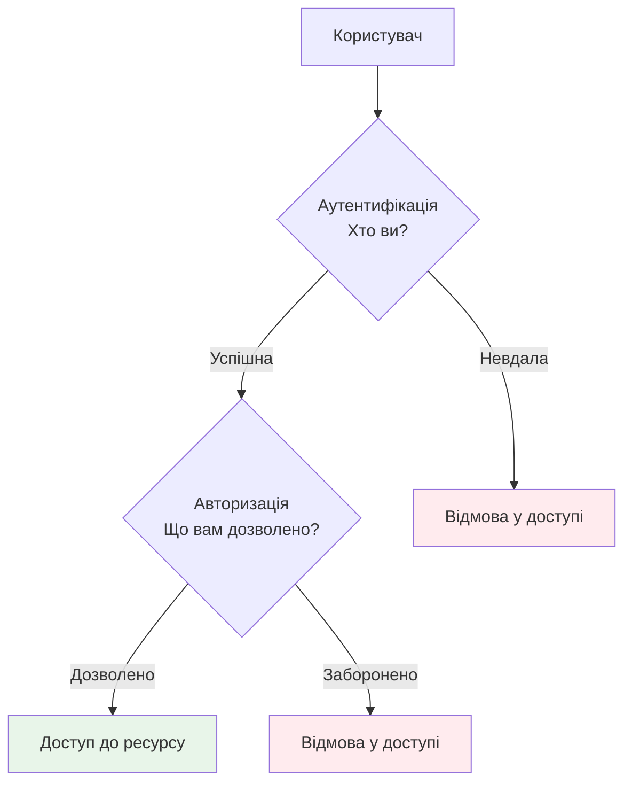

- **Аутентифікація** → "Хто ви?" (пароль, токен, біометрія)
- **Авторизація** → "Що вам дозволено?" (ролі, права)

---

## 📱 Три фактори аутентифікації

| Фактор | Тип | Приклади |
|--------|-----|----------|
| Знання | Щось, що ви **знаєте** | Пароль, PIN, секретне питання |
| Володіння | Щось, що ви **маєте** | Смартфон, токен, смарт-карта |
| Властивість | Щось, чим ви **є** | Відбиток пальця, обличчя, райдужна оболонка |

**MFA** = поєднання двох або більше факторів.

---

## 🔢 Як працює TOTP (MFA)

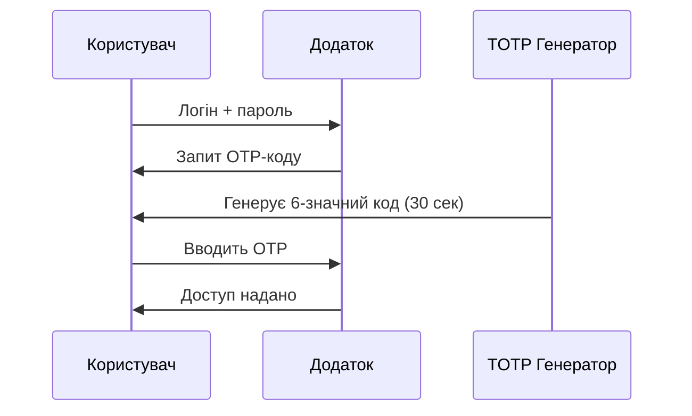

> Навіть скомпрометований пароль не дає зловмиснику доступ без другого фактора.

---

## ⚠️ Обмеження методів MFA

| Метод | Вразливість |
|-------|-------------|
| SMS-код | **SIM-swapping** — перенесення номера на чужу SIM |
| Push-повідомлення | **MFA fatigue** — автоматичне підтвердження |
| TOTP-додаток | Крадіжка пристрою |
| **FIDO2/WebAuthn** | Найбільш захищений варіант ✅ |

---

## 🔗 Single Sign-On (SSO)

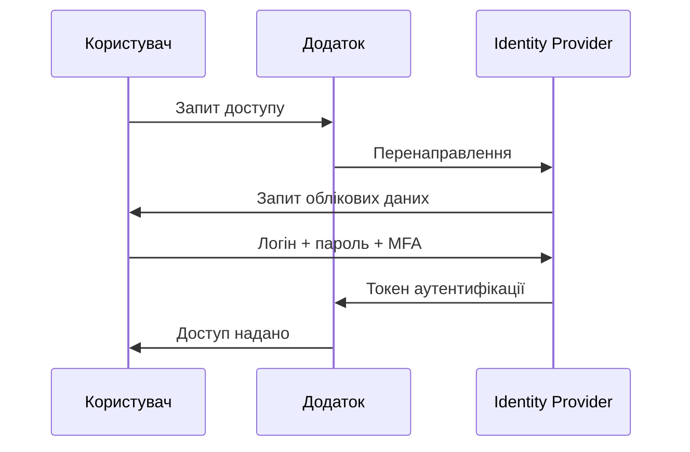

- Один вхід → доступ до всіх інтегрованих систем
- Протоколи: **SAML 2.0**, **OpenID Connect**, **OAuth 2.0**

---

## 👥 RBAC — рольова модель доступу

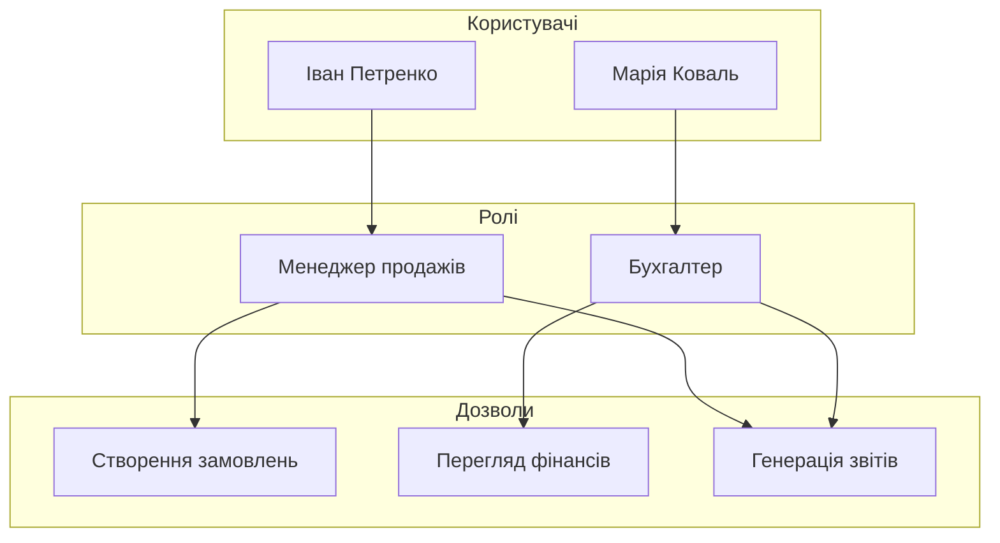

**Принцип найменших привілеїв** — тільки те, що необхідно для роботи.

---

## 🔐 Шифрування: два типи

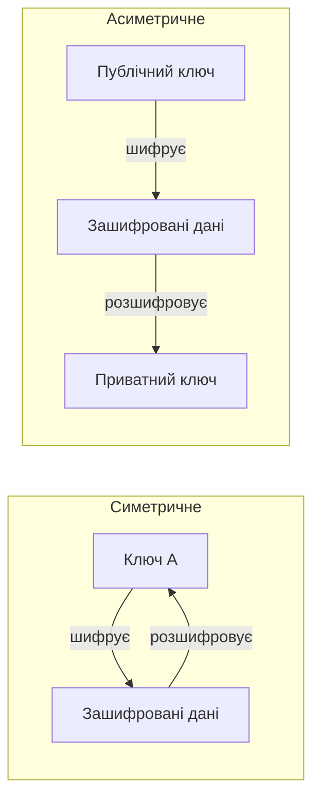

- **Симетричне (AES-256):** швидке, ідеальне для великих даних
- **Асиметричне (RSA, ECC):** повільніше, вирішує проблему обміну ключами
- **Гібридний підхід:** асиметричне для обміну ключем → симетричне для даних

---

## 💾 Шифрування даних у спокої

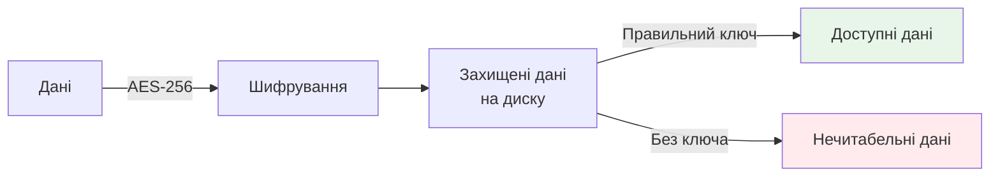

- **BitLocker** (Windows) / **FileVault** (macOS) / **LUKS** (Linux)
- Шифрування колонок БД для чутливих полів (номери карток, ID)
- Хмара: **provider-managed** → **customer-managed** → **client-side encryption**

---

## 🌐 Шифрування при передачі: TLS

**Процес встановлення TLS-з'єднання:**

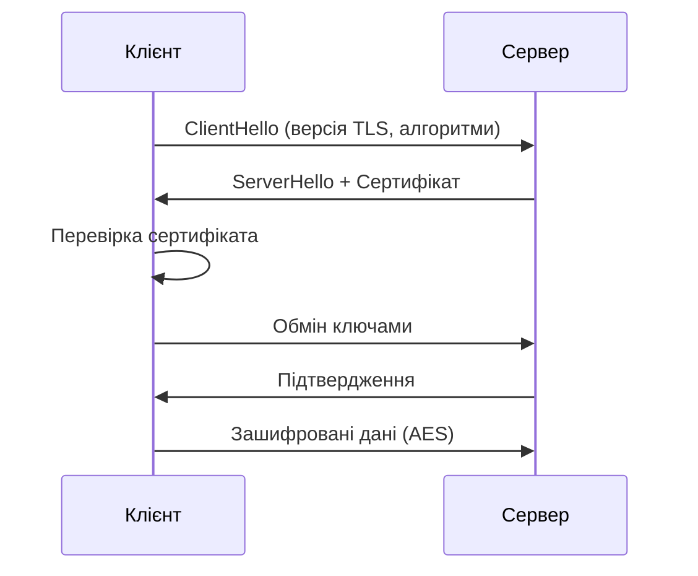

**Як перевірити TLS у браузері:**
```
# Командний рядок — перевірка сертифіката сайту
openssl s_client -connect example.com:443 -brief

# Результат: версія TLS, алгоритм, термін дії сертифіката
Protocol: TLSv1.3
Cipher: TLS_AES_256_GCM_SHA384
```

> Ніколи не ігноруйте попередження браузера про недійсний сертифікат!

---

## 🧱 Firewall — перша лінія оборони

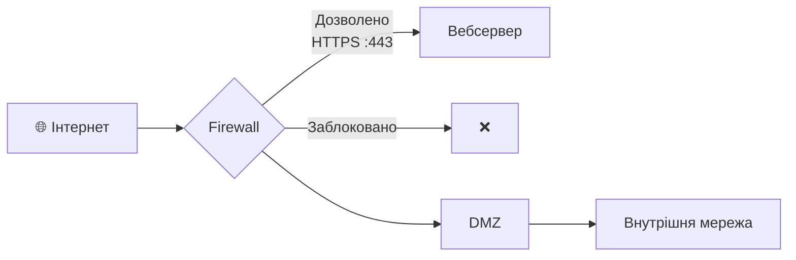

| Тип | Принцип роботи |
|-----|----------------|
| Пакетний фільтр | IP, порт, протокол |
| Stateful | Відстеження стану з'єднань |
| **NGFW** | Deep Packet Inspection + AppID |

---

## 🔍 IDS та IPS

- **IDS** (Intrusion Detection System) — виявляє та **сповіщає**
- **IPS** (Intrusion Prevention System) — виявляє та **блокує**

| Метод виявлення | Принцип | Особливість |
|-----------------|---------|-------------|
| Сигнатурний | Порівняння з базою | Відомі загрози |
| Аномальний | Відхилення від норми | Нові атаки |
| Поведінковий | ML-аналіз | Складні атаки |

---

## 🛡️ DMZ — демілітаризована зона

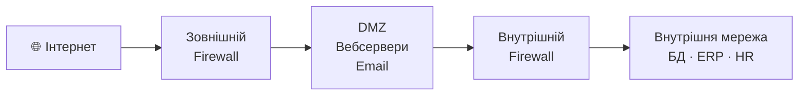

Публічні сервіси ізольовані від критичних внутрішніх систем.

---

## 💻 Захист кінцевих пристроїв

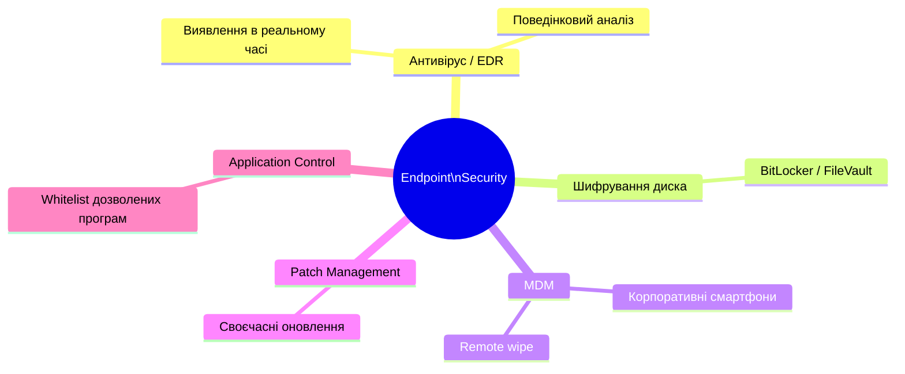

---

## 🔄 DevSecOps — безпека в кожному кроці

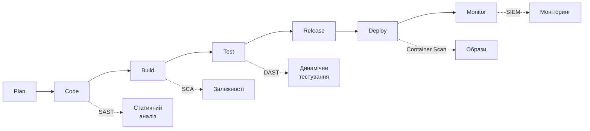

**Shift Left** — виявляти проблеми безпеки якомога раніше.

**Приклад: автоматична перевірка при кожному PR у GitHub Actions**
```yaml
on: [pull_request]
jobs:
  security:
    steps:
      - uses: actions/checkout@v3
      - name: SAST — пошук вразливостей у коді
        uses: github/codeql-action/analyze@v2
      - name: SCA — перевірка залежностей
        run: pip-audit  # знайде CVE у бібліотеках
```
Якщо знайдено критичну вразливість — PR автоматично блокується.

---

## 🧪 Типи автоматизованих перевірок

| Метод | Аналізує | Переваги |
|-------|----------|----------|
| **SAST** | Вихідний код | Ранні етапи, без запуску |
| **DAST** | Запущений додаток | Реальні вразливості |
| **SCA** | Сторонні бібліотеки | Виявлення CVE у залежностях |
| **Container Scan** | Docker-образи | Вразливості ОС у контейнері |

---

## 🔑 Безпечне управління секретами

❌ **Заборонено:**
```python
DB_PASSWORD = "super_secret_123"  # у коді / репозиторії
API_KEY = "sk-abc123..."          # жорстко вписаний
```

✅ **Правильно — через змінні середовища:**
```bash
# Файл .env (додається до .gitignore — НЕ комітується!)
DB_PASSWORD=super_secret_123
API_KEY=sk-abc123...
```
```python
import os
DB_PASSWORD = os.environ.get("DB_PASSWORD")
```

✅ **У CI/CD (GitHub Actions) — секрети зберігаються у сховищі платформи:**
```yaml
- name: Deploy
  env:
    DB_PASSWORD: ${{ secrets.DB_PASSWORD }}  # ніколи не з'являється в логах
```

> Секрет у git-репозиторії вважається **скомпрометованим** — навіть після видалення.

---

## 🏗️ Принцип Defense in Depth

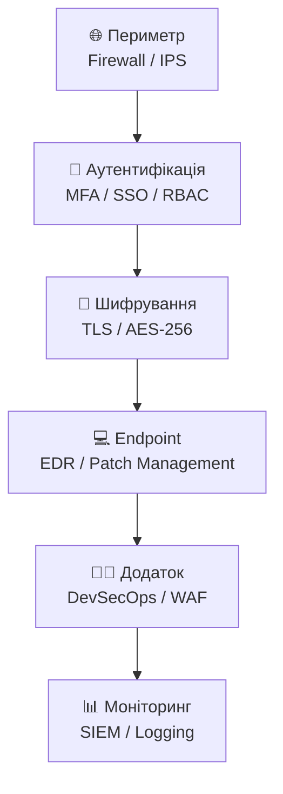

Якщо один рубіж пробито — інші зупиняють атаку.

---

## 📌 Висновки

- **Аутентифікація + MFA** — блокує доступ навіть зі скомпрометованим паролем
- **Шифрування** — захищає дані навіть при фізичній крадіжці носія
- **Firewall + IPS** — фільтрує трафік та виявляє атаки
- **DevSecOps** — безпека як частина процесу розробки, а не "після"
- **Жоден окремий захід** не гарантує повну безпеку → лише **Defense in Depth**

